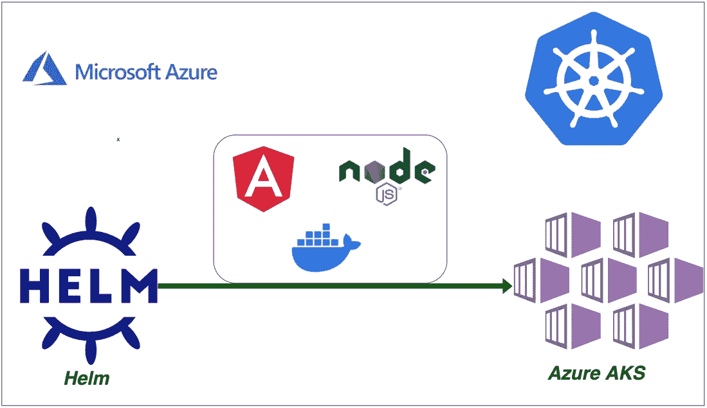

# 使用 HELM 在 Azure AKS 上部署带 NodeJS 后端的 Angular

> 原文：<https://medium.com/bb-tutorials-and-thoughts/deploying-angular-with-nodejs-backend-on-azure-aks-using-helm-184f3953fb96?source=collection_archive---------0----------------------->

## 包含示例项目的逐步指南

Kubernetes 是发展迅速的技术之一，现在所有的公司都在采用它。当您在 Kubernetes 上运行任何应用程序时，您都需要部署许多对象，如 deployment、configmap、secrets 等。你需要在 ***manifest.yml*** 文件中定义所有这些对象…