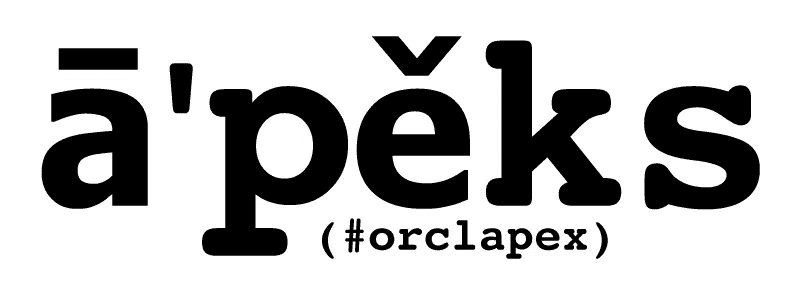

# 使用 terraform 在 OCI 部署 APEX

> 原文：<https://medium.com/oracledevs/deploying-apex-on-oracle-oci-with-terraform-213a56a25e1f?source=collection_archive---------2----------------------->

如果您想在云中使用 APEX，您的首选应该是使用 Oracle APEX 云服务或自治数据库。但是，如果您有一些依赖或约束阻止您使用其中之一，在 OCI DBaaS(数据库虚拟机)上部署 APEX 仍然是一个选择。

在这种情况下，我强烈建议遵循 APEX [Terraform 部署白皮书](https://docs.oracle.com/en-us/iaas/Content/Resources/Assets/whitepapers/oracle-apex-on-oci-database.pdf) ( [存档版本](https://web.archive.org/web/20210604124834/https://docs.oracle.com/en-us/iaas/Content/Resources/Assets/whitepapers/oracle-apex-on-oci-database.pdf))并使用提供的 [Terraform 脚本](https://objectstorage.uk-london-1.oraclecloud.com/p/Syf5wONrf1h6j4GBcFFnWUAEtdFLdNDMWb7j0iPpIjcy838VxLfgNaqg_qcGRaPs/n/intdbaasecra/b/masito-SQLDeveloperWeb/o/ORDS-APEX_Comp.zip) ( [存档版本](https://objectstorage.uk-london-1.oraclecloud.com/p/Syf5wONrf1h6j4GBcFFnWUAEtdFLdNDMWb7j0iPpIjcy838VxLfgNaqg_qcGRaPs/n/intdbaasecra/b/masito-SQLDeveloperWeb/o/ORDS-APEX_Comp.zip))。

几个注意事项:

*   在撰写本文时，该脚本只适用于 terraform v 11(至少对我来说是这样)
*   最新 APEX/ORDS 版本的脚本存在一些问题

**使用 terraform 11**

使用旧版本 TF 最简单的方法是安装并配置 [tfenv](https://github.com/tfutils/tfenv) 。如果您在 mac 上， *brew install tfenv* 可以工作，请参考[自述文件](https://github.com/tfutils/tfenv/blob/master/README.md)了解如何使用它。

**解决 APEX/ORDS 的 TF 脚本问题**

最近版本的 APEX 和 ORDS 有一点不同的反应，正如脚本所预期的，所以 TF 将在某个时候停止。请按照下列步骤解决问题:

*注意:这完全是我个人的解决方案，与 Oracle 无关，也不受 Oracle 支持！继续进行，后果自负！*

*   解压 [TF 脚本](https://objectstorage.uk-london-1.oraclecloud.com/p/Syf5wONrf1h6j4GBcFFnWUAEtdFLdNDMWb7j0iPpIjcy838VxLfgNaqg_qcGRaPs/n/intdbaasecra/b/masito-SQLDeveloperWeb/o/ORDS-APEX_Comp.zip)
*   展开用户数据文件夹
*   解压缩 files_tomcat.zip
*   [补丁](https://gist.githubusercontent.com/TheKashe/a4f98999c0a98c993a8e3fd7c20682d5/raw/a1a37235bdd4d38ab69b9611927201d549378313/gistfile1.txt) ords_setup_base.exp
*   [补丁](https://gist.githubusercontent.com/TheKashe/d4291f33e6e5fca9a484354627c07bd4/raw/0f78a4fbc2024346ec823f93d8d384fab7a39009/gistfile1.txt) ords_validate_base.exp
*   重命名文件 _tomcat.zip
*   将修补的文件压缩回 files_tomcat.zip(保持结构)

在我的案例中，应用这些更改后，terraform 过程成功完成。

*现在我正在写这个故事，我注意到 ords_setup_base.patch 中的一个补丁只是重复了一个已经存在的 expect 可能不需要，但是我已经没有测试环境了，这是我用过的版本，所以我保留它。*

*这不是甲骨文的官方博客。这里的信息可能过时或不正确。观点是我自己的。*