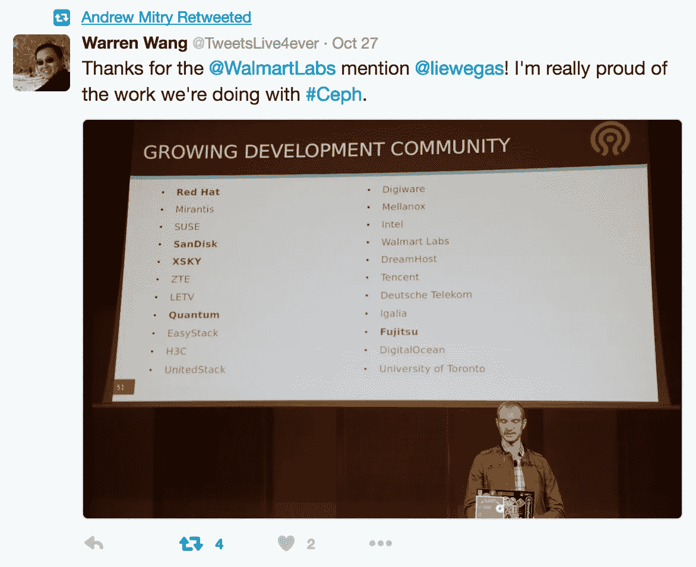
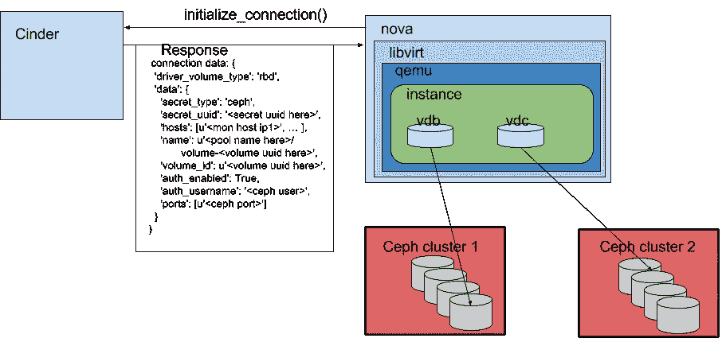

# 使用多个 Ceph 集群后端部署 Cinder

> 原文：<https://medium.com/walmartglobaltech/deploying-cinder-with-multiple-ceph-cluster-backends-2cd90d64b10?source=collection_archive---------4----------------------->



本文是关于利用多个 Ceph 集群作为 cinder 后端的。此用途的目的是允许实例从一个或两个 Ceph 集群附加块卷。

## 背景

Cinder 的任务是创建块卷，并向 nova 提供这些卷的连接参数。nova-compute 服务调用 Cinder 的 api 来保留和请求特定的卷，Cinder 提供一个包含以下信息的响应:driver_volume_type、secret_type、secret_uuid、hosts、name、volume_id、auth_enabled、auth_username 和 ports。不同的卷类型可能会有不同的信息，但是您可以在下面看到一个 Ceph 卷的响应示例:



Nova 通过将这些设置转换成适当的 xml 标记和参数来提供给 libvirt。

```
<disk type='network' device='disk'>
  <driver name='qemu' type='raw' cache='none'/>
  <auth username='cinder'>
    <secret type='ceph' uuid='secret-uuid'/>
  </auth>
  <source protocol='rbd' name='cinder_volumes/volume-uuid'>
    <host name='mon_host_ip' port='mon_host_port'/>
  </source>
  <target dev='vdb' bus='virtio'/>
  <serial>volume-uuid</serial>
  <alias name='virtio-disk1'/>
  <address type='pci' domain='0x0000' bus='0x00' slot='0x0e' function='0x0'/>
</disk>
```

## 设置

在新的 Ceph 集群上创建适当的 cinder 用户。**用户名必须与现有的 Ceph 集群 cinder 用户名**不同(本例中我使用的是“cinder2”)。

将以下部分添加到 **cinder.conf**

```
[volumes-new]
restore_discard_excess_bytes=True
rbd_secret_uuid=<secret uuid>
rados_connect_timeout=-1
volume_backend_name=new-1
volume_driver=cinder.volume.drivers.rbd.RBDDriver
rbd_store_chunk_size=4
glance_api_version=2
rbd_ceph_conf=/etc/ceph/ceph-new.conf
rbd_pool=cinder_volumes
rbd_flatten_volume_from_snapshot=False
rbd_max_clone_depth=5
rbd_user=cinder2
```

用一个**新 uuid** 替换 **<秘密 uuid >** 。此 uuid 必须不同于 cinder/libvirt 使用的任何现有 uuid。

从新集群的一个 mon 主机上获取 ceph.conf 文件，将其作为 **/etc/ceph-new.conf** 保存到 cinder 主机上，并添加以下部分:

```
[client.cinder2]
keyring = /etc/ceph/ceph-new.client.cinder2.keyring
```

从新的 Ceph 集群中抓取 **cinder2** 用户的密钥，并保存到**/etc/Ceph/Ceph-new . client . cinder 2 . key ring**

在文件中只存储用户的密钥:

```
printf 'key here' > cinder2.key
```

注意:使用 **printf** ，因为 **echo** 会将一个\n 插入到您的文件中，而您不希望这样。

创建一个新的 **nova-secret.xml** 文件，内容如下:

```
<secret ephemeral="no" private="no">
<uuid>secret uuid here</uuid>
<usage type="ceph">
<name>client.cinder2 secret</name>
</usage>
</secret>
```

再次插入您在上面创建的 **uuid** 。

接下来，我们需要使用 virsh 在 libvirt 中创建秘密并设置密钥:

```
virsh secret-define --file nova-secret.xml
virsh secret-set-value --secret <secret uuid> --base64 $(cat cinder2.key)
```

重启 cinder-volumes，你就可以开始工作了。您可能希望清理您创建的 cinder2.key 文件和 nova-secret.xml 文件。

## 就是这样！

你完了！当然，您将需要创建利用新后端的新的 cinder 卷类型，但这在其他地方已经充分讨论过了。

当然，如果你使用的是 OpenStack-Ansible，这些步骤在 Newton 版本中已经自动完成。更多信息，请参考 [Ceph 客户角色文件](http://docs.openstack.org/developer/openstack-ansible-ceph_client/configure-ceph.html#extra-client-configuration-files)。