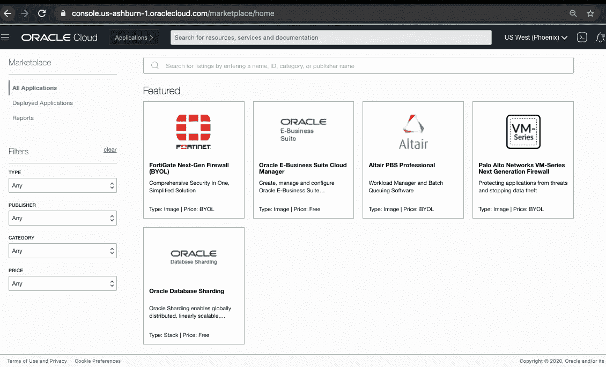
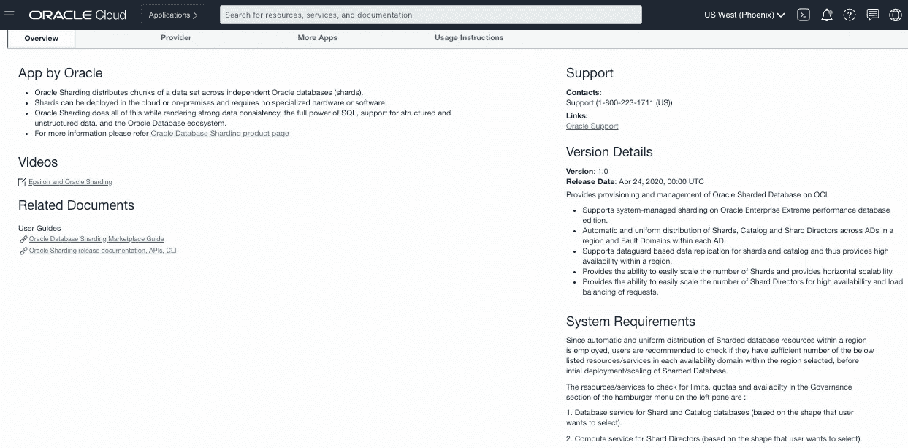
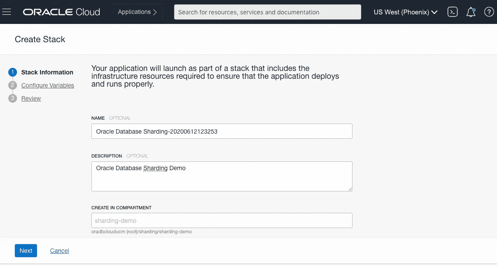
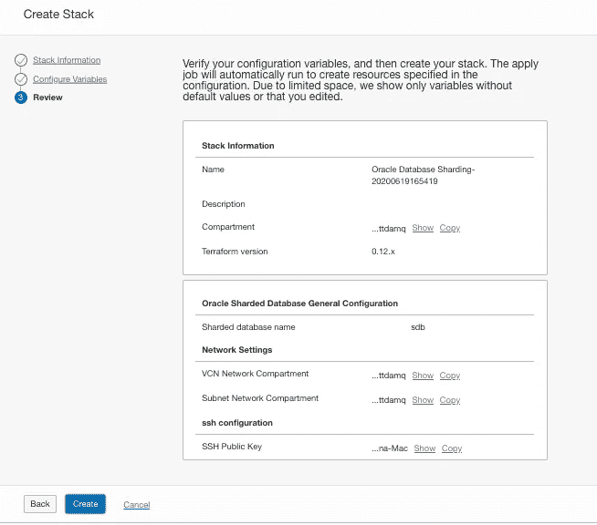
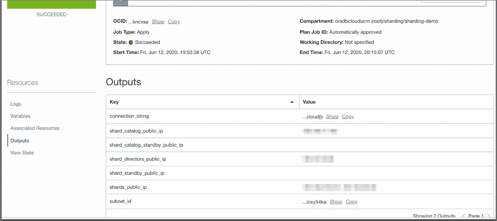

# 在 Oracle 云基础架构上部署地理分布式 Oracle 数据库(OCI)

> 原文：<https://medium.com/oracledevs/deploying-geo-distributed-oracle-database-on-oracle-cloud-infrastructure-oci-786ad3ec33c6?source=collection_archive---------3----------------------->

地理分布式 Oracle 数据库，也称为 Oracle 数据库分片，为具有低响应时间、高可用性和数据主权要求的超大规模应用程序提供全球分布式、可线性扩展的融合 Oracle 数据库。

你好。我是 Bharath Ramaprasad， [Oracle 数据库分片](https://www.oracle.com/database/technologies/high-availability/sharding.html)团队的首席软件工程师，欢迎阅读关于如何在 Oracle 云基础设施上部署地理分布式 Oracle 数据库(也称为 OCI 市场的 Oracle 分片数据库)的快速浏览文章。

我向您保证，在本文结束时，您将学会如何部署一个简单的 Oracle 数据库分片部署设置，如下所示。你可以在这里找到更多部署架构相关信息[。如果你时间不够，想看一段漫游视频，这里有链接:【https://youtu.be/-gn8HuT7cY8](https://docs.oracle.com/en/solutions/db-sharding-single-region/)

Sample Oracle Database Sharding Deployment Architecture

如果您还没有甲骨文云(OCI)帐户，请注册一个免费的甲骨文云试用帐户**。否则，只需登录您的 OCI 控制台。**

**所以，事不宜迟，让我们开始吧。**

**首先，我将单击 OCI 控制台左侧的汉堡导航菜单，向下滚动到解决方案和平台部分。在这里，我将单击“市场”菜单项。**

**这样做将会打开 OCI 市场的主屏幕，正如您所见，Oracle 数据库分片就列在特色应用部分的顶部，这使得访问变得非常简单和方便。*注意*:如果您因为某种原因找不到 Oracle 数据库分片应用，只需在市场搜索栏中搜索即可。**

****

**Oracle Database Sharding on the Featured Apps section of OCI Marketplace**

****

**Searching for Oracle Database Sharding on OCI Marketplace**

**接下来，我将单击 Oracle 数据库分片，以显示产品列表页面。**

****

**Oracle Database Sharding product page on OCI marketplace**

**Oracle 数据库分片产品列表页面描述了以下信息-**

**在左手边你有:**

*   **Oracle 数据库分片概述以及指向产品主页的指针。**
*   **市场用户指南链接—因此，如果您需要任何关于如何在 OCI 上部署或管理 Oracle 数据库分片的帮助或说明，那么[分片市场用户指南](https://github.com/oracle/db-sharding/wiki/Oracle-Database-Sharding-on-OCI-Marketplace)是您的最佳选择。**

****

**Oracle Database Sharding Product Listing Overview and Version Details**

**右手边有:**

*   **支持信息。**
*   **版本详细信息，包括当前版本中可用的功能。**
*   **系统要求—这本质上强调了这样一个事实，即由于分片在当前区域的可用性域(AD)之间以及每个 AD 中的故障域之间自动且统一地分配分片数据库资源，因此作为用户，您应该确保您的租户中有足够数量的数据库和计算服务实例，以满足您在即将到来的 Oracle 数据库分片配置屏幕中选择的形状。**

**接下来，让我们看看 Oracle 数据库分片和 ***的定价，猜猜什么*** ？Oracle 数据库分片软件 ***绝对免费*** ！作为用户，您只需为 Oracle 数据库分片提供的基础架构(即 OCI 数据库实例、计算实例和存储)付费。这就是定价！很酷吧？**

**接下来，让我们选择默认的推荐版本，在本例中为 1.0，并选择您希望在租赁中部署 Oracle 数据库分片的隔离专区。**

****

**Launch Stack**

**完成后，点击启动堆栈。**

**这将我们带到 Oracle 数据库分片创建堆栈屏幕。在这里，您可以选择为 Oracle 数据库分片堆栈添加名称和描述。**

****

**Oracle Database Sharding Create Stack Screen — Part 1**

****

**Oracle Database Sharding Create Stack Screen — Part 2**

**您可以跳过其余部分，保留默认值。**

**现在，我将单击“next ”,这将带我们进入 Oracle 数据库分片配置屏幕。**

**该屏幕包含以下配置部分:**

**1.一般配置。**

**2.分片配置。**

**3.碎片目录配置。**

**4.复制配置。**

**5.分片控制器配置。**

**6.网络设置。**

**7.Ssh 配置。**

**如果您想快速体验一下 Oracle 数据库分片的概念验证，或者正在为您的应用评估 Oracle 数据库分片，或者只是想尝试一下简单的 Oracle 数据库分片设置，您只需配置 ***三个简单的输入*** 。**

**首先， ***分片数据库名称*** —这是整个分片数据库的唯一名称，并作为所有分片数据库资源显示名称的前缀。此外，指定的分片数据库名称在区域子网中必须是唯一的…现在，我将把这个分片数据库命名为“sdb”。**

****

**Sharded Database Name**

**第二， ***网络设置*** —在这里，我们强烈建议选择“创建新网络”选项，以便提供一个新的区域网络，并在其上部署 Oracle 数据库分片资源。对于在任何地区的 VCN 部署的第一个 Oracle 分片数据库，必须选中此选项，以便在当前 VCN 和地区设置分片所需的基本网络结构。**

****

**第三， ***SSH 公共密钥*** —从您的笔记本电脑或本地机器上传 SSH 公共密钥，您之前已经在那里生成了 RSA 密钥对，这样一旦部署了 Oracle 数据库分片，您就能够访问分片的数据库资源实例。**

****

**您可以跳过配置的其余部分，保留默认值。**

**这就是在 OCI 上部署一个简单的 oracle 数据库分片所需的配置。**

****

**然后，您只需单击“next ”,在接下来的查看屏幕中，您可以单击“create ”,这将创建所有 Oracle 数据库分片资源并部署 Oracle 分片数据库。**

*****那不是又甜又简单的*** 吗？**

**现在，让我返回到分片配置屏幕，查看其余的配置部分。**

********

**Oracle Database Sharding general configuration section**

*   **在 General configuration 部分中，分片数据库名称之后的下一个输入是分片方法，默认情况下是系统管理的分片，其中用户不需要指定任何数据到分片的映射，数据会使用一致哈希分区自动分布到各个分片。系统管理的分片可确保数据均匀、随机地分布在所有分片中，从而消除数据热点，并在各个分片中提供一致的性能。**
*   **接下来，默认情况下，数据库软件版本是企业极致性能。**
*   **存储管理软件是 LVM。**
*   **默认情况下，许可证类型为“包含许可证”。你也可以选择带上自己的驾照。**
*   **默认情况下，数据库版本是 19c。**

**这就是一般配置部分。**

**接下来，让我们看看碎片配置部分。**

****

**基于您的应用需求**

*   **您可以选择适当的碎片形状。**
*   **主要碎片的数量。**
*   **以及每个分片的数据库存储。**

**接下来，让我们看看碎片目录配置部分**

****

**基于您的应用需求**

*   **您可以选择适当的碎片目录形状。**
*   **以及碎片目录数据库存储。**
*   **主分片目录的数量限制为 1，因为整个分片数据库只能有一个主目录。**

**接下来，让我们看一下复制配置部分。**

****

**Replication configuration section**

**复制因子的概念类似于副本集，它基本上决定了 Oracle 分片数据库维护多少份用户数据副本。**

**默认复制配置为 1，这意味着它是一个仅限于主节点的设置。这意味着只部署主碎片和主目录。**

**您也可以将其增加到 2，这意味着每个主碎片和目录都有一个对应的备用碎片。对于出于 HA 和 DR 目的的生产部署，建议将复制系数设置为 2。**

**接下来，让我们看看 Shard Director 配置部分。**

****

**在这里，根据您的应用需求，**

*   **您可以选择适当的分片控制器计算形状**
*   **以及碎片导演的数量。**

**请注意，分片控制器、分片和目录将跨当前区域中的所有可用性域以及每个可用性域中的容错域均匀分布。**

**最后，在“网络设置配置”部分，如果您过去已经从 OCI 市场创建了一个分片数据库，您可以通过取消选中“创建新网络”选项来选择使用现有网络。如果没有，请选中此选项以创建新网络。**

**配置完网络设置后，您只需单击“next ”,在接下来的查看屏幕中，您可以单击“create ”,这将在 OCI 上部署 Oracle 分片数据库。**

**单击 create 后，将显示 Oracle Resource Manager (ORM)作业屏幕，其中显示了分片数据库部署的进度。**

****

**Oracle Database Sharding deployment job in progress**

**作业的状态从“已接受”变为“正在进行”，最后，几分钟后(大约 15 分钟)，当 Oracle 数据库分片部署完成且 ORM 应用作业显示已成功时，作业的状态将变为“成功”。**

****

**Oracle Database Sharding successful deployment job status**

**现在，让我们看看 ORM 作业屏幕左侧的资源菜单。**

*   **日志视图向我们展示了部署的细节，并在最后打印出一条成功部署的消息。**

****

*   **变量视图显示了我们刚刚在配置屏幕中输入的配置。因此，用户可以随时参考变量菜单，快速验证输入是否与将要部署或过去部署的内容相匹配。**
*   **接下来，Outputs 视图为用户提供了使用或访问已部署的分片数据库组件所需的任何信息。**

****

**Outputs view after Oracle Database Sharding has been successfully deployed**

**正如您所看到的，output 视图提供了连接字符串，您只需将其复制并粘贴到您的应用程序数据库访问层配置中，这样您就可以像从您的应用程序中访问任何其他数据库一样，直接开始访问刚刚部署的 Oracle 分片数据库。**

**您还可以看到，这里列出了 IP，因此用户可以访问分片数据库的不同组件。您可能还记得，在我们之前介绍的 Oracle 数据库分片配置屏幕中，我们已经将 Oracle 分片数据库配置为具有 2 个主分片和 1 个分片控制器。您可以注意到，有两个分片 IP 对应于两个分片实例，一个分片控制器 IP 对应于基于用户配置部署的分片控制器实例。**

*   **最后但同样重要的是，我们有关联的资源视图，其中列出了作为部署的一部分创建的所有 Oracle 数据库分片资源。用户只需点击任何碎片链接或目录链接即可访问其 OCI 数据库系统屏幕，或点击碎片控制器链接即可访问其 OCI 计算屏幕。**

****

**Oracle Database Sharding resources deployed on OCI**

**总而言之，在 OCI 市场的 OCI 上部署 Oracle 数据库分片非常简单、直观和容易，只需点击几下鼠标，就可以在几分钟内启动并运行生产规模的 Oracle 分片数据库部署。**

**如果您还没有甲骨文云帐户，我们强烈建议您注册甲骨文云 的 [**免费试用版，并在 OCI 市场**](https://www.oracle.com/cloud/free/) 上试用 [**甲骨文数据库分片。**](https://cloudmarketplace.oracle.com/marketplace/en_US/listing/74654105)**

**如果您已经拥有 Oracle 云帐户，您可以在以下 [***链接***](https://console.us-ashburn-1.oraclecloud.com/marketplace/application/74654105) ***开始使用 Oracle 数据库分片。*****

**这就引出了本文的结尾，如何在 Oracle 云基础设施上部署来自 OCI 市场的 Oracle 数据库分片。**

**关注[我的中型客户](/@bharath.h.ramaprasad)和 [Oracle 的开发中型客户](https://medium.com/oracledevs)，了解更多关于地理分布式 Oracle 数据库分片的精彩内容。**

**感谢阅读！**