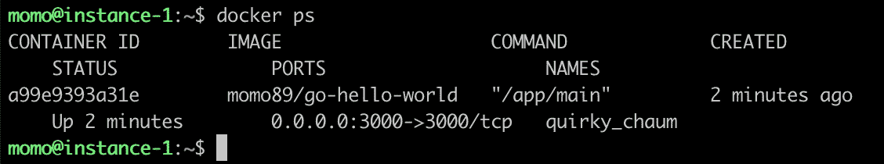

# 将带有 HAProxy + Docker 的 Go 应用程序部署到 Google 计算引擎

> 原文：<https://medium.easyread.co/deploying-go-app-with-haproxy-docker-to-google-compute-engine-f7e01693b645?source=collection_archive---------0----------------------->

## 如何将带有 HAProxy 和 Docker 的 Go App 部署到 Google 计算引擎


Photo by [pixabay.com](https://pixabay.com/illustrations/upload-online-internet-files-cloud-3406226/)

大家好！和我一起，一次又一次地，分享一些关于软件工程领域技术相关的经验、想法或观点。今天，我将再次分享关于 DevOps 的事情，即如何将您的应用程序部署到谷歌计算引擎。而这个例子我们会用 Docker + HAProxy + Go 编程语言。

我在这篇文章里写过一个关于将应用部署到亚马逊 EC2 的故事， [**《用 NGINX + Docker 将 Go App 部署到亚马逊 EC2》**](https://medium.com/easyread/deploying-go-app-with-nginx-docker-to-aws-ec2-b33d458918fd)。

现在，我们将尝试部署到谷歌计算引擎。为什么是谷歌？我们知道谷歌是一家大型科技公司，也有很多公司或用户使用的云计算服务。详细信息的官方页面可以在这里找到【https://cloud.google.com/ 

他们还提供免费等级和免费信用，这很好，因为我们可以免费学习使用 GCP。访问此链接了解更多关于 https://cloud.google.com/free[的免费项目](https://cloud.google.com/free)

如果你已经有了有效的帐号，让我们启动它并进入 https://console.cloud.google.com/的 GCP 控制台

# 1.安装计算引擎服务

选择**转到计算引擎**按钮。


Picture 1 Choose Compute Engine Service

选择项目(如果有)或创建项目并给出名称。例如，我们将使用 **go-app** 作为项目名称。点击**创建**按钮继续。


Picture 2 Creating Project

创建项目后，点击**创建**按钮继续该过程。


Picture 3 Creating Instance

我们将被重定向到设置实例的页面。在这种情况下，我们将更改几个规格，如**机器类型**、**启动盘、**和**防火墙**，其余的保持默认。我们使用 **f1-micro** 因为它最便宜，我们使用最新的 **Ubuntu LTS** 和**允许 HTTP 流量**因为我们将使用 HAProxy 作为负载平衡器。

接下来，点击**创建**按钮，完成实例的设置。


Picture 4 Choose Machine Type


Picture 5 Choose Boot Disk and Firewall Type

稍等片刻，直到您的实例准备就绪，我们将被重定向到**实例列表**页面。


Picture 6 Instances List Page

# 2.连接到实例

有几种方法可以从浏览器模式下的 SSH 开始连接到实例，直到使用 gcloud 命令或使用另一个 SSH 客户端。通过单击 Connect 列上 SSH 文本旁边的箭头按钮来查看列表。


Picture 7 Connect to Instance Options

我们将使用 gcloud 命令轻松连接到 Google 云服务。关于如何安装 gcloud command 的详细信息，请参见本文 [**【安装 Google Cloud SDK】**](https://cloud.google.com/sdk/install)因为它依赖于我们的 OS。

在本例中，我使用的是 macOS，步骤如下所示

下载 gcloud SDK:

```
**curl https://sdk.cloud.google.com | bash**
```

重新启动外壳:

```
**exec -l $SHELL**
```

运行 gcloud init 并遵循安装步骤(会询问您几个关于 google 帐户、云项目、计算引擎区域的问题) :

```
**gcloud init**
```

安装完成后，尝试连接到实例:

```
**gcloud beta compute ssh --zone "us-central1-a" "instance-1" --project "go-app-275713"**
```


Picture 8 Connected to Instance

# 3.设置 Docker

在这个例子中，我们将使用 Docker。为什么是 Docker？Docker 是什么？你可以看看这篇文章里的解释。

*   [**为开发者赋能 App 开发**](https://www.docker.com/) ，以及
*   [**开发者用 Docker**](https://www.docker.com/why-docker) 把他们的想法变成现实

**TL**； **DR** Docker 是一套平台即服务产品，使用操作系统级虚拟化来交付称为容器的软件包中的软件。有了这些容器，您可以轻松地将您的应用程序设置到服务器，或者从一个服务器迁移到另一个服务器。

首先，使用 apt 作为软件包管理来更新软件包，使用以下命令(-y 表示如果出现提示，假设是) :

```
**sudo apt-get update -y**
```

安装软件包以允许`**apt**`通过 HTTPS 使用存储库:

```
**sudo apt-get install** \
    apt-transport-https \
    ca-certificates \
    curl \
    gnupg-agent \
    software-properties-common
```

添加 Docker 官方 GPG 键:

```
**curl -fsSL https://download.docker.com/linux/ubuntu/gpg | sudo apt-key add -**
```

使用以下命令来设置**稳定的**库:

```
**sudo add-apt-repository** \
   "deb [arch=amd64] https://download.docker.com/linux/ubuntu \
   $(lsb_release -cs) \
   **stable**"
```

完成后，继续安装 Docker:

```
**sudo apt install docker.io**
```

启动 docker 并使其在系统重启后启动:

```
**sudo systemctl enable --now docker**
```

将您的用户添加到 docker 组，以便在没有 sudo 的情况下运行该命令(用您的用户更改 SOMEUSER):

```
**sudo usermod -aG docker SOMEUSER**
```

您需要注销并重新登录，以便重新评估您的组成员资格。

确保所有步骤正常工作，我们可以运行以下命令:

```
**docker --version
docker info**
```

# 4.设置图像

我们将使用我之前的[故事](https://medium.com/@bismobaruno/b33d458918fd)中的图片。如果你没有，请参考如何在此基础上构建图像。

# 5.运行 Go 应用程序

因为我们已经有了 Go 应用程序 Docker 映像，所以我们将尝试使用以下命令在我们的实例中获取并运行它:

```
**docker run -p 3000:3000 -d momo89/go-hello-world**
```


Picture 9 Pull Docker Image

检查已经运行的容器服务:

```
**docker ps**
```



Picture 10 Check Go App Container Service

尝试使用 curl 命令 ping 应用程序:

```
**curl -s localhost:3000**
```


Picture 11 Ping Go App

耶！！如果您成功地从服务器获得响应，我们就完成了 Go 应用程序。

# 6.运行 HAProxy

我们将使用 HAProxy 作为负载平衡器。什么是 HAProxy？

> HAProxy 是免费的开源软件，为基于 TCP 和 HTTP 的应用程序提供高可用性负载平衡器和代理服务器，这些应用程序将请求分布在多个服务器上。

要了解更多关于 HAProxy 的信息，请访问他们的官方页面。

由于 HAProxy 映像已经存在于 Docker Hub 中，我们不需要创建映像。只需提取图像并加载一些配置。

为 HAProxy 配置创建一个目录和一些文件。

```
cd $HOME
mkdir haproxy
cd haproxy
touch Dockerfile
touch haproxy.cfg
```

HAProxy 的 Dockerfile 应该是这样的:

而`**haproxy.cfg**`会是这样的(我们用 172.17.0.1，因为是默认的 Docker IP 地址):

构建 HAProxy 映像:

```
**docker build -t momo89/haproxy .**
```


Picture 12 Build HAProxy Docker Image

使用以下命令运行 HAProxy docker:

```
**docker run -p 80:80 -d momo89/haproxy**
```


Picture 13 Run HAProxy Docker Image

使用以下命令检查 HAProxy 服务是否已经运行:

```
**docker ps**
```


Picture 14 Check HAProxy Conteiner Service


Picture 15 Accessing Go App through HTTP

瞧，成功了！现在可以访问 HAProxy 后面的 Go App 了！

希望你喜欢它，我很高兴如果这篇文章对你有用！部署愉快！

谢谢大家！

# **其他仍在讲述的故事**

*   配置域名:[https://medium.com/@bismobaruno/2fb0a26832af](https://medium.com/@bismobaruno/2fb0a26832af)
*   配置子域:[https://medium.com/@bismobaruno/4294db1970b8](https://medium.com/@bismobaruno/configure-subdomain-to-google-compute-engine-with-google-cloud-dns-haproxy-docker-4294db1970b8)
*   配置通配符 SSL:[https://medium.com/@bismobaruno/ea92e896dfc](https://medium.com/@bismobaruno/configure-wildcard-ssl-to-google-compute-engine-with-google-cloud-dns-haproxy-docker-ea92e896dfc)