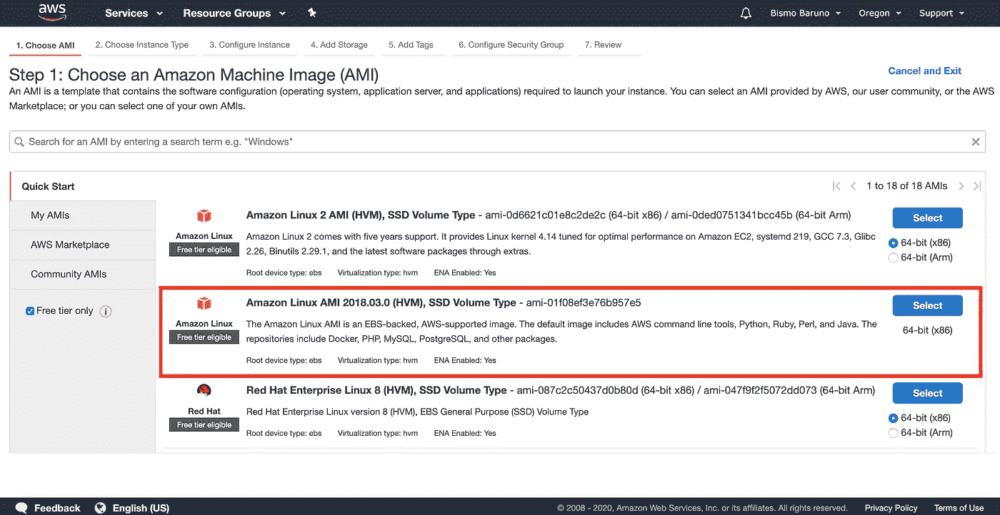
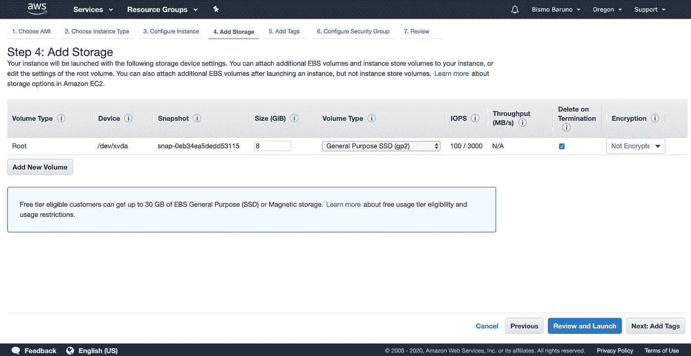
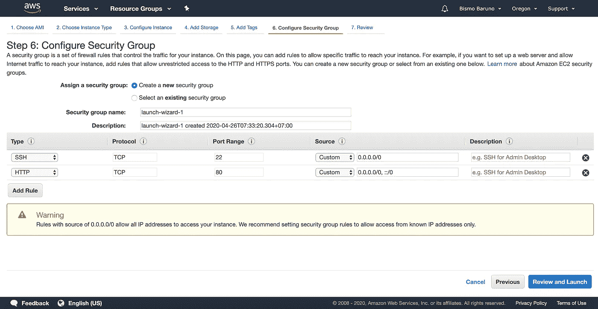
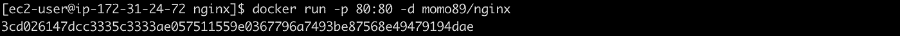

# 将带有 NGINX + Docker 的 Go 应用程序部署到 Amazon EC2

> 原文：<https://medium.easyread.co/deploying-go-app-with-nginx-docker-to-aws-ec2-b33d458918fd?source=collection_archive---------0----------------------->


Photo by [pixabay.com](https://pixabay.com/illustrations/cloud-computer-hosting-3406627/)

大家好！与我一次又一次地分享一些经验，尽管还是关于软件工程领域相关技术的看法。今天，我将分享关于 DevOps 的事情，即如何将您的应用程序部署到 Amazon EC2。而这个例子我们会用 Docker + NGINX + Go 编程语言。

为什么是 AWS？AWS 是当今流行的云平台，许多公司都在使用它。你可以在他们的官方页面[https://aws.amazon.com/](https://aws.amazon.com/)看到细节

他们提供了一些免费的服务，所以我们可以很容易地了解他们的服务。有关这项服务的更多信息，请参见 https://aws.amazon.com/free。

请确保您已经拥有有效的 AWS 帐户，并转到这个控制台链接【https://aws.amazon.com/console/ 

# **1。设置 EC2 服务**

从 AWS 管理控制台页面选择 **EC2** 服务


Picture 1 Choose EC2 Service

向下滚动并找到**启动实例**按钮。点击后，您将被重定向到 **AMI** 列表页面。


Picture 2 Launch EC2 Instance

我们将在步骤 1 中使用**Amazon Linux AMI 2018 . 03 . 0(HVM)，SSD 卷类型**,因为它支持自由层并具有 Docker 存储库，我们将使用容器来部署我们的应用程序。



Picture 3 Choose AMI

第 2 步是针对**实例类型**，您可以选择任何类型，但是我们将选择 **t2 micro** ，它符合自由层条件。接下来，点击**下一步:配置实例细节**按钮。


Picture 4 Choose Instant Type

然后，如果你想有具体的配置，你可以根据你的喜好进行更改。但是，我们将使用默认配置。因为我们使用默认设置，所以我们可以通过单击 **Next: Add Storage** 按钮继续步骤 3，并在 **Add Storage** 页面中，通过单击 **Next: Add Tags** 按钮转到步骤 4。


Picture 5 Configure Instance



Picture 6 Add Storage

第 5 步是**添加标签**，我们可以为实例和卷定义一个标签。我们将使用**名称**作为**键**，使用 **go-app** 作为**值**。


Picture 7 Add Tags

在步骤 6: **配置安全组**页面上，我们将公开端口 80 作为监听服务器，并允许来自任何地方的源(0.0.0.0/0)。因为我们将使用 NGINX 作为代理，然后重定向到我们的 Go 应用程序。



Picture 8 Configure Security Group

最后一步是**审查。**如果一切正常，点击**启动**按钮创建你的实例。


Picture 9 Review Instance Launch

如果我们提示输入一个**密钥对**，你可以选择创建一个新的密钥对或者选择一个现有的密钥对。因为我们没有任何密钥对，所以我们将首先创建。

**下载密钥对**并将**私钥文件**保存在一个安全的地方，因为一旦创建就不能再下载了。因为您将需要通过 **SSH 连接实例。**

然后， **Launch Instances** 按钮将被启用并准备好点击。让我们从点击按钮开始。


Picture 10 Key Pair

成功启动实例后，您将重定向到**启动状态**页面。点击**查看实例**按钮查看详情。


Picture 11 Launch Status

# 2.**连接到实例**

您可以在**我的实例**页面上看到我们创建的实例已经以绿色状态运行。在此页面中，您可以看到您拥有的每个实例的信息。


Picture 12 My Instance Page

单击**连接**按钮，查看我们如何连接到我们的实例。我们将使用 SSH 连接到实例。


Picture 13 How to Connect to Your Instance

```
ssh -i "aws_go_app.pem" [ec2-user@ec2-34-212-76-173.us-west-2.compute.amazonaws.com](mailto:ec2-user@ec2-34-212-76-173.us-west-2.compute.amazonaws.com)
```

只需复制示例命令并粘贴到您的终端(我使用的是 Mac)中，并确保您的私钥路径是正确的，文件权限为 400。然后，瞧，我们进去了！！

> 我们还可以使用 Pv4 公共 IP 代替公共 DNS (IPv4)来实现 SSH


Picture 14 Connected to Instance

# 3.设置 Docker

在这个例子中，我们将使用 Docker。为什么是 Docker？Docker 是什么？

> [https://www.docker.com/](https://www.docker.com/)T22[https://www.docker.com/why-docker](https://www.docker.com/why-docker)

**TL**； **DR** Docker 是一套平台即服务产品，它使用操作系统级虚拟化来交付称为容器的软件包中的软件，有了这个容器，您可以轻松地将您的应用程序设置到服务器或从一台服务器迁移到另一台服务器。

首先，使用 yum 作为软件包管理来更新软件包，使用以下命令(-y 表示如果出现提示，假设是) :

```
sudo yum update -y
```

完成后，继续安装 Docker:

```
sudo yum install -y docker
```

启动 docker 服务:

```
sudo service docker start
```

将 ec2-user 设置为 docker 组，以便在没有 sudo 的情况下运行命令:

```
sudo usermod -a -G docker ec2-user
```

您需要注销并重新登录，以便重新评估您的组成员资格。

# 4.设置图像

因为我们将努力保持实例的整洁，所以我们可以选择在本地开发应用程序，构建映像并存储到容器注册表中。在这一部分，我们将使用 Docker Hub([https://hub.docker.com/](https://hub.docker.com/))，因为它对公共存储库是免费的。

如果你在考虑私人仓库，你可以在 Docker Hub 上付费，或者使用其他服务，比如亚马逊 ECR([https://aws.amazon.com/ecr/](https://aws.amazon.com/ecr/))。也许我们可以尝试，我会创造另一个故事。

回到应用程序，我们将需要简单的 Go 文件和 Dockerfile。创建包含以下代码的 main.go 文件:

Dockerfile 应包含以下代码:

使用以下命令构建映像:

```
docker build -t momo89/go-hello-world .
```


Picture 15 Build Docker Image

登录 Docker Hub(确保您已经拥有一个帐户):

```
docker login
```

将图像推送到 Docker Hub:

```
docker push momo89/go-hello-world:latest
```


Picture 16 Push Docker Image

# 5.运行 Go 应用程序

成功创建 Go 应用程序 Docker 映像后，我们将尝试在我们的实例中获取并运行它。命令非常简单:

```
docker run -p 3000:3000 -d momo89/go-hello-world
```


Picture 17 Pull Docker Image

检查已经运行的容器服务:

```
docker ps
```


Picture 18 Check Container Service

尝试使用 curl 命令 ping 应用程序:

```
curl -s localhost:3000
```


Picture 19 Ping Go App

耶！！如果你得到服务器的响应，我们已经完成了 Go 应用程序

# 6.运行 NGINX

由于 NGINX 映像已经存在于 Docker Hub 中，我们不需要创建映像。只需提取图像并加载一些配置。

为 NGINX 配置创建目录和一些文件

```
cd $HOME
mkdir nginx
cd nginx
touch Dockerfile
touch nginx.conf
```

NGINX 的 docker 文件应该是这样的:

而 nginx.conf 会是这样的(我们用 172.17.0.1，因为它是默认的 Docker ip 地址):

构建 NGINX 映像:

```
docker build -t momo89/nginx .
```


Picture 20 Build NGINX Docker Image

使用以下命令运行 NGINX docker:

```
docker run -p 80:80 -d momo89/nginx
```



Picture 21 Run NGINX Docker Image

使用以下命令检查 NGINX 服务是否已经运行:

```
docker ps
```


Picture 22 Check Service


Picture 23 Accessing Go App through HTTP

瞧，成功了！现在可以访问 NGINX proxy 后面的 Go App 了！

希望你喜欢它，我很高兴如果这篇文章对你有用！部署愉快！

谢谢大家！

**还有人讲述的故事**

*   配置域名:【https://medium.com/@bismobaruno/4832900e353b 
*   配置子域:[https://medium.com/@bismobaruno/1cb956c6a542](https://medium.com/@bismobaruno/configure-subdomain-to-amazon-ec2-with-amazon-route-53-1cb956c6a542)
*   配置通配符 SSL:[https://medium.com/@bismobaruno/a33e657d8149](https://medium.com/@bismobaruno/configure-wildcard-ssl-to-amazon-ec2-with-amazon-route-53-nginx-docker-a33e657d8149)