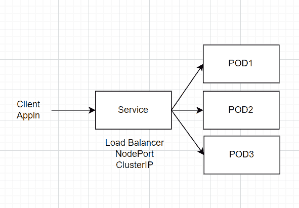
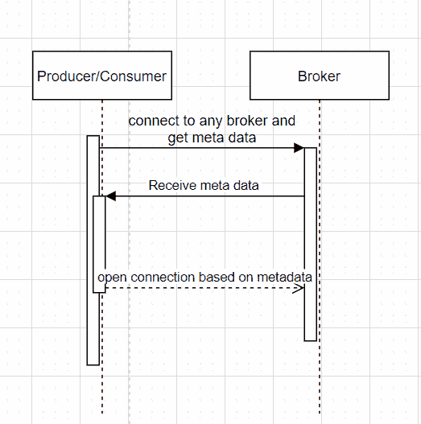
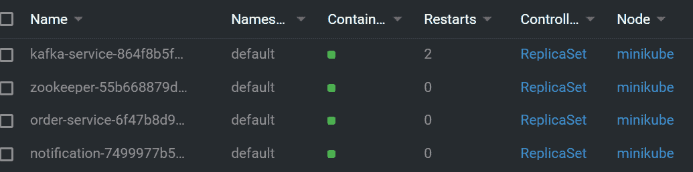
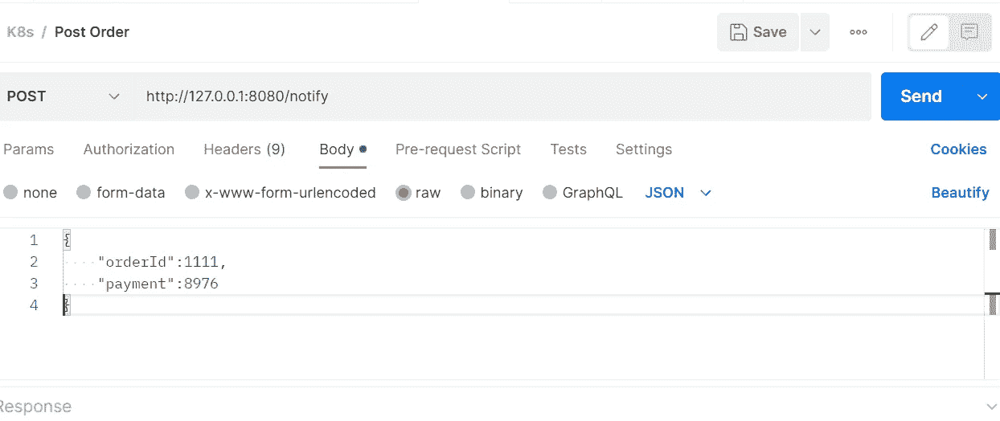
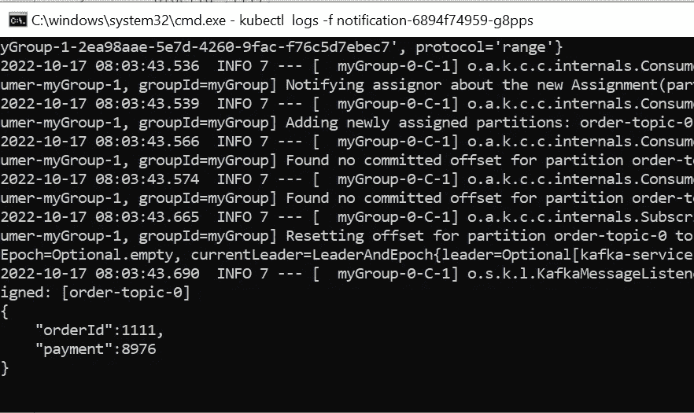

# 在 minikube 上部署卡夫卡

> 原文：<https://medium.com/globant/deploying-kafka-on-minikube-without-ip-hack-springboot-producer-consumer-6698489012dd?source=collection_archive---------0----------------------->

在 minikube 上部署 Kafka，无需 IP hack 进行本地开发。


Photo by [John Schnobrich](https://unsplash.com/@johnschno?utm_source=unsplash&utm_medium=referral&utm_content=creditCopyText) on [Unsplash](https://unsplash.com/s/photos/computer?utm_source=unsplash&utm_medium=referral&utm_content=creditCopyText)

问题:如果你正在努力在 minikube 上安装和运行 Kafka，那么你来对地方了。

这里的解决方案是为代理创建一个“无头服务”。

为什么只有无头服务而没有其他？

我们先来了解一下 Kubernetes 中的服务是做什么的。



Service and PODs

Kubernetes 服务充当临时 pod 的代理/包装器/LB。现在，当我们查询服务对象时，我们得到的是代理的地址，而不是运行代理的实际 POD 地址。

为了使 Kafka 客户端成功连接到代理，我们需要如下所示的代理地址:



Kafka client broker communication

Kafka 客户端(生产者/消费者)希望连接到实际的代理，而不是代理。那么如何获得代理的地址而不是服务的地址呢？这里有两种方法，

1.使用 Kubernetes API 服务器获取 Broker 的地址(自定义)

2.使用 OOTB 无头服务

在本文中，我们将采用一种无头方法。那么什么是无头服务呢？

无头服务是一种不分配群集 IP 并且不进行负载平衡或代理的服务。与其他服务对象不同，当查询 headless 服务时，它返回 POD(broker)的 IP，Kafka 客户端可以直接使用这些 IP。

如何创建一个无头服务？

为代理创建一个服务，并将服务类型设置为 clusterIP 和 clusterIP none，如下所示，

clusterIP:无→ **重要**

类型:ClusterIP

让我们现在实际检查一下

**先决条件:**

Spring Boot 版本:2.7.3

卡夫卡版本:3.2.0

minikube 版本:v1.25.1

Kubectl: v1.22.5

步骤 1:创建一个动物园管理员 POD。

zookeeper.yaml

```
apiVersion: v1
kind: Service
metadata:
  labels:
    app: zookeeper-service
  name: zookeeper-service
spec:
  type: NodePort
  ports:
    - name: zookeeper-port
      port: 2181
      nodePort: 30181
      targetPort: 2181
  selector:
    app: zookeeper
---
apiVersion: apps/v1
kind: Deployment
metadata:
  labels:
    app: zookeeper
  name: zookeeper
spec:
  replicas: 1
  selector:
    matchLabels:
      app: zookeeper
  template:
    metadata:
      labels:
        app: zookeeper
    spec:
      containers:
        - image: wurstmeister/zookeeper
          imagePullPolicy: IfNotPresent
          name: zookeeper
          ports:
            - container Port: 2181
```

使用 kubectl apply -f zookeeper.yaml 部署它。

第二步:创建一个 kafka-broker POD。

卡夫卡-broker.yaml

```
apiVersion: v1
kind: Service
metadata:
  labels:
    app: kafka-service
  name: kafka-service
spec:
  ports:
   - name: kafka-port
     port: 9092
     protocol: TCP
     targetPort: 9092
  selector:
    app: kafka-service
  clusterIP: None
  type: ClusterIP
---
apiVersion: apps/v1
kind: Deployment
metadata:
  labels:
    app: kafka-service
  name: kafka-service
spec:
  replicas: 1
  selector:
    matchLabels:
      app: kafka-service
  template:
    metadata:
      labels:
        app: kafka-service
    spec:
      containers:
      - env:
        - name: KAFKA_BROKER_ID
          value: "1"
        - name: KAFKA_ZOOKEEPER_CONNECT
          value: zookeeper-service:2181
        - name: KAFKA_LISTENERS
          value: LISTENER_INTERNAL://kafka-service:9092,LISTENER_EXTERNAL://localhost:9093
        - name: KAFKA_ADVERTISED_LISTENERS
          value: LISTENER_INTERNAL://kafka-service:9092,LISTENER_EXTERNAL://localhost:9093
        - name: KAFKA_LISTENER_SECURITY_PROTOCOL_MAP
          value: LISTENER_INTERNAL:PLAINTEXT,LISTENER_EXTERNAL:PLAINTEXT
        - name: KAFKA_INTER_BROKER_LISTENER_NAME
          value: LISTENER_INTERNAL
        image: wurstmeister/kafka
        imagePullPolicy: IfNotPresent
        name: kafka-service
        ports:
        - containerPort: 9092
```

IMP(解决方案):如您所见，服务类型是 ClusterIP 和 clusterIP: None

使用 Kubectl apply-f Kafka-broker . YAML 部署它。

步骤 3:使用 spring starter 创建一个 SpringBoot 应用程序，将其命名为 order-service，

3.1 **依赖关系添加以下 2 个依赖关系**

```
<**dependency**> <**groupId**>org.springframework.boot</**groupId**> <**artifactId**>spring-boot-starter-web</**artifactId**></**dependency**><**dependency**> <**groupId**>org.springframework.kafka</**groupId**> <**artifactId**>spring-kafka</**artifactId**> <**version**>3.2.0</**version**></**dependency**>
```

3.2 **创建 MessageProducer 类**

```
@Component
**public class** MessageProducer {**private final** KafkaTemplate<String, String> **kafkaTemplate**;**public** MessageProducer(KafkaTemplate<String, String> kafkaTemplate) {
   **this**.**kafkaTemplate** = kafkaTemplate;
}
**public void** send(String message) {
 **this**.**kafkaTemplate**.send(**"order-topic"**, message);
}}
```

**3.3 创建发布消息的 Rest 端点**

```
**@SpringBootApplication
@RestController
public class OrderServiceApplication {****@Autowired
Environment env;****@Autowired
MessageProducer messageProducer;****public static void main(String[] args) {
SpringApplication.*run*(OrderServiceApplication.class, args);
}**@PostMapping(**"/notify"**)
**public String sendNotifation(@RequestBody String message){****System.*out*.println("sending message : " + message);
messageProducer.send(message);
System.*out*.println("Sent message : " + message);****return message;
}****}**
```

3.4 在 application.yaml 中指定引导服务器

```
**spring**:
  **application**:
    **name**: order-service
  **kafka**:
    **bootstrap-servers**: kafka-service:9092
    **consumer**:
      **group-id**: **"myGroup"**
```

步骤 4:使用 spring starter 创建一个 SpringBoot 应用程序，

4.1:按照步骤 3.1 添加依赖项

4.2:创建消费者

```
@SpringBootApplication
**public class** NotificationApplication {**public static void** main(String[] args) {        SpringApplication.*run*(NotificationApplication.**class**, args);
}@KafkaListener(id = **"myGroup"**, topics = **"order-topic"**)
**public void** listen(String in) { //Logic to consume/process message goes here
  System.***out***.println(in);
}
}
```

第五步:测试

**检查**验证所有 pod 均已启动并运行

kubectl 获取豆荚

运筹学

使用 k8slens



**制片人**

首先，我们需要使用下面的命令向本地 m/c 公开服务，

kubectl 端口转发 <order-service-pod-name>8080:8080</order-service-pod-name>



Post message

**消费者**

kubectl logs -f<notification-service-pod-name></notification-service-pod-name>



**结论**

我们已经成功地在 minikube 上部署了 Kafka，并且使用 Spring Producer 和 Consumer 我们能够发送和接收消息。

# InvalidReplicationfactor # UnknownHostException # Kafka # Minikube # spring boot

参考资料:

[](https://spring.io/projects/spring-kafka) [## 阿帕奇卡夫卡的春天

### 有关受支持版本的信息，请使用上面的“支持”选项卡。Apache Kafka 的 Spring 是基于纯 java 的…

spring.io](https://spring.io/projects/spring-kafka) [](https://www.confluent.io/blog/kafka-listeners-explained) [## 卡夫卡听众-解释|汇合

### 您需要将 advertised.listeners(或者 KAFKA_ADVERTISED_LISTENERS，如果您使用 Docker 图像的话)设置为外部…

www.confluent.io](https://www.confluent.io/blog/kafka-listeners-explained) [](https://chamszamouri.medium.com/why-stateful-applications-in-k8s-need-a-headless-service-20d3db993872) [## 为什么 K8s 中的有状态应用程序需要一个无头服务

### 多年来，Kubernetes 以最适合无状态应用程序而闻名，这就是……

chamszamouri.medium.com](https://chamszamouri.medium.com/why-stateful-applications-in-k8s-need-a-headless-service-20d3db993872)