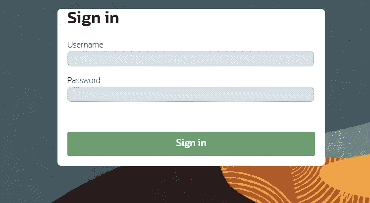
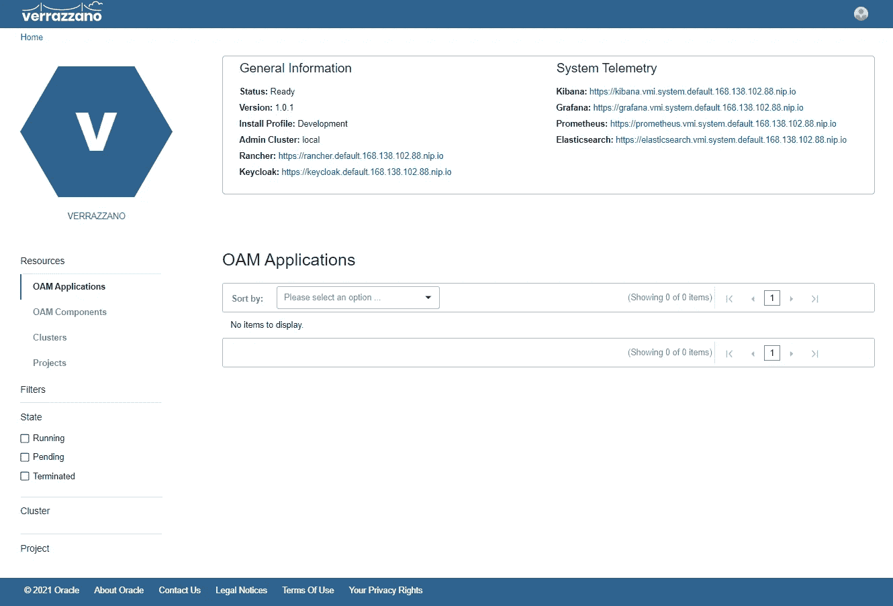
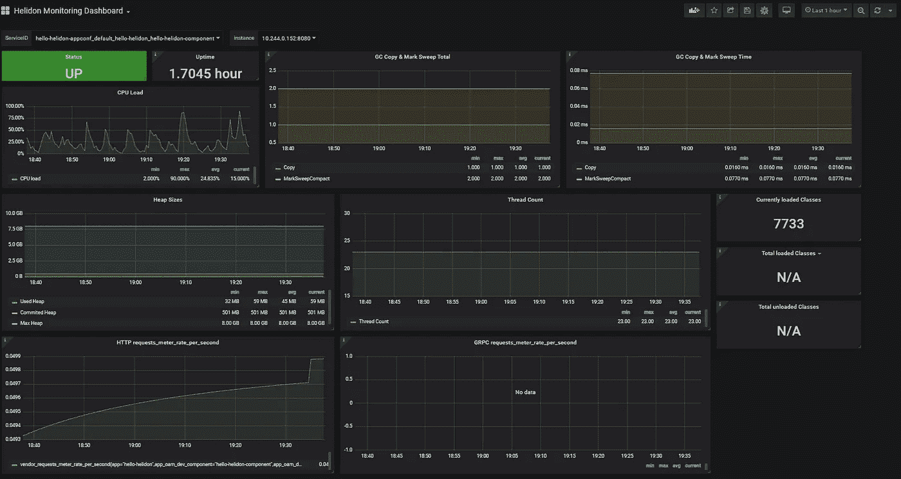
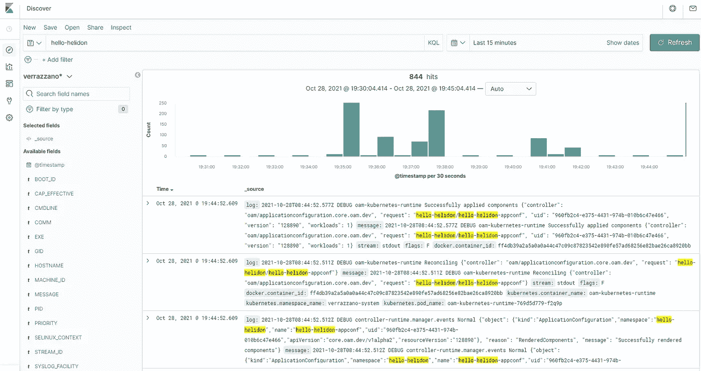
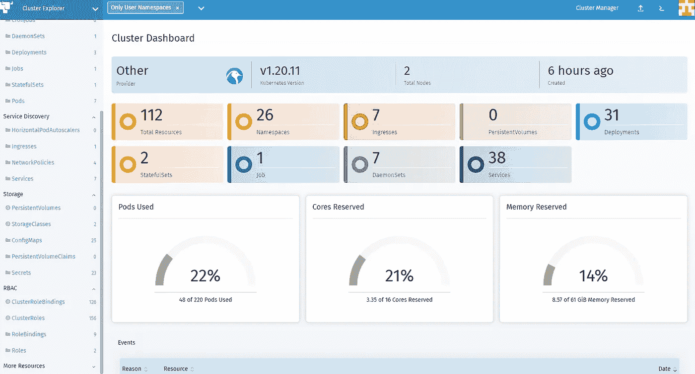

# 在 OKE 部署 Verrazzano

> 原文：<https://medium.com/oracledevs/deploying-verrazzano-on-oke-d506101f93e?source=collection_archive---------2----------------------->


甲骨文最近发布了 [Verrazzano](https://verrazzano.io) ，这是一个“端到端的容器平台，用于在多云和混合环境中部署云原生和传统应用。”如果这是一个很大的负担，那是因为 Verrazzano(简称 v8o)包了很多。在本帖中，我们将探索在 [OKE](https://docs.oracle.com/en-us/iaas/Content/ContEng/home.htm#top) 上部署 Verrazzano。

单一集群部署模式非常简单:

*   创建一个 Kubernetes 集群
*   安装 Verrazzano 平台操作器
*   安装 Verrazzano

之后，您可以部署您选择的应用程序。

## 创建 OKE 集群

我们将从使用[https://github . com/Oracle-terra form-modules/terra form-OCI-OKE](https://github.com/oracle-terraform-modules/terraform-oci-oke)创建 OKE 集群开始。因为我们只是带着 Verrazzano 兜一圈，所以我们只需要最基本的功能。遵循快速入门指南，创建提供程序并创建 terraform.tfvars.example 的副本，并将该副本重命名为 terraform.tfvars。确保启用/创建了以下功能/资源:

```
create_bastion_host = true
bastion_access = ["anywhere"]create_operator                    = true
enable_operator_instance_principal = true
node_pools = {
  np1 = { shape = "VM.Standard.E4.Flex", ocpus = 2, memory = 32, node_pool_size = 2, boot_volume_size = 150}
}
```

按照快速入门的其余部分运行 terraform init 并应用。

创建集群后，使用方便的输出将 ssh 命令复制到操作员主机:

```
ssh_to_operator = "ssh -i ~/.ssh/id_rsa -J opc@xyz.xyz.xyz.xyz opc@10.0.0.12"
```

从这里开始，所有的 kubectl 命令都在操作员主机上执行。

## 安装 Verrazzano 操作器

让我们安装 Verrazzano 操作符:

```
$ kubectl apply -f https://github.com/verrazzano/verrazzano/releases/download/v1.0.1/operator.yaml
```

并等待部署完成:

```
$ kubectl -n verrazzano-install rollout status deployment/verrazzano-platform-operatorWaiting for deployment “verrazzano-platform-operator” rollout to finish: 0 of 1 updated replicas are available…
```

再过几分钟，操作员应该已经部署好了。验证操作员正在运行:

```
$ kubectl -n verrazzano-install get podsNAME                                            READY   STATUS    RESTARTS   AGEverrazzano-platform-operator-5f788568fd-w8cz7   1/1     Running   0          80s
```

## 安装 Verrazzano

我们现在可以安装 Verrazzano 了。在本练习中，我们将使用开发配置文件:

```
kubectl apply -f - <<EOF
apiVersion: install.verrazzano.io/v1alpha1
kind: Verrazzano
metadata:
  name: hello-verrazzano
spec:
  profile: dev
EOF
```

现在我们需要等待 Verrazzano 安装:

```
kubectl wait \
    --timeout**=**20m \
    --for**=**condition**=**InstallComplete \
    verrazzano/
```

## 访问 Verrazzano

为了访问 Verrazzano，您需要获得控制台 URL:[https://verrazzano.io/docs/operations/](https://verrazzano.io/docs/operations/)

```
$ kubectl get vz -o yaml
```

您将得到一个打印的 URL 列表。比如我的 Verrazzano 控制台网址是[https://Verrazzano . default . 168 . 138 . 102 . 88 . nip . io](https://verrazzano.default.168.138.102.88.nip.io)

在浏览器中访问此 url，系统会提示您登录:



用户名是 **verrazzano** ，您可以通过发出以下命令获得密码:

```
kubectl get secret \
    --namespace verrazzano-system verrazzano \
    -o jsonpath={.data.password} | base64 \
    --decode; echo
```

您现在应该可以访问 Verrazzano 控制台了:



## 将应用程序部署到 Verrazzano

我们将部署 hello-helidon 应用程序。创建名称空间:

```
kubectl create namespace hello-helidon
```

并添加标签来标识由 Verrazzano 管理并为 Istio:

```
kubectl label namespace hello-helidon verrazzano-managed**=**true istio-injection**=**enabled
```

接下来，部署 Verrazzano [组件](https://verrazzano.io/docs/applications/#components):

```
kubectl apply -f https://raw.githubusercontent.com/verrazzano/verrazzano/master/examples/hello-helidon/hello-helidon-comp.yaml
```

然后创建[应用配置](https://verrazzano.io/docs/applications/#application-configurations):

```
kubectl apply -f https://raw.githubusercontent.com/verrazzano/verrazzano/master/examples/hello-helidon/hello-helidon-app.yaml
```

现在获取您的 pod 的名称:

```
$ kubectl get pods -n hello-helidonNAME                                        READY   STATUS    RESTARTS   AGEhello-helidon-deployment-54979d7d74-6c9nw   1/1     Running   0          2m18s
```

并检查应用程序是否准备好了:

```
$ kubectl wait — timeout=300s — for=condition=Ready -n hello-helidon pod/hello-helidon-deployment-54979d7d74–6c9nwpod/hello-helidon-deployment-54979d7d74-6c9nw condition met
```

查找负载平衡器的主机名:

```
HOST**=**$**(**kubectl get gateway hello-helidon-hello-helidon-appconf-gw \
    -n hello-helidon \
    -o jsonpath**=**'{.spec.servers[0].hosts[0]}'**)**
```

然后，您可以测试应用程序:

```
$ curl -sk \
    -X GET \
    "https://${HOST}/greet"
```

这应该会返回给你:

```
{"message":"Hello World!"}
```

## 可观察性

现在，我们已经让我们的应用程序运行并可访问，我们还想看看它的日志和指标。Verrazzano 为您提供了用于日志记录的 ELK 堆栈，以及用于度量和性能监控的 Prometheus 和 Grafana 的组合。

我们先来看看格拉夫纳。在 Verrazzano 控制台的主页上，您会看到一个到 Grafana 的链接。您可以使用与登录 Grafana 时相同的用户名和密码组合。登录后，点击“主页”并选择“Helidon 监控仪表板”:



Helidon Monitoring Dashboard

类似地，访问 Kibana 仪表板并点击左侧菜单中的可视化图标。系统将提示您创建一个索引模式。选择 verrazzano*并按照向导添加索引模式。搜索 hello-helidon，您应该能够看到以下内容:



Kibana dashboard

从这里，您可以创建自己的可视化和仪表板。

如果我们想窥视 Kubernetes 星团本身呢？再说一次，维拉扎诺会掩护你的。在 Verrazzano 控制台中，找到 Rancher 的链接并单击它。用户名为“admin ”,您可以按如下方式检索密码:

```
kubectl get secret \
    --namespace cattle-system rancher-admin-secret \
    -o jsonpath={.data.password} | base64 \
    --decode; echo
```

登录后，您将进入集群页面，您将看到一个资源管理器按钮。点击它，您将能够查看您的 Kubernetes 集群:



Rancher Kubernetes dashboard

## 摘要

Verrazzano 打包了一套很好的功能，可以帮助您处理 Kubernetes 的操作方面。从监控到日志记录和安全性，Kubernetes 或应用程序管理员可以获得很高的工作效率。

我希望这篇文章对你有所帮助。未来，我们将探索 Verrazzano 的其他特性，包括多集群部署和网络安全等。