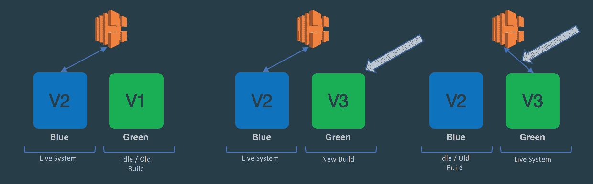
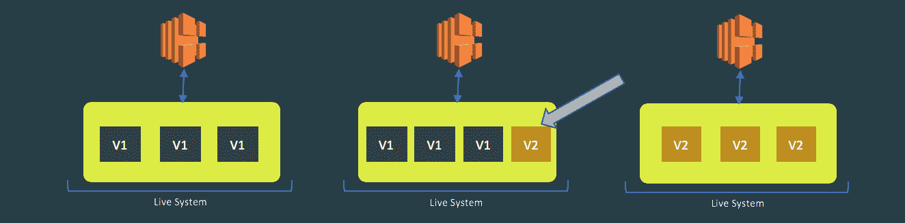
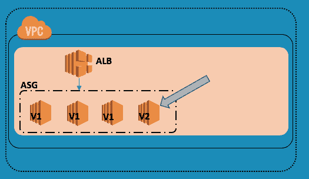
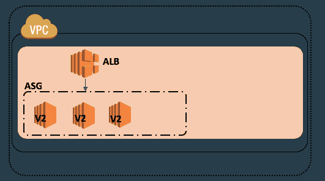
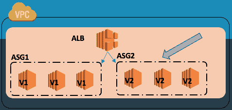
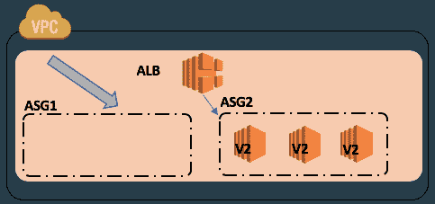
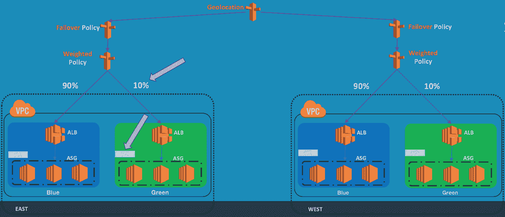
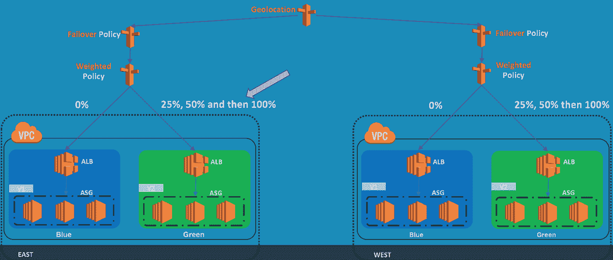

# 信心十足地部署—借助 AWS 上的 Canary 部署，最大限度地降低风险、提高弹性

> 原文：<https://medium.com/capital-one-tech/deploying-with-confidence-strategies-for-canary-deployments-on-aws-7cab3798823e?source=collection_archive---------0----------------------->

今天的客户对在线网站和网络应用有很高的期望。他们希望网站和应用程序总是可用的，当它们不可用时，这就成了大新闻。想象一个社交媒体应用程序宕机一个小时左右。公司会尽快安排最优秀的人员来解决这个问题。他们还会向用户发送信息，解释发生了什么，以及他们将来如何避免这种情况。在内部，他们将经历许多回顾和反思，以加强他们的系统和基础设施，并履行他们对用户的承诺。

而且这只是针对社交媒体应用。金融网站和应用程序与客户的个人生活非常接近，影响了他们访问和使用财务的能力。客户越来越多地在网上进行金融交易，包括付款、交易股票、转账等。因此，客户越来越希望财务应用程序始终可用。这些应用程序可用性的任何中断不仅会影响客户满意度，还会影响金融机构的信任度、声誉和可信度。

我们如何确保金融应用程序始终可供客户使用？

# 变化是活系统不可避免的

金融界及其他领域的企业越来越多地构建“永不停机”系统，以便为客户提供全天候可用性。这些系统需要不断更新以添加新功能、更新技术堆栈等。改变一个活跃的系统总是伴随着出错的风险。这些故障可能源于系统错误和/或应用程序/功能缺陷。对于“永不停机”的系统，有不同的策略来降低不同故障的风险。

# 蓝绿色部署

[蓝绿色部署](https://martinfowler.com/bliki/BlueGreenDeployment.html)是一种在不影响当前实时流量的情况下部署新版本软件的流行技术。在这种方法中，创建了两个基础设施栈；一个叫做*蓝*，另一个叫做*绿*。在任何给定的时间，其中一个栈正在服务实时流量，而另一个栈是空闲的。闲置的堆栈基础架构可以在不用于部署时关闭，以避免资源浪费。在更新期间，新版本被部署在空闲堆栈上。一旦所有验证完成，流量就向空闲堆栈开放，空闲堆栈变为活动，活动堆栈变为空闲。

请参见下图:

# 金丝雀部署

金丝雀部署(Canary Deployment)是一种将流量缓慢调节到新版本软件的技术。这种方法的好处是，与向新版本开放全部流量相比，任何问题的影响都较低。一旦新版本通过验证，并且没有发现任何问题，那么新版本将被滚动部署到剩余的服务器上。

请参见下图:

Canary 部署是升级“永不停机”系统的最佳方法之一，在这种系统中，新旧两个版本可以并行运行，不会产生任何副作用。这需要端到端的验证，以确保新版本没有任何问题。它还允许流量在缓慢增加之前向一小部分用户开放。如果出现任何问题，这允许快速回滚到以前的版本。

# AWS 服务

AWS 提供了一组丰富的服务，可用于实现蓝绿色和淡黄色部署。

*   [**路由 53**](https://aws.amazon.com/route53/) **:** 提供路由和健康检查功能的托管 DNS 服务。路由策略决定了 Route 53 将如何响应查询。
*   [**ALB**](https://docs.aws.amazon.com/elasticloadbalancing/latest/application/introduction.html) **:** 应用负载平衡器在多个可用性区域中的多个目标(如 EC2 实例)之间分配传入流量。
*   [**ECS**](https://aws.amazon.com/ecs/)**:**弹性容器服务(Elastic Container Service)是一种容器编排服务，可以在 Docker 中轻松运行和扩展容器化的应用。
*   [**EC2**](https://aws.amazon.com/ec2/)**:**弹性计算云在 AWS 中提供可扩展的计算能力。
*   [**ASG**](https://docs.aws.amazon.com/autoscaling/ec2/userguide/AutoScalingGroup.html)**:**自动缩放组包含一组具有相似特征的 EC2 实例，并被视为一个逻辑分组，用于实例缩放和管理。

# 使用 AWS 实现 Canary 部署

使用 AWS 服务实现 Canary 部署有许多方法。这些技术可用于 ALB/ECS 堆栈或 ALB/ASG 堆栈。Canary 部署也可以通过创建一个堆栈或两个堆栈来实现。

## 1 堆栈方法:使用 AWS 服务实现 Canary 部署

在这种方法中，有一个 ALB/ECS 堆栈为实时流量提供服务。通过增加 ASG 的大小或附加另一个 ASG 来部署软件的新版本。一旦新版本通过验证并且没有发现任何问题，那么新版本将在剩余实例上滚动部署。

请参见下图:

考虑这种方法，其中堆栈大小较小，回滚的 SLA 较大。注意，这种方法不能控制新版本的流量百分比。ALB 路由到所有 EC2 实例。在上面的例子中，一旦创建了一个新的实例，由于有 4 个实例，25%的流量将流向新版本。

此外，完全释放后的回滚可能需要比预期更长的时间。要回滚，请对软件的先前版本重复上述过程。回滚所需的时间取决于实例的数量和每个实例的启动时间。

这种方法的另一个变体是使用两个 ASG，并向第二个 ASG 添加新的实例。请参见下图:

考虑这种方法，其中堆栈大小较大，回滚的 SLA 也较大。这种方法不能控制新版本的流量百分比。ALB 路由到所有 EC2 实例。

当两个 ASG 都在服务流量时，回滚比收缩旧版本后更容易。只要把 V2 的 ASG 缩小到 0。这将终止所有具有 V2 的实例。但是，完全释放后，回滚将需要更长时间。要回滚，请对以前版本的软件重复上述过程。回滚所需的时间取决于实例的数量和每个实例的启动时间。

## 2 堆栈方法:使用 AWS 服务实现 Canary 部署

在这种方法中，竖立两个平行的 ALB/ECS 堆叠。使用 Route53 加权策略向一个或两个堆栈发送流量。默认情况下，100%的流量由一个堆栈提供服务(比如蓝色)。新版本部署在非活动堆栈上(在本例中为绿色)。在路由任何流量之前，所有验证和健康检查都在绿色堆栈上运行。一旦一切正常，通过改变 Route53 记录的权重，一小部分流量(比如 10%)被开放给绿色堆栈。

请参见下图:

当两个堆栈都在服务流量时，可以自动比较每个堆栈的健康状况、响应时间和错误率，并决定增加或减少新堆栈的流量。如果一切顺利，则慢慢增加新堆栈的流量，直到流量达到 100%。

请参见下图:

这种方法的好处如下:

*   完全控制百分比。
*   不应影响现有堆栈的运行状况。
*   回滚更容易、更快；切换流量所需的时间取决于为 Route 53 记录集配置的 TTL 值。

考虑将这种方法用于业务关键型低风险系统，因为这种方法提供了最快的回滚选项。

# 摘要

总之，在决定部署策略之前，评估您的系统的风险承受能力，识别您的实际系统的风险，并选择最适合您的系统的方法。这里有一些通用的指导方针，可能有助于使系统更有弹性。

*   拥有健全的健康检查机制。
*   添加智能显示器和警报。
*   评估每个版本的风险承受能力，并准备好后备选项。
*   决定最适合您系统的部署策略。
*   使用自动化测试、自动化验证和自动化管道。
*   为自动回滚添加智能。
*   将基础设施版本(JDK 升级、框架升级)与功能版本(新功能、增强、逻辑变化)分开。
*   有一个全面的发布沟通计划。

*披露声明:这些观点是作者的观点。除非本帖中另有说明，否则 Capital One 不属于所提及的任何公司，也不被其认可。使用或展示的所有商标和其他知识产权都是其各自所有者的所有权。本文为 Capital One 2018。*