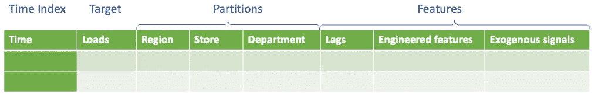
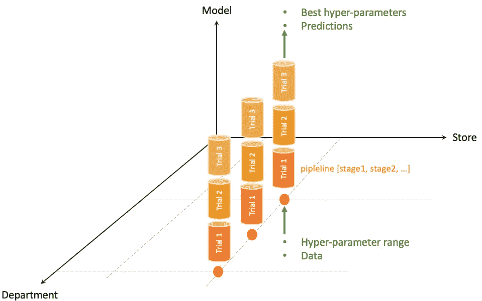
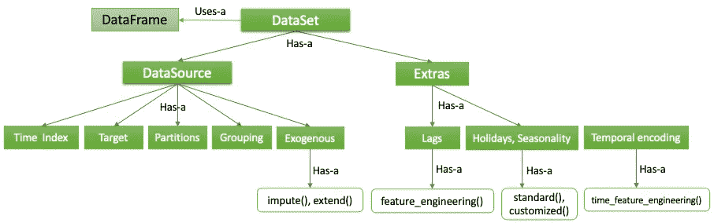
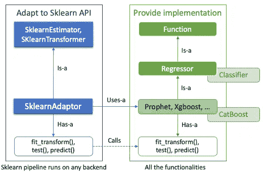
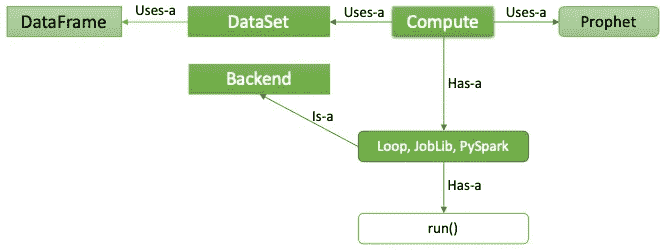
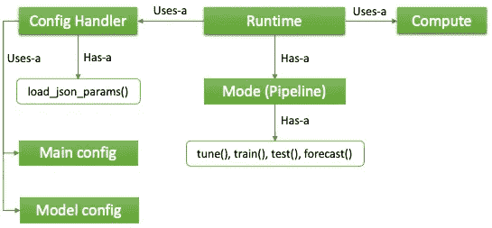

# 具有可扩展性和可伸缩性的可重用预测库的设计与实现

> 原文：<https://medium.com/walmartglobaltech/design-and-implementation-of-a-reusable-forecasting-library-with-extensibility-and-scalability-b59b3701b66f?source=collection_archive---------6----------------------->

预测是沃尔玛公司最常要求的机器学习功能之一。当不同的团队在竖井中构建 ML 模型时，他们经常使用相同的开源包，无休止地重复工作。最近，我们开发了一个可重用的预测库( *RFL* )，通过同时关注可伸缩性和可扩展性的设计来避免这种情况。目标是为常用的建模方法(如 Prophet、Xgboost、Arima 等)提供一个包装器..那些重复性的工作现在由 *RFL* 来完成。因此，数据科学家可以花更多的时间来评估结果和改进模型。

# **要求**

我们一开始要求 *RFL* 必须是**基于配置的**。应用程序相关信息在 JSON 文件中指定，而应用程序不可知部分在核心库中实现。这是由我们的预测即服务愿景推动的，其中前端 UI 通过 JSON 文件与后端 FAAS 通信。

第二个需求是**扩展性**。这包括添加当前库中没有的新预测模型的能力，以及扩展分类等功能的能力。 *RFL* 应该让这种功能提升变得简单易行。

最后一个需求是**可扩展性**。在我们从事的项目中，有涉及几百个模型(小)、几万个模型(中)或几百万个模型(大)的项目。所有这些用例都应该得到支持，并通过翻转 JSON 文件中的一个标志进行理想的配置。

# 设计

我们的方法是首先对预测的计算过程进行抽象。然后，我们使用面向对象设计(OOD)的概念来捕获抽象。我们的直觉是，一旦被捕获，添加新的模型/功能就变成了子类化的问题(从基类)。

一个抽象是数据和计算的分离。在图 1a 中，数据帧的字段包括四种类型:

*   时间索引—这是数据点的时间戳。
*   目标-这是要预测的目标。
*   分区-这里的列实际上定义了一个数据网格，其每个关节都与数据框中的一个时间序列相关联。图 1a 示出了一些例子。分区列也称为维度。
*   特征——被视为目标变量的驱动因素，用于辅助预测。同样，图 1a 示出了一些示例特征。

图 1b 是在关节处发生的计算的图示。在许多试验中，它由一系列连续运行的阶段组成(想想超参数调整)。所有的管道运行相同的程序，但是使用不同的数据(听起来是不是像一个程序多数据的事情？).

Figure 1a. Abstraction of data: think of data as multiple time series at the joints of the partition grid

Figure 1b. Abstraction of computation: parallelization happens at joints and trials

第二个抽象进一步深入计算方面(图 1b)。在这里，我们观察到在流水线中运行的功能和为执行分配的计算资源的分离。我们把后者叫做*后端*。更多内容将在下一节介绍。

在进入详细描述之前，让我们简要介绍一下将用于表示我们的设计的 UML 术语:

*   **是-A**:*A*是-AB 的意思是 *A* 是基类 *B* 的子类
*   **有-A**:*A*有-AB 的意思是 *B* 是 *A* 的成员
*   **用途-a** : *A* **用途-a** *B* 表示 *A* 引用了 *B* 的对象，通常作为参数传递给 *A* 的成员函数

D***ataset***反映了前面图 1a 所示的数据抽象。有两部分: *DataSource* 对应的是从数据源中读取的内容； *Extras* 是由 *AutoPipe* 制造的附加特征。*数据帧*最初存储从源读取的数据。后来，它增加了那些来自*临时演员*的演员。不同类型的特征具有不同的行为。最好用面向对象的设计来捕获它们，如图 2 所示。

Figure 2\. Hierarchy of the *Dataset* class. Notice the reference to *DataFrame* which stores the actual data.

*外生*信号是降水、失业、店铺客流量等外部变量。，它们与*目标*相关。提供了两种方法: *impute()* 和 *extend()。*前者填充任何 N/A 值。后者计算每个要素的未来值。

*滞后*由一组从*目标*设计的统计特征组成，通常用于基于回归的模型，如树模型。*节假日*和*季节性*很好理解。

*时间编码*以每周、每月、每季度和/或每年的频率对时间周期进行编码。它们类似于在变压器型 NLP 神经网络中广泛使用的位置编码。同样，此功能在回归模型中也很有用，如果没有此类功能，时间顺序可能会丢失。

F**油号** 是实现可扩展性的地方。在图 3 中，*函数*类是功能的提供者。它完成了三件事:I)。纳入当前不在库中的新预测模型；ii)。添加新的估计器，如分类器；iii)。适应一些流行的机器学习 API。目前 *RFL* 已经实现了 6 种建模方法:Sarimax，Prophet，Greykite，Xgboost，LightGBM，Random Forest。

SklearnEstimator 类提供了一个 API 适配的例子，在这个例子中是 Scikit-learn——一个流行的开源 ML 包。该适配器的目的是允许 *RFL* 函数作为遵循 Scikit-learn 编码约定的其他函数的阶段集成到 Scikit-learn 管道中。管道是一种高效的执行方式，在 ML 社区中被广泛认可。它消除了阶段之间的瞬时数据 IO。新 API 的未来扩展可以类似地实现。

Figure 3\. Hierarchy of the Function class. In the future, *Classifier* can be added as new *Function.*

C***compute***是一个“把一切都拉在一起”的类。图 4 呈现了这样一个过程:在可伸缩的*后端*上，针对*数据集*中的多个数据运行*函数*。目前为止支持三个后端: *Loop* 、 *Joblib* 和 *PySpark* 。顾名思义，*循环*后端旨在以数据迭代的方式在本地计算机上运行。 *Joblib* 后端使用 Joblib 开源库实现多线程。最后，大规模任务可以使用 *PySpark* 后端在 Spark 集群上执行。 *run* ()的工作是从被引用的 *Function* 对象(本例为 Prophet model)中打包相应的函数( *fit_transform* ()或 *predict* ())并发送到已经预先配置好的后端。模型和后端都在配置文件中指定。

Figure 4\. Hierarchy of the Compute class. This example illustrates that a Prophet model is run on one of the three backends.

# 履行

R ***untime*** 为数据科学家提供顶层功能。对于他们的大部分日常工作，与这个班级的互动是足够的。已经实现了四种模式。其中每一个都是功能的组合:*调*()、*练*()、*测*()、*预报*()，依次进行(图 5)。虽然数据科学家可以通过编程 API 调用这些函数，但标准的使用方式是通过配置文件，通过*配置处理程序*类加载配置信息。在内部，四种模式调用 *Compute.run* ()来完成它们的赋值。由于模块化设计，未来新模式的整合将变得轻而易举。在配置方面，*主配置*用于一般设置，*车型配置*用于车型特定设置。

Figure 5\. Runtime architecture. Four predefined modes are implemented currently. User construction of runtime pipelines (via config files) will be realized in the future.

除了上述四种模式， *RFL* 还有一些额外的功能值得一提:

R广义特征生成。有必要在训练和测试中递归地产生外部信号和统计特征的未来值。目前，一个香草先知模型被用于此目的。如果数据框中有未来值，可在配置中禁用此功能。

G肉平。在一些用例中，分区变得过于精细，时序信号变得过于稀疏。一个常见的例子是商店-部门-类别级别的预测。在这种情况下，数据科学家会希望首先对某些分区维度进行分组。 *RFL* 可以配置为在组的基础上训练模型，并为组中的所有分区生成预测。

E估价频率。对于模型的绩效评估，可以使用不同的指标，如 MAPE、加权 MAPE、对称 MAPE、MAE 等。可以对聚合的时间序列频率而不是数据集的原始频率进行评估。当未来的时间序列具有不同的频率时，这一点尤其重要，并且当未来的数据可用时，要对性能度量进行比较。

# 摘要

*RFL* 已经在多个沃尔玛项目中被采用作为建模工具。总之，数据科学家报告的好处有两个方面:

*   低代码实验设置带来的工作节省。由于内置并行化，这相当于节省了 3 到 4 天时间，并减少了 90%的执行时间。有了 RFL，数据科学家可以更专注于设计实验，而不是每次都花精力去设置。
*   通过更广泛地探索超参数和特征空间提供质量改进。虽然提高建模质量不是库本身的目标，但由于实验的简化，数据科学家通常会在事后找到更优的模型。

*RFL* 是一个可重用的预测库，设计时考虑了可扩展性和可伸缩性。它也是配置驱动的，这是一种设计选择，旨在支持我们预测即服务的长期愿景，以便企业作为数据所有者可以以无代码的方式尝试假设情景。未来，我们希望在公司内部提高其认知度，以增加更多的使用。

# 确认

多个沃尔玛团队参与了 *RFL* 的开发。他们的贡献在这里立刻得到承认。