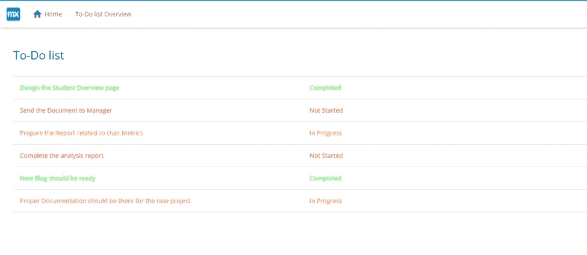

# 使用 SCSS 和考拉编译器设计和编译你的 Mendix 应用程序

> 原文：<https://medium.com/mendix/design-compile-your-mendix-app-using-scss-and-koala-compiler-22b73ab1b8e4?source=collection_archive---------6----------------------->


如今，开发者们正竭尽全力设计吸引人的应用程序，以抓住用户的注意力。创建一个具有优秀设计的应用程序是吸引用户并一次又一次吸引他们回来的一种方式。

在这篇简短的博客中，我将向你展示如何使用 SCSS 设计你的应用程序，并使用考拉编译器编译它们，给你所有你需要的工具来制作一个更漂亮的用户界面。

## 为什么要考拉编译器？

Studio Pro 内置了 Calypso 为什么还要用考拉编译器？虽然它有一些弱点，但它也有一些相当大的优势:

*   **多语言支持:** Less、Sass、CoffeeScript Compass 框架和 Dust
*   **自动 CSS 前缀:** -WebKit-、-Moz-等
*   **跨平台支持:** Windows、Linux 和 Mac


## **待办事项:1。给读者举一个✅** 的实际例子

下面是我的待办事项清单，有几项还没开始，有几项正在进行，有几项已经完成。

我想用不同的方式向我的用户传达这一点，用颜色。为了实现这一点，我想用绿色显示已完成的项目，进行中的项目将是橙色的，而未开始的项目是红色的。

颜色向用户描述了待办事项的状态。

## **待办事项:2。向读者展示如何真正做到这一点** ✅

**步骤 1:** 在系统资源管理器中启动您的应用程序，并导航至主题文件夹，如下所示。在 app 文件夹中创建一个新文件，并将其命名为 this _todolist。scss。

> **文件夹路径:**\ my design \ theme \ styles \ web \ sass \ app


**步骤 2:** 在您的编辑器中启动 _todolist.scss(本例中我使用的是 Notepad++)，编写如下所示的 scss 类并保存文件。

```
**.completed-todolist{****color: #00FF00;****}****.inprogress-todolist{****color: #FFA500;****}****.notstarted-todolist{****color: #FF0000;****}**
```


**第三步:**启动 _custom。scss 并在文件中添加导入语句，然后保存它。

```
**@import “todolist”;**
```


第四步:在 Studio Pro 中打开你的应用程序，打开你的概览页面，编辑文本小部件的动态类，如下所示

```
**if $currentObject/Status=MyFirstModule.Enum_Status.Not_Started****then****‘notstarted-todolist’****else if $currentObject/Status=MyFirstModule.Enum_Status.In_Progress****then****‘inprogress-todolist’****else****‘completed-todolist’**
```


**第五步:**打开[考拉官网](http://koala-app.com/)下载考拉编译器。现在在你的系统上安装它。


步骤 6: 现在启动考拉编译器并加载你的项目，如下所示


**步骤 7:** 加载后，确保勾选自动编译复选框，并点击编译一次。


**第八步:**现在你的 app 已经编译成功了。此后，无论你在任何 scss 文件中做了什么更改，这个应用程序都会被考拉编译器自动编译，因为我们打开了自动编译选项。


**第九步:**编译完成后，新添加的 CSS 就会出现在你的 main.css 文件中。


**第 10 步:**现在重新运行你的应用程序，看看有什么变化。您将能够在您的应用中看到以下更改。



哇！您刚刚学习了如何将新的 SCSS 类应用到我们的小部件中，以及如何使用考拉编译器和 Mendix 成功地编译它们。看到你们的评论和问题，我很激动。在博客的评论区发表你的评论/问题。

下一篇文章再见！！！

## 阅读更多

 [## 自定义样式- Studio Pro 9 操作指南| Mendix 文档

### 这一页描述了开发者如何改变应用程序的风格和创建可重用的风格。对于渐进式和 web…

docs.mendix.com](https://docs.mendix.com/howto/front-end/customize-styling-new) [](https://github.com/oklai/koala/wiki#docs) [## 主页 ok lai/考拉 Wiki

### 此时您不能执行该操作。您已使用另一个标签页或窗口登录。您已在另一个选项卡中注销，或者…

github.com](https://github.com/oklai/koala/wiki#docs) 

*来自出版商-*

如果你喜欢这篇文章，你可以在我们的 [*媒体页面*](https://medium.com/mendix) *找到更多类似的文章。对于精彩的视频和直播会话，您可以前往*[*MxLive*](https://www.mendix.com/live/)*或我们的社区*[*Youtube PAG*](https://www.youtube.com/c/MendixCommunity/community)*e .*

*希望入门的创客，可以注册一个* [*免费账号*](https://signup.mendix.com/link/signup/?source=direct) *，通过我们的* [*学苑*](https://academy.mendix.com/link/home) *获得即时学习权限。*

有兴趣更多地参与我们的社区吗？你可以加入我们的 [*Slack 社区频道*](https://join.slack.com/t/mendixcommunity/shared_invite/zt-hwhwkcxu-~59ywyjqHlUHXmrw5heqpQ) *或者那些想要更多参与的人，看看加入我们的*[*Meetups*](https://developers.mendix.com/meetups/#meetupsNearYou)*。*