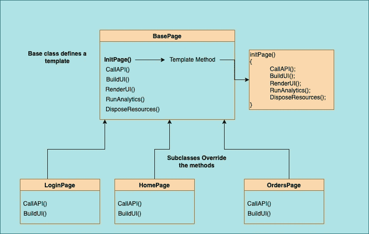

# 以模板化的方式设计它！

> 原文：<https://medium.com/globant/design-it-the-templated-way-6d89cba7beef?source=collection_archive---------6----------------------->


嘿各位程序员和爱好者们！

在编程过程中，您可能听说过封装对象创建、方法调用和其他复杂的接口。你可能不知道的是封装算法。让我们试着看一看模板方法设计模式如何帮助我们实现算法封装。我们将看看这个模式是关于什么的，为什么需要它，以及我们可以在哪里使用它。我们走吧！

**什么是模板方法设计模式？**

模板方法设计模式是一种行为设计模式，它在称为模板方法的抽象方法的帮助下提供了算法的抽象定义。目的是通过向子类提供某些步骤的责任来定义算法的框架，即子类可以定义或覆盖某些步骤而不影响框架。



**我们为什么需要它以及它的用法-**

这种模式有助于实现代码的可重用性和消除代码冗余。有时我们需要设计可以被我们的系统重用的公共库和框架。在这种情况下，模板方法是我们分离出常见行为的方式。使用这种设计模式开发的应用程序允许低层组件适应高层组件，并允许它们对自己在系统中的行为进行模块化控制。

模板可以创建一次，子类可以根据需要覆盖抽象方法的行为，而不会扰乱算法的结构。在这种模式中，每个子调用一个抽象操作或一个原始操作。子类通过定义抽象操作为算法提供特定于需求的细节。

**有哪些用例？**

*   在这种情况下，我们希望创建一个框架，框架类可以定义一些行为，并对用户应用程序承担一些责任。
*   我们希望有一个模板设置，以便新用户遵循相同的一致性的情况。
*   同时在不同的屏幕上创建可重复使用的界面和用户界面。

**它有助于解决哪种反模式？**

这个模式有助于解决“**调用超** **反** - **模式**”。这是一种反模式，其中子类**必须**使用 super 关键字调用其父类方法，以使功能完整。使用 Super 关键字调用父类方法在 OOP 中并不是错误的做法。但是，如果它是完成业务逻辑的必要条件，那么它就被称为“代码味道”或“调用超级反模式”，因为它不会使程序员的期望变得强烈。

模板方法设计模式通过将这种责任转移给子类来帮助修复这种反模式。父类中模板方法内部引用的抽象方法迫使子类实现业务逻辑，从而为子类提供更多的控制。

**用例子编码。**

让我们考虑一个典型的移动应用程序屏幕的例子。这包括数据加载、控件创建、设置帧和后期渲染回调。可以创建一个通用模板作为基类，它可以在每个屏幕上运行并执行不同的任务。这些方法的职责和定义可能因屏幕而异。

例如，我们可能在某些类中需要不同的数据加载逻辑，不同的呈现逻辑，等等。这些责任可以在单独的屏幕上承担。但是可以创建一个通用的模板方法，它一步一步地调用这些方法，并将其行为决定为运行时多态性。

1.  **基础页面有模板方法、抽象方法和原语方法。**

```
public abstract class BasePage
  {
      public void Init()
      { 
          RunAnalytics();
          LoadData();
          InitControls();
          RenderControls();
          SetFrames();
      }

      private void RunAnalytics()
      {
          //Call firebase analytics
          //use common logging
      }

     //methods to be overriden
      protected abstract void LoadData();
      protected abstract void InitControls();
      protected abstract void RenderControls();
      protected abstract void SetFrames();
  }
```

**2。子页面调用模板方法并覆盖抽象方法来决定运行时的控制流。**

```
public class UserListPage : BasePage
  {
       public override void OnAppearing()
       {
           base.Init(); 
       }public override void LoadData()
       {
           Console.WriteLine("Loading data needed for this page");
       }public override void InitControls()
       {
           //Control Initialization logic
       }public override void RenderControls()
       {
           //Control rendering logic
       }public override void SetFrames()
       {
           //set frames logic
       }
  }public class OrdersPage : BasePage
   {
           public override void OnAppearing()
           {
               base.Init(); 
           }public override void LoadData()
           {
               //API Calls to fetch user order list
           }public override void InitControls()
           {
               //Control Initialisation logic
           }public override void RenderControls()
           {
               //Control rendering logic
           }public override void SetFrames()
           {
               //set frames logic
           }
   }
```

**外卖-**

综上所述，模板化设计模式是组织代码的好方法。如果您的系统需要在代码中大量使用抽象和继承，最好暂停一下，权衡一下，看看这种设计模式是否有助于更好地构建您的代码。然后开始编码。如果你有更多你认为这种模式可以帮助的用例，请在评论中分享你的想法。编码快乐！