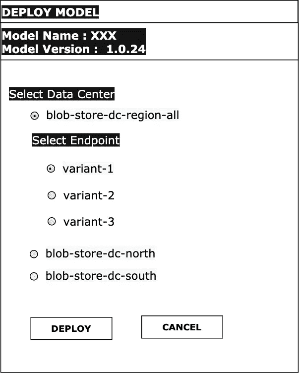
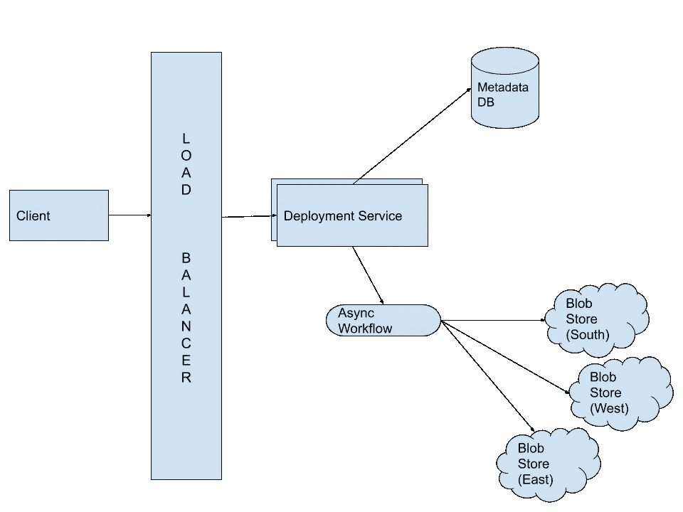
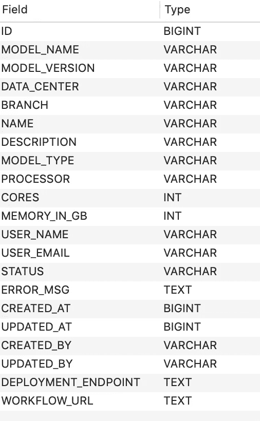
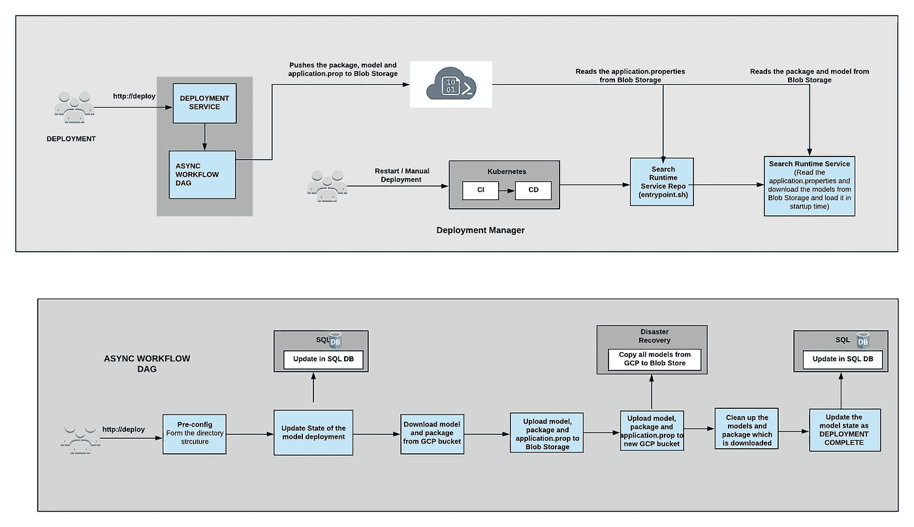
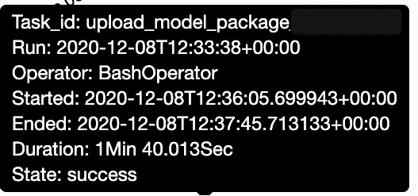

# 设计 ML 模型和代码部署系统

> 原文：<https://medium.com/walmartglobaltech/design-ml-model-code-deployment-system-e1f2f8404786?source=collection_archive---------0----------------------->

在这篇文章中，我们将讨论多区域数据中心的 ML 模型和代码部署系统的设计，包括归档、灾难恢复、低延迟和多实例部署。我们将该产品创建为一键式部署系统，以在沃尔玛搜索中加快 ML 模型和代码的生产部署。

> **功能需求:**
> 用户应该能够从用户界面部署代码和 ML 模型。
> 
> 不同的模型可以部署到单个环境中的多个实例。比方说，对于环境开发，在每个实例中可以有不同的模型。
> 
> 模型存储应在 blob 存储中存档。
> 
> 如果任何分布式 blob 存储关闭，应该启用灾难发现。
> 
> **非功能需求:**
> 
> 模型和包到分布式 blob 存储区的上载和下载延迟应该非常低。应该在大约 1 分钟内。
> 
> 每日部署数量将为 100。
> 
> 部署服务应该高度可用。



## 用户流量:

如下图所示，开发人员可以选择他/她喜欢在开发/阶段/生产环境中部署的端点/实例。这又会将模型和包推送到 blob 存储(blob 存储)。

## **容量估计:**

通常情况下，机器学习模型二进制文件非常大。

ML 模型和包文件大小: **4 GB**

搜索服务每天处理的部署数量: **100**

环境数量(开发、阶段和生产): **3**

一个月的 Blob 存储空间: **4 GB * 100 * 30 * 3=~ 36 TB**

西、南、东三个数据中心的存储(灾难恢复)=~ **36 TB * 3 = 108 TB**

一年的存储=**108 TB * 12 = 1296 TB = ~ 1.2 PB**(我们将在归档过程中再次讨论这一点)

## **高层次设计:**



High Level Design — 10000 feet overview

## API 设计:

部署 API:POST/deploy/:model name/:model version？数据中心= DC-all &端点=variant-2

取消部署 API: POST **/** 取消部署/:modelName/:modelVersion？数据中心=dc-all &端点=变量-2

## **数据库设计:**



我们使用 CloudSql 来存储部署的元数据。在部署/取消部署 API 调用时，我们将创建一个条目来存储部署。这将帮助我们跟踪部署的历史、状态、失败、工作流失败和用户详细信息。

我们将 blob 存储用于 ML 模型和包存储。为了使其高度可用并避免单点故障，我们在三个区域(南部、西部和东部 blob store)建立了 blob store 副本。

## **算法设计:**



**部署 API 流程:**

当用户在带有环境和实例的客户端 UI 中单击 Deploy 时，我们将使用我们的 Deploy API 来异步触发工作流(airflow DAG ),这将模型和包推到所有三个区域的 blob 存储中。如果模型和包未能存储在任何区域 blob 存储区中，则部署将停止/失败。我们将把该部署的元数据存储到 blob 存储中的 application.properties 中。在这种情况下，该文件将在所有三个区域的 blob 存储的以下路径中具有该部署的模型名称和版本。在部署工作流成功完成后，我们会将元数据数据库中的部署状态更新为**实时/已部署**

**目录路径:**容器/数据/模型 _ 名称/环境/应用程序.属性

示例:[s](https://portal.azure.com/)earch/[data](https://portal.azure.com/)/re ranking _ model/[dev](https://portal.azure.com/)/application . properties

在运行时，在每日重启或手动部署时，我们将从上述路径中读取 application.properties，并从特定于区域的 blob 存储中下载模型和包，并在系统启动时加载它。这将减少系统启动期间的下载延迟，因为我们连接到区域特定的 blob 存储。

**取消部署 API 流程:**

当用户在带有环境和实例的客户端 UI 中单击取消部署时，我们将使用我们的取消部署 API 来异步触发工作流(airflow DAG ),这将从所有三个区域的 blob 存储中删除模型和包。在取消部署工作流成功完成后，我们会将元数据数据库中的部署状态更新为**取消部署**。同样，application.properties 文件也将使用空数据记录进行更新，它将等待下一次部署。

## 工作流程设计:

我们将遵循下面的目录结构来存储模型并打包到所有三个区域的 blob 存储中。

**目录路径:**容器/数据/模型名称/环境/端点/版本

例:[s](https://portal.azure.com/)earch/[data](https://portal.azure.com/)/re ranking _ model/[dev](https://portal.azure.com/)/**variant-1**/1 . 0 . 32

## 每个环境的多实例部署

在客户端 UI 中，用户从 env (dev、stage、prod)中为要部署的特定模型和包选择数据中心(blob-store-all)和端点(variant-1、variant-2)。

在微服务运行时，我们将为每个实例配置环境变量。在下面的例子中，我们将有一个名为 **endpoint** 的环境变量，它的值将被用来跟踪相应区域的 blob 存储中的目录路径。

```
- name: dev-variant-01
  flows: [master]
  target:
    - cluster_id: [north-dev-a3]
  helm:
    values:
      scaling:
        enabled: true
      env:
        endpoint: variant-1deploy_env: dev
```

## **存档流程**

在任何给定的时间点，解决方案被设计为在 blob 存储中仅存储两个版本。因此，存档过程通过取消部署工作流来处理。在这种情况下，UI 中的每个部署都会自动触发取消部署 API 调用，以删除/归档该环境中的最后一个旧部署。这将帮助我们清理大量空间，因为我们之前的 **1.2 PB** 在所有副本中已经减少到 **72 GB** 。

两个版本:4GB + 4GB = 8GB

三种环境:3 * 8GB = 24 GB

有三个数据中心/副本:24 * 3 = **72GB**

## 灾难恢复

自动化流程:创建按需 DAG 以实现此工作流。二进制文件和包 jar 的副本保存在 GCP Blob 存储中。我们有下载 GCP 和 Blob 存储容器中的所有目录的功能。当整个 blob 存储损坏时，我们将使用 GCP blob 存储，并将其复制到所有区域特定的 blob 存储中。

## **延迟指标**

**将 4GB 的模型和包**以更短的延迟上传到所有三个区域的 blob 存储区是相当具有挑战性的。我们使用 blob 存储 Python、Java SDKs 和异步处理，从 45 分钟的上传延迟开始。但是后来当我们使用 blob store cli 进行优化时，延迟降低到了 **1 分 40 秒**。



类似地，**下载延迟**在服务启动期间使用 blob Storage Python SDK 花费了 **1 分钟**。

## **总结**

这篇博客涵盖了实现代码部署系统的各种设计观点和挑战。我们还了解了如何为创建任何新产品维护高可用性和灾难恢复。如果你有任何后续想法，请在评论中留下。