# Android Studio 4.1 中的设计工具套件 UX 增强功能

> 原文：<https://medium.com/androiddevelopers/design-tools-suite-ux-enhancements-in-android-studio-4-1-60c11f54ddb0?source=collection_archive---------0----------------------->

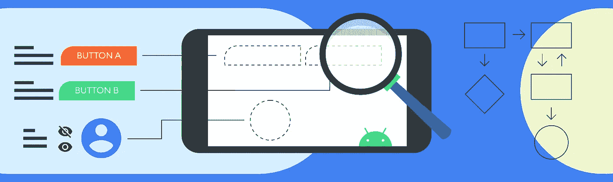

Illustration by [Virginia Poltrack](https://twitter.com/VPoltrack)

Android Studio 中的设计工具套件是一个工具集合，旨在支持开发人员有效地设计、原型制作、构建和调试他们的应用程序。这些工具包括但不限于布局编辑器、导航编辑器、运动编辑器、资源管理器和布局检查器。在 Android Studio 4.1 中，我们将精力集中在积压的用户(您的)反馈上，以增强这些现有的工具——因此，我们改进了交互并创建了缺失的功能。下面是我们所做工作的总结——仔细看看在 [*设计工具新功能讲座*](https://www.youtube.com/watch?v=ns67AAuDs4s&t=804s) 中提到的 UX 改进！

# 布局编辑器

## 约束助手支持

ConstraintLayout 1.1 中首次引入了 Barriers 和 Guidelines 等约束助手，以允许多个小部件作为不可见视图的输入被引用，并在没有代码重复的情况下对它们进行分组对齐。在 2.0 中，助手的概念得到了扩展:添加了[virtualloyouts](https://developer.android.com/reference/androidx/constraintlayout/helper/widget/package-summary)如 Flow 和 Groups，以允许同时将行为应用到所有引用的小部件。例如，使用 Flow，视图可以通过间隙和换行样式的全局调整轻松地水平或垂直布局。

在 Android Studio 4.1 中，我们希望确保我们的工具支持并优化在 IDE 中使用这些助手的体验和交互。因此，我们首先绘制了用户从发现到创造再到操作的旅程，然后我们开始提高旅程中每一步的效率。对于 discovery，我们在 Palette 中添加了一个助手部分，这样可以很容易地找到和使用可用的助手。

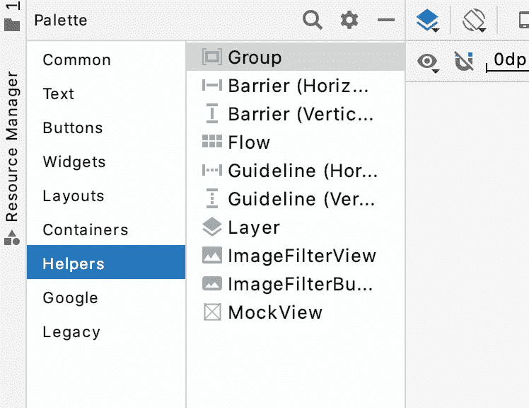

Helper palette

对于创建，您现在还可以选择多个视图，并右键单击以选择一个助手——然后我们会自动添加与所选内容相对应的引用 id。

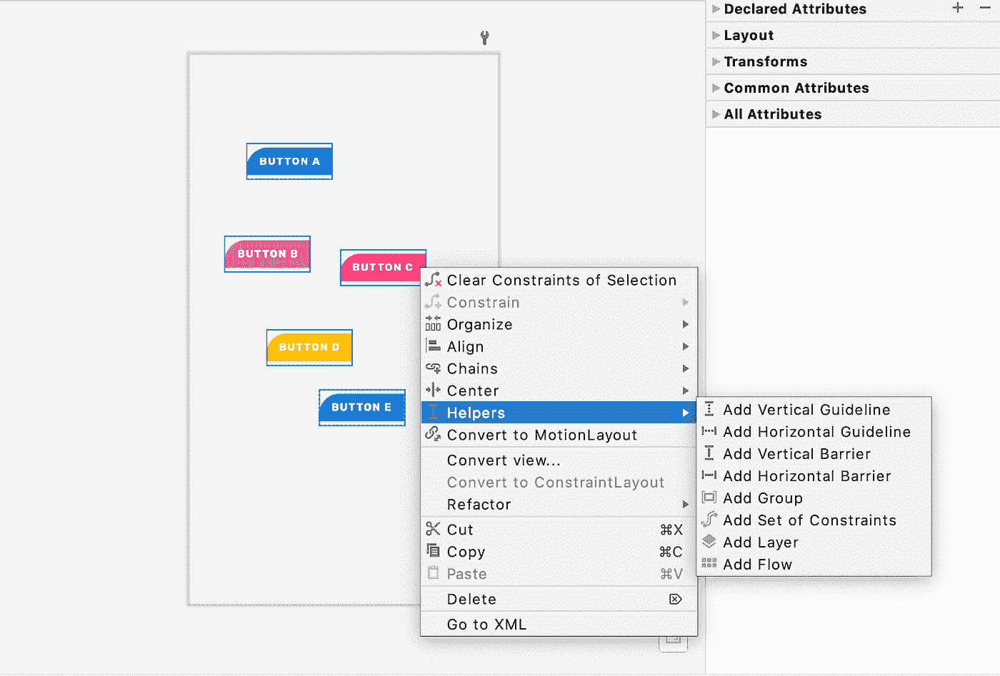

Helper creation through multi-select

对于操作，我们希望使流的功能更容易访问，所以我们用特定于流的常用属性扩展了属性面板，例如用于快速对齐的图标和用于重新排列引用 id 顺序的部分。

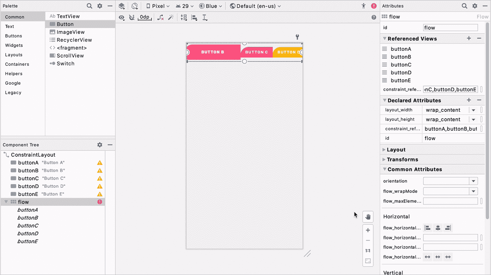

Helper manipulation through new attribute panel sections

## 设计时属性切换

Android Studio 提供了各种各样的[工具属性](https://developer.android.com/studio/write/tool-attributes)，它们是 *android:tools* 名称空间中的 XML 属性，支持设计时特性(即显示片段的布局)。这些属性在您构建应用程序时会被删除，对 APK 大小或运行时行为没有影响，它们只是为了帮助设计/开发过程。

对于构建 UI，我们知道*工具:可见性*和绝对定位(*工具:layout_editor_absoluteX* 和*工具:layout_editor_absoluteY* )是两个广泛使用的工具属性，因为它们允许设计者在布局编辑器中临时显示/隐藏 UI，以及在设置约束之前精确定位视图。然而，我们在用户研究中观察到，很难知道视图何时以及是否设置了工具属性，因此用户会对布局编辑器的预览和应用程序在仿真器或物理设备上的呈现之间的差异感到惊讶。例如，在下面的截图中，右栏中的图像具有绝对位置，即使它们在布局编辑器预览中看起来很好，但在模拟器中，它们都在左上角彼此叠加。

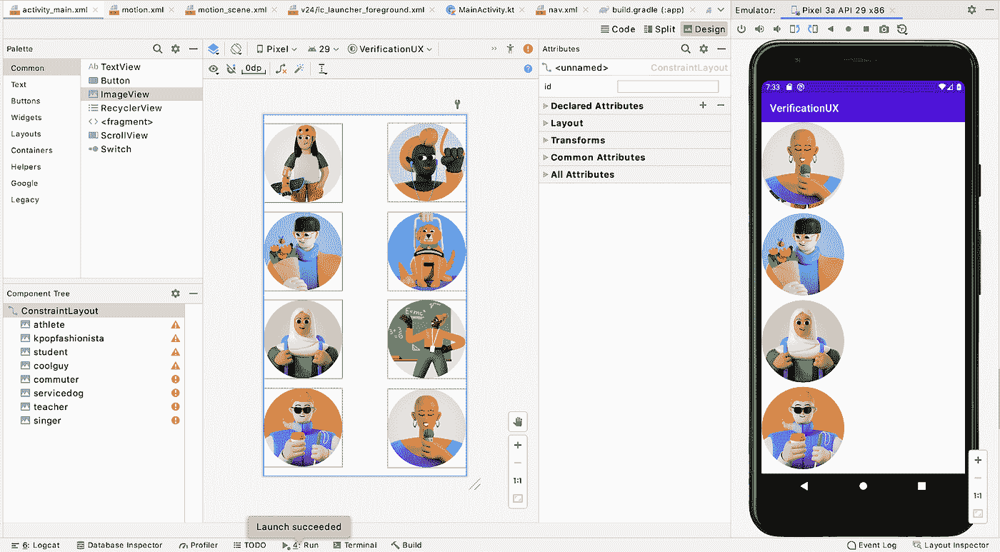

Discrepancy between the Layout Editor’s preview and the app’s rendering on an emulator due to tools attributes

为了解决这个问题，我们决定在布局编辑器的设计界面附近添加一个开关，以允许用户轻松地打开/关闭*工具:可见性*和绝对定位。

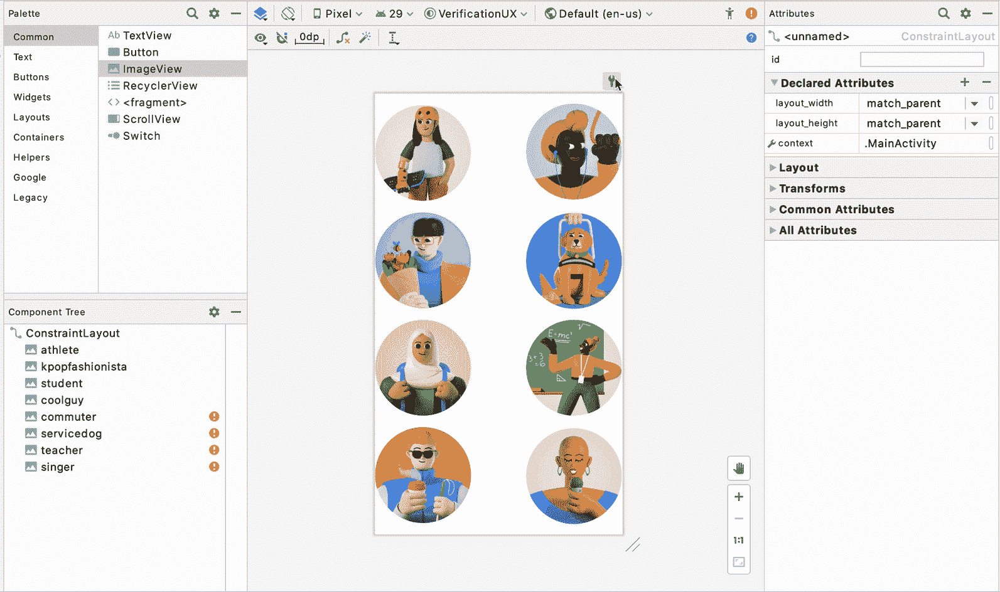

Using the new tools attributes toggle

通过切换，我们的目标是为用户提供更准确的/非设计时的呈现，并提高他们使用这些工具属性时的意识。

## 组件树上的可见性控制

如上一节所述，可见性是视图的一个非常常见和重要的属性。当您需要根据不同的条件或特定的逻辑来显示/隐藏特定的 ui 时，它特别有用。例如，您可能只希望经过身份验证的用户能够看到他们的用户数据。因此，我们希望通过在布局编辑器中提供一种快速设置显示/隐藏/消失可见性的方法来优化可见性属性。

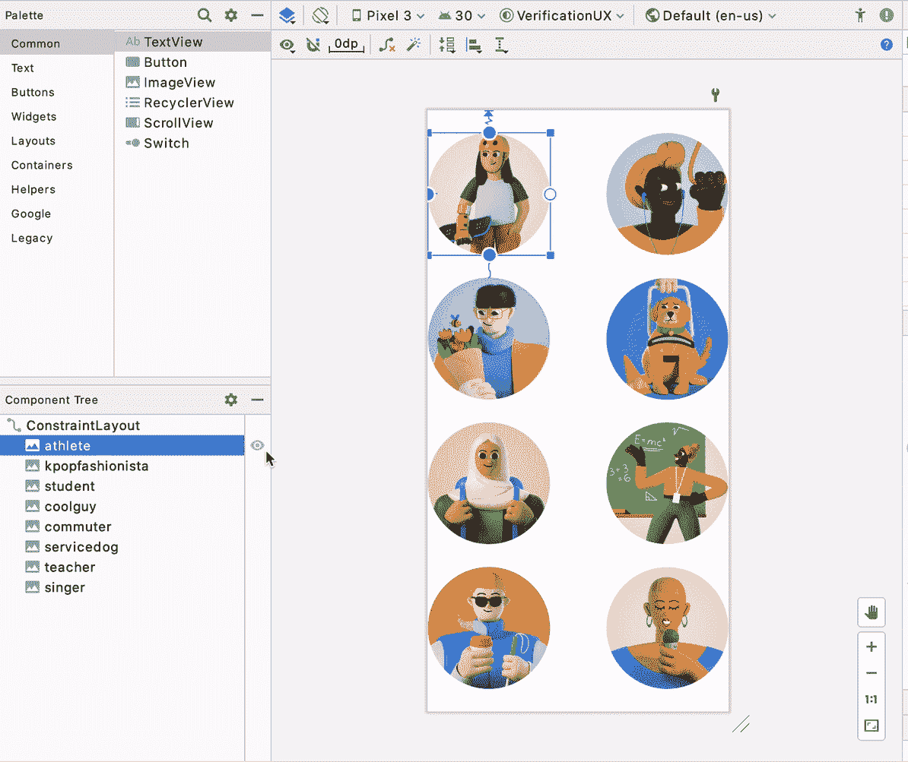

Using the new visibility controls on the component tree

从 4.1 开始，您将能够使用任何视图旁边的组件树中的可见性控制选择器来快速更改它。这允许您看一眼树，就知道视图是如何基于可见性显示的，并根据您想要在 UI 的哪个部分工作来更改它们。

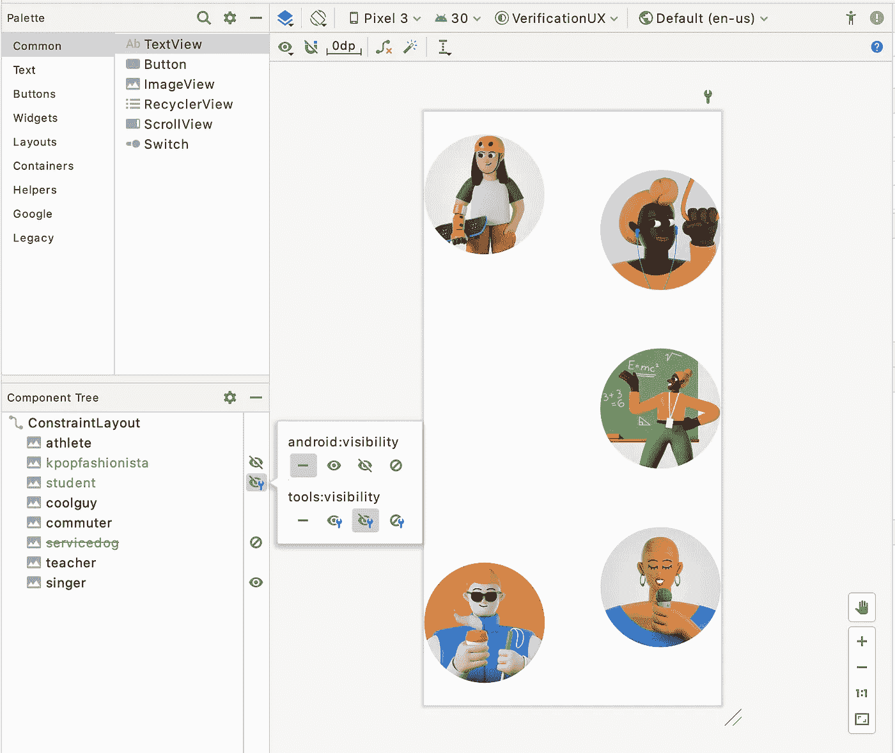

Component tree shows visibility status with icons

我们包括了*工具*和 *android* 名称空间，以适应不同的用户需求。这里要注意的一点是，在设计时，*工具*覆盖了 *android* 可见性，因此这也反映在可见性控件上——如果您设置了*工具:可见性*，它将在 UI 上优先。例如，在下面的截图中，学生图像有一个*Android:visibility = visible*和 *tools:visibility = gone* ，您可以看到工具可见性优先。

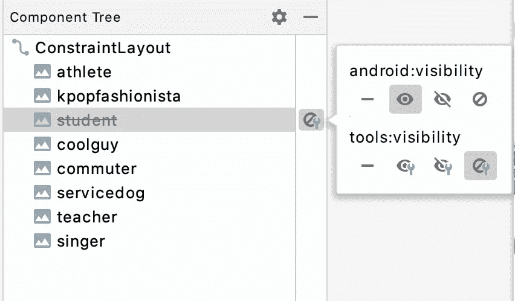

Tools overrides android visibility

## 键盘快捷键+键盘映射设置

我们都认识到键盘快捷键在提高生产力和开发效率方面的力量。在 Studio 4.1 中，我们对设计工具套件中的所有[键盘快捷键进行了审核，并将它们注册到 Preferences > Keymap 中，允许您发现、更改和编辑最适合您工作风格的快捷键。](https://developer.android.com/studio/intro/keyboard-shortcuts)

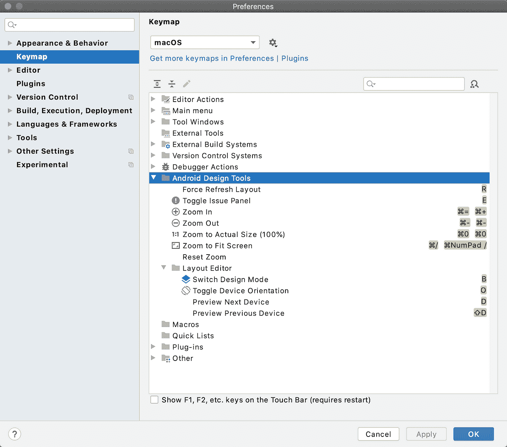

Keymap preference includes design editors’ shortcuts

## 变换面板

我们已经听到了开发人员的反馈，他们要求在视图上操作转换属性时更加精确。为了更容易地微调视图的变换，我们添加了可视化工具和滑块来帮助视图的 3D 旋转。在属性面板上，一旦你选择了一个视图，你可以使用“变换”下的控件进行调整。

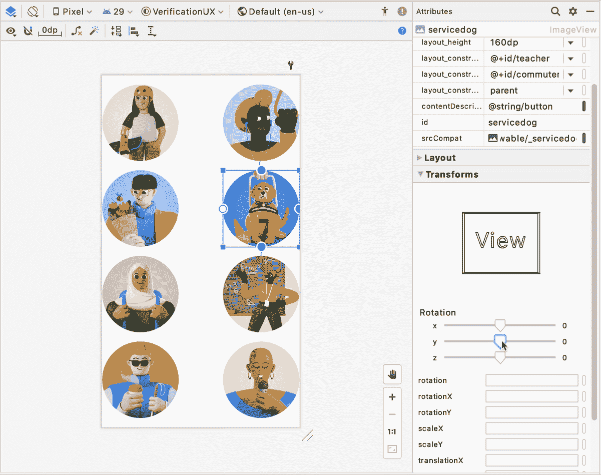

Using the transform panel to rotate the service dog image

# 资源管理程序

## 水槽可拉式捡拾器

回到 Android studio 3.6，我们引入了[颜色选择器资源标签](https://developer.android.com/studio/releases)，它可以帮助你快速更新应用程序中的颜色资源值。picker 模式非常受欢迎，因为这里的交互提供了从文本(代码)到视觉(颜色)的无缝过渡——用户可以在使用图形用户界面(GUI)加速器的同时，呆在代码编辑器的上下文中。因此，在 4.1 中，我们将相同的概念应用于 Drawables——现在，当你的文件中有一个 drawable 资源时，你会发现一个 gutter 图标，允许你快速更改 drawable 资源。此外，点击“浏览”将打开资源对话框，允许更广泛的搜索。

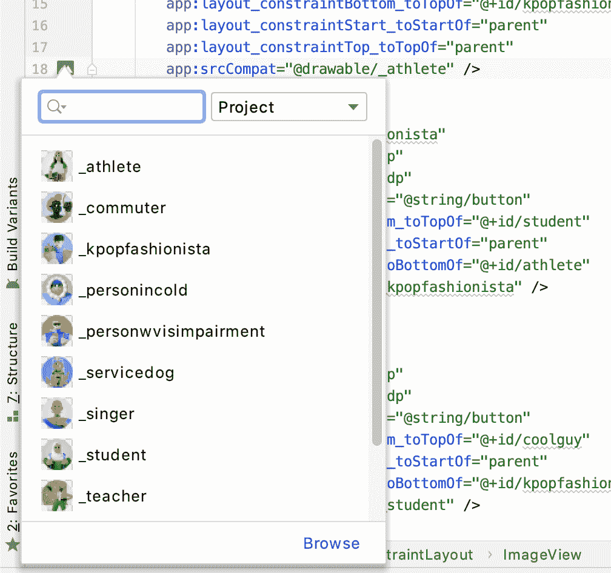

Drawable picker

## 向量资源图标自动下载

这种更新可能在视觉上不明显，但仍然很重要。我们收到了关于 [Material.io](https://material.io/resources/icons/?style=baseline) 上的材料图标和我们的矢量资产向导中的材料图标不一致的投诉。这是由于工作室的发行节奏和材料更新之间的不一致。为了解决这个问题，我们简化了这个过程，现在每当材质更新其图标库时，向量资源向导也会在后台自动更新该库。您现在可以期待我们将在向导中始终拥有最新的材质图标！🎉

# 导航编辑器

## 新目标树

[分割视图](/androiddevelopers/android-studio-design-tools-ux-changes-split-view-dcde75e88a0c)是 Android Studio 3.6 中引入的一种切换设计文件编辑模式的新方式，这为我们优化导航文件和导航编辑器的并排视图创造了机会。其中一个优化是使用组件树结构在导航编辑器中表示目标图。这样，用户可以一目了然地看到他们所有的目的地(包括嵌套的目的地)和动作，并且他们以拆分模式 1:1 映射到代码。

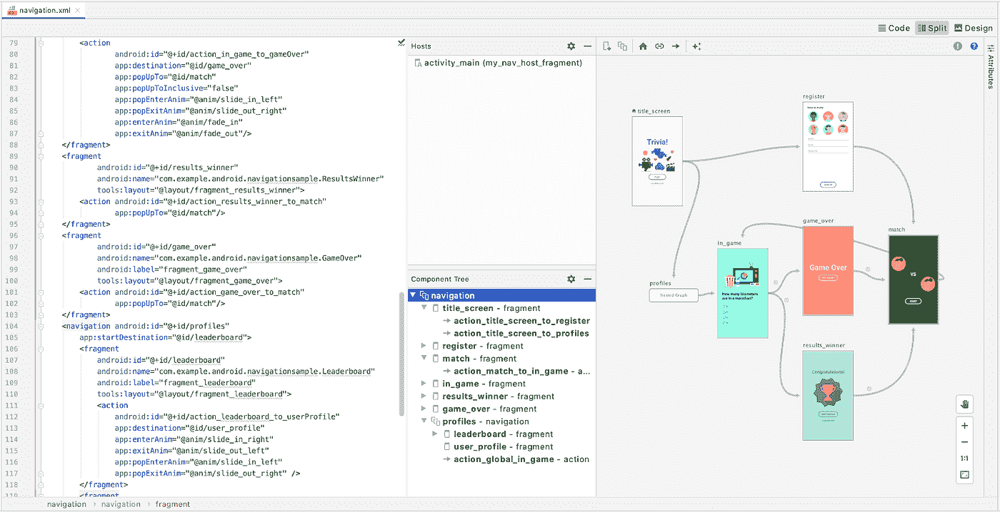

Navigation destination as tree in split view

顺便提一下，这对我们代码库的健康是有益的，因为它在我们所有的设计工具中重用了公共组件。

## 深度链接对话框新属性+自动完成

[导航 2.3.0](https://developer.android.com/jetpack/androidx/releases/navigation#2.3.0-alpha01) 为深度链接引入了两个新的属性类型:MIME 和 Action。为了使工具的功能与库的功能一致，我们将它们添加到导航编辑器的深度链接创建对话框中，并提供自动完成和验证支持。

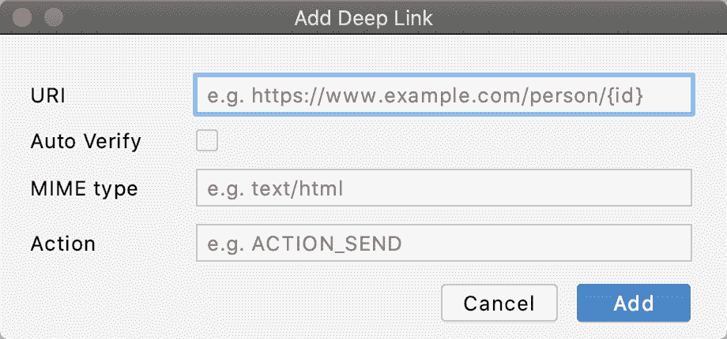

Add Deep Link dialog with new attributes

# 运动编辑器

## 运动关键帧路径图

MotionLayout 支持不同类型的[关键帧](/google-developers/defining-motion-paths-in-motionlayout-6095b874d37)，最常用的类型之一是位置关键帧( *<关键位置…/ >* )，它允许开发人员在动画期间的给定时间修改小部件的路径。使用 4.0 中引入的运动编辑器，用户可以通过直接在表面上拖动这些关键帧来直接操纵它们。但是，此工作流程的一个问题是，根据关键帧的设置方式，应用于关键帧的属性可能有不同的含义。例如，将关键帧向左拖动 20%,没有关于这是相对于路径的 20%还是相对于父项的 20%的上下文。为了解决这个问题，在 4.1 中，我们在拖动过程中在设计图面上添加了一个坐标系和轴重影对象的覆盖图，这样每当开发人员想要手动编辑关键帧时，他们就可以更好地了解它们的边界、轴和方向。

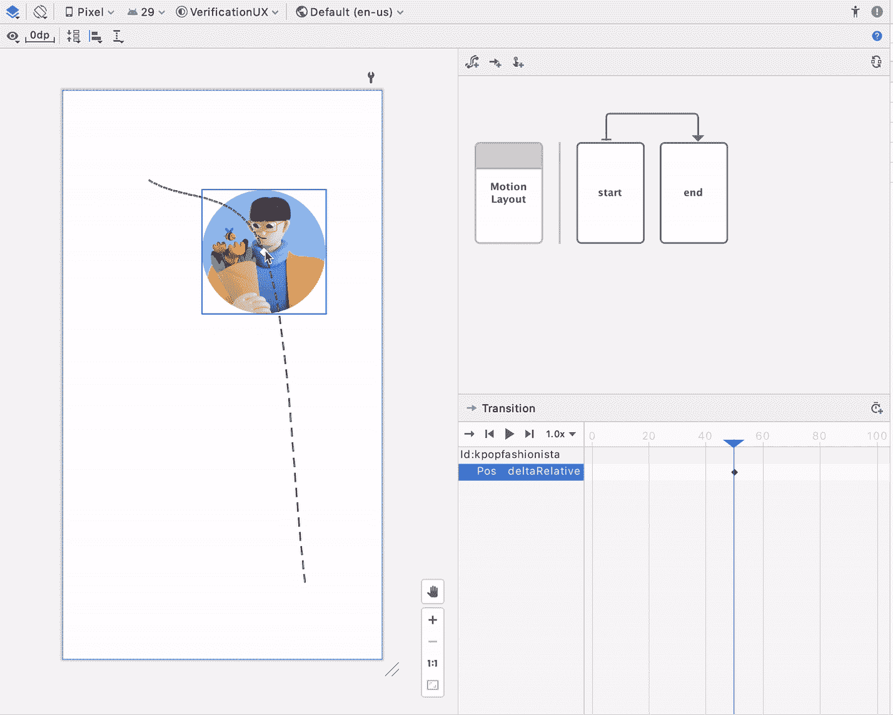

Showing position keyframe grid and value overlay

## 缓和曲线编辑器

类似于上面提到的布局编辑器中的 Transform 面板，我们已经从开发人员那里听到了关于用纯数字指定过渡曲线是多么困难的反馈。因此，在 4.1 中，我们在运动编辑器中添加了对 GUI 曲线编辑器的支持，允许开发人员使用可视化和控制手柄来完善曲线。

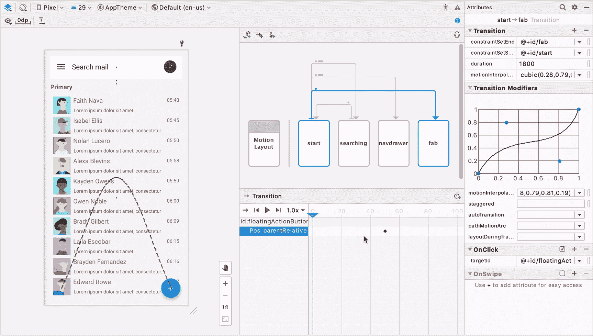

Using the transition curve editor

我们希望您对尝试这些新的改进感到兴奋！我们不断收集反馈，并应用它们来改进我们的工具。设计工具套件的目标是支持、补充和提升您的编码体验——找到提供可视化或 GUI 支持有意义的领域。我们在这里发现的知识也将应用到我们为 [Jetpack Compose](https://developer.android.com/jetpack/compose) 构建的工具中。例如，这些选取器体验(即可见性切换、可绘制选取器)是我们可以进一步探索的一种形式因素，因为它们是基于上下文的，不会分散注意力，并提供了一种将设计工具应用于应用程序开发流程的独特方式。

像往常一样，如果你在使用这些工具时遇到任何问题，或者有一个可以提高你工作效率的新功能的想法，请[提交一个 bug](https://b.corp.google.com/issues/new?component=192747&template=1023344) 。我们将继续优化编辑器的性能，修复错误，并采纳您的建议和反馈。