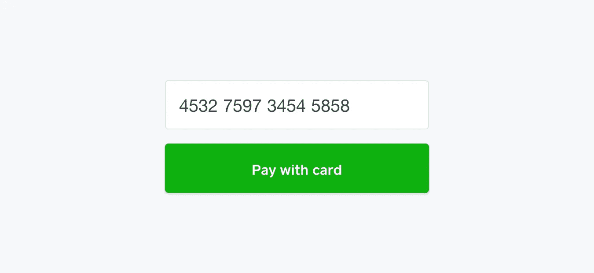
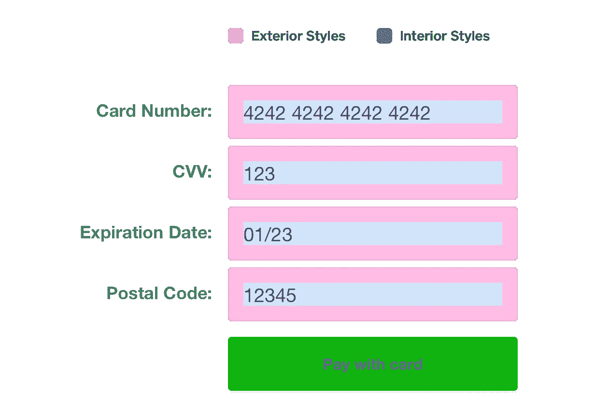
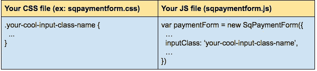
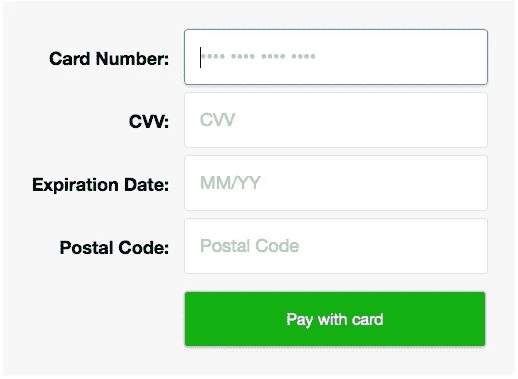

# 使用 SqPaymentForm 设计您的自定义付款表单

> 原文：<https://medium.com/square-corner-blog/design-your-custom-payment-form-with-sqpaymentform-d3e181eec479?source=collection_archive---------3----------------------->

> 注意，我们已经行动了！如果您想继续了解 Square 的最新技术内容，请访问我们的新家[https://developer.squareup.com/blog](https://developer.squareup.com/blog)

您目前是否正在使用`SqPaymentForm`，但您希望它看起来时尚而专业？现在你有机会弄清楚如何让它看起来像你想要的任何东西！让我们开始吧。

*题外话:我假设你至少已经在 Square 的文档网站上浏览过* `*SqPaymentForm*` *概览页面:*[*https://docs . connect . Square up . com/payments/sqpaymentform/sqpaymentform-Overview*](https://docs.connect.squareup.com/payments/sqpaymentform/sqpaymentform-overview)*。如果没有，请现在就做，因为这篇文章将引用来自文档站点的项目。*

`SqPaymentForm`中的每个单独的输入字段将是从 Square 嵌入的 iFrame。这样做是为了保护敏感的信用卡信息免受恶意行为者的侵害，并确保您不必担心 PCI 合规性，因为 Square 会为您处理这一切。为了定制`SqPaymentForm`，我们需要考虑单个 iframe 内部的区域和 iframe 外部的区域，因为它们是分开处理的。

外部关注实际的文本输入字段(比如边框、边距和元素宽度)，而内部关注内部文本(比如字体大小、字体颜色、占位符和背景颜色)。这里有一个快速的视觉辅助工具来展示我的意思:

让我们先看看如何编辑外观设计。

外部设计在你自己的 CSS 文件中定义(在我们的设置指南中，我们建议一个名为`sqpaymentform.css)`的文件)。创建`SqPaymentForm`时，您需要指定`inputClass`，这是表单中使用的文本输入字段的类名。这可以从字面上命名为*任何东西。你只需要确保它在`sqpaymentform.css`文件中匹配。例如:*

This is just to point out where the the name should match!

我们将添加以下样式:

*   蓝色边框&输入周围略微弯曲
*   由于弯曲的边框(而不是轮廓)而产生的方框阴影
*   增加标签的大小和重量(注意:`.label`是我给每个`input`(即“卡号:”的文本标签的类名)
*   按钮的背景颜色和字体颜色
*   不同颜色的边框用于焦点和错误验证

添加这些更改后，我们得到如下结果:

Since the exterior design lives in the CSS file, you can customize any CSS style! The “smoothing” at the top of the file ensures the best quality across browsers

需要指出的是，上面可以看到的是`.sq-input--error`和`sq-input--focus`的使用(这应该与你的`inputClass`的设置相匹配。例:`your-cool-input-class-name--focus`)。当你选择输入框时，或者当`SqPaymentForm`返回一些验证错误时，这些可以用来改变输入框的外观。它们很棒，你应该使用它们！

在`sqpaymentform.js`文件中，我们需要确保引用它，这很容易；只需使用与前面提到的`inputClass`相同的名称:

This is just a small snippet, you need more code to have the form actually load (see docs)

让我们跳到室内设计。`SqPaymentForm`只支持内部的某些属性，必须通过`sqpaymentform.js`文件中的`inputStyles`数组提供。如需完整的属性列表，请查看该页面:[https://docs . connect . square up . com/payments/sqpaymentform/sqpaymentform-overview # input style-objects](https://docs.connect.squareup.com/payments/sqpaymentform/sqpaymentform-overview#inputstyle-objects)

现在，假设我们想要使字段具有以下样式:

*   18px 文本
*   深灰色文本
*   15px 填充
*   浅灰色占位符文本。

实现这一点相当简单。添加更改后，我们得到了这样的结果:

Again, this is just a small snippet, you need more code to have the form actually load (see docs)

如果我们将我们快速浏览过的内部和外部设计结合起来，我们将得到类似这样的东西:

“Card Number” is selected to show off the box-shadow style. Simple, yet elegant!

这就结束了！有了这些知识，你应该能够按照自己的喜好打造自己的`SqPaymentForm`。

*想要更多？* [*注册*](https://www.workwithsquare.com/developer-newsletter.html?channel=Online%20Social&sqmethod=Blog) *订阅我们的每月开发者简讯，或者在* [*这里*](https://squ.re/slack) *加入我们的 Slack 社区。*