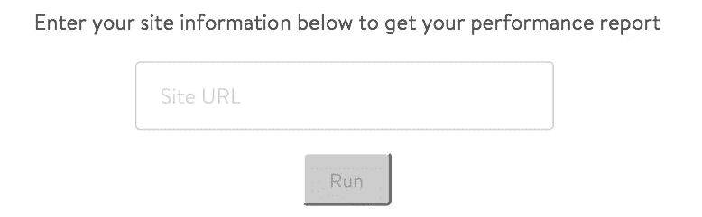
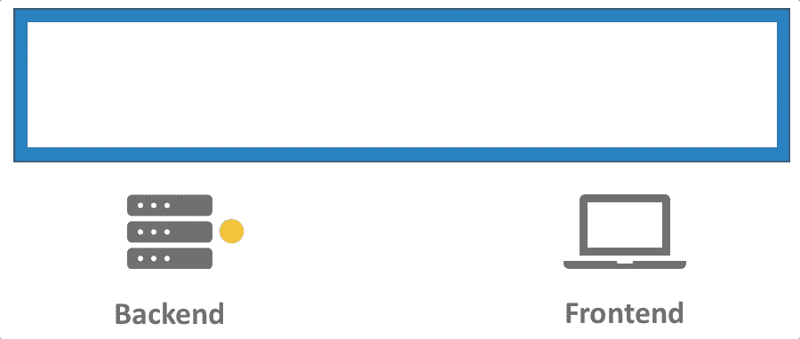
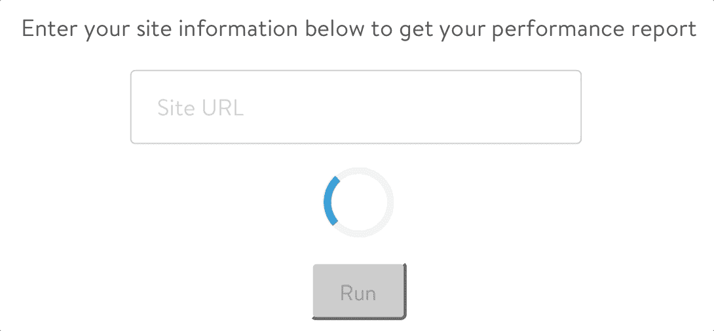
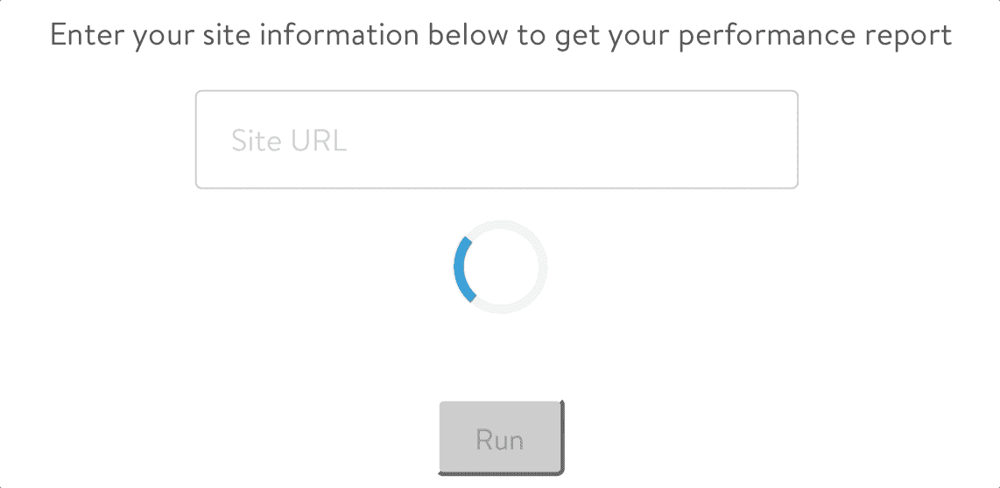
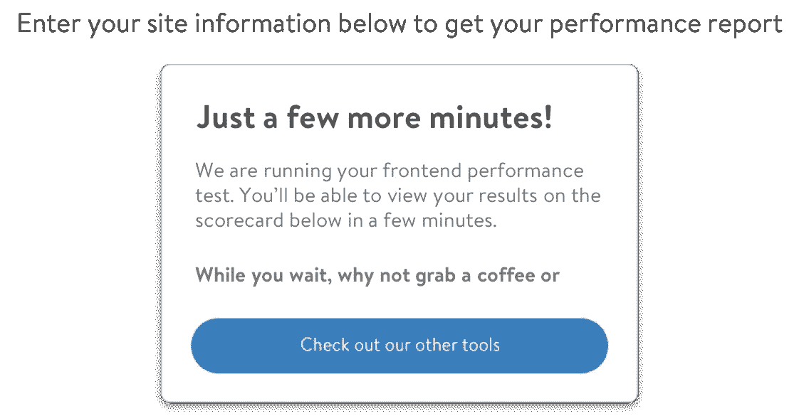

# 设计适合您应用的加载屏幕

> 原文：<https://medium.com/walmartglobaltech/designing-a-loading-screen-to-fit-your-app-f044bda4f6bf?source=collection_archive---------3----------------------->

无论你是在提交在线表格，还是在等待你最喜欢的应用程序加载，我们都经历过…被困在地狱的加载屏幕中。App 加载时间往往不可避免；设计一个合适的加载屏幕会对你的整体用户体验有很大的影响(UX)。

我最近加入了沃尔玛实验室，担任软件交付和支持(SDE)组织下的 UI/UX 团队的产品经理。SDE 的使命是提供一个工具平台，加速沃尔玛应用软件的交付过程(如店面、网络和移动应用)。我的团队的目标是设计和开发漂亮的界面，为我们的最终用户提供不可抗拒的体验。

我们最近部署了一个内部性能分析工具，允许用户输入他们的站点信息并查看前端设计建议。与任何应用程序开发项目一样，我们遇到了几个挑战。我们面临的一个挑战(你猜对了)是加载屏幕。

Submission Form for Performance Analysis Tool

在用户输入他们的站点 URL 并点击运行后，测试平均需要 3-5 分钟才能完成。如果没有合适的加载屏幕设计，这种长时间的等待会导致不愉快的 UX。加载屏幕——尤其是耗时超过 10 秒的屏幕——应该提供回答两个关键问题的反馈:

*   发生了什么事？
*   接下来会发生什么？

带着这些问题，我们评估了几种设计方案，以最大限度地减少等待时间的不确定性。

## 设计选项#1:进度条

给用户一个确定的等待时间，即使等待时间很长，也比让用户不确定要好。一项研究发现，很难让用户的注意力在一个页面上停留超过 10 秒钟(姑且称之为 10 秒规则)，超过这个时间，用户就有可能离开网站。进度条通过提供总等待时间的透明度来减少超过 10 秒的等待时间。

进度条通常显示基于实际后端操作的完成百分比或剩余时间。构建这个特性需要在整个测试过程中不断获得更新进度条的后端响应。

Progress Bar with Backend and Frontend Interaction

然而，我们能够获得的唯一后端响应发生在测试完全完成之后，使得真正的进度条成为不可能。我们可以随着时间的推移定期推进进度条——比如说每 10 秒增加 5%——但这将伪造 UX 并导致其他挫折。例如，如果进度条移动到 95%，但是测试还没有完成，进度将停止移动，用户将认为应用程序已经冻结。

## 设计选项#2:装载旋转器

我们看的下一个选项是臭名昭著的装载旋转器。加载微调器提供了一个动画来显示应用程序仍在进行中。基于 10 秒规则，装载微调器对于等待时间少于 10 秒是最佳的，因此对于我们的用例来说不是理想的。让用户观看一个不确定的纺车会增加跳出率并破坏 UX。不幸的是，时间表的压力迫使我们在最初的发布中使用微调器。

First Release of Performance Analysis Tool

正如所料，我们立即收到了负面反馈，并回到了绘图板。

## **设计选项#3:专业技巧**

减少 T2 感知的等待时间的一个巧妙方法是让用户忙于其他事情。我们收到了一个建议，在加载微调器下添加专业提示，以分散用户等待时的注意力。这个想法是周期性地循环通过一个推荐列表，这将有助于用户提高他们的网站性能。

Next Iteration with Pro Tips

这个选项可以让用户占用一段时间，但是效果有限——尤其是对于回头客。这种方法也没有解决主要问题——让用户知道正在发生什么以及接下来会发生什么。然而，该选项确实为用户提供了价值，并且可以与其他加载选项结合使用以充分发挥作用。

## **设计方案 4:静态指示器**

我们评估的最后一个选项是静态指标。静态指示器通常缺乏用户的主动反馈和相关信息，因为它们只是图像或文本。尽管如此，我们探索了如何以更有意义的方式利用静态指标。

Boring Static Loading Screen

因为我们的目标是最小化等待时间的不确定性，所以我们决定提供明确的细节来通知用户运行时间的持续时间。此外，我们为用户提供了在测试运行时执行其他任务的建议，设定了他们的期望并提供了分散注意力的方法。

Meaningful Static Loading Screen

测试完成后，静态指示器消失，弹出一条成功消息，表单重置，用户可以提交另一次运行。这个简单但有效的加载页面提供了等待时间透明性，让用户知道正在发生什么以及接下来会发生什么。

## **设计完成…目前**

我们的用户现在很满意，但我们仍在探索其他有效的设计选项来减少*感知的*等待时间，如创建迷人的图形或交互式加载屏幕。甚至可能是以上所有的组合？

加载屏幕不是一刀切；它们应该进行优化，以适应您的应用程序的特定用例，设置用户期望，并回答正在发生的事情和接下来会发生的事情。

沃尔玛实验室正在不断解决问题，以增强软件交付流程和用户体验。如果你有兴趣加入我们不可抗拒的 UX 设计的使命，请查看我们在[careers.walmart.com/technology/ux-design](https://careers.walmart.com/technology/ux-design)的职业页面。

大声称赞 Amanda Bittinger 和 Yash Shah 设计并实现了性能分析工具。

## 你觉得这有用吗？请大家推荐或分享，随意点击拍手键。👏🏻关注我以后的帖子。