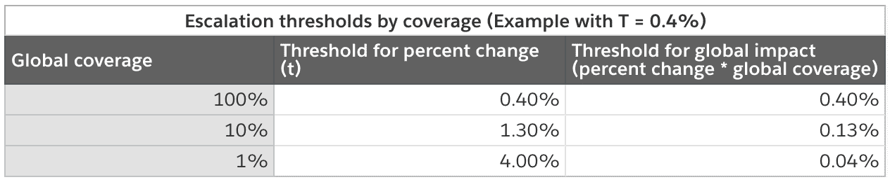

# 设计实验护栏

> 原文：<https://medium.com/airbnb-engineering/designing-experimentation-guardrails-ed6a976ec669?source=collection_archive---------0----------------------->

*介绍我们在 Airbnb 实施的实验护栏框架，这有助于我们在大规模实验时防止对关键指标产生负面影响。*

由[塔蒂亚娜](/@tatiana.xifara)，[里德](/@ReidAndersen/)，[卡西](/@kathy.a.yang) & [阿里](/@ali.rauh)

每周，成千上万的在线实验同时在 Airbnb 平台上运行，以测量潜在产品变化的影响，每个实验监控大约几十个指标。在做出发布决定时，每个团队通常关注不同的评估标准，例如，信任团队优先考虑欺诈识别，而体验团队可能优先考虑在我们的主页中发现在线体验产品。积极影响一个团队的指标的实验也可能损害另一个团队的指标，如何权衡这些权衡并不总是显而易见的——例如，如果结账时没有显示房规，我们可能会看到预订量增加但评分降低。在最坏的情况下，一个团队可能会发现另一个团队最近在没有对权衡进行适当分析的情况下启动了对他们的一个关键指标造成重大损害的处理，这需要回滚新的更改。

**介绍实验护栏系统**

为了帮助我们的几十个实验运行团队确保他们的启动不会损害我们最重要的指标，我们在 2019 年推出了一个全公司范围的实验护栏系统。该系统通过在发布前识别潜在的负面影响来帮助保护关键指标。如果一个团队希望启动一个“触发”护栏的实验(也就是说，当我们的护栏系统发现处理对关键指标产生负面影响，或者没有足够的权力来确保不会对关键指标产生负面影响)，他们将首先通过一个升级流程，利益相关者可以透明地讨论结果。

**选择要保护的指标**

护栏指标对公司整体而言非常重要。虽然某项功能不一定需要改善护栏指标才能被认为是成功的，但所有发布都旨在避免对护栏产生重大负面影响。

我们发现有用的护栏指标往往属于以下三类之一:

*   **代表公司整体绩效的关键业务/财务指标**，例如*收入*。
*   **用户体验指标**捕捉使用产品的感受——例如*跳出率*或*页面加载速度*。
*   **战略优先指标**，关注对公司具有战略重要性的领域，例如，预订体验的*座位*。随着公司战略的发展，这些可能会随着时间而改变。

虽然保护每个团队最喜欢的指标可能很有诱惑力，但重要的是要记住，更多的保护指标并不一定意味着更好——在保护多少指标、保护的彻底程度以及产品开发过程中增加多少摩擦之间存在权衡。例如，如果我们选择 50 个指标，并在 0.05 的水平上对任何显著的降级发出警报，那么在 AA 测试中 92%的时间里我们至少会有一个错误警报。

**定义三个护栏**

我们的系统由三个护栏组成，每个护栏都必须单独通过，以便在不升级的情况下启动实验:

*   撞击护栏要求整体平均处理效果不超过预设阈值。无论统计意义如何，这种护栏都可以防止较大的负面影响。
*   电力护栏确保实验已经接触到足够多的用户，因此撞击护栏具有合理的假阳性升级率和电力。
*   Stat Sig 负面护栏为指标提供了额外的保护，在这种情况下，任何具有统计显著性的负面影响(即使幅度很小)都将导致上报。

我们将在下面详细介绍其中的每一项:

**防撞护栏**

碰撞护栏升级试验，如果:

其中百分比变化是平均值的相对变化，而 *t* 是升级阈值。例如，如果 *t* 为 0.5%，则影响大于-0.5%的实验将被升级。

请注意，在这篇博文中，我们假设我们使用的是期望增长的指标(例如，*收入*)。对于需要*减少*的指标，应翻转与 percent_change 的关系(例如，如果 percent _ change>t*t*，则客户服务单应升级)

**动力护栏**

电源护栏影响实验运行时间。它要求我们估计的百分比变化的标准误差满足:

这是为了确保防撞护栏具有合理的良好动力和假阳性率(FPR)。如果某个实验刚好满足单个指标的电源护栏，则该指标将具有以下配置文件:

如果实验运行的时间比功率护栏所需的时间长，FPR 会变小，检测-0.8* *t* 冲击的功率会变大，因为标准误差变小，实验包括的度量越多，在任何给定的运行时间，实验水平 FPR 就越大。

如果您想要更严格的功率和 FPR 要求，常数 0.8 可以向下调整，或者如果您可以容忍更低的功率和更高的 FPR，可以向上调整。请记住，常数越低，实验必须运行越长时间才能通过电源护栏。评估您的电动护栏实用性的一个好方法是进行回溯测试:在过去 6 个月中启动的实验中，有百分之多少可以原样通过护栏？对于那些没有通过的人，他们需要跑多长时间？您需要考虑实施 Power 护栏会如何影响整个组织的实验运行时间。

**Stat Sig 负护栏**

如果 Stat Sig 阴性护栏显示对某些指标有统计上的显著负面影响，则会升级实验:

最有可能的情况是，您不希望将 Stat Sig 负面护栏应用于所有指标，因为一些指标可能不保证对小的负面影响进行上报。例如，*页面性能*下降(增加)0.1%是不可取的，但可能不值得升级。另一方面，像 Airbnb 这样规模的公司的*收入*下降 0.1%，可能会转化为数百万美元。这种护栏是对您的最高指标的额外保护，即使很小的负面影响也应该浮出水面。

**调整全球覆盖范围**

我们将实验的全球覆盖率定义为被分配到实验中的 airbnb 访问者的百分比。如果所有的实验都有相同的电源护栏，低覆盖率的实验将更难通过。为了让所有实验在大致相同的时间内通过电源护栏，我们允许 *t* 按照以下方式随全局覆盖率(分配给实验的受试者覆盖的指标总值的百分比)而变化:

我们为每个指标设置了一个升级参数 *T* ，它代表了总会触发 100%全球覆盖实验的百分比变化。然后，我们让升级阈值 *t* 根据覆盖率而变化:

因为碰撞护栏也使用覆盖范围调整过的 *t* ，所以所有刚刚通过动力护栏的实验将会看到与动力护栏部分中概述的相同的动力/ FPR 曲线。

在下表中，您可以看到百分比变化和全球影响的升级阈值是如何随承保范围而变化的。随着覆盖率的下降，百分比变化的阈值增加，这是可取的，因为它使各覆盖率级别的电源护栏通过率相似。另一方面，全球影响的门槛随着覆盖率的降低而降低——这也是可取的，因为就全球影响而言，我们应该对覆盖率较低的实验更加严格。

**将所有这些放在一起**

总之，这三个护栏通过升级我们认为有意义的负面影响来保护我们最重要的指标，同时确保我们有适当的权力来检测它。从视觉上，我们可以看到护栏在一个示例指标的点估计和标准误差之间工作:

电源护栏表示为水平线，具有较大标准误差的实验将需要继续运行，直到 StdError < 0.8 * t. An experiment owner can also choose to escalate prior to reaching the required standard error, if the estimated run time is too long.

The Impact Guardrail is represented as the vertical line at -T, and an experiment with an impact more negative than -0.5% would require escalation prior to launch.

Finally, the Stat Sig Negative Guardrail is represented as the diagonal line, where the percent change is negative and p-value = 0.05\. Metrics with this guardrail enabled will escalate experiments with a statistically significant negative effect.

For all remaining experiments, we are comfortable that there is low risk of meaningful negative impact, and they are able to launch without escalation.

**细化护栏——自动批准的情况**

为了改进需要升级的实验，我们已经划分了一些情况，在这些情况下，即使实验触发了上面的一个护栏，我们也会自动批准实验。以下是我们所做的两项重大改进:

*   对于一些指标，我们很容易达到统计显著性，但只有指标中的大变化对我们的业务有重大影响，我们忽略 Stat Sig 护栏，只应用功率和冲击护栏。
*   对于尚未通过电源护栏但具有正的点估计值的实验，如果它们通过了与我们的电源护栏(您可以将其视为电源护栏的放松)具有相同阈值的非劣性测试，我们允许它们通过而不升级。特别是，如果置信区间的下限满足以下条件，我们就让实验通过:

这允许具有正点估计的处理在到达电源护栏之前通过。

**打造自己的风格**

这个护栏系统是非常可配置的，参数可以调整，以满足您的需求。我们已经讨论了如何调整 0.8* *t* 乘数，并在某些情况下优化护栏。

最重要的决定是为每个护栏度量设置参数 T，这既是一门科学，也是一门艺术。更紧的 T 将允许您捕捉更小的负面影响，但也会使电源护栏更难通过。您应该将 T 设置为“什么样的影响值得升级？”，以及“可以检测哪些影响？”这确保了护栏既不需要异常的运行时间，也不会在低级别影响上造成浪费。

另一个要考虑的因素是您有多少护栏指标。您涵盖的指标越多，总体上报率(和误报率)就越高。如果您的组织经常进行实验，那么能够真实回顾的实验数量将会受到限制。要求升级会降低迭代和发布的速度，所以您希望在保护您的指标和快速移动之间找到平衡。同样，最好的决定方法是查看历史数据—通过估计最终的总体升级率来评估不同的指标集和 T 值，并决定哪种配置最适合您组织的需求。

**最终想法**

大规模实验可能具有挑战性，尤其是当多个团队可能专注于不同的目标时。我们引入了一个实验护栏系统，以帮助提高 Airbnb 最重要指标的可见性，并保护它们免受潜在的有害启动。该系统每月标记大约 25 个实验用于升级/审查。其中 80%在利益相关者讨论和额外分析后最终发布，20%(每月 5 个)在发布前停止。我们的可配置系统使我们能够平衡维护我们的指标和保持敏捷的产品开发流程，我们希望这可以成为您思考自己的护栏系统的有用参考。快乐实验！