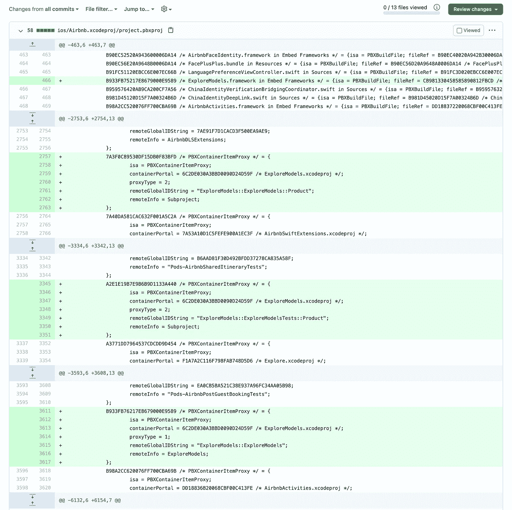

# 大规模 iOS 应用程序的生产力设计

> 原文：<https://medium.com/airbnb-engineering/designing-for-productivity-in-a-large-scale-ios-application-9376a430a0bf?source=collection_archive---------0----------------------->

*技术和人员流程的创新如何让 iOS 开发人员在大型代码库中保持高效。*


每个 iOS 工程师都记得看到自己的第一个应用在 iOS 设备上运行时的喜悦。iPhone 以人为中心的界面让这个程序变得生动起来。当你选择 iOS 开发作为职业时，这种喜悦随着你的应用触及更多人的生活而增长。

影响更多用户通常涉及新的 iOS 特性、流程和功能。但是，随着应用程序增长以服务更多的用户，新的特性和功能可能会引入额外的重量和复杂性，这将减缓产品迭代并排除原子重构。

我们作为 Airbnb 的 iOS 团队经历了这段旅程。得知我们每周发送的代码能够为客人带来难忘的假期，并为东道主企业家带来新的收入来源，我们深感欣慰。对设计的关注是我们的基因，我们为完善展示给用户的每一个细节而感到无比自豪。与此同时，我们也不能幸免于大规模发展的挑战。

在本文中，我们将介绍我们在满足 Airbnb 不断增长的业务需求时遇到的困难。我们将概述在技术、所有权和流程方面的投资是如何让 Airbnb iOS 团队获得两全其美的:在具有全球影响力的代码库中工作，而不会感觉到它的重量。

# 开发大规模 iOS 应用程序的挑战

2010 年 6 月 16 日，一名 Airbnb 实习生第一次提交了我们的 iOS 应用程序。从那时起，同一个 Xcode 项目已经发展成为拥有 150 万行第一方代码的代码库。今天大约有 75 名 iOS 工程师在开发我们的应用程序。我们每周发布 62 种语言的应用程序，支持地球上几乎每个国家的客人和主人社区。

在 Airbnb 的规模上，代码组织成为一个挑战。我们欢迎并鼓励实验和新想法。然后，一旦我们充分探索了解决方案空间，我们就重视“Airbnb 方式”的一致性。直到最近，我们的大部分代码都被组织成一个名为`lib/`的平面目录中的模块。如果我们的代码没有任何层次或分类，工程师就很难找到通用功能的现有实现。我们开始注意到在我们的应用程序代码中完成相同任务的许多方法，这使得我们提供给用户的二进制文件变得臃肿。此外，我们发现，相同功能的每一个竞争实现的质量往往低于获得更多投资和关注的实现。

虽然 Xcode 是 iOS 工程师最喜欢使用的工具，但我们发现 Xcode 并不能很好地适应我们这种规模和复杂性的代码库。不仅 Xcode 项目文件在“拉”请求中具有挑战性，而且随着更大的工程师团队高速移动，这些项目文件中合并冲突和竞争情况的发生率也在增加。即使是打开 Xcode 也会变成一件繁琐的工作，因为代码基数很大。一年多前，我们测量了 Xcode 在加载包含所有源代码的工作空间时需要一到两分钟的时间来变得可交互。



*A pull request circa 2018 adding one new module. Over half of the changes to the pbxproj Xcode project file are not shown in this screenshot.*

大多数 iOS 工程师对漫长的构建时间和缓慢的迭代循环感到沮丧。有一次，一位特别有创造力的工程师发现，如果拔掉外接显示器，他的笔记本电脑可以更快地编译代码。许多工程师已经训练自己将 USB-C 充电线插入他们 MacBook Pro 的[右侧](https://www.imore.com/heres-why-you-should-probably-charge-your-macbook-using-ports-its-right-side)以避免热量节流的生产力损失。当 Airbnb 的代码库少于 50 万行第一方代码时，其中一些问题可以通过更强大的硬件来解决，尽管我们也发现了这种解决方案的实际限制。当你一天中的大部分时间都在等待构建完成时，你很难感觉到自己在尽全力工作。

这些挑战是有机增长的。新员工的反馈为我们应该如何优先考虑基础设施需求提供了宝贵的意见，因为来自较小项目公司的 iOS 工程师还不习惯过度增长的代码库的迟缓和变通办法。我们知道必须有所改变，以确保 Airbnb 继续提供世界级的 iOS 应用。

# 我们实施的解决方案

多年来，我们研究并实施了许多解决方案来解决上述问题。在本帖中，我们将讨论让我们大规模高效运营的三个最大杠杆。我们预计这些高级主题将适用于其他正在快速成长的中小型 iOS 团队。

## 采用现代建筑系统

Xcode 仍然是 Airbnb iOS 工程师的首选 IDE。与此同时，我们已经看到了其他构建系统中的功能，我们知道这些功能可以提高 iOS 开发人员的工作效率。几个突出的例子是:构建工件的网络缓存、构建图的查询接口，以及将定制步骤作为依赖项添加的无缝方式。我们相信这些能力是现代构建系统的基础。

脸书的[巴克](https://buck.build/)建造系统满足了这些要求。我们在 2016 年末开始认真讨论巴克，并在 2017 年开始认真探索。2019 年，我们全面过渡到 Buck 的声明式构建系统。尽管我们发现公共文档还有许多不足之处，但我们从 Buck 那里获益匪浅。因此，我们在[公共 GitHub 库](https://github.com/airbnb/BuckSample)中分享了我们的 Buck 设置。

作为这一转变的一部分，我们移除了手动管理的 Xcode 项目，转而支持声明性的 BUCK 文件，这些文件与每个模块的代码相邻。BUCK 文件是使用 [Starlark](https://github.com/bazelbuild/starlark) 语言定义的，它可以与 Bazel(另一个流行的现代构建系统)互操作。下面是一个现有 Airbnb 模块的结构。

```
~/apps/ios/features/WifiSpeedFeature> tree -L 1
.
├── BUCK
├── Sources
├── Tests
└── _infra3 directories, 1 file
```

我们的基础设施团队采取的方法是，我们应该在工程师所在的地方与他们见面，同时在引擎盖下增强他们的开发经验。因此，iOS 工程师继续在 Xcode 工作空间中进行开发，Xcode 工作空间是从 Buck 中定义的构建图生成的。

最初，只有 Airbnb iOS 应用程序的命令行 Buck 版本可以从 Buck HTTP 缓存中受益。这本身就是一个很大的改进，因为它使我们能够验证应用商店的构建将在每个拉取请求上成功，而不会减慢工程师的速度。然而，本地 Xcode 构建不能从缓存中提取工件，因为生成的 Xcode 工作空间继续使用标准 Xcode 构建系统。

我们继续在应用程序的基础上利用现代构建系统来为工程师缩短迭代周期。我们[使](https://github.com/airbnb/BuckSample/pull/134)生成 Xcode 工作空间成为可能，该工作空间使用 Buck 构建系统在内部构建应用程序。iOS 工程师每天使用的所有标准 Xcode 工具(断点、控制台、错误)都按预期工作。

基于 Buck 的 Xcode 工作区提高了本地构建速度，因为它可以参与 Buck 的缓存。为了缩短 Xcode 的启动时间，我们还可以只使用整个代码库的一部分来生成 Xcode 工作空间。整个应用程序继续用 Buck 构建，Xcode 在很短的时间内就变成了交互式的。

## 设计模块类型

为了解决我们的代码缺乏层次性，因此缺乏可发现性，我们为我们的第一方代码设计了一个组织结构。模块被组织成语义上有意义的组，称为*模块类型*。

我们已经为我们的模块类型编写了精确的文档。由于模块类型的概念对于 iOS 开发人员在 Airbnb 的工作方式非常重要，因此本文档托管在我们的内部开发人员门户网站上，并在源代码控制中进行管理。我们用几个段落总结了每种模块类型，解释了模块类型的用途以及它所支持的代码类型。

在设计这个架构时，我们考虑了应用程序编程和构建系统的最佳实践。每个模块类型都有一套严格的[可见性规则](https://buck.build/concept/visibility.html)。这些可见性规则定义了该类型模块之间允许的依赖关系。一个单独的模块可能会加强其可见性，这是一些大型团队使用的技术，他们享受模块化的好处，并希望避免对他们的模块的意外入站依赖。单个模块不能将其可见性扩展到其模块类型所施加的限制之外。

> **我们来看一个例子……**
> 
> *特性*是我们的核心模块类型之一。在 Airbnb，特色是面向用户的目的地。在我们的 iOS 代码中，面向用户的目的地是一个`UIViewController`，它将以模态方式呈现或者安装到一个`UINavigationController`中。如果可能的话，一个特性模块的范围应该是一个面向用户的目的地，尽管它可能包含多个实现该目的地的`UIViewController`。
> 
> 特征模块对其他特征模块不可见(即，特征模块不能依赖于特征模块)；然而，它们通过一个叫做*特性接口*的兄弟模块类型共享轻量级类型。
> 
> 每个特性都有对应的特性接口，具有更广的可视性。一个特性可以依赖于任意数量的特性接口模块，并且总是依赖于它自己的接口模块。该接口的功能类似于头文件在 Clang 程序中的功能。
> 
> 特征模块类型的可见性规则确保所有特征模块相互独立。接口模块类型允许特性共享简单类型(协议、枚举、值类型)，支持特性之间的强类型[路由](https://youtu.be/ray2vMjg2ug?t=661s)等功能。
> 
> 除了特性模块类型之外，*服务*模块类型是负责管理特性间共享状态的非 UI 对象的宿主。任何服务模块也可以可选地具有接口兄弟模块。
> 
> 我们今天在 Airbnb 有十二种 iOS 模块类型。

我们语义上有意义的模块类型充当我们非常大的代码库的目录。基于模块的类型，工程师很快就有了一个相当准确的模块心智模型。我们 90%的第一方代码已经从`lib/`迁移到模块类型。我的同事 Francisco 的一个很棒的[演讲](https://www.youtube.com/watch?v=KhZcSRXJHFs&t=190s)更详细地描述了我们的代码组织策略是如何从文件夹发展到模块类型的，并且也阐明了我们是如何操作这个大迁移的。

## 创建开发应用

我们在构建系统和 iOS 应用架构方面的投资促成了第三项创新:开发应用。一个*开发应用*是一个按需的、短暂的 Xcode 工作空间，用于单个模块及其依赖项。

开发应用起源于 Airbnb Android 生态系统。Android 和 iOS 开发应用程序的流行和成功都源于一个简单的公理:将 IDE 范围最小化到只有您正在编辑的文件会缩短开发周期。当 Xcode 工作空间中的代码较少时，Xcode 可以更快地索引和编译这些代码。

在我们的代码库中采用模块类型打破了功能单元之间代价高昂的依赖性。现在，模块具有最小的依赖性。例如，构建任何功能模块及其所有依赖项总是比构建整个 Airbnb 应用程序便宜得多。因为功能模块不能依赖于其他功能模块，所以我们已经定义了大量功能来构建整个应用程序的可能性。

iOS 工程师使用强大且用户友好的命令行界面创建开发应用。生成开发应用程序的命令遵循 Unix 最佳实践，重点是让可能不熟悉终端的工程师也能使用。在幕后，该工具使用 Buck 的查询接口来汇编源文件的完整列表。

Dev App 命令行工具生成一个容器 iOS 应用程序来托管该特性，并打开一个生成的 Xcode 工作区。开发人员在非生产代码中定义其功能的变体。这些变体支持一键访问任何可能的 UI 状态。Dev App container 应用程序为常见的工作流提供了便利，比如将 OAuth 令牌附加到 HTTP 请求上。


*A Dev App for an existing Airbnb module. Developers can test all states of their feature by defining variants (left). Developer settings support live network requests (right).*

开发应用程序允许产品开发人员在构建整个 Airbnb 应用程序的一部分时，迭代其功能的 UI 和大部分业务逻辑。虽然开发应用程序是为功能和 UI 模块设计的，但我们现在支持为任何模块类型创建开发应用程序。我们发现，许多 iOS 开发人员也更喜欢在这种最小的 Xcode 环境中开发非 UI 模块。

在许多情况下，构建和运行整个 Airbnb 应用程序仍然至关重要，尤其是在测试功能如何相互交互时。然而，当你工作在足够隔离和测试的代码上时，仅仅用一个开发应用程序就可以自信地发布那些改变。

# 突破到另一边

我们的努力创造了一个生态系统，团队可以在他们的表面区域独立运作。在开发应用中编码让人想起在更简单、更小的项目中编码的快乐，以及由成熟的第三方工具和框架支持的所有好处。

开发应用现在驱动超过 50%的本地构建。开发应用程序构建时间的第 75 百分位不到两分钟，第 50 百分位不到一分钟。我们鼓励开发应用尽可能多地使用模拟依赖，以减少需要构建的代码。

我们的应用架构已经开创了一个 100%代码所有权的时代。我们通过团队重组保持了 100%的所有权，部分原因是我们高度模块化的代码库，它允许所有权以最小的重构进行转移和重新划分。今天，我们的第一方代码被分成近 1500 个模块。

我们看到现代模块结构中的代码有超过 50%的测试覆盖率，而遗留模块结构中的代码只有 23%的覆盖率。这部分是由于接口模块，它强烈地推动开发人员使用面向协议的编程技术来编写服务。当代码主要与协议交互时，很容易为依赖关系创建测试副本。

通过在模块类型之间保留严格的可见性规则，我们已经实现了高度并行化的构建图。当在 8 核 16 英寸的 2019 MacBook Pro 上检查完整 Airbnb 应用程序的构建跟踪时，我们看到近 80%的编译阶段完全利用了可用的 CPU 资源。

我们的现代构建系统支持命令行工具的健康生态系统，极大地简化了常见任务。创建一个模块之前需要遵循一长串容易出错的步骤。现在，工程师们用一个交互式的 Rake 命令创建模块。我们甚至利用我们的 Buck 查询接口构建了一个命令行工具，该工具指导工程师完成将他们的`lib/`模块迁移到新模块结构的必要步骤。

最后，但肯定不是最不重要的，通过不再在源代码控制中管理 Xcode 项目，现在添加和删除模块依赖关系变得很简单，可以很容易地解决任何合并冲突。


*A portion of a recent PR that adds a dependency to a feature module. Starlark build files make the code easy to write and review.*

# 将信封的边缘推到一起

在 Airbnb，我们热衷于推进整个行业的 iOS 开发状态。我们相信在移动设备上运行的原生应用程序的力量，并希望其他公司利用我们已经完成的工作，以便他们可以将更多的精力放在构建用户喜欢的体验上。

我们知道，我们不是唯一一家应用程序从一个小项目有机成长为比原作者可能设想的更大的公司。我们知道，我们的许多同行公司都经历了与我们类似的转型。我们前面提到的每一个解决方案都是针对我们的环境和文化的，尽管我们已经看到这些主题是永恒的。作为[移动原生基金会](https://mobilenativefoundation.org/)的一部分，我们很高兴能与同行公司在公共领域继续这项工作。

我们提高生产率的旅程还没有结束。展望未来，我们看到了使用 [Swift static analysis](https://github.com/apple/swift-syntax) 生成样板代码并提高特性和服务的代码可移植性的巨大机会。我们将继续收紧 iOS 产品开发的构建/测试/运行迭代循环，以便大型 iOS 应用程序的重量不会扼杀独立 iOS 开发的乐趣。我们渴望得到苹果公司支持的现代建筑系统。

我们相信我们只是触及了移动计算的皮毛。我们将继续改进大规模创新所需的工具、技术和人员流程。

非常感谢 [Francisco Díaz](https://www.linkedin.com/in/fdiazmeza) 在这篇文章的多次修改中对内容和声音提出建议。这篇文章中描述的工作是许多才华横溢的 Airbnb iOS 工程师的产物。

如果你有兴趣加入我们在 App Store 中制作最好的 iOS 应用的持续探索，请查看我们的[职业](https://careers.airbnb.com/)页面，了解开放的 iOS 职位。

*所有产品名称、标识和品牌都是其各自所有者的财产。本网站中使用的所有公司、产品和服务名称仅用于识别目的。使用这些名称、标志和品牌并不意味着认可。*