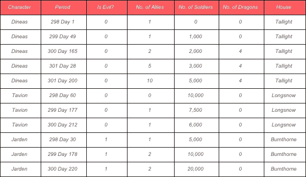
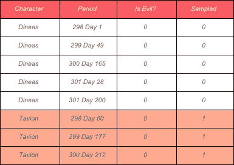
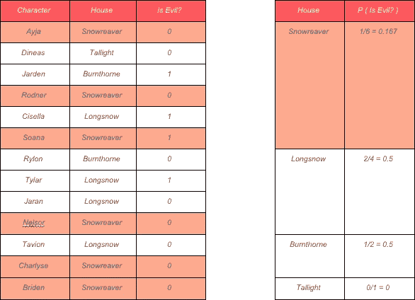

# 设计机器学习模型

> 原文：<https://medium.com/airbnb-engineering/designing-machine-learning-models-7d0048249e69?source=collection_archive---------1----------------------->

## 精确和回忆的故事

由 [Ariana Radianto](https://www.linkedin.com/in/aradianto)

在 Airbnb，我们专注于创造一个人们可以属于任何地方的地方。这种归属感部分来自于用户之间的信任，并且知道他们的安全是我们最关心的问题。

虽然我们社区的绝大部分是由友好和值得信赖的主人和客人组成的，但仍有一小部分用户试图利用我们的网站。这种情况非常罕见，但尽管如此，这正是[信任与安全](https://www.airbnb.com/trust)团队的用武之地。

信任和安全团队处理我们平台上可能发生的任何类型的欺诈。我们的主要目标是保护我们的用户和公司免受各种类型的风险。风险的一个例子是退款，这是大多数电子商务公司都熟悉的一个问题。为了减少欺诈行为的数量，Trust and Safety 团队中的数据科学家构建了各种机器学习模型来帮助识别不同类型的风险。有关我们模型背后的架构的更多信息，请参考之前关于[为风险](http://nerds.airbnb.com/architecting-machine-learning-system-risk/)构建机器学习系统的博文。

在这篇文章中，我简要概述了构建机器学习模型的思维过程。当然，每个模型都是不同的，但希望它能让读者了解我们如何在机器学习应用程序中使用数据来帮助保护我们的用户，以及我们用来改进模型的不同方法。对于这篇博客文章，假设我们想要建立一个模型来预测某些虚构的角色是否是邪恶的。

# 我们试图预测什么？

模型构建中最基本的问题是确定您希望模型预测什么。我知道这听起来很傻，但是很多时候，这个问题会引发其他更深层次的问题。

当我们更深入地思考要建立什么样的模型时，即使是一个看似简单的字符分类模型也会引发许多问题。例如，我们希望这个模型得到什么分数:只是新引入的角色还是所有角色？如果是前者，我们希望在介绍中给角色打分到什么程度？如果是后者，我们要多久给这些角色打一次分？

第一个想法可能是建立一个模型，在介绍时给每个角色打分。然而，有了这样一个模型，我们将无法随着时间的推移跟踪角色的分数。此外，我们可能会错过潜在的邪恶角色，这些角色在引入时可能具有“好”的特征。

我们可以建立一个模型，每当一个角色出现在剧情中时，就给这个角色打分。这将使我们能够随着时间的推移研究分数，并发现任何不寻常的情况。但是，考虑到不可能在每一次亮相中都有任何性格发展，这可能不是最实际的途径。

经过深思熟虑后，我们可能会决定一个介于这两个最初想法之间的模型设计，即建立一个每次发生重大事件时为每个角色评分的模型，例如聚集新盟友、拥有龙等。这样，我们仍然能够跟踪角色的分数，而不必给那些最近没有发展的角色打分。

# 我们如何对分数建模？

由于我们的目标是分析一段时间内的得分，我们的训练数据集需要反映人物在一段时间内的活动。生成的训练数据集将类似于以下内容:

与每个人物相关的时期不一定是连续的，因为我们只对有重大发展的日子感兴趣。

在这种情况下，Jarden 在 3 个不同的场合有重要的角色发展，并随着时间的推移不断地壮大他的军队。迪尼亚斯在 5 个不同的场合有重要的角色发展，并负责 4 条龙的中间情节。

# 抽样

通常对于机器学习模型，有必要对观察值的数量进行下采样。采样过程本身可以非常简单，即一旦有了所需的训练数据集，就可以对总体进行基于行的采样。

然而，因为这里描述的模型处理每个字符的多个句点，所以基于行的采样可能导致与字符相关的时机在用于模型构建的数据和验证数据之间分裂的情况。下表显示了这种情况的一个示例:

这并不理想，因为我们没有得到每个角色的整体图像，而那些缺失的观察对于建立一个好的模型可能是至关重要的。

为此，我们需要进行基于字符的采样。这将确保与角色相关的所有事件都包含在模型构建数据中，或者一个都不包含。

同样的逻辑也适用于将数据分成训练集和验证集的时候。

# 特征工程

特征工程是机器学习不可或缺的一部分，对数据的良好理解有助于产生关于特征类型的想法，以设计更好的模型。特征工程的例子包括特征标准化和分类特征的处理。

特征标准化是一种标准化特征的方法，可以进行更合理的比较。让我们以下表为例:

两个角色都有一万名士兵。然而，塞里昂执政 5 年，迪尼亚斯才执政 2 年。比较这些角色中士兵的绝对数量可能没什么用。然而，将它们与人物掌权的年份标准化可以提供更好的见解，并产生更具预测性的特征。

分类特征的特征工程可能值得一篇单独的博文，因为有许多不同的方法来处理它们。特别是对于缺失值插补，请查看之前关于[在随机森林分类器](http://nerds.airbnb.com/overcoming-missing-values-in-a-rfc/)中克服缺失值的博文。

转换分类特征最常用的方法是矢量化(也称为一键编码)。然而，当处理具有许多不同层次的许多分类特征时，使用条件概率编码(CP 编码)更实用。

CP 编码的基本思想是在给定分类水平的情况下计算事件发生的概率。这种方法允许我们将分类特征的所有级别投射到单个数值变量中。

然而，这种类型的变换可能会导致未被很好地表示的电平的噪声值。在上面的例子中，我们只有一个来自塔莱特宫的观察结果。因此，相应的概率要么是 0，要么是 1。为了解决这个问题并总体上减少噪声，可以通过考虑加权平均值、全局概率以及引入平滑超参数来调整概率的计算方式。

那么，哪种方法更好呢？这取决于分类特征的数量和级别。CP 编码很好，因为它减少了特征的维数，但这样做，我们牺牲了特征间交互的信息，而这是矢量化保留的东西。或者，我们可以集成这两种方法，即组合感兴趣的分类特征，然后对相互作用的特征执行 CP 编码。

# 评估模型性能

当谈到评估模型性能时，我们需要注意好/坏角色的比例。在我们的示例模型中，数据在[character*period]级别聚合(如下表所示)。

但是，模型性能应该在角色级别进行测量(见下表)。

结果，模型构建和模型性能数据之间的好/坏角色的比例显著不同。在评估模型的精度和召回率时，分配适当的权重是至关重要的。

此外，因为我们可能会对观察值的数量进行降采样，所以我们需要重新调整模型的精度和召回率，以说明采样过程。

# 评估精确度和召回率

模型评估的两个主要性能指标是[精度和](http://en.wikipedia.org/wiki/Precision_and_recall)。在我们的例子中，精度是模型能够正确预测的邪恶角色的比例。它在给定的阈值下测量模型的准确性。另一方面，回忆是模型能够检测到的邪恶角色的比例。它衡量模型在给定阈值下识别邪恶角色的综合程度。这可能会令人困惑，因此我在下表中对其进行了细分，以说明不同之处:

将数字分类到 4 个不同的箱中通常很有帮助:

1.  真正的正面(TP):角色是邪恶的，模型也是这样预测的
2.  误报:角色是好的，但是模型预测它是邪恶的
3.  真实否定(TN):角色是好的，模型也是这样预测的
4.  假阴性(FN):性格是邪恶的，但是模型不能识别它

精确度通过计算来测量:在预测为邪恶的字符中，模型正确识别了多少，即 TP / (TP + FP)？

回忆是通过计算来衡量的:在所有邪恶的角色中，有多少是由模型预测的，即 TP / (TP + FN)？

请注意，即使分子是相同的，分母指的是不同的子群体。

在选择高精度和高召回率之间总是有一个权衡。根据模型的目的，人们可能会选择更高的精度而不是更高的召回率。然而，对于欺诈预测模型，即使牺牲了一些精度，也通常倾向于较高的召回率。

有许多方法可以提高模型的精度和召回率。这些包括增加更好的功能，优化树木修剪和建立一个更大的森林等等。然而，考虑到这种讨论的广泛性，我将把它放在一篇单独的博客文章中。

# 收场白

希望这篇博文能让读者一瞥构建机器学习模型需要什么。不幸的是，对于构建一个好的模型来说，没有放之四海而皆准的解决方案，但是很好地了解数据的上下文是关键，因为这可以转化为导出更多的预测特征，从而得到更好的模型。

最后，将角色分类为善或恶可能是主观的，但标签是机器学习的*重要部分，糟糕的标签通常会导致糟糕的模型。快乐造型！*

***该模型假设每个角色要么生来善良，要么生来邪恶，也就是说，如果他们生来邪恶，那么他们一生都会被贴上邪恶的标签。如果我们假设角色可以在中年时跨越标签，模型设计将会完全不同。**

**

## *在 [airbnb.io](http://airbnb.io) 查看我们所有的开源项目，并在 Twitter 上关注我们:[@ Airbnb eng](https://twitter.com/AirbnbEng)+[@ Airbnb data](https://twitter.com/AirbnbData)*

**原载于 2015 年 7 月 1 日*[*nerds.airbnb.com*](http://nerds.airbnb.com/designing-machine-learning-models/)*。**