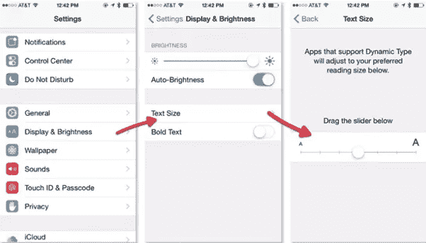
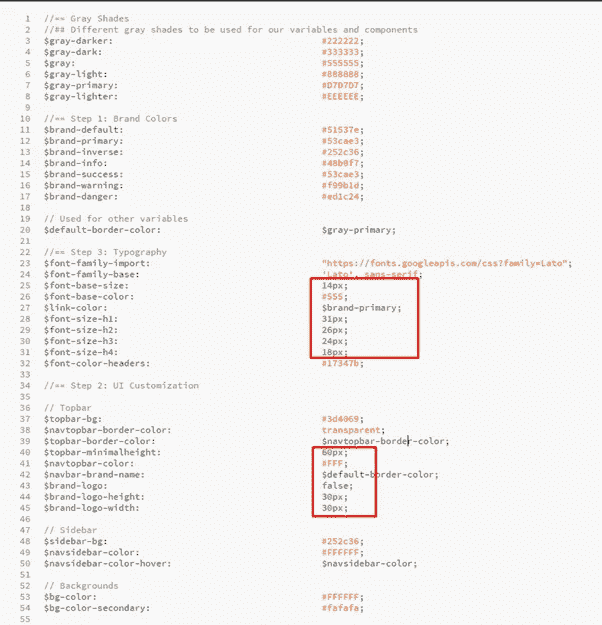
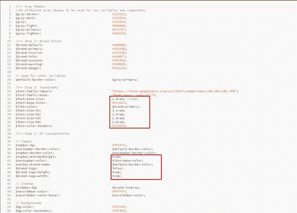
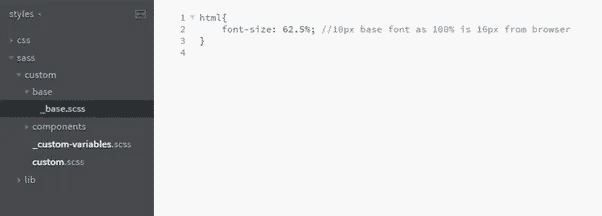
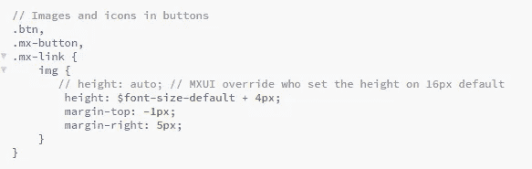

# 设计具有包容性可访问性的 Mendix 应用程序

> 原文：<https://medium.com/mendix/designing-mendix-apps-with-inclusive-accessibility-c2decf383c7d?source=collection_archive---------5----------------------->

## 每一个现代网站和应用程序都必须尽可能地包容和方便尽可能多的人使用。这一定是任何一个设计师在开发一个网站或应用时的想法。

我将把这篇博文的重点放在 Mendix 可访问性的字体大小方面。

有什么问题吗？

对于用户来说，将浏览器设置为较高的字体大小是很常见的，而对于移动用户来说，在整个设备中增加字体大小则更为常见。

[https://www.cnet.com/how-to/an-easier-way-to-adjust-font-size-on-ios-8/](https://www.cnet.com/how-to/an-easier-way-to-adjust-font-size-on-ios-8/)

用户会期望所有的网站/应用程序都会响应这些文本大小的变化。不幸的是，开箱即用的 Mendix 不这样做。这是因为样式表中的字体大小是以像素为单位设置的。这意味着它优先于来自用户设置的浏览器的文本大小。

**用像素有什么不好？**

每个开发人员都是使用 pixel 长大的，它易于理解和翻译。大多数开发人员在接触任何类型的样式时，都会使用 pixels，并且很容易继续这种做法。

正如你在上面的图片中看到的，字体大小被设置为 14px。这意味着字体大小将总是 14px，不管用户将默认字体大小设置为什么。

**我们如何解决这个问题？**

因此，我们想要的是一个应用程序，改变其字体大小的基础上，用户的偏好。那么我们如何使用文本大小而不是用我们自己的来覆盖它呢？一种方法是使用“rem”而不是“px”。Rem 值是相对于根 HTML 元素的，允许您以相对的方式指定文本大小。

1rem 等于 HTML 中设置的字体大小。即，如果浏览器中的字体是 16px，1rem 将等于 16px。(浏览器的默认值通常是 16px)。

为了简化，最好将 HTML 中的字体大小设置为 62.5%。因此 1rem 等于 10px 这使得文本大小的计算更加容易。

1rem = 10px 1.4rem = 14px 以此类推。

这两者将给出相同的结果。然而，通过使用 rem 而不是 px，你允许用户控制他们的字体大小，而不是为他们设置。

要使用 rem 而不是 px，我们必须首先更新 HTML 中的字体大小。默认情况下，在 Mendix 样式表 lib 文件夹中，这被设置为$font-size-default(在 px 中设置)。

如前所述，我们需要在自定义的 Sass 文件夹中覆盖它以使用 percentage。像这样:

**Mendix/Bootstrap 问题**

你可能已经注意到，如果你试图编译你的 Sass，你会得到以下错误:不兼容的单位' rem '和' px '

在 Mendix lib 文件夹 lib/components/_buttons.scss 中有以下代码:

如你所见，它添加了字体大小默认值(现在设置为使用 rem，而不是 px)和+4px。这就是抛出编译错误的原因，因为你不能同时使用 rem 和 px。因此，最好在注释大纲中添加回，并删除违规的行。

我们走吧！一旦您编译了 Sass，您的 Mendix 应用程序现在就可以被更改字体大小的用户完全访问了！

使用 rem 而不是像素还有其他好处吗？

使用 rem 而不是 px 还有其他好处，不仅仅是改变字体大小…例如，使用 rem 而不是 px 来填充、标识宽度、布局间距等。这将使整个应用程序响应用户正在查看的浏览器的大小。此外，不需要对样式表中的每个不同元素都使用媒体查询，也就是说，不需要增加移动设备上的基本字体大小，只需要在基本 HTML 中进行一次媒体查询。这将更新基本字体大小，因此将在整个应用程序中更新，节省您必须编写大量的媒体查询，只有一个地方来管理基本 rem 大小。