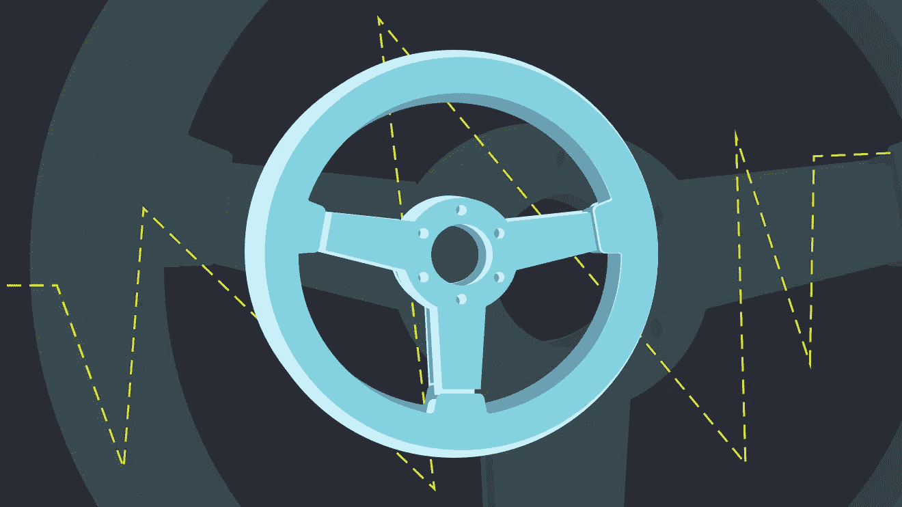

# 在边缘设计微观体验

> 原文：<https://medium.com/capital-one-tech/designing-microexperiences-on-the-edge-for-mobile-eb4e6c3a3f2e?source=collection_archive---------7----------------------->

## 依赖驱动的面向顾客体验的微观设计原则的实际应用

Capital One 的 Edge 工程师扩展了现有 API 的功能，以在我们的移动产品中创建强大的、可重复使用的体验。为了持续地交付客户期望的高质量特性，我们的 Edge 工程师必须是自主的，并被授权快速地交付固有地依赖于各种后端系统的高质量代码。此外，从开发、部署和支持的角度来看，代码必须是可维护的。

考虑所有这些因素可能很困难。微服务架构模式解决了真空中的自主开发和交付问题，但是随着功能套件的增长，从开发和支持的角度来看，它可能变得难以管理。特别是考虑到您的代码库和生产环境中可能存在许多工件。同样，*“做一件事并把它做好”*微服务格言并不总是适用于我们如何看待客户特征。

Capital One Edge engineering 通过为我们的产品建立所谓的*微观体验*来解决这些问题。什么是微体验？

> 微观体验是依赖驱动的面向客户的体验的微观设计原则的实际应用。

让我们把这句话分解成它的组成部分和子组成部分。

# 微观设计原则的实际应用

## 深思熟虑的功能分离

微经验允许工程师避免单一的应用程序，而不会变得太细粒度，以至于代码维护和操作支持变得难以维持。微观体验强调*深思熟虑的功能分离*。

例如，假设客户希望按时间顺序查看与其支票账户相关的所有交易。为了提供这种体验，应用程序将需要检索许多不同的交易类型(即将发生的交易、已过帐的交易、转账等)。)，将它们聚合在一起，然后按日期排序。

不是将这些任务中的每一个分解成它们自己的服务，这些服务独立地不为客户提供有价值的体验，而是将逻辑组合在一起成为单一的事务微观体验，为客户提供全面的体验。这提供了微设计原则固有的安全优势，因为对该代码的任何更新只能影响一个孤立的功能，同时如果我们使用不同的服务来检索每种类型的事务，还可以减轻对代码库和工件蔓延的影响。

## 体验自主

这涉及到更大的概念*体验自主*。工程师可以自主建立微体验，推广到生产，基于流量自主规模化。登录的微观体验(每次 Capital One 客户使用我们的移动应用程序时都会使用)可以扩展为比查看汽车贷款详细信息的微观体验(Capital One 用户的子集使用次数)有更多的实例。同样，对抵押贷款微观体验的改变与登录微观体验完全隔离，隔离了改变的潜在风险。

# 依赖驱动

在边缘构建的微观体验本质上依赖于各种下游依赖。为了确保最佳的客户体验，即使依赖关系有延迟或停机时间，微观体验接受它们的依赖驱动的本质是很重要的。这意味着实施一些模式来确保高弹性，如断路和跨区域冗余，以及为我们的客户优雅地处理故障。

# 面向客户的体验

因为微服务是建立在“*做一件事并把它做好”*的格言之上的，所以它们往往是从数据向前构建的。微体验是从客户体验反向服务体验 API 构建的，确保客户在数字移动渠道中拥有一致的体验。

让我们回到支票账户交易的例子。通过将多种事务类型的获取和排序捆绑到一个工件中，这段代码可能会被视为违反了*“做一件事并把它做好。”*但每个“一件事”本身并不能创造面向顾客的体验。所有这些“东西”必须相互集成，以便为客户创建一个内聚的体验，同时需要最少的客户端逻辑，因此将这些逻辑捆绑在一起是有价值的。

# 结论

Capital One 的 Edge 工程师利用微经验的弹性、自主性和可维护性来快速构建和交付高质量、可重用的代码，供我们每月数百万的移动用户使用。我们发现微体验在微设计原则和依赖驱动的开发之间取得了完美的平衡，从而在移动领域建立了令人兴奋的面向客户的体验。

# 有关系的

*   [迭代交付和基于合同的实现](/capital-one-tech/iterative-delivery-and-contract-based-implementation-for-apis-behind-capital-ones-mobile-experiences-6abfb6ad49e1)
*   [移动编排——边缘创新](/capital-one-tech/mobile-orchestration-innovation-on-the-edge-9835e4cbd69e)
*   [Capital One 的移动边缘工程团队利用的 4 种弹性模式](/capital-one-tech/resiliency-patterns-at-the-edge-capital-one-a5b4d41d477e)
*   [Capital One 基于插件的架构和扩展 iOS 开发](/capital-one-tech/plugin-based-architecture-and-scaling-ios-development-at-capital-one-fb67561c7df6)

*除非本帖中另有说明，第一资本与文中提到的任何公司都没有关联，也没有得到它们的支持。使用或展示的所有商标和其他知识产权都是其各自所有者的所有权。本文为 2018 首都一。*