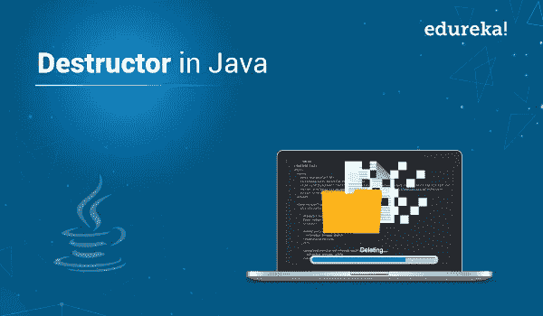
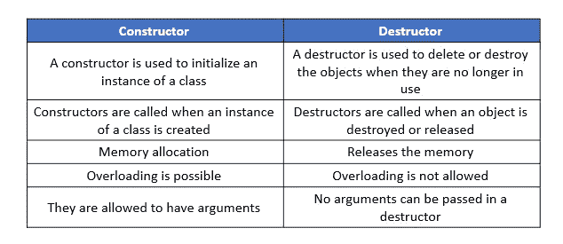

# Java 中析构函数有什么用？

> 原文：<https://medium.com/edureka/destructor-in-java-21cc46ed48fc?source=collection_archive---------1----------------------->



在 Java 中使用类时，构造函数用于初始化类的实例。使用构造函数为对象分配内存，但是在对象生命周期结束并且不再使用对象后，必须释放内存。这就是 Java 中析构函数的用武之地。在本文中，我们将按照以下顺序学习 Java 中的析构函数:

1.  什么是析构函数？

*   垃圾收集工

2.构造函数和析构函数的区别

3.Java finalize()方法

4.例子

# 什么是析构函数？

析构函数是一种特殊的方法，一旦对象的生命周期结束，它就会被自动调用。调用析构函数来释放内存。调用析构函数时，将执行以下任务。

*   松开释放锁
*   关闭所有数据库连接或文件
*   释放所有网络资源
*   其他家务工作
*   恢复在对象生存期内分配的堆空间

Java 中的析构函数也称为终结器，是不确定的。在 Java 中，内存的分配和释放由垃圾收集器隐式处理。

Java 中的终结器必须隐式调用，因为它们的调用没有保证，不像 C#终结器那样在。净运行时间。

让我们来看看析构函数的关键属性:

*   不允许重载或继承
*   没有指定访问修饰符或参数
*   自动调用，没有来自用户的显式调用
*   用于类中，但不用于结构中
*   从最大派生类到最小派生类，类的顺序各不相同
*   当对象实例不再适合访问时也调用
*   用于释放非托管资源，而不是对象持有的托管资源

## 垃圾收集工

垃圾收集器是一个运行在 Java 虚拟机上的程序，它通过删除不再使用或已经结束生命周期的对象来恢复内存。当且仅当一个对象不可达时，称该对象有资格进行垃圾收集。

让我们试着理解 Java 中垃圾收集的工作原理:

*   串行垃圾收集器
*   并行/吞吐量垃圾收集器
*   CMS 收集器
*   G1 收藏家

让我们来看看 Java 中垃圾收集的几个优点:

*   它会自动删除无法访问的未使用对象，以释放内存
*   垃圾收集使 Java 内存高效
*   不需要显式调用它，因为实现存在于 JVM 中
*   垃圾收集已经成为许多编程语言的重要和标准组件

让我们试着理解一下为什么 Java 中不使用析构函数。

# 构造函数和析构函数:构造函数和析构函数的区别



# Java Finalize()方法

对于任何开发人员来说，强制执行垃圾收集器都变得相当困难，但是有一个替代方法。我们可以用这个物体。finalize()方法，其工作方式与 Java 中的析构函数完全一样。

Object.finalize()方法在所有 Java 对象中被继承。它不是一个析构函数，但用于确保或提供额外的安全性，以确保在程序关闭前关闭文件等外部资源的使用。您可以使用方法本身或 system . runfinalizersonexit(true)来呼叫它。

强烈建议不要使用 finalize()方法，因为它可能非常不安全，并且在某些情况下使用不正确。

让我们举一个简单的例子来说明如何使用 finalize()来调用垃圾收集器。

```
**public** **class** A {
**public** **void** finalize() **throws** Throwable{
System.out.println("Object is destroyed by the Garbage Collector");
}
**public** **static** **void** main(String[] args) {
A test = **new** A();
test = **null**;
System.gc();
}
}
```

这就把我们带到了本文的结尾，我们已经了解了 Java 中的析构函数。我希望你清楚本教程中与你分享的所有内容。

这就把我们带到了高级 Java 教程博客的结尾。我希望你发现这个博客信息丰富，增加了你的知识价值。
如果你想查看更多关于人工智能、DevOps、道德黑客等市场最热门技术的文章，你可以参考 [Edureka 的官方网站。](https://www.edureka.co/blog/?utm_source=medium&utm_medium=content-link&utm_campaign=destructor-in-java)

请留意本系列中的其他文章，它们将解释 Java 的各个方面。

> *1。* [*面向对象编程*](/edureka/object-oriented-programming-b29cfd50eca0)
> 
> *2。*[*Java 中的继承*](/edureka/inheritance-in-java-f638d3ed559e)
> 
> *3。*[*Java 中的多态性*](/edureka/polymorphism-in-java-9559e3641b9b)
> 
> *4。*[*Java 中的抽象*](/edureka/java-abstraction-d2d790c09037)
> 
> *5。* [*Java 字符串*](/edureka/java-string-68e5d0ca331f)
> 
> *6。* [*Java 数组*](/edureka/java-array-tutorial-50299ef85e5)
> 
> *7。* [*Java 收藏*](/edureka/java-collections-6d50b013aef8)
> 
> *8。* [*Java 线程*](/edureka/java-thread-bfb08e4eb691)
> 
> *9。*[*Java servlet 简介*](/edureka/java-servlets-62f583d69c7e)
> 
> *10。* [*Servlet 和 JSP 教程*](/edureka/servlet-and-jsp-tutorial-ef2e2ab9ee2a)
> 
> *11。*[*Java 中的异常处理*](/edureka/java-exception-handling-7bd07435508c)
> 
> 12。 [*Java 教程*](/edureka/java-tutorial-bbdd28a2acd7)
> 
> *13。* [*Java 面试题*](/edureka/java-interview-questions-1d59b9c53973)
> 
> *14。* [*Java 程序*](/edureka/java-programs-1e3220df2e76)
> 
> 15。 [*科特林 vs Java*](/edureka/kotlin-vs-java-4f8653f38c04)
> 
> 16。 [*依赖注入使用 Spring Boot*](/edureka/what-is-dependency-injection-5006b53af782)
> 
> 17。 [*堪比 Java 中的*](/edureka/comparable-in-java-e9cfa7be7ff7)
> 
> *18。* [*十大 Java 框架*](/edureka/java-frameworks-5d52f3211f39)
> 
> *19。* [*Java 反射 API*](/edureka/java-reflection-api-d38f3f5513fc)
> 
> 20。[*Java 中的 30 大模式*](/edureka/pattern-programs-in-java-f33186c711c8)
> 
> *21。* [*核心 Java 备忘单*](/edureka/java-cheat-sheet-3ad4d174012c)
> 
> *22。*[*Java 中的套接字编程*](/edureka/socket-programming-in-java-f09b82facd0)
> 
> *23。* [*Java OOP 备忘单*](/edureka/java-oop-cheat-sheet-9c6ebb5e1175)
> 
> *24。*[*Java 中的注释*](/edureka/annotations-in-java-9847d531d2bb)
> 
> *25。*[*Java 中的库管理系统项目*](/edureka/library-management-system-project-in-java-b003acba7f17)
> 
> *26。*[*Java 中的树*](/edureka/java-binary-tree-caede8dfada5)
> 
> *27。*[*Java 中的机器学习*](/edureka/machine-learning-in-java-db872998f368)
> 
> *28。* [*顶级数据结构&Java 中的算法*](/edureka/data-structures-algorithms-in-java-d27e915db1c5)
> 
> *29。* [*Java 开发人员技能*](/edureka/java-developer-skills-83983e3d3b92)
> 
> 三十岁。 [*前 55 名 Servlet 面试问题*](/edureka/servlet-interview-questions-266b8fbb4b2d)
> 
> 31。 [](/edureka/java-exception-handling-7bd07435508c)[*顶级 Java 项目*](/edureka/java-projects-db51097281e3)
> 
> *32。* [*Java 字符串备忘单*](/edureka/java-string-cheat-sheet-9a91a6b46540)
> 
> 33。[*Java 中的嵌套类*](/edureka/nested-classes-java-f1987805e7e3)
> 
> 34。 [*Java 集合面试问答*](/edureka/java-collections-interview-questions-162c5d7ef078)
> 
> *35。*[*Java 中如何处理死锁？*](/edureka/deadlock-in-java-5d1e4f0338d5)
> 
> *36。* [*你需要知道的 50 大 Java 合集面试问题*](/edureka/java-collections-interview-questions-6d20f552773e)
> 
> *37。*[*Java 中的字符串池是什么概念？*](/edureka/java-string-pool-5b5b3b327bdf)
> 
> 38。[*C、C++和 Java 有什么区别？*](/edureka/difference-between-c-cpp-and-java-625c4e91fb95)
> 
> 39。[*Java 中的回文——如何检查一个数字或字符串？*](/edureka/palindrome-in-java-5d116eb8755a)
> 
> *40。* [*你需要知道的顶级 MVC 面试问答*](/edureka/mvc-interview-questions-cd568f6d7c2e)
> 
> *41。*[*Java 编程语言的十大应用*](/edureka/applications-of-java-11e64f9588b0)
> 
> *42。*[*Java 中的死锁*](/edureka/deadlock-in-java-5d1e4f0338d5)
> 
> *43。*[*Java 中的平方和平方根*](/edureka/java-sqrt-method-59354a700571)
> 
> *44。*[*Java 中的类型转换*](/edureka/type-casting-in-java-ac4cd7e0bbe1)
> 
> *45。*[*Java 中的运算符及其类型*](/edureka/operators-in-java-fd05a7445c0a)
> 
> *46。*[*Java 中的析构函数*](/edureka/destructor-in-java-21cc46ed48fc)
> 
> *47。* [*爪哇*二分搜索法](/edureka/binary-search-in-java-cf40e927a8d3)
> 
> 48。[*Java 中的 MVC 架构*](/edureka/mvc-architecture-in-java-a85952ae2684)
> 
> *49。* [*冬眠面试问答*](/edureka/hibernate-interview-questions-78b45ec5cce8)

*原载于 2019 年 9 月 30 日 https://www.edureka.co**T21*[。](https://www.edureka.co/blog/destructor-in-java/)