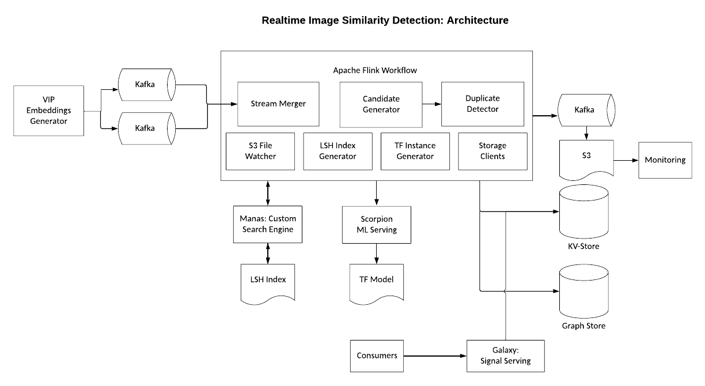

# 使用 Apache Flink(近)实时检测图像相似性

> 原文：<https://medium.com/pinterest-engineering/detecting-image-similarity-in-near-real-time-using-apache-flink-723ce072b7d2?source=collection_archive---------1----------------------->

沙姬·陈楠·昆努梅尔|软件工程师，内容质量
Iaroslav Tymchenko|软件工程师，内容质量

Pinterest 的核心是一个视觉平台，因此理解和处理图像的需求是最重要的。几年前，内容质量团队[设计并实现了](/pinterest-engineering/detecting-image-similarity-using-spark-lsh-and-tensorflow-618636afc939)我们自己的批处理管道来检测类似的图像。相似性信号在 Pinterest 上被广泛用于各种用例，从改善基于相似图像的推荐到删除垃圾邮件和滥用内容。然而，为新创建的图像计算信号需要几个小时，这对垃圾邮件发送者和滥用者来说是一个损害平台的长时间窗口。因此，最近，该团队实现了一个流管道，以近实时的方式检测类似的图像。

鉴于该平台的规模，识别重复图像一直很困难，而实时识别则更具挑战性。这篇博客文章重点介绍了内容质量团队最近利用 Apache Flink(近)实时检测重复图像的工作。

该项目的目标是在不影响准确性和覆盖范围的情况下，将延迟从批处理流水线的数小时延迟减少到几秒钟。

具体来说，我们希望解决以下两个问题:

*   给定一张图片，查找之前是否在 Pinterest 上使用过相同的图片(或稍有变化，又名*near up*
*   给定一张图片，找到 Pinterest 上使用的所有相似图片的列表

出于实际原因，Pinterest 上使用的整个图像世界被分解成一组不重叠的簇。注意，相似性关系是不可传递的，因此使用近似关系来分割图像。对于每个集群，一个代表性的成员被挑选(随机)并被用作一个集群 ID。更具体地，我们使用图像之间的以下关系来表示不相交的聚类:

*   镜像(又名*集群成员*)到规范镜像(又名*集群头*)
*   集群成员列表的规范映像

本文的其余部分将重点讨论实时管道的设计和实现。请注意，本文不是关于检测图像相似性，而是关于*如何实时检测。如何使用位置敏感哈希(LSH)搜索和基于张量流的分类器来检测图像相似性的细节在之前名为“[使用火花、LSH 和张量流检测图像相似性](/pinterest-engineering/detecting-image-similarity-using-spark-lsh-and-tensorflow-618636afc939)”的博客文章和这些[文章](https://dl.acm.org/doi/fullHtml/10.1145/3366423.3380031)中有详细解释。*

# 挑战

Pinterest 上的海量图片在可扩展性和健壮性方面带来了一系列挑战。下面给出的数字让我们看到了我们正在应对的规模:

*   Pinterest 上保存的 pin 数: **300B**
*   每秒图像创建的速率: **~100(高峰时 200)**
*   集群成员数量:**平均 6 个，少数集群成员数量高达 110 万**

考虑到信号的重要性以及信号延迟/损坏可能带来的影响，我们必须从一开始就将以下方面融入系统:

*   易于调试
*   信号的可解释性
*   实时和长期监控信号的健康状况
*   在发生灾难性故障时，能够重新处理图像子集
*   能够尽可能无缝地从批处理管道切换到新管道

# 设计和实施

对于每个新创建的图像，我们运行以下步骤来检测相似的图像:

*   从视觉嵌入中提取 [LSH](https://en.wikipedia.org/wiki/Locality-sensitive_hashing) 术语
*   查询自定义搜索引擎(通过 LSH 术语索引引导)以确定一组潜在候选项。基于与所讨论的图像匹配的词的数量对候选进行排序。
*   使用基于张量流的分类器评估候选集。我们使用经验确定的阈值来过滤掉不匹配的图像
*   如果检测到相似的映像，则识别群集并更新存储。

整个系统构建为一个 [Apache Flink](https://ci.apache.org/projects/flink/flink-docs-release-1.12/) 工作流。在高层次上，一旦嵌入就绪，就触发相似性计算。Pinterest 的媒体团队已经通过 Kafka 发布了通知。

## 架构图

本节给出的图表抓住了管道架构的本质。

## 流-流连接

相似性计算使用不同的嵌入(部分出于历史目的)用于 LSH 和机器学习评估。典型地，嵌入在几秒钟内可用，并且管道使用一个[流-流连接](https://ci.apache.org/projects/flink/flink-docs-release-1.12/dev/stream/operators/joining.html)来同步多个嵌入的可用性。

## Manas:自定义搜索引擎

我们使用 [Manas](/pinterest-engineering/manas-a-high-performing-customized-search-system-cf189f6ca40f) (Pinterest 的可配置搜索引擎)通过 LSH 术语匹配找到潜在候选人。在[之前的博客文章](/pinterest-engineering/detecting-image-similarity-using-spark-lsh-and-tensorflow-618636afc939)中解释了 LSH 术语如何用于识别相似图像的细节。

因为我们需要根据重叠项的数量对候选项进行排序，

搜索群集已针对延迟的正确性进行了优化。与传统的搜索引擎不同，我们的用例通常需要扫描整个语料库，并且期望返回具有最高术语重叠的结果。大量的文档扫描确实给搜索基础设施带来压力，并且需要严格的速率限制来调节搜索查询的速率。

一旦计算出相似性得分，搜索索引也会更新，以使新创建的图像可搜索。

## 张量流模型服务

我们利用 Pinterest 名为 [Scorpion](/pinterest-engineering/building-a-dynamic-and-responsive-pinterest-7d410e99f0a9) 的 ML 服务基础设施来评估选中的候选人。考虑到问题的规模(峰值时，每秒有近 500，000 个实例被评估)，模型服务使用 GPU 和微批处理等重要的优化来获得更好的性能。

## 存储和服务

如果检测到重复的映像，则需要更新底层存储以服务于映射。如上所述，我们在存储中坚持两种关系:

*   图像到簇头映射
*   集群成员列表中的集群头

映像到簇头的映射很简单，并且存储在 rocksdb 的一个[变种中，这为我们提供了低延迟和线性可伸缩性。](/pinterest-engineering/open-sourcing-rocksplicator-a-real-time-rocksdb-data-replicator-558cd3847a9d)

然而，集群头与成员列表的关系是一个更复杂的关系，因为集群大小严重不对称(平均大小为 6，但对于少数集群来说达到 100 万左右)。在 Pinterest 自己的名为 [Zen](https://www.youtube.com/watch?v=yI0vHfgK6oI) 的图形存储系统中，簇头到成员列表的关系被存储为图形(节点是图像，边代表簇头到图像的映射)。使用图形存储的主要原因是利用它对获取边的分页支持(如果没有分页，将会有 V 大小非常大的 K-V 对，这将限制它在在线 K-V 系统中的使用)。

这些关系通过称为 Galaxy 的通用信号传递系统提供服务，该系统提供低延迟的信号获取。

## 引导现有关系

我们利用 Flink 的[文件监视器](https://ci.apache.org/projects/flink/flink-docs-stable/dev/datastream_api.html)特性来引导 rocksdb 和 Zen graph 存储。历史数据被转换成 Flink 工作流能够理解的模式，并保存在 AWS S3 的一个目录中。工作流中添加了一个文件监视器操作员，以监视 S3 位置并将数据批量上载到存储系统中。

# 管道的可操作性

管道的设计和实施考虑了可操作性。

## 可调试性

由于管道很复杂，我们通过 Flink 操作符实现了特殊的调试数据传播。调试细节被推送到 Kafka 队列，并使用 Pinterest 自己的名为 [Merced](/pinterest-engineering/scalable-and-reliable-data-ingestion-at-pinterest-b921c2ee8754) 的可扩展 Kafka 物化基础设施进行持久化。系统还内置了一种功能，可以有选择地将图像 id 接收到管道中，并实时检查中间结果，以便更好、更轻松地进行调试。

## 监控和警报

除了使用 Flink 提供的标准指标，我们还有许多自定义指标来衡量管道的健康状况。也有每小时运行的作业在物化的 Kafka 日志上测量覆盖率和其他标准度量来检测模型偏差，等等。

## 处理失败

我们构建了以下工具来处理故障和错误:

*   用于在管道中的任何主要组件出现故障时回滚到良好状态的工具
*   通过强制将映像更改为簇头映射来修复误报的工具

# 未来的工作

最初以图像为中心的管道发现了从静态图像到动态大头针(如视频和故事大头针)的应用。此外，它还可以被推广到处理存在近似重复关系的任何类型的数据，这为将来提高效率创造了机会。

*致谢:这篇文章总结了多个团队几个季度的工作。感谢 Michael Mi、Andrey、Haibin Xie Saurabh Joshi、Sheng Cheng、Ankit Patel、Qingxian Lai、Karthik Anantha Padmanabhan、、、Nilesh Gohel、Teja Thotapalli、Nick DeChant*