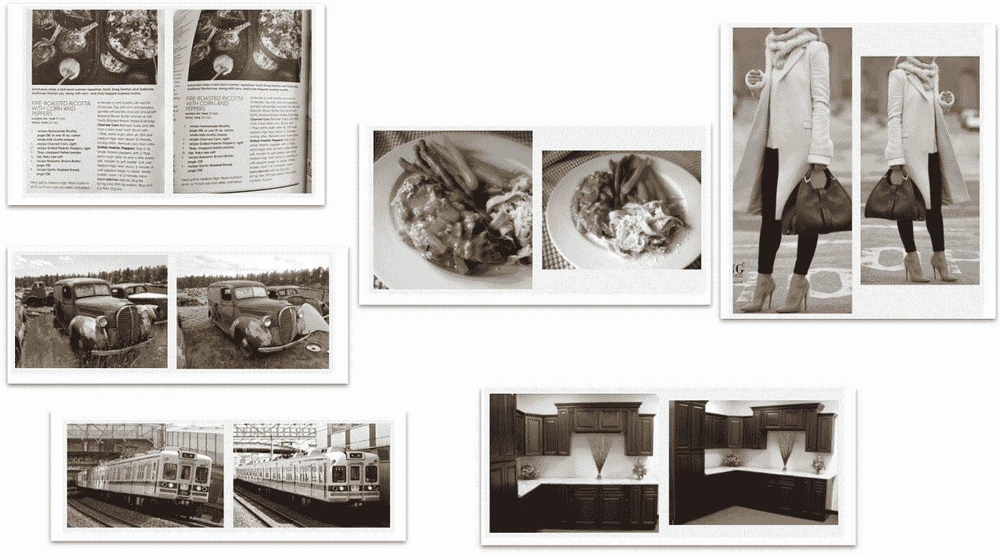

# 利用火花、LSH 和张量流检测图像相似性

> 原文：<https://medium.com/pinterest-engineering/detecting-image-similarity-using-spark-lsh-and-tensorflow-618636afc939?source=collection_archive---------0----------------------->

安德烈·古塞夫，Pinterest 工程师，内容质量

作为一个视觉平台，从图像中学习以理解我们的内容的能力很重要。为了检测近似重复的图像，我们使用 NearDup 系统，一个基于火花和张量流的管道。流水线的核心是批量 [LSH](https://en.wikipedia.org/wiki/Locality-sensitive_hashing) (位置敏感散列)搜索的 Spark 实现和基于 TensorFlow 的分类器。每天，管道都会比较数十亿个项目，并增量更新集群。在本帖中，我们将解释我们如何使用这项技术来更好地理解图像，并提高推荐和搜索结果的准确性和密度。

# 概观

我们将我们的图像世界划分为几乎相同的图像类别(如人类观察者所感知的)。虽然这个概念有些主观，但下面的一组图像对会让你知道什么属于接近阈值。请注意，图像可能不一定来自相同的源照片(见右下方的示例图像)或具有相同的背景(见左下方)。它可能会有明显的几何扭曲(见左上)，或者可能是旋转、裁剪或翻转变体(见中间和右上)。

在图像的宇宙中寻找一个理想的划分在数学上是不明确的，因为邻近关系不是传递的，因此不是等价关系。为了说明这一点，想象一下经过 1000 次迭代，慢慢地将一只猫的图像变形为一只狗的图像。预计每一次迭代都将落在 NearDup 阈值内，但如何划分序列尚不清楚:是有一群猫、一群狗还是一群猫狗？我们使用所选候选对象上的传递闭包和贪婪 k-切割的组合来找到最小化图中 k-切割的划分的近似。在图中，边代表图像的相似性，节点代表图像。

# 使用批处理 LSH 的候选生成

## 嵌入和 LSH 术语

为了理解图像的内容，我们将图像映射到嵌入的向量空间中。视觉嵌入是捕捉视觉和语义相似性的图像的高维向量表示。它们通常通过神经网络架构产生，如 VGG16 和 Inception。为了通过 NearDup 关系对图像进行聚类，我们每天都要将数千万张新图像与数十亿个现有聚类进行比较。在没有优化的情况下进行这样的最近邻搜索将产生二次时间复杂度和与超过 10 万亿次成比例的运行时间(即 16 个零！)图片对比。取而代之的是，我们使用 LSH 项来简化图像的嵌入表示，以极大地改善这类问题的易处理性。

LSH 是一种现代技术，用于降低高维数据的维数，同时保留各个点之间的成对距离。通过基于[随机投影](https://en.wikipedia.org/wiki/Locality-sensitive_hashing#Random_projection)和[比特采样 LSH](http://mlwiki.org/index.php/Bit_Sampling_LSH) 的过程，我们首先降低原始空间的维度。接下来，在从根本上权衡检测概率和运行时间的过程中，导出的比特被分组为 LSH 项。分组越小，运行最近邻搜索的计算开销就越大，但这增加了准确检测的概率。这个过程使用 LSH 项和它们的 Jaccard 重叠作为原始嵌入空间中向量之间的余弦相似性的近似。

## 批量 LSH 搜索

每个图像都由一组 LSH 术语表示，我们继续建立倒排索引，并实现面向批量的图像搜索。在高层次上，我们使用函数转换、压缩的倒排索引和连接的组合来一次计算所有查询图像的结果集。流水线是在 Spark 中实现的，需要一系列的优化来确保我们能够处理数据量，即使是在计算上更易处理的 LSH 项空间中。一些优化包括:

*   **字典编码**这样一切都通过尽可能最小宽度的数字原语进行编码
*   **可变字节编码**用于所有倒排索引
*   **索引分区**改善了倒排索引的平衡
*   **基于成本的优化器**检测嵌入式空间的密度，并确定最佳运行时参数
*   **原始数据打包**进一步提高内存利用率
*   **Jaccard 重叠计数**是通过低级别、高性能的收集完成的
*   **关闭堆积**减少 GC 开销

# 使用迁移学习的候选人选择

批量 LSH 是一种在最小化计算成本的同时产生高召回率的有效方法。但是，它通常不会产生最佳的精确度和候选人排名。我们通过监督分类器对生成的候选项进行传递，以选择足够相似的候选项，从而被认为是接近的。分类器是基于视觉嵌入的迁移学习的一个例子。它使用 TensorFlow 前馈网络和 AdamOptimizer。我们已经在包含超过 10 亿个不同对的集合上训练了分类器。训练集是从具有几何验证的 SURF 视觉特征上的决策树分类器的输出中导出的，其被用于 NearDup 系统的先前迭代中。为了改进每对图像的学习和收敛，汉明比特(从视觉嵌入中得到)被异或并被馈送到输入层。该分类器被调整为高精度，并在人类标记的数据上实现了超过 99%的精度。

经过训练的网络上的推断也发生在 Spark 上下文中。使用 mapPartitions 和分组范式，我们可以使用大批量的预定义大小来有效地向量化和减少开销。借助一个拥有近 1000 万个参数的网络，我们在一个 r 3.8 x 大型机器集群上实现了平均 2 毫秒/次的预测。

# 结论

接近检测需要计算成本很高的成对比较。通过利用 Spark 中的批量 LSH 实现，我们跳过了不可能相似的图像对，从而大大降低了计算复杂度。基于 Spark 的实现结合了高效的工作负载分配和低级优化，以最大限度地减少内存和 CPU 占用。随后的微调步骤使用受监督的前馈网络来选择和排列高于 NearDup 相似性阈值的图像对。Spark 和 TensorFlow 推理的结合使用了最好的分布式计算和每个内核的矢量化，以实现高吞吐量和低预测延迟。这两个步骤的结果然后被用于聚类图像，这有助于每天在 Pinterest 上提供数百亿个搜索结果和推荐。

*关于这个话题的更多信息，请查看我在* [*Spark+AI 峰会 2018*](https://databricks.com/session/image-similarity-detection-at-scale-using-lsh-and-tensorflow) *下面的*