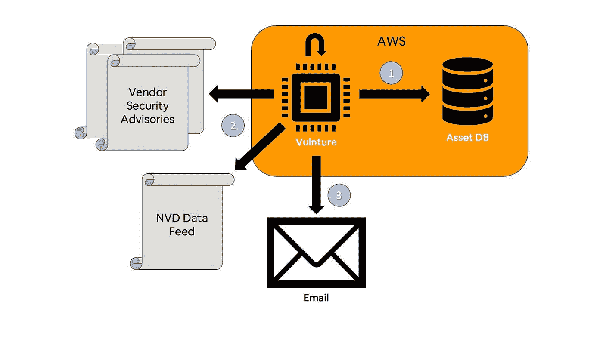

# 使用 Vulnture 检测漏洞

> 原文：<https://medium.com/airbnb-engineering/detecting-vulnerabilities-with-vulnture-f5f23387f6ec?source=collection_archive---------2----------------------->

引入新的开源工具，以便更快地识别您资产中的安全漏洞。

# 介绍

无论您的行业或公司规模如何，保护资产和数据都是一项具有挑战性的重要任务。在 Airbnb 的 InfoSec 团队中，我们一直在思考如何快速有效地检测和修复影响我们资产的已知安全漏洞。

为了应对这一挑战，我们创建了一个名为 [Vulnture](https://github.com/airbnb/vulnture) 的工具，我们很乐意将其开源并与软件社区共享！

Vulnture 极大地简化了在一个地方收集已知资产并及时识别安全漏洞的费力过程。在我们分享 Vulnture 如何工作之前，让我们更深入地了解一下我们正在应对的挑战。

# 背景

1999 年， [MITRE](https://www.mitre.org/) 和更广泛的安全社区发布了[常见漏洞和暴露(CVE)列表](https://cve.mitre.org/index.html)。开发此列表的目的是减少安全覆盖范围的差距，实现漏洞数据库和工具之间的互操作性，并为评估各种工具之间的漏洞提供一个标准化的基础。

几年后的 2005 年，[国家标准与技术研究所(NIST)](https://www.nist.gov/) 推出了[美国国家漏洞数据库(NVD)](https://nvd.nist.gov/) 。NVD 中填充了来自 CVE 列表的漏洞数据，以及与每个漏洞相关的附加信息，如修复信息、严重性分数和影响评级，以使 CVE 信息更有用和更具可操作性。NVD 还提供了更精细的搜索功能，可以根据漏洞影响的产品名称和/或版本、创建时间、严重性等来查询漏洞。

简而言之，CVE 列表提供了所有已知的、公开披露的安全漏洞的列表，而 NVD 则提供了与这些漏洞相关的更详细、更容易查询的信息。Airbnb 在这些资源中看到了巨大的机会。让我们看看我们是如何利用这些数据的！

# 问题是

在过去的 20 年左右的时间里，这些数据源和数据的消费者都有了巨大的增长。然而，这些数据并不容易消化。为了利用它，你必须有一个好的方法来比较你所有的资产和 NVD 中列出的脆弱产品。此外，根据 [NVD 常见问题](https://nvd.nist.gov/general/FAQ-Sections/General-FAQs)，NVD 每小时更新一次，因此您需要经常查看，尤其是在寻找严重漏洞的时候。有效利用 NVD 数据的先决条件包括:

1.  记录您的所有资产(例如，操作系统、应用程序、服务、可执行文件、硬件型号、每个版本、关联的 IP 地址、所有者)
2.  能够经常查询以获取所有更新，同时最好不要多次检查相同的漏洞(除非它们已被修改),以避免重复工作

当我们看到 NVD 更新的*实际*周转时间时，解决这些挑战开始变得更加复杂。NVD 常见问题提到，根据新简历的数量，信息可能需要 1-3 天**才能发布。根据[威胁情报公司记录未来](https://www.recordedfuture.com/vulnerability-disclosure-delay/)的一份报告，2017 年，漏洞在 NVD 内传播之前有 7 天的中值滞后时间。显然，等待长达一周的时间才得到已知漏洞的通知是不理想的。**

这意味着，除了搜索 NVD，您可能还想考虑搜索其他来源的漏洞数据，例如可能受影响的产品的供应商站点。这样，您更有可能在几天后发现影响您的关键漏洞，从而不再给攻击者宝贵的时间来利用这些漏洞。

当然，这里的挑战是您现在必须:

1.  从您的供应商那里找出所有可能的漏洞
2.  设计一个合适的查询来筛选出不需要的数据
3.  解析出非标准化的结果

这两个步骤中的后一个步骤需要对每个单独的漏洞馈送重复执行，这意味着对于您想要从中获取数据的每个漏洞源，工作量会成倍增加。

考虑到上述情况，根据 [2020 年威瑞森数据泄露调查报告](https://enterprise.verizon.com/resources/reports/2020-data-breach-investigations-report.pdf)，近 85%的安全漏洞和 99%的安全事件是由外部或合作伙伴来源发现的，如第三方监控服务、安全研究人员或客户报告，这并不奇怪。这意味着大多数安全漏洞，以及几乎所有的安全事件，都是由经历安全事件或漏洞的公司之外的人检测到的！

并非所有的安全事件或漏洞都是由已知的漏洞引起的，但这里的关键点是，绝大多数公司都依赖第三方来告诉他们有安全问题，而不是自己能够识别它。

# 介绍 Vulnture

Vulnture 是一个完全无服务器的解决方案，它吸收您所有已知的资产，搜索影响它们的漏洞，然后通知您所有您应该知道的已发现的漏洞。让我们简单回顾一下它是如何工作的。

Vulnture High Level Overview Diagram

在当前发布的版本中，Vulnture 能够从 [AWS DynamoDB](https://aws.amazon.com/dynamodb/) 表中提取资产信息，然后查询 NVD 以及[思科安全咨询出版物](https://tools.cisco.com/security/center/publicationListing.x)中的漏洞。对于通知，它会向配置文件中配置的收件人发送电子邮件:

Vulnture 设置为每天查询一次其漏洞数据源，以确保您不会错过与影响您资产的漏洞相关的重要信息。如果您还没有某种类型的资产管理或库存解决方案，您可以开始在 DynamoDB 表中构建一个，然后让 Vulnture [引用](https://github.com/airbnb/vulnture/blob/c79326bf16d38bf963dbaf17801e9ccdd72d5b82/variables.tf#L19)。如果您有，您可以将该数据导出到 DynamoDB 表或更新 Vulnture，以便它能够查询您现有的资产数据(如果您对您的特定技术堆栈进行了更新，请考虑发出一个 pull 请求，使其成为 Vulnture 的一个本机特性！)

Vulnture 完全用 Python 编写，并使用包含的 Terraform 模块通过 [Terraform](https://www.terraform.io/) 进行部署。tf 文件)。这使得部署变得快速简单，而不必担心手动管理各种基础设施或用多种语言修改代码。

我们计划对 Vulnture 进行一些激动人心的更新，这些更新正在等待公开发布。这些包括一个附加的通知选项(JSON 文件上传到一个 [AWS S3](https://aws.amazon.com/s3/) 桶)和对来自 DynamoDB 表的更详细的资产信息的支持(例如，IP、FQDN、源)。我们在未来的版本中有更多的更新，包括利用相对[新的 NVD API](https://nvd.nist.gov/General/News/New-NVD-CVE-CPE-API-and-SOAP-Retirement) 来加速和缩小漏洞查询。我们还计划支持更多直接来自供应商(如 Amazon、Microsoft、Ubuntu、Red Hat)的漏洞数据源，以便更快地发现漏洞。

我们的目标是使 Vulnture 易于通过插件模型进行扩展，以允许它与各种资产、漏洞和通知渠道无缝协作，这些渠道可以通过简单的配置更改快速选择。

# 结论

虽然保护您的资产不是一件简单的任务，但您可以放心地知道，您有一个工具为您工作，它定期查询行业标准漏洞数据存储库，将该数据与您已知的资产信息进行比较，并通知您发现的漏洞。

我们已经在 Airbnb 使用 Vulnture 来取代我们以前的一些低效的漏洞识别和通知方法，并希望其他人也能从这个工具中受益。除此之外，我们很乐意与社区合作，继续扩充 Vulnture，使它成为一个更强大、功能更丰富的工具，易于使用，并能适应各种公司环境和工具集。

今天试试 [Vulnture](https://github.com/airbnb/vulnture) ，你可能会对你错过的东西感到惊讶！

有兴趣帮助保护人员和数据吗？Airbnb InfoSec 在招人！查看我们的[空缺职位](https://www.airbnb.com/careers/departments/engineering)并立即申请！

# 附录

所有商标都是其注册所有者的财产；Airbnb 声称对此不承担任何责任，也不享有任何所有权。

亚马逊网络服务、“由 AWS 提供动力”标志、AWS、AWS Lambda 和 DynamoDB 是 Amazon.com 公司或其附属公司在美国和/或其他国家的商标。

Cisco 是 Cisco Systems，Inc .和/或其附属公司在美国和某些其他国家的注册商标或商标。

Terraform 是 HashiCorp 的商标。