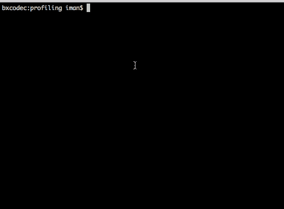
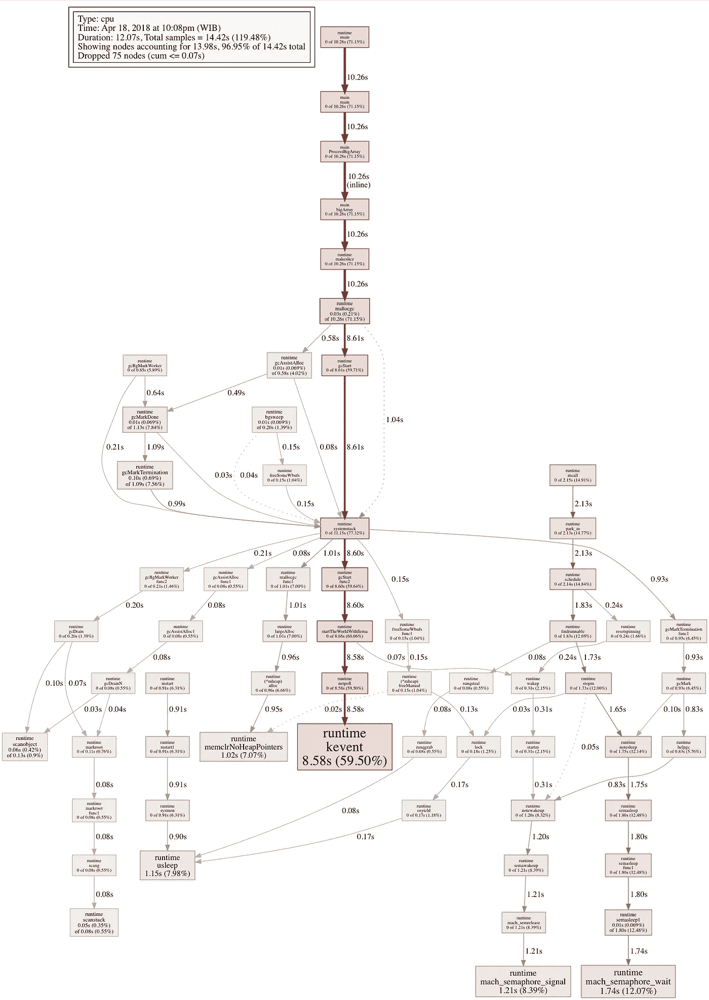

# Deteksi Slow Function di Golang dengan Profiling

> 原文：<https://medium.easyread.co/deteksi-slow-function-di-golang-dengan-profiling-2f6e5e51c1c?source=collection_archive---------3----------------------->

## Langkah sederhana untuk mendeteksi slow function di golang menggunakan pprof


Slow Illustration by [Alex Blăjan](https://unsplash.com/photos/qMWgy4LpaIs?utm_source=unsplash&utm_medium=referral&utm_content=creditCopyText) on [Unsplash](https://unsplash.com/search/photos/slow?utm_source=unsplash&utm_medium=referral&utm_content=creditCopyText)

Baru-baru ini, kami di [Kurio](https://kurio.co.id) melakukan sedikit eksperimen sederhana, yakni melakukan *tune-up* fungsi-fungsi pada API yang kami miliki.

Berangkat dari permasalahan yang kami alami ketika membangun sebuah fitur di Kurio. Saat kami melakukan proses *deploying* untuk fitur tersebut *,* penggunaan CPU server kami tiba-tiba naik. Tentu saja hal tersebut sangat mengganggu, sehingga diperlukan penanganan serius. *What really happen there* ?

*Nah* , untuk mengetahui apa yang sebenernya terjadi, langkah-langkah yang kami lakukan adalah:

*   Mendeteksi *slow function,* yakni mencari fungsi-fungsi yang menggunakan *resource* paling banyak,
*   *Improve function* , yakni melakukan pembaharuan pada fungsi tersebut dengan opsi yang optimal, dan
*   Penambahan *cache* jika di perlukan.

# Profiling Golang

Untuk tahap pertama, yang kami lakukan adalah mendeteksi fungsi yang berat dan menggunakan *resource* paling banyak. Hal ini ternyata sangat mudah untuk dilakukan di Golang.

Berkat package `pprof` pada Golang, kita dapat dengan mudah mendeteksi fungsi apa saja yang memakan banyak *resource* . Cara pemakaiannya juga cukup mudah. Kita hanya perlu *mengimport* *package* `pprof` pada aplikasi yang ingin kita *profiling* .

Pada `pprof` Golang terdapat beberapa cara melakukan profiling:

**Runtime Profiling**
*Runtime profiling* digunakan untuk aplikasi *binary* yang tidak ada proses http service. *Runtime profiling* sangat cocok digunakan untuk program-program yang bersifat *standalone* seperti *library* .
Menggunakan package: `runtime/pprof`

**HTTP Profiling**
*HTTP profiling* digunakan untuk *profiling* API atau http server yang kita miliki. Perlakuannya mirip dengan *runtime* *profiling* , namun karena diharuskan *live* , *HTTP profiling* harus dilakukan saat *load test* .
Menggunakan package: `net/http/pprof`

*Nah* , digolang sendiri dengan tools `pprof` , terdapat beberapa jenis *profiling*
- *CPU Profiling* (akan di bahas di tulisan ini),
- *Heap Memory Profiling* ,
- *Block Profiling* , dan
- *Goroutine Profiling*

Ke empat topik tersebut cukup banyak untuk di bahas dalam satu tulisan. Makadari itu untuk tulisan kali ini saya hanya akan membahas mengenai *CPU Profiling* .

# *CPU Profiling*

Jika kita ingin mengetahui fungsi apa aja yang memakan CPU paling banyak atau fungsi mana yang paling lama proses eksekusinya, maka kita dapat melakukan CPU *profiling* pada fungsi kita.

Untuk contoh sederhana, kita bisa mulai dengan sebuah fungsi kecil. Dimana fungsi tersebut akan mengembalikan sebuah *array* besar yang kemudian akan di proses oleh fungsi lain.

```
func bigArray() *[]int {
  s := make([]int, 10000000)
  return &s
}func ProcessBigArray() {
  for i := 0; i < 10000; i++ {
    arr := bigArray()
    if arr == nil {
      fmt.Println("Array is Nil")
    }
  }
}
```

Nah, untuk mulai *memprofiling* fungsi ini, hal pertama tentu saja kita perlu *mengimport* package `runtime/pprof` seperti yang sudah jelaskan di atas.

Penjelasan:

```
cpuProf, err := os.Create(cpuProfile) 
if err != nil {
  log.Fatal(err) 
} 
defer cpuProf.Close() 
_runtime.StartCPUProfile(cpuProf) 
defer _runtime.StopCPUProfile()
```

*Code* diatas digunakan untuk *mentrack* CPU *usage* kita saat mengeksekusi fungsi di bawahnya. Dan akan berhenti pada saat fungsi `main` telah selesai dieksekusi.

## Run Profiling

Setelah *code* tersebut kita selesaikan, maka kita akan melakukan *profiling* CPU pada fungsi tersebut.

```
# Build the go project
$ go build -o app_name# run the project
$ ./app_name# Wait until done
```

Setelah selesai, pada folder tersebut akan anda temukan file baru yang bernama `cpu.prof` . Selanjutnya anda tinggal melihat *profiling* pada aplikasi anda.

```
# Run the pprof
$ go tool pprof app_name cpu.prof
```



demo 1: go tool pprof

## List Top CPU Usage

Nah untuk melihat *list process* yang memakai CPU, lakukan langkah berikut


demo 2: go tool pprof

*   *Command* : `top` .


pprof top

*   *Command* : `top N` atau `topN` Contoh: `top 20` , atau `top20` .


pprof top 20

*Command* ini akan menampilkan sebanyak 20 fungsi atau *package* yang memakai CPU paling banyak.

*   *Command* `top -param` ,untuk mengurutkan berdasarkan `param` . Contoh: `top -cum` , `top -sum` , `top -flat` .


sort by cum

** **flat** , adalah satuan waktu yang dibutuhkan oleh satu fungsi untuk mengeksekusi secara langsung, tanpa fungsi lain yang termasuk di dalam.
** **cum** , adalah satuan waktu keseluruhan fungsi secara kumulatif.

Untuk lebih jelas tentang `cum` dan `flat` dapat kita buat ke dalam contoh.

```
//need 4s to execute
func iman() {
}// need 2s to execute
func tampan(){
}// need 7s to execute in total
func hakiki(){
 iman() 
 tampan()
 // Other code 
 // execute  for 1s
}// neeed 1s to execute
func fakta() {
}func main() {
 fakta() // executed for **1s**
 // Some of random
 // Unknown function
 // Executed for **2s**
 hakiki() // executed for **7s** 
}
```

*Nah* , dari contoh kodingan di atas, jika kita lihat dari fungsi `main` maka dapat dijabarkan sebagai berikut:
- **cum** dari fungsi `main` adalah 10 detik.
Karena secara kumulatif, fungsi main dieksekusi selama 10 seconds. `1s` untuk memanggil `fakta()` . `2s` untuk kodingan *logic* `main` sendiri. Dan `7s` untuk memanggil `hakiki()` .
- **flat** dari fungsi `main` adalah 2 detik.
Karena tanpa fungsi `fakta()` dan `hakiki()` , fungsi `main` membutuhkan waktu `2s` untuk kodingannya sendiri.

## Export Graphical

Selain melihat melalui *command* `top` , kita juga bisa melihat melalui gambar *graphical* . Yaitu dengan mengetik *command* `web`


demo 3: pprof

```
(pprof) web 
```


pprof web



pprof web results

*Command* `web` akan *mengexport* hasilnya ke dalam file `svg` dan bisa di buka dengan *browser* . Atau kita juga bisa menggunakan terminal *command* :

```
$ go tool pprof -png app_name cpu.prof > cpu.png
```

Command diatas akan menyimpan hasil pprof dalam bentuk gambar png.

## Seek To Source Code

Dengan `pprof` kita juga bisa langsung melihat ke source code, *line* berapa yang meenggunakan resource waktu paling banyak. Langkahnya tetap sama.

```
# Run the pprof
$ go tool pprof app_name cpu.prof
```

dan kemudian gunakan *command* `list functionName` . Secara langsung *command* `list` akan melihat ke dalam *source code* kita, dan jika menggunakan `functionName` akan melakukan filter pada seluruh *function* yang sesuai dengan yang dimasukkan.


pprof : list function name

Jika di lihat pada gambar di atas, kita dapat melihat, *function* `ProcessBigArray()` membutuhkan waktu `10.26s` untuk di eksekusi.
Atau jika kita filter lagi kedalam function `ProcessBigArray()`


pprof : list ProcessBigArray

Maka semakin kelihatan apa yang memakan waktu terlalu banyak. Yakni code:

```
s:=make([]int,1000000) // membutuhkan waktu 10.26s
```

Hal ini terjadi karena kita menginialisasi *array* yang sangat besar dengan *array* `[]int` dan panjang `1000000` . Maka dari hasil ini kita bisa simpulkan, untuk inialisasi *array* saja dengan `size` -nya yang besar, memakan waktu cukup banyak. Sehingga, kita bisa mengantisipasinya dengan menggunakan *array* *size* secukupnya saja.

# Implementasi dengan HTTP Golang API

Penjelasan di atas adalah tentang bagaimana kita melakukan *profiling* pada aplikasi *standalone* , yakni dengan cara *Runtime profiling* .

Namun cara tersebut kurang cocok dilakukan pada aplikasi HTTP API server. Sehingga perlu dilakukan pendekatan yang berbeda. Untuk keseluruhan *command* , pada `pprof` masi mirip, yang berbeda hanya cara *mereproducenya* pada HTTP API Server.

Sebagai contoh, misalnya kita memiliki sebuah API sebagai berikut:

## Add Endpoint Debugging Profiling

Langkah pertama adalah dengan menambah *endpoint* *profiling* pada aplikasi kita. Jika melihat *code* diatas, kita akan menemukan code seperti berikut.

```
handler.HandleFunc("/debug/pprof/", pprof.Index)
handler.HandleFunc("/debug/pprof/cmdline", pprof.Cmdline)
handler.HandleFunc("/debug/pprof/profile", pprof.Profile)
handler.HandleFunc("/debug/pprof/symbol", pprof.Symbol)
handler.HandleFunc("/debug/pprof/trace", pprof.Trace)
```

Dengan menambahkan *endpoint* ini pada aplikasi kita, maka kita sudah bisa melakukan profiling pada aplikasi kita menggunakan `pprof` .

## Make A Huge Request

Untuk melakukan *profiling* , tentu saja API kita harus dalam keadaan *live* dan sedang menangani *request* . Untuk membuat ini, kita bisa menggunakan *tools* untuk *load testing* , yang akan memberikan *load* *request* banyak pada API kita.
Untuk *project* kecil yang saya buat, saya menggunakan `github.com/rakyll/hey` , sebagai *tools* untuk load test.

```
# make a huge load request
$ hey -n 500 -c 50 [http://localhost:9090/hi](http://localhost:9090/hi)
```

## Running The Profiling

Sembari *load* *test* berjalan, kita lakukan *profiling* pada API kita

```
# start profiling 
$ go tool pprof app http://localhost:9090/debug/pprof/profile
```

Untuk *profiling* nya akan memakan waktu sekitar 30 detik, sampai `pprof` selesai me- *record* data yang dibutuhkan.

## Detect Slow Function

Setelah selesai, `pprof` akan muncul. Selanjutnya kita mendeteksi fungsi yang lamban dan memakai *resource* yang banyak. *Commandnya* sama seperti sebelumnya, yaitu:
`topN` , `top -cum` , `list functionName` serta `web` ,jika ingin mengaksesnya secara visual.

# What Next?

Demikian cara singkat penggunaan `pprof` di golang untuk membantu rekan `Gopher` melakukan *profiling* pada aplikasi yang dimiliki. Kepada rekan pembaca, jika ingin mengeksplorasi lebih lanjut, berikut kami sertakan referensi untuk profiling golang.

## References:

*   [https://blog.golang.org/profiling-go-programs](https://blog.golang.org/profiling-go-programs)
*   [https://artem.krylysov.com/blog/2017/03/13/profiling-and-optimizing-go-web-applications/](https://artem.krylysov.com/blog/2017/03/13/profiling-and-optimizing-go-web-applications/)
*   [https://research.google.com/pubs/pub37122.html](https://research.google.com/pubs/pub37122.html)

And btw, [Easyread](https://medium.com/easyread) is [calling for submission](https://medium.com/easyread/about-easyread-74b20960e180) 😆. HAPPY READING 😃