# 使用序列之间的 Levenshtein 距离，根据字母频率确定文档的语言

> 原文：<https://medium.com/oracledevs/determine-the-language-of-a-document-from-the-letter-frequency-using-levenshtein-distance-c230db714fce?source=collection_archive---------0----------------------->

尽管许多语言共享相同或非常相似的字母表，但是在用这些语言编写的文档中，字母的使用是非常不同的。字母“e”非常流行，但不是每种语言中使用最多的字母。事实上，字母频率对于一种语言来说是非常特定的——可以用一种简单而快速的方式来确定文档的语言。

非常简单的步骤是:

*   计算文档中字母的出现次数
*   将字母按出现的次数排列成一个字符串(最先出现的字母)(例如:*eiaonlrtscdupmgvfhqbzé；JXêy*)
*   将字母序列与所有语言的已知字母出现序列进行比较，并找到最接近的匹配；它给出了文档的语言

为此，我们需要两件重要的事情:

1.  我们想要测试的所有语言的字母频率序列—可在 http://letterfrequency.org/letter-frequency-by-language/[的](http://letterfrequency.org/letter-frequency-by-language/)获得
2.  一种比较两个序列相似性的方法——一个很好的候选方法是 Levenshtein 距离——在这里举例介绍:[https://stack abuse . com/Levenshtein-Distance-and-text-similarity-in-python/](https://stackabuse.com/levenshtein-distance-and-text-similarity-in-python/)

在[这本 Jupyter 笔记本](https://github.com/lucasjellema/language-determination-analytics/blob/master/Letter%20Frequency%20Analysis%20-%20Determine%20Language%20of%20Document%20based%20on%20Letter%20Frequency.ipynb)中，我创建了一个基于 Python 的小程序来计算文档中的字母数，根据出现次数创建字母序列，并将该序列与二十种不同语言的已知序列进行比较。这个 GitHub repo 包含代码和文档示例:[https://GitHub . com/lucasjellema/language-determination-analytics](https://github.com/lucasjellema/language-determination-analytics)。

# 走过引路

*1。将字母频率数据读入 Pandas 数据帧*

将带有 20 多种语言字母序列的 CSV 数据(取自[http://letterfrequency.org/letter-frequency-by-language/](http://letterfrequency.org/letter-frequency-by-language/))从文本文件加载到 Pandas 数据框中，并为可视化和进一步处理做准备。

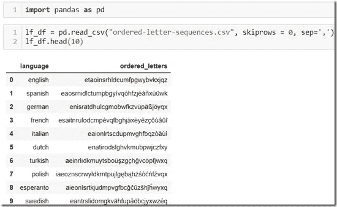

*2。创建一个函数，从文件中加载文档并计算字母的出现次数*

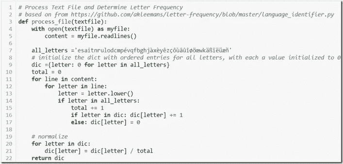

*3。运行特定文件的功能*

文档 *text-file-italian.txt* 已处理—此文档摘自古腾堡项目现场(【https://www.gutenberg.org】T5)——剧透提示:来自一本意大利书。由此产生的字母计数结果从 dict 转换成 Pandas 数据帧，并呈现为:

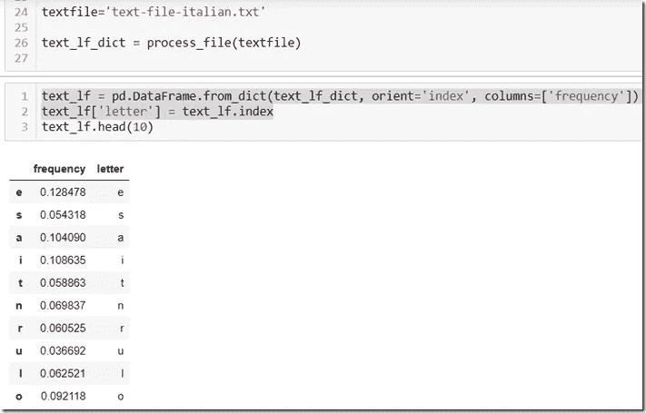

*4。导出有序字母序列，与各种语言的已知序列进行比较*

该字符串包含文档中所有不同的字母，按字母出现的顺序排列

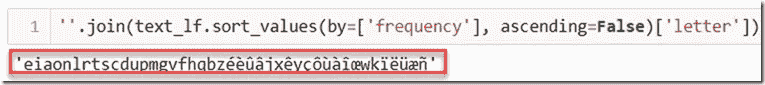

*5。创建一个函数来计算两个字母序列之间的距离或差异—基于 Levenshtein 距离*

简而言之，Levenshtein 距离通过确定将一个序列转换成另一个序列所需的动作(插入、删除、替换)的数量来表达两个序列之间的相似性。如果需要很少的改变来将一个序列变形为另一个，则两个字母序列非常接近(例如*亮*和*暗*非常接近，并且*货运*也接近*亮*但是比*暗*稍微远一点)。这篇文章更详细地描述了 Levenshtein 距离方法和 Python 中的一个实现。我愉快地采用并稍微修改了 Python 函数。

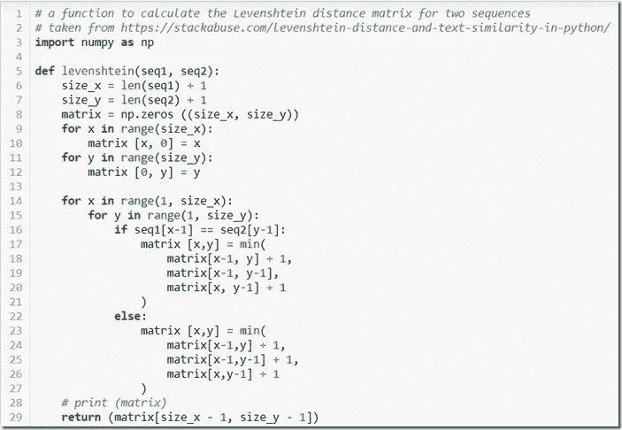

对几个字符串尝试该函数:

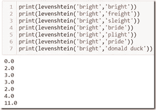

6。找出被审查文件的字母序列和所有语言的有序字母序列之间的最短距离

现在我们可以计算两个距离之间的相似性得分，我们可以迭代所有语言的基于字母频率的序列，计算从我们的文档序列到这些序列中的每一个的距离，并选择距离最小的语言作为该文档最可能的语言:

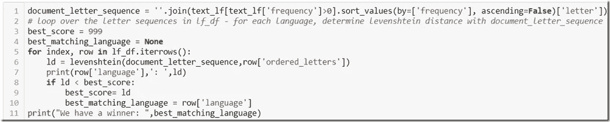

运行此代码会导致:

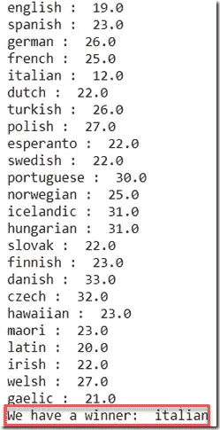

这完全正确。

7。更多例子

这个函数可以处理任何文本文件，并显示其内容最可能的语言:

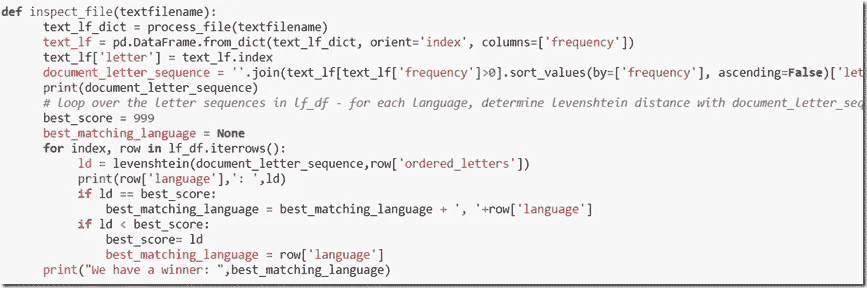

我已经为一些附加文档调用了该函数。它做得非常好——而且做得非常快！它错误地将一份丹麦文件(也取自古腾堡计划)认定为瑞典文。我听说这两个很亲近？鉴于这段文字来自古腾堡遗址，它可能有些陈旧(过时),也许和今天的丹麦语有不同的字母频率？

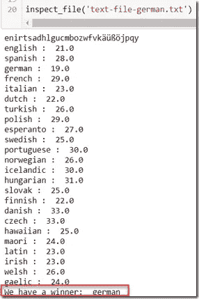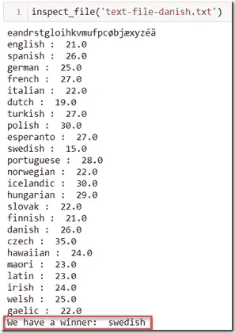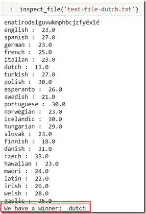

# 资源

包含示例代码和文档的 GitHub 存储库:[https://GitHub . com/lucasjellema/language-determination-analytics](https://github.com/lucasjellema/language-determination-analytics)

每种语言的字母频率:【http://letterfrequency.org/ 

Levenshtein Distance —比较系列及其差异(Python 中)—[https://stack abuse . com/levenshtein-Distance-and-text-similarity-in-Python/](https://stackabuse.com/levenshtein-distance-and-text-similarity-in-python/)

字母频率是特定于语言的。字母频率见维基百科本页:[https://en . Wikipedia . org/wiki/Letter _ frequency # Relative _ frequency _ of _ letters _ in _ other _ languages](https://en.wikipedia.org/wiki/Letter_frequency#Relative_frequencies_of_letters_in_other_languages)。

*原载于 2019 年 8 月 21 日*[*https://technology . amis . nl*](https://technology.amis.nl/2019/08/21/determine-the-language-of-a-document-from-the-letter-frequency-using-levenshtein-distance-between-sequences/)*。*