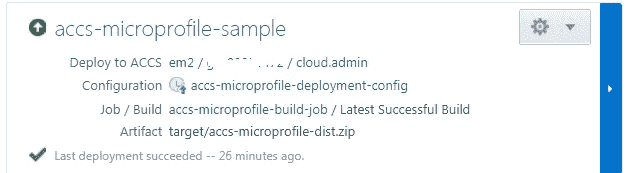

# 在 Oracle 云上开发和部署微文件应用程序

> 原文：<https://medium.com/oracledevs/develop-and-deploy-a-microprofile-application-on-oracle-cloud-22eef6c2e42c?source=collection_archive---------0----------------------->

这篇博客展示了如何从一个基于**微概要文件**规范的简单应用程序开始

*   利用**野花**蜂群作为微配置文件实现
*   在 [**Oracle 应用容器云**](https://cloud.oracle.com/en_US/application-container-cloud) 上运行
*   CI/CD 使用 [**Oracle 开发人员云**](https://cloud.oracle.com/en_US/developer-service)

# 关于示例应用程序

这个应用程序非常简单，这里有。在深入其细节之前，让我们先来看一下 Microprofile 和 Wildfly Swarm

# Eclipse Microprofile …？

Microprofile 是一个开源项目，其目标是为运行基于 Java 的微服务提供一个优化的运行时和平台。这是一个概述

*   作为 Eclipse 基金会的一个项目，它目前正处于酝酿阶段
*   该规范有**多个** **实现**——wildly Swarm、Payara、TomEE、WebSphere Liberty
*   利用现有的和广泛使用的 Java EE 规范以及其他技术
*   到目前为止，微文件支持来自 Java EE 保护伞的 **JAX-RS** 、 **CDI** 和 **JSON-P** 规范

详情请查看以下链接—[Eclipse 上的 micro profile](https://projects.eclipse.org/projects/technology.microprofile)， [microprofile.io](https://microprofile.io/)

# 野生蜂群

这个例子使用 Wildfly Swarm 作为微概要规范的*实现*。你可以在这里阅读更多关于[野生蜂群](http://wildfly-swarm.io/)

# 实施细节

在本节中，我们将探讨应用程序如何使用支持的规范，即 CDI、JAX-RS 和 JSON-P

*   **JAX-RS**:JAX-RS 资源公开了一个获取股票价格的 REST 端点——它的实际实现是由内部助手类实现的
*   **JSON-P** :由源(在本例中是 Google Finance 端点)返回的股票数据(semi JSON 有效负载)被清理，然后由使用 JSON-P API 的`StockDataParser` 解析

CDI :它起着粘合剂的作用，在许多方面都有帮助

*   将应用程序类公开为 CDI bean—`StockDataParser` (`@ApplicationScoped`)和`StockPriceRetriever` ( `@Dependent`)
*   利用 JAX-RS 和 CDI 集成点—指定一个 JAX-RS`@Provider`(`ExceptionMapper` 实现)作为`@ApplicationScoped`CDI bean—有关更多详细信息，请查看 JAX-RS 规范的第 *10.2.3 节*
*   **beans.xml** 在后台启用所有 CDI 魔法

***JAX 遥感资源***

```
@Path("stocks")
public class StockPriceResource {

    @Inject
    private StockPriceRetriever stock;

    @GET
    public Response getQuote(@QueryParam("ticker") final String ticker) {
        return Response.ok(stock.getPrice(ticker)).build();
    }

}
```

***应用逻辑(CDI bean)***

```
@Dependent
public class StockPriceRetriever {

    @Inject
    private StockDataParser parser;

    public String getPrice(String ticker) {
        String tick = null;

        if (ticker == null) {
            throw new InvalidTickerException();
        }

        Future<Response> promise = ClientBuilder.newClient().
                target("https://www.google.com/finance/info?q=NASDAQ:" + ticker).
                request().async().get();
```

***异常映射器——又一个 CDI bean***

```
@Provider
@ApplicationScoped
public class InvalidTickerExceptionMapper implements ExceptionMapper<InvalidTickerException>{

    public InvalidTickerExceptionMapper() {
    }

    @Override
    public Response toResponse(InvalidTickerException e) {
        return Response.status(400).entity(e.getMessage()).build(); //Bad Request
    }

}
```

# 动态端口绑定

当部署到 Oracle 应用容器云时，应用程序*动态地*绑定到由**端口**环境变量公开的端口

*   Wildfly Swarm 将此作为系统属性公开— **swarm.https.port**
*   这又在 **manifest.json** (这是一个部署描述符)中的启动*命令*中使用

```
{
  "runtime":{"majorVersion":"8"},
  "command":"java -jar -Dswarm.https.port=$PORT -Dswarm.context.path=/ accs-microprofile-swarm.jar",
  "notes":"Sample Microprofile app on ACCS"
}
```

# 设置

# Oracle 开发人员云

让我们为*持续构建*以及*部署*流程配置 Oracle 开发人员云。您可以参考以前的博客(这里将重点介绍这个例子的一些细节)

**参考文献**

*   在 Oracle 开发人员云中引导应用程序— [项目&代码库创建](https://community.oracle.com/community/cloud_computing/oracle-cloud-developer-solutions/blog/2017/05/25/getting-started-with-kafka-based-microservices-using-oracle-event-hub-cloud-application-container-cloud-developer-cloud#jive_content_id_Project__code_repository_creation)
*   持续集成设置— [配置构建作业](https://community.oracle.com/community/cloud_computing/oracle-cloud-developer-solutions/blog/2017/05/25/getting-started-with-kafka-based-microservices-using-oracle-event-hub-cloud-application-container-cloud-developer-cloud#jive_content_id_Configure_build_job)
*   部署设置— [持续部署(CD)到应用容器云](https://community.oracle.com/community/cloud_computing/oracle-cloud-developer-solutions/blog/2017/05/25/getting-started-with-kafka-based-microservices-using-oracle-event-hub-cloud-application-container-cloud-developer-cloud#jive_content_id_Continuous_Deployment_CD_to_Application_Container_Cloud)

## 提供 Oracle 应用程序容器云(配置)描述符


## Oracle 开发人员云中的部署确认



**应用容器云中的后期部署状态**


# 测试应用程序

它超级简单！只需选择一个 HTTP 客户端——浏览器、邮递员..任何事

*   访问[*https://accs-micro profile-sample-*](https://accs-microprofile-sample-/)*<your domain>. apaas .<DC>.oraclecloud.com/stocks？ticker=ORCL* —您应该看到一个带有价格信息的 HTTP 200，例如[*https://accs-micro profile-sample-*](https://accs-microprofile-sample-/)*domain007.apaas.us.oraclecloud.com/stocks?ticker=ORCL*
*   访问[*https://accs-micro profile-sample-*](https://accs-microprofile-sample-/)*<your domain>. apaas .<DC>. Oracle cloud . com/stocks—*JAX-RS 异常映射器将启动，您应该会看到一个 HTTP 400，并显示错误消息
*   访问[*https://accs-micro profile-sample-*](https://accs-microprofile-sample-/)*<your domain>. apaas .<DC>.oraclecloud.com/stocks？JAX-RS 异常映射器将会启动，你应该会看到一个 HTTP 500*

# 测试 CI/CD 流

做一些代码修改，推送给开发者云服务 Git repo。这应该

*   自动触发**构建**，一旦成功将
*   自动触发**部署**过程，以及
*   **将新的应用程序版本重新部署**到 Oracle 应用程序容器云

# 不要忘记…

*   查看针对 Oracle 应用容器云的[教程](https://docs.oracle.com/en/cloud/paas/app-container-cloud/create-first-applications.html)——每个运行时都有一些内容！
*   [应用容器云上的其他博客](http://bit.ly/2gR3nrV)

> 本文表达的观点是我个人的观点，不一定代表甲骨文的观点。