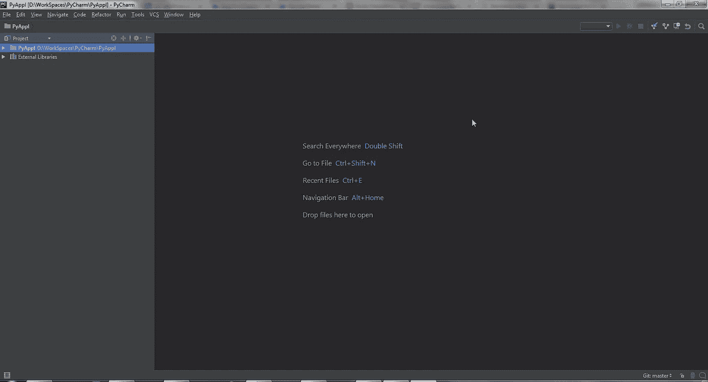
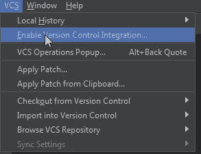

# 在 Oracle 云上开发和部署 Python 应用程序—第 1 部分

> 原文：<https://medium.com/oracledevs/develop-and-deploy-python-application-on-oracle-cloud-part-1-a4142d44a84e?source=collection_archive---------0----------------------->

**为 Oracle 开发者云服务配置 py charm**

这篇博客是使用开发者云服务在 Oracle Cloud 上开发和部署 Python 应用程序的系列文章中的第一篇。本博客将有助于理解如何使用 py charm(Python 代码开发最流行的 IDE 之一)和 Oracle Developer Cloud Service 来管理开发的应用程序的 DevOps 生命周期。

后续博客将重点关注 Python 应用程序的开发、使用开发人员云服务在 Oracle 云上构建和部署，以及使用 Grunt 和 PSM Cli 实现 DevOps 流程的自动化。

链接: [**第二部分**](/oracledevs/develop-and-deploy-python-application-on-oracle-cloud-part-2-fb4fa3ac5a80)**[**第三部分**](/oracledevs/develop-and-deploy-python-application-on-oracle-cloud-part-3-20ba46e221fc)**

****关于 PyCharm****

**PyCharm 是一个用于计算机编程的集成开发环境(IDE ),专门用于 Python 语言。它是由 JetBrains 开发的。它提供代码分析、图形调试器、集成单元测试器、与版本控制系统的集成，并支持使用各种 Python 框架进行 web 开发。
PyCharm 是跨平台的，有 Windows、MacOS、Linux 版本。社区版是在 Apache 许可下发布的。出于本博客的目的，我们将使用社区版 2017。请使用链接获取 PyCharm 的详细信息。**

****

**您可以根据自己的需要选择操作系统，从这个[链接](https://www.jetbrains.com/pycharm/download/#section=windows)下载 PyCharm 社区版。默认情况下，选择 windows。**

**启动 PyCharm IDE:**

****

**现在在 PyCharm IDE 中创建一个新项目，如下图所示。确保 Python 解释器在您机器上的位置是在 PyCharm 中预先设置的，如下面的第二个屏幕截图所示。否则，您必须为项目或 IDE 进行配置。出于这个博客的目的，我使用 Enthought Canopy Python 发行版，因为它已经预装在我的机器上。**

********

**现在是时候在 PyCharm IDE 和 Oracle Developer Cloud Service 之间建立连接了。要做到这一点，以下是先决条件:**

**1.拥有 Oracle 云帐户。**

**2.创建了一个关于 Oracle 开发人员云服务的项目。**

**3.在开发者云服务项目中创建了一个 Git 存储库。**

**4.Oracle Application Container Cloud Service(针对本系列即将发布的博客)。**

**注意:如果您拥有有效的 Oracle Cloud 帐户，那么将为您提供开发人员云服务作为一项权利。**

**下面的屏幕截图显示了 Oracle 开发者云服务项目和托管的 Git 存储库。我们将在 Python 博客系列中使用的 Git 存储库以红色突出显示。**

********

****PyCharm 开发者云服务配置****

**一旦你的项目被创建，进入 PyCharm IDE 菜单中的 VCS 标签。选择菜单项“启用版本控制集成”，如下图所示。**

****

**现在选择您想要集成的版本控制系统(VCS)。由于开发者云服务仅支持 Git 作为托管的 VCS，所以您必须在下拉列表中选择相同的内容，如下面的截图所示。然后单击“确定”。**

****

**一旦您将 VCS 集成启用为项目的 Git。你可以继续，右击项目，然后从菜单中选择“Git”。然后选择 Repository -> Remotes，添加 Developer Cloud Service 上托管的远程 Git 存储库。**

****

**一旦“Git Remotes”对话框出现。单击“+”按钮添加远程开发者云服务存储库。**

****

**您可以在“定义远程”对话框中保留名称作为原点，并给出可以从开发人员云服务上的 Git 存储库中检索的 URL。请参考博客中的截屏，它突出显示了将用于这个博客系列的存储库和显示的 YRL。作为项目的一部分，您可以复制您在开发人员云实例上创建的 Git 存储库的 URL。然后点击“确定”按钮提交。**

****

**完成后，它会要求您提供凭证来访问 Oracle Developer Cloud 上托管的 Git 存储库。这将是您用来访问开发人员云服务实例的 Oracle 云凭据。然后点击“确定”按钮提交。**

****

**完成后，将为您在 PyCharm 上的项目配置 Developer Cloud 上托管的远程 Git 存储库。这将使您能够从 Git 存储库中，从您最喜欢的 Python IDE——py charm——推送或提取代码。**

**请阅读我的第二篇 [**博客**](/oracledevs/develop-and-deploy-python-application-on-oracle-cloud-part-2-fb4fa3ac5a80) 中关于开发一个简单的 Python 应用程序以及如何在 Oracle Developer Cloud Service 上自动化构建的文章。**

**编码快乐！**

*** *本文表达的观点是我个人的观点，不一定代表甲骨文的观点**