# 在 Oracle 云上开发和部署 Python 应用程序—第 2 部分

> 原文：<https://medium.com/oracledevs/develop-and-deploy-python-application-on-oracle-cloud-part-2-fb4fa3ac5a80?source=collection_archive---------1----------------------->

**在 Oracle 开发者云服务上开发 Python 应用**

本博客是使用开发者云服务在 Oracle 云上开发和部署 Python 应用程序系列的第二篇。本博客将有助于理解如何将 PyCharm IDE 和 Oracle Developer Cloud Service 结合使用，以开发、管理和构建 Python 代码。它将有助于理解如何在 DevOps 生命周期中使用开发人员云和构建工具来自动化构建过程。

本系列的下一篇 [**博客**](/oracledevs/develop-and-deploy-python-application-on-oracle-cloud-part-3-20ba46e221fc) 将重点介绍使用 Oracle Cloud 的 Python 应用程序的自动化部署，该应用程序使用开发者云服务和 Oracle 应用程序容器云服务上的集成 PSM CLI。

**使用的技术堆栈**

**IDE:**Python 代码开发的 PyCharm

**DevOps 平台:甲骨文开发者云服务**

**构建工具:** Grunt 是用于生成部署工件的构建工具


**Python 项目**

首先，我们必须在 IDE 中创建项目。可以参考我之前的 [**博客**](/oracledevs/develop-and-deploy-python-application-on-oracle-cloud-part-1-a4142d44a84e) (系列第一篇)关于设置 PyCharm IDE 和创建新 Python 项目的内容。设置 PyCharm IDE 并将其配置到 Developer Cloud Service 上托管的 g it 存储库是实现本博客目标的先决条件。下面是在 PyCharm IDE 中显示项目的截图。

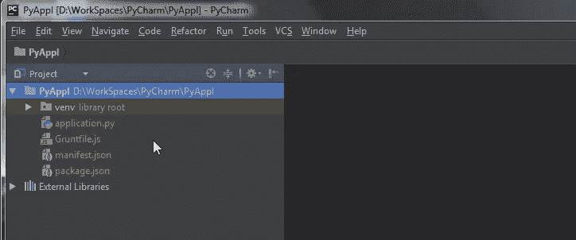

**Python 项目文件**

**application.py**

这是主应用程序文件，其中包含一个简单 Python web 应用程序代码的代码。它有一个 HTTP 请求处理程序。如果此代码在您的机器上执行，则可以使用端口 8084 访问它，而当部署在应用程序容器上时，只能通过端口 80 访问它。它有三个功能。第一个函数 do_HEAD 用于设置 HTTP 头。第二个函数 do_GET 形成 HTTP 响应，最后 run 函数让服务器运行来监听传入的请求。下面是上面讨论的函数的代码片段。

```
import os
 from http.server import BaseHTTPRequestHandler, HTTPServer

 PORT_NUMBER = int(os.environ.get('PORT', 8084))

 # HTTPRequestHandler class
 class testHTTPServer_RequestHandler(BaseHTTPRequestHandler):

     # GET
     def do_HEAD(self):
         # Send response status code
         self.send_response(200)
         self.send_header('Content-type', 'text/html')
         self.end_headers()
         return

     # GET
     def do_GET(self):
         # Send response status code
         self.send_response(200)

         # Send headers
         self.send_header('Content-type', 'text/html')
         self.end_headers()

         # Send message back to client
         message = "Welcome Python on Oracle Cloud"
         # Write content as utf-8 data
         self.wfile.write(bytes(message, "utf8"))
         return

 def run():
     print('starting server...')

     # Server settings
     # Choose port 8080, for port 80, which is normally used for a http server, you need root access
     server_address = ('0.0.0.0', PORT_NUMBER)
     httpd = HTTPServer(server_address, testHTTPServer_RequestHandler)
     print('running server...')
     httpd.serve_forever()

 run()
```

**manifest.json**

该文件对于在 Oracle 应用程序容器云服务上部署 Python 应用程序非常重要。在清单文件中，我们定义了执行代码所需的 Python 运行时版本，以及定义需要执行的“application.py”的命令。下面是清单 json 文件的代码片段。

```
{
   "runtime": {
     "majorVersion": "3.6.0"
   },
   "command": "python application.py",
   "notes": "Simple Python Application"
 }
```

**Gruntfile.js**

这个文件定义了构建任务，并被构建文件用来标识需要生成的部署工件类型，在本例中，它是一个 zip 文件，也是来自需要包含在构建工件中的项目的文件。对于 python 项目，我们只需要包含 application.py python 代码文件和 manifest.json 来部署应用程序容器。这些文件在 src 属性中定义，如下面的代码片段所示。

```
module.exports = function(grunt) {

   require('load-grunt-tasks')(grunt);

   grunt.initConfig({
     compress: {
       main: {
         options: {
           archive: 'pythonappl.zip',
           pretty: true
         },
         expand: true,
         cwd: './',
         src: ['application.py','./manifest.json'],
         dest: './'
       }
     }
   });

   grunt.registerTask('default', ['compress']);
 };
```

**package.json**

因为 Grunt 是基于 Nodejs 的构建工具，我们在这篇博客中使用它来构建和打包部署工件，我们需要包 json 文件来定义 Grunt 工具执行所需的依赖关系。

```
{

  "name": "PythonAppl",

  "version": "0.0.1",

  "private": **true**,

  "scripts": {

    "start": "python application.py"

  },

  "dependencies": {

    "grunt": "^0.4.5",

    "grunt-contrib-compress": "^1.3.0",

    "grunt-hook": "^0.3.1",

    "load-grunt-tasks": "^3.5.2"

  }

}
```

**将代码从 PyCharm 推送到 Git 仓库**

一旦代码被开发出来。是时候将代码从本地机器推送到开发者云服务上托管的 Git 存储库了。为此，我们将利用我们在之前的 [**博客**](/oracledevs/develop-and-deploy-python-application-on-oracle-cloud-part-1-a4142d44a84e) 中为开发人员云托管的 Git 库在 PyCharm IDE 上的 CVS 配置。

要提交代码并将其推送到 Developer Cloud Git 存储库，请在 IDE 中右键单击 PyAppl 项目，然后从菜单中选择 Git -> Commit Directory。

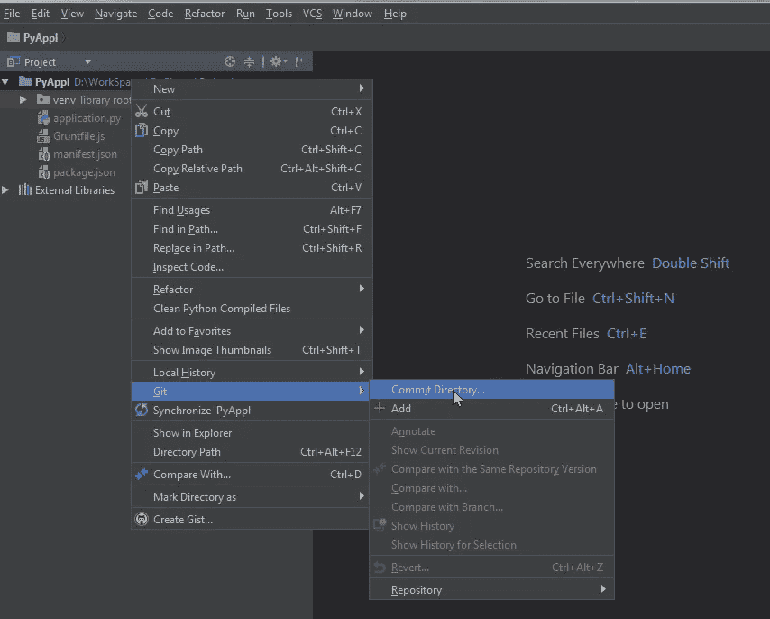

在“提交更改”对话框中，选择要提交的文件。对于博客，我们将只提交和推送四个文件 application.py、manifest.json、package.json、Gruntfile.js。另外，输入提交消息，如下面的屏幕截图所示。

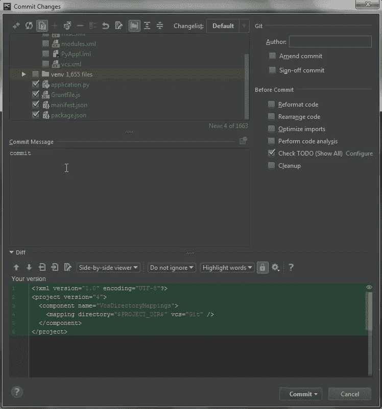

现在，单击 Commit 按钮并选择 Commit 和 Push，以提交本地 Git 存储库中的代码，并将其推送到开发者云服务上托管的 Git 存储库。

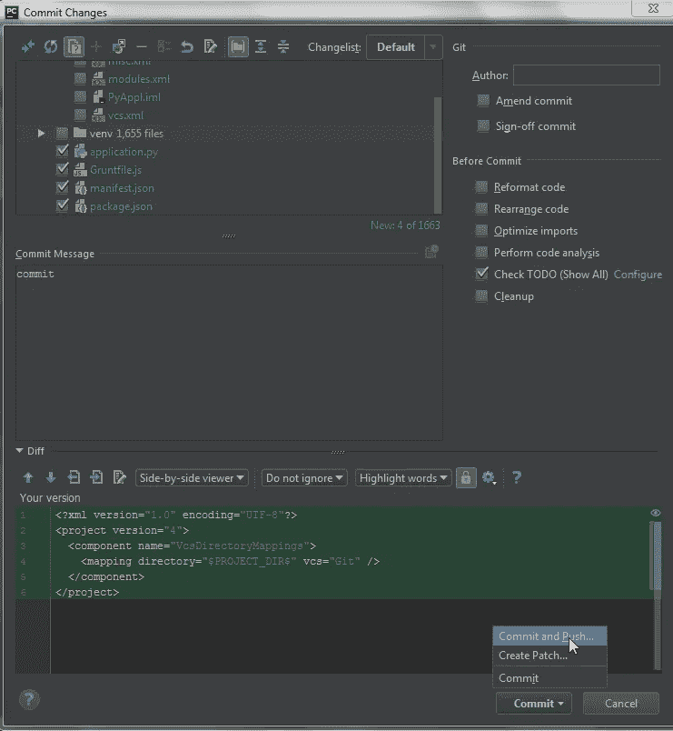

现在验证您想要提交和推送的分支。然后点击“推送”按钮，并从菜单中选择“推送”。

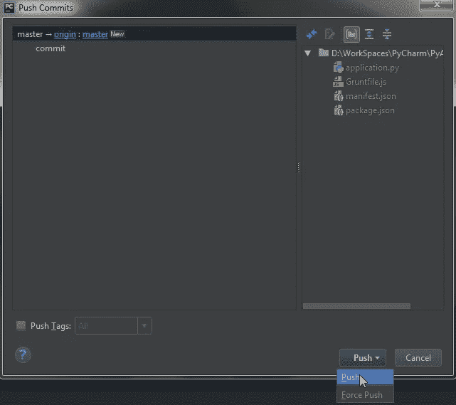

这将把代码推送到开发者云服务，在那里您可以转到您已经创建的项目和 Git 存储库来查看代码的推送，如下面的屏幕截图所示。

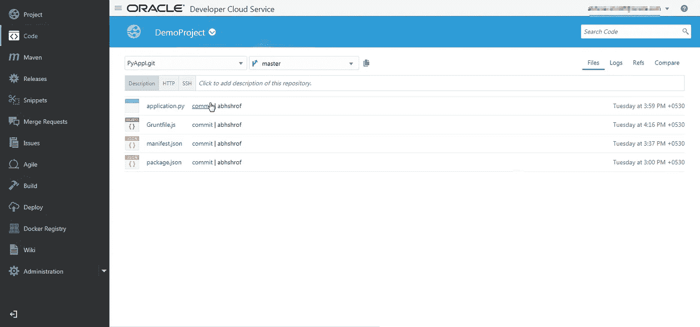

**在开发人员云上构建作业配置**

下面是将构建和部署 Python 应用程序的“PythonBuild”的构建作业配置屏幕截图:

为构建作业选择一个名称。对于这个博客，我将其命名为“PythonBuild”。由于这是一个 Python 应用程序，您可以将 JDK 保留为默认值。

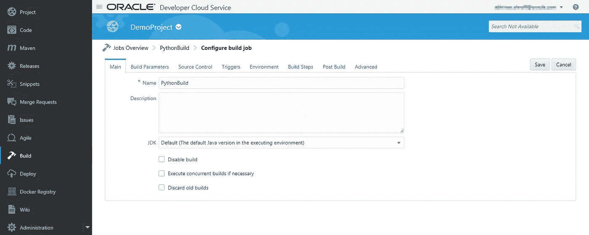

选择 Python 应用程序代码已上传到的存储库。它将包含博客前面描述的所有四个代码文件。

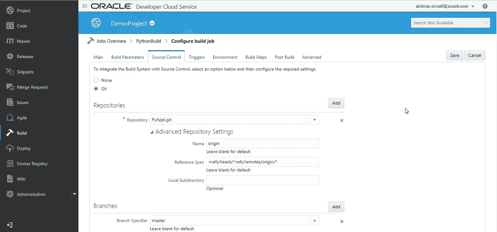

这里我们将 SCM 轮询设置为触发器，如下面的屏幕截图所示。这确保了每次我们将代码上传到 Git 存储库时，都会触发‘python build’，

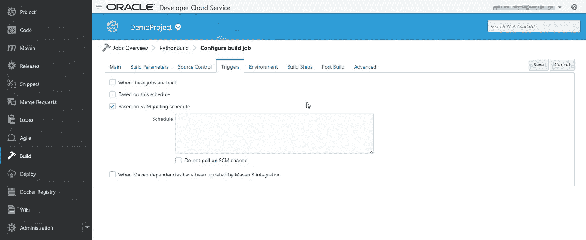

因为我们将使用 Grunt 来构建部署工件，并且 Grunt 是一个基于 Nodejs 的工具，所以我们必须配置 Nodejs 版本来使它工作。配置 Nodejs 版本，如下图所示。

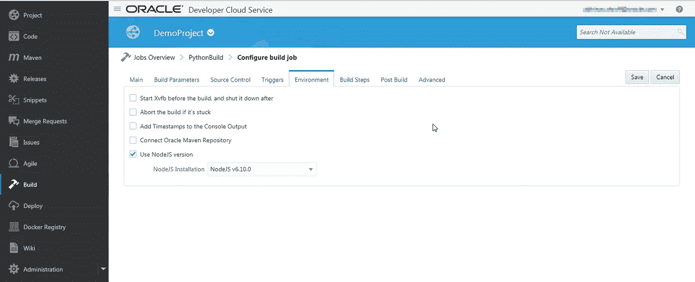

我们将使用执行 shell 构建步骤。作为构建步骤的一部分，我们将使用 npm install 来安装所有需要的 Nodejs 模块，如下图所示。然后使用“grunt”命令为部署构建 zip 存档。

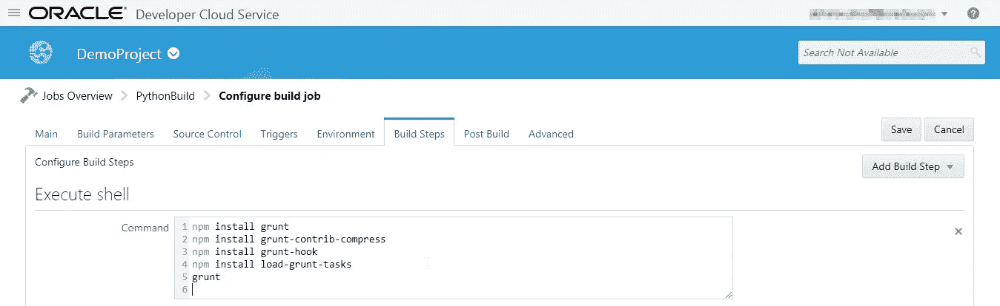

在 post build 选项卡中，配置通过执行 grunt 构建脚本生成的 zip 文件的归档。

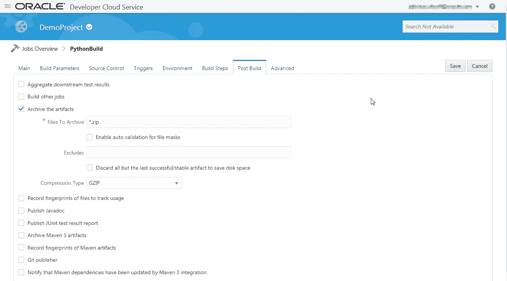

现在，您已经准备好在 Oracle 应用程序容器云服务上部署 Python 应用程序代码了。我们将在开发人员云服务上使用 PSM CLI 集成来实现自动化。阅读第三篇也是最后一篇 [**博客**](/oracledevs/develop-and-deploy-python-application-on-oracle-cloud-part-3-20ba46e221fc) ，了解如何使用开发者云服务为您的 Python web 应用实现部署自动化。

编码快乐！

* *本文表达的观点是我个人的观点，不一定代表甲骨文的观点