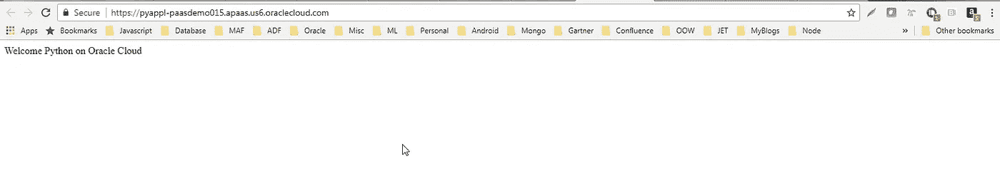

# 在 Oracle 云上开发和部署 Python 应用程序—第 3 部分

> 原文：<https://medium.com/oracledevs/develop-and-deploy-python-application-on-oracle-cloud-part-3-20ba46e221fc?source=collection_archive---------2----------------------->

**使用开发人员云实现部署自动化**

本博客是使用开发者云服务在 Oracle 云上开发和部署 Python 应用程序系列的第三篇也是最后一篇。这篇博客将有助于理解如何使用 Oracle Developer Cloud Service 上的 **PSM CLI** 在应用程序容器云上自动部署 Python 应用程序。

请阅读前面两篇关于在 Oracle Cloud 上开发和部署 python 应用程序的博客，这将帮助您使用 PyCharm python IDE、Developer Cloud 设置开发环境，在 Developer Cloud Service 上开发和构建 Python 代码。以下是供您参考的链接:

[**在 Oracle 云上开发部署 Python 应用—第一部分**](/oracledevs/develop-and-deploy-python-application-on-oracle-cloud-part-1-a4142d44a84e)

[**在 Oracle 云上开发和部署 Python 应用—第二部分**](/oracledevs/develop-and-deploy-python-application-on-oracle-cloud-part-2-fb4fa3ac5a80)

**添加到部署自动化的构建作业中**

在我们在之前的 [**博客**](/oracledevs/develop-and-deploy-python-application-on-oracle-cloud-part-2-fb4fa3ac5a80) 中创建的“PythonBuild”作业中，转到构建步骤选项卡中的“添加构建步骤”下拉菜单，并选择调用 PSMcli，如下图所示。

在从下拉列表中选择“Invoke PSMcli”构建步骤时，会添加构建步骤，如下面的屏幕截图所示。在这里，您必须输入能够访问 Oracle 应用程序容器云实例的用户的用户名和密码。您还必须为应用程序容器云实例提供身份域，以及提供它的数据中心区域。完成后，您可以选择 PSM 命令的输出格式。您可以选择 JSON 或 HTML。这个构建步骤将帮助您为构建设置 PSM CLI，并使用实例验证您的身份，使您能够执行 PSM 命令。现在，您可以在执行 shell 构建步骤中执行 PSM 命令，如屏幕截图所示。下面是我们使用的 PSM 命令。

**PSM accs push-n py appl-s monthly-r python-e docker hub-p python appl . zip**

我们将执行上面的 PSM 命令 post 执行 grunt 构建，如屏幕截图所示。因为 PSM 命令将使用 grunt build 创建的 zip 文件在应用程序容器云上部署 Python 应用程序。

以下是 PSM 命令参数的描述:

Psm accs push:用于在应用程序容器云上创建应用程序。

**-n:** 您希望在应用程序容器上使用的应用程序显示名称。

**-s:** 这是基于您选择的订阅类型的订阅类型(每月/每小时)。

**-r:** 运行时，在这种情况下将是 python。(它有其他选项，如 Java、Node 等)

**-e:** 这是针对仓库的。我们将使用来自 dockerhub 的 Python 容器。

就在 PSM 命令执行之前，由构建作业执行中的 grunt 构建的包名。

一旦命令被执行，您就可以登录到应用程序容器云服务控制台来查看列出的 PyAppl。

您还可以通过单击“PyAppl”来查看应用程序实例的详细信息，py appl 是指向详细信息用户界面的链接。

现在要查看应用程序的运行情况，请使用 PyAppl 清单中提到的 URL。下面是显示浏览器中应用程序响应的屏幕截图。

您可以使用其他 ACCS PSM 命令来帮助自动化您的 DevOps 生命周期。以下是其中的一些:

**psm accs delete** —删除一个应用程序

**psm accs scale** —扩展部署在应用容器云上的应用

**psm accs start** —启动部署在应用程序容器云上的应用程序

**psm accs stop** —停止部署在应用程序容器云上的应用程序

**psm accs check-health** —检查应用程序的健康状况。这在自动化测试脚本执行时可能会很方便。

有关应用程序容器云服务 PSM 命令的更多详细信息，请使用以下链接。

[https://docs . Oracle . com/en/cloud/PAAs/Java-cloud/PS CLI/accs-commands . html](https://docs.oracle.com/en/cloud/paas/java-cloud/pscli/accs-commands.html)

编码快乐！

* *本文表达的观点是我个人的观点，不一定代表甲骨文的观点