# 在 Oracle 云上开发和部署基于 Cassandra 的应用程序

> 原文：<https://medium.com/oracledevs/develop-deploy-a-cassandra-based-application-on-oracle-cloud-ca3d9d124bf6?source=collection_archive---------0----------------------->

> **请注意**:Oracle Cloud 以 Oracle 数据中心云的形式提供一流的 Cassandra 服务— [更多详情请点击此处](/oracledevs/getting-started-with-cassandra-using-oracle-data-hub-cloud-550889f4126e)

这个博客将展示如何构建和 CI/CD 一个使用 Cassandra 进行存储的 Java 应用程序。它将侧重于以下领域

*   如何**在 [Oracle 计算云](https://cloud.oracle.com/en_US/compute)上设置** Apache Cassandra 以及应用概述
*   **使用 [Oracle 开发人员云](https://cloud.oracle.com/en_US/developer-service)将** : CI/CD 部署到 [Oracle 应用程序容器云](https://cloud.oracle.com/en_US/application-container-cloud)
*   **安全配置**:安全通道 b/w 您的应用程序和 Cassandra

# 你好卡珊德拉

Apache Cassandra 是一个开源的 NoSQL 数据库。它是用 Java 编写的，(最初)是在脸书开发的，它的设计是基于/受亚马逊的 Dynamo 和谷歌的 Bigtable 的启发。它的一些显著特点如下

*   属于**面向行的**家族(NoSQL 数据库)
*   分布式、分散且可弹性扩展
*   高可用性和容错性
*   支持**可调**一致性**可调**

你可以在这里阅读更多关于卡珊德拉的信息

# 关于示例应用程序

*   示例应用程序公开了 REST 端点——使用`Jersey` (JAX-RS)实现
*   `Employee` —作为域对象。您需要引导所需的表
*   [data tax Java 驱动](https://github.com/datastax/java-driver)用于与 Cassandra 交互
*   利用卡珊德拉`object mapper`进行 CRUD 操作

[这里有](https://github.com/abhirockzz/accs-cassandra)

# 锁定卡桑德拉的入口

目标是允许从我们的应用程序独占访问 Cassandra，而不将它的端口(例如 9042)暴露给公共互联网。

Oracle 应用容器云通过与 Oracle 计算云协同工作来实现这一点

*   当您部署应用程序时，Oracle 计算云中会自动生成一个**安全 IP 列表**(特定于该应用程序)
*   然后可以将该 IP 列表添加到 Oracle 计算云服务(即 Cassandra 实例)中虚拟机(VM)的**安全规则**中。这允许您的应用程序和 VM 进行通信。

设置细节将在下一节讨论。请参考甲骨文计算云[文档](http://docs.oracle.com/en/cloud/iaas/compute-iaas-cloud/stcsg/configuring-shared-network.html)了解详细信息

# 在 Oracle 计算云上安装 Cassandra

## 快速开始使用 Bitnami

我们将通过 [Oracle 云市场](https://cloudmarketplace.oracle.com/marketplace/en_US/homeLinkPage)使用来自 Bitnami 的预配置 [Cassandra 图像](https://cloudmarketplace.oracle.com/marketplace/en_US/listing/6371241)

*   登录您的 Oracle 云计算仪表板，
*   选择**创建实例**向导，然后
*   从**市场**选项卡中选择所需的机器图像

更多[详情点击此处](http://docs.oracle.com/en/cloud/iaas/compute-iaas-cloud/stcsg/creating-instance-instances-page.html)

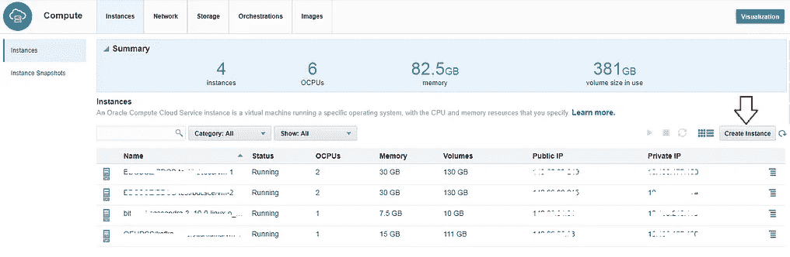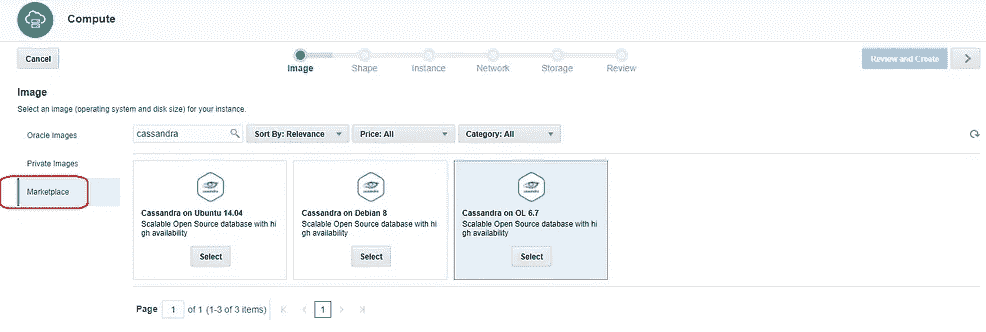

## 激活 SSH 访问

我们现在需要允许 SSH 连接到 Oracle 计算云上的 Cassandra 虚拟机

***创建安全规则***

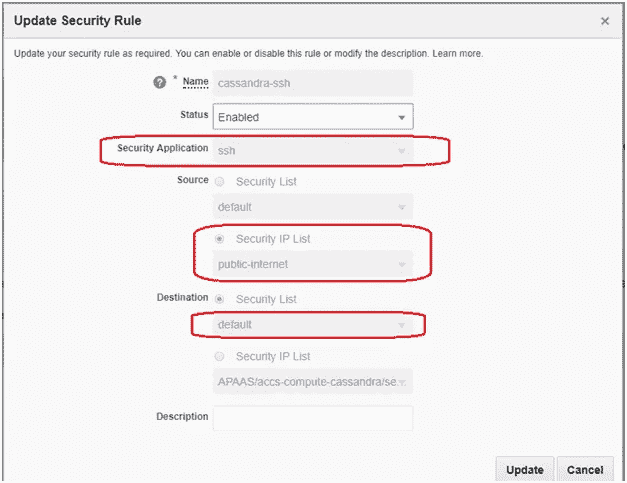

完成后，您应该会在列表中看到它


***SSH 进入虚拟机***

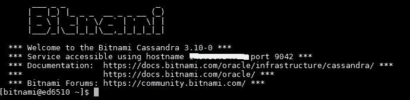

## 重置密码

您需要根据本文档[https://docs . bitnami . com/Oracle/infra structure/Cassandra/# how-to-reset-the-Cassandra-administrator-password](https://docs.bitnami.com/oracle/infrastructure/cassandra/#how-to-reset-the-cassandra-administrator-password)重置 Cassandra 密码。完成后，使用新凭据登录

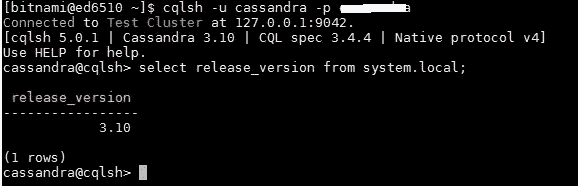

# Oracle 开发人员云:设置和应用程序部署

您需要为*持续构建*以及*部署*流程配置 Oracle 开发人员云。您可以参考以前的博客(这里将重点介绍这个例子的一些细节)

**参考文献**

*   在 Oracle 开发者云中引导应用程序— [项目&代码库创建](https://community.oracle.com/community/cloud_computing/oracle-cloud-developer-solutions/blog/2017/05/25/getting-started-with-kafka-based-microservices-using-oracle-event-hub-cloud-application-container-cloud-developer-cloud#jive_content_id_Project__code_repository_creation)
*   持续集成设置— [配置构建作业](https://community.oracle.com/community/cloud_computing/oracle-cloud-developer-solutions/blog/2017/05/25/getting-started-with-kafka-based-microservices-using-oracle-event-hub-cloud-application-container-cloud-developer-cloud#jive_content_id_Configure_build_job)
*   部署设置— [持续部署(CD)到应用容器云](https://community.oracle.com/community/cloud_computing/oracle-cloud-developer-solutions/blog/2017/05/25/getting-started-with-kafka-based-microservices-using-oracle-event-hub-cloud-application-container-cloud-developer-cloud#jive_content_id_Continuous_Deployment_CD_to_Application_Container_Cloud)

## 提供 Oracle 应用程序容器云(配置)描述符

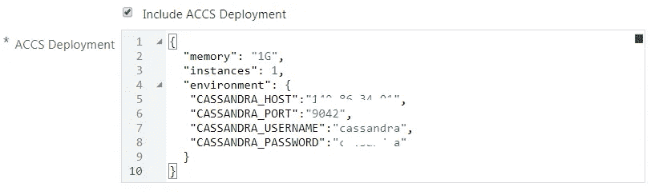

## 查看 Oracle 应用容器云上的应用详细信息

***部署应用***


***环境变量***

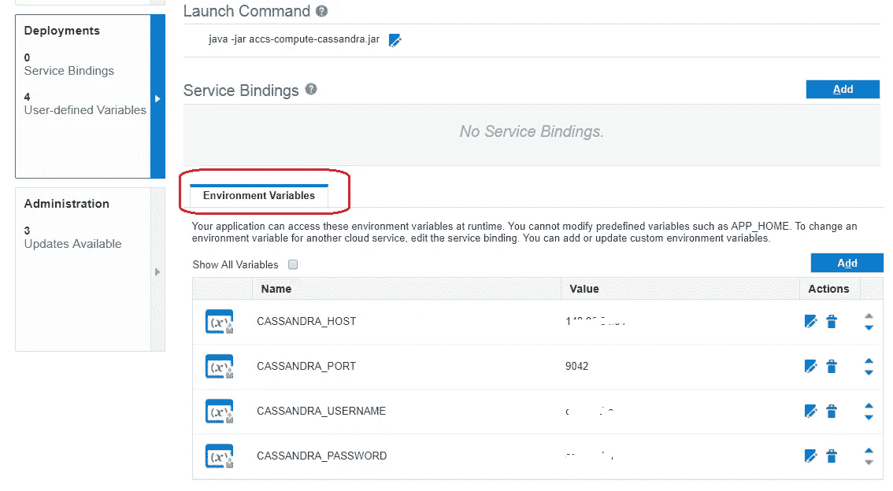

## 检查安全 IP 列表

成功部署后，您将能够在 Oracle 应用程序容器云中看到应用程序以及安全 IP 列表信息

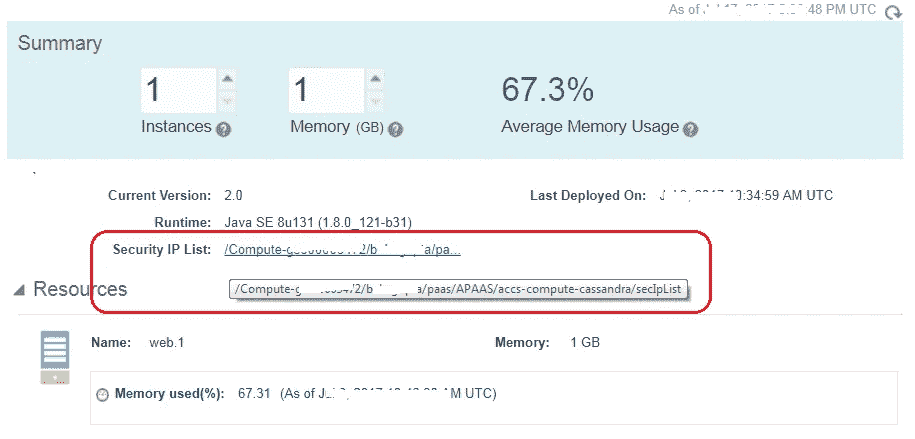

> 请注意，由于您的应用程序和 Cassandra 之间的安全通信通道尚未建立，您现在**将无法**访问/测试应用程序。下一节将介绍细节

# Oracle 计算云安全配置

## 确认安全 IP 列表

您将看到在 Oracle Application Container cloud 上部署应用程序时创建的安全 IP 列表(如上所述)。它确保部署在 Oracle 应用容器云上的应用的 IP 被**列入白名单**，以便访问我们在 Oracle 计算云上的 Cassandra 虚拟机

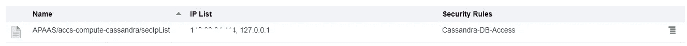

## 创建安全应用程序

这表示您正在保护的组件及其访问类型和端口号，在本例中分别是其`TCP` 和`9042`

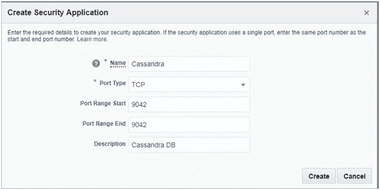

## 创建安全性规则

**默认**安全列表由 Oracle 计算云创建(在配置 Bitnami 映像之后)


我们将创建一个**安全规则**来使用安全 IP 列表、安全应用程序和安全列表

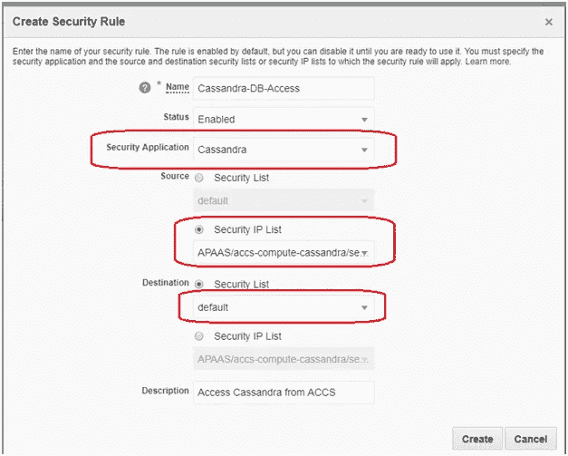

您应该会在规则列表中看到它


# 测试应用程序

## 引导密钥空间和表

示例应用程序使用了**测试**键空间和一个名为**雇员**的表——您需要在 Cassandra 实例中创建这些实体

```
CREATE KEYSPACE test WITH REPLICATION = {‘class’ : ‘SimpleStrategy’,‘replication_factor’ : 1};CREATE TABLE test.employee (emp_id uuid PRIMARY KEY, name text);
```

## 访问 REST 端点

**创造几个员工**

```
curl -X POST <ACCS_APP_URL>/employees -d abhishek // 'abhishek' is the name curl -X POST <ACCS_APP_URL>/employees -d john // 'john' is the name
```

*   您将收到 **HTTP 201** (已创建)的响应
*   **位置**(响应)标题将具有新创建的员工记录的(剩余)坐标(URI)——用于搜索(下一步)

**寻找新员工**

```
curl -X GET <ACCS_APP_URL>/employees/<emp_id>
```

您将收到一个包含员工 ID 和姓名的 XML 有效负载

```
<?xml version="1.0" encoding="UTF-8" standalone="yes"?> <employee>     <empId>18df5fd1-88d8-4820-984e-3cf0293c3051</empId>     <name>test1</name> </employee>
```

**搜索所有员工**

```
curl -X GET <ACCS_APP_URL>/employees/
```

您将收到一个包含员工信息的 XML 有效负载

```
<?xml version=”1.0" encoding=”UTF-8" standalone=”yes”?>
<employees>
 <employee>
 <empId>8a841167–6aaf-428f-bc2b-02269f04ce93</empId>
 <name>abhirockzz</name>
 </employee>
 <employee>
 <empId>2e2cfb3c-1530–4099-b6e9-a550f11b25de</empId>
 <name>test2</name>
 </employee>
 <employee>
 <empId>18df5fd1–88d8–4820–984e-3cf0293c3051</empId>
 <name>test1</name>
 </employee>
 <employee>
 <empId>2513a12d-5fc7–4bc6–9f94-d13cea23fe7a</empId>
 <name>abhishek</name>
 </employee>
</employees>
```

# 测试 CI/CD 流

做一些代码修改，推送给开发者云服务 Git repo。这应该

*   自动触发构建，一旦成功将
*   自动触发部署流程，以及
*   将新的应用程序版本重新部署到应用程序容器云

# 不要忘记…

*   查看 Oracle 应用容器云的教程[——每个运行时都有一些内容！](https://docs.oracle.com/en/cloud/paas/app-container-cloud/create-first-applications.html)
*   [其他关于应用容器云的博客](http://bit.ly/2gR3nrV)

> 本文表达的观点是我个人的观点，不一定代表甲骨文的观点。