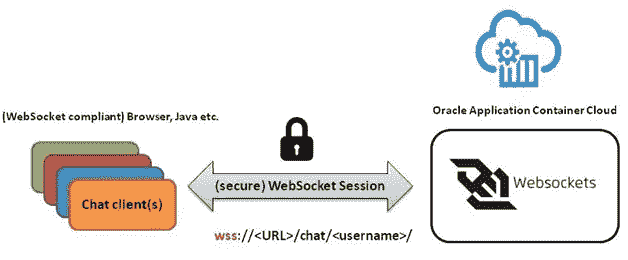
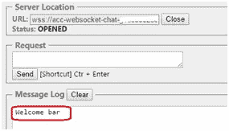

# 在 Oracle Cloud 上使用 Java EE 开发和部署基于 WebSocket 的聊天应用程序

> 原文：<https://medium.com/oracledevs/develop-deploy-a-websocket-based-chat-application-using-oracle-cloud-3df9034582d5?source=collection_archive---------0----------------------->

这篇博客将展示如何构建和运行基于 WebSocket 的微服务。以下是博客将涵盖的高层次内容

*   **概述**web socket 和示例 Java 应用程序
*   **持续集成**设置:从 IDE 中的源代码到[开发者云服务中的构建工件](https://cloud.oracle.com/en_US/developer-service)
*   **持续部署**设置:从开发者云服务中的构建工件到运行在[应用容器云中的应用](http://cloud.oracle.com/acc)
*   **测试**应用程序

# 概观

## WebSocket:标准

WebSocket 是由 RFC 6455 认可的 IETF 标准，具有以下关键特性，非常适合实时应用

*   **双向**:服务器和客户端都可以发起通信
*   **全双工**:一旦 WebSocket 会话建立，服务器和客户端就可以相互独立地进行通信
*   **不太冗长**(与 HTTP 相比)

对该协议的深入研究超出了本博客的范围。请参考 RFC 了解更多详情

## Java Websocket API

这项技术的标准 Java 等价物(API)由 JSR 356 T21 定义。它由一个规范支持，该规范使得相同的实现可以有多种实现。JSR 356 也包含在 [Java 企业版 7 (Java EE 7)平台](https://www.jcp.org/en/jsr/detail?id=342)中。这包括该 API 的预打包(默认)实现，以及与其他 Java EE 技术的集成，如 EJB、CDI 等。

## 泰勒斯

Tyrus 是 Java Websocket API 的参考实现。它是默认实现，与 Weblogic 12.2.1(及更高版本)和 Glassfish (4.x)等 Java EE 7 容器打包在一起。它为构建 web 套接字应用程序提供了服务器端和客户端 API。

## Tyrus grizzly 模块

Tyrus 具有模块化架构，即它具有用于服务器、客户端实施、SPI 等的不同模块。它支持特定运行时支持的容器概念(您可以将它们视为连接器)(这些构建于模块化设置之上)。Grizzly 是受支持的容器之一，可以根据您的需求用于服务器或客户机(或两者)模式(示例应用程序利用了这一点)

# 关于示例应用程序

该示例是一个**聊天应用程序**——web sockets 的一个典型用例(这绝不是一个成熟的聊天服务)。用户可以

*   加入聊天室(不允许重复用户名)
*   获得关于新用户加入的通知
*   发送公共消息
*   发送私人消息
*   离开聊天室(其他用户会收到通知)

应用程序非常简单

*   它有一个**服务器端**组件，这是一个部署到应用程序容器云的基于(胖)JAR 的 Java 应用程序
*   **客户端**可以是任何支持 WebSocket API 的组件，例如您的浏览器。单元测试使用 Tyrus 的 **Java 客户端 API** 实现



# 密码

下面是各种类及其角色的总结

*   `ChatServer`:包含应用的核心业务逻辑
*   `WebSocketServerManager`:管理 WebSocket 容器的引导和关闭过程
*   `Bootstrap`:管理 WebSocket 容器的引导和关闭过程
*   `ChatMessage`、`DuplicateUserNotification`、`LogOutNotification`、— `NewJoineeNotification`、`Reply`、`WelcomeMessage`:简单的 POJOs 来建模应用级实体(域对象)
*   `ChatMessageDecoder`:将用户发送的聊天信息转换成 Java(域)对象的解码器，可以在应用程序中使用
*   `DuplicateUserMessageEncoder`、`LogOutMessageEncoder`、`NewJoineeMessageEncoder`、`ReplyEncoder`、`WelcomeMessageEncoder`:将 Java(域)对象转换成本地(文本)有效负载的编码器，这些有效负载可以使用 WebSocket 协议通过网络发送

下面是 WebSocket 端点实现

# 设置持续集成和部署

以下部分讨论了在 Oracle 开发人员云服务中进行的配置

## 项目和代码库创建

请参考开发者云服务博客中[跟踪 JUnit 测试结果的**项目&代码库创建**部分，或者查看产品](https://community.oracle.com/community/cloud_computing/oracle-cloud-developer-solutions/blog/2016/10/05/junit-testing-using-oracle-developer-cloud)[文档](http://docs.oracle.com/cloud/latest/devcs_common/CSDCS/GUID-3317B279-A9C0-4566-A289-BD651A89D7B5.htm#GUID-7B30C8EC-6CDA-4F14-9791-8AE3BB3E8343)了解更多详情

## 在 Git 存储库中配置源代码

[将项目](http://docs.oracle.com/cloud/latest/devcs_common/CSDCS/GUID-B4C03296-8497-4356-8C74-2031D1FB96FC.htm#CSDCS-GUID-A33E83CE-845C-4393-8C93-936527033715)从您的本地系统推送到您刚刚创建的开发人员云 Git repo。我们将通过命令行来完成，您所需要的就是在您的本地机器上安装 Git 客户端。你可以使用 Git 或者任何你选择的工具

```
cd <project_folder> git init git remote add origin <developer_cloud_git_repo>  
//e.g. [https://john.doe@developer.us.oraclecloud.com/developer007-foodomain/s/developer007-foodomain-project_2009/scm/acc-websocket-sample.git//john.doe@developer.us.oraclecloud.com/developer007-foodomain/s/developer007-foodomain-project_2009/scm/acc-websocket-sample.git](https://john.doe@developer.us.oraclecloud.com/developer007-foodomain/s/developer007-foodomain-project_2009/scm/acc-websocket-sample.git//john.doe@developer.us.oraclecloud.com/developer007-foodomain/s/developer007-foodomain-project_2009/scm/acc-websocket-sample.git) git add . git commit -m "first commit" git push -u origin master  //Please enter the password for your Oracle Developer Cloud account when prompted
```

## 配置版本

创建一个**新工作**


选择 **JDK**


## 持续集成

选择 **Git 回购**


设置构建触发器—该构建作业将被触发，以响应 Git 存储库中的更新(例如，通过 **git 推送**)


添加 **Maven** 构建步骤


激活以下生成后操作

*   **存档**Maven 工件(包含可部署的 zip 文件)
*   发布**JUnit**测试 结果报告


## 执行构建并检查 JUnit 测试结果

在配置部署之前，我们需要触发构建，以便产生可以被部署配置引用的工件


构建完成后，您可以

*   检查构建日志
*   检查 JUnit 测试结果
*   确认存档的 Maven 工件


**测试结果**


**构建日志**


# 持续部署(CD)到应用容器云

为部署创建一个**新配置**


输入所需的详细信息并配置**部署目标**

配置**应用程序容器云**实例


在最终确认页面上配置**自动**展开选项


确认屏幕


# 测试 CI/CD 流

做一些代码修改，推送给开发者云服务 Git repo。这应该

*   自动触发**构建**，一旦成功将
*   自动触发**部署**流程


检查应用程序容器云中的应用程序


# 试验

对于这个例子，您需要一个 WebSocket 客户机。我个人会推荐使用可以作为插件安装到 Chrome 浏览器中的客户端——[简单 WebSocket 客户端](https://chrome.google.com/webstore/detail/simple-websocket-client/pfdhoblngboilpfeibdedpjgfnlcodoo?hl=en)。请参见下面的快照，了解此客户端的一般使用模板


以下是 WebSocket 端点的 URL 模板

```
wss://<acc-app-url>/chat/<user-handle>/ e.g. wss://acc-websocket-chat-domain007.apaas.em2.oraclecloud.com/chat/abhi/
```

# 考试成绩单

下面是一系列事件，您可以执行这些事件来进行测试

*用户* ***foo*** *和* ***酒吧*** *加入聊天室*

```
wss://acc-websocket-chat-domain007.apaas.em2.oraclecloud.com/chat/foo/ wss://acc-websocket-chat-domain007.apaas.em2.oraclecloud.com/chat/bar/
```



***foo*** *中计* ***通报*** *关于* ***栏***


*用户* ***约翰*** *加入*

```
wss://acc-websocket-chat-domain007.apaas.em2.oraclecloud.com/chat/john/
```


**和* ***栏*** *都是* ***通知****

****

****foo*******发送*** *消息给大家(* ***公开*** *)***

****

***双方* ***栏*** *和* ***约翰*** *得到消息***

********

*****栏*** *发送一条* ***私有*** *消息给* ***foo*****

****

*****只有 foo*** *能搞定***

****

***与此同时，* ***约翰*** *厌倦了，决定* ***离开*** *聊天室***

****

*******foo****和* ***栏*** *获取* ***通知*******

********

**那都是乡亲们！**

> **本文表达的观点是我个人的观点，不一定代表甲骨文的观点。**