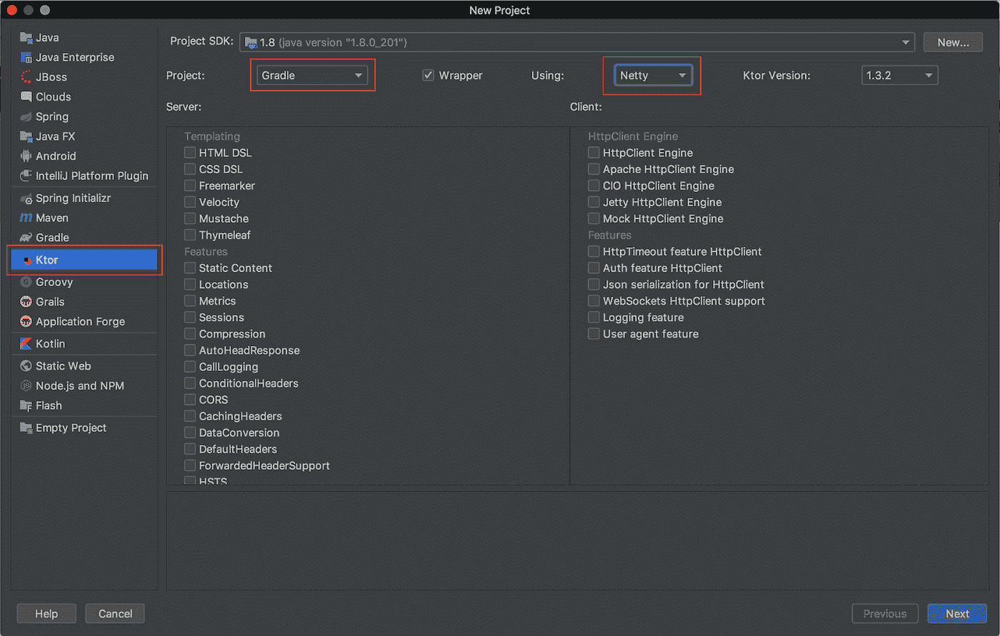
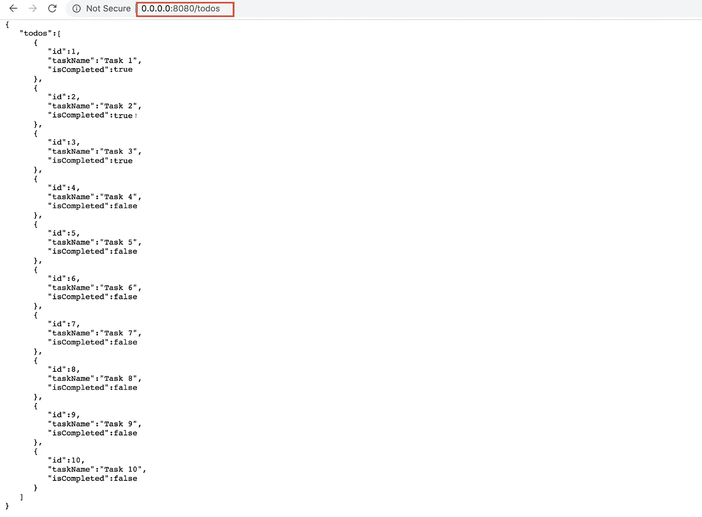
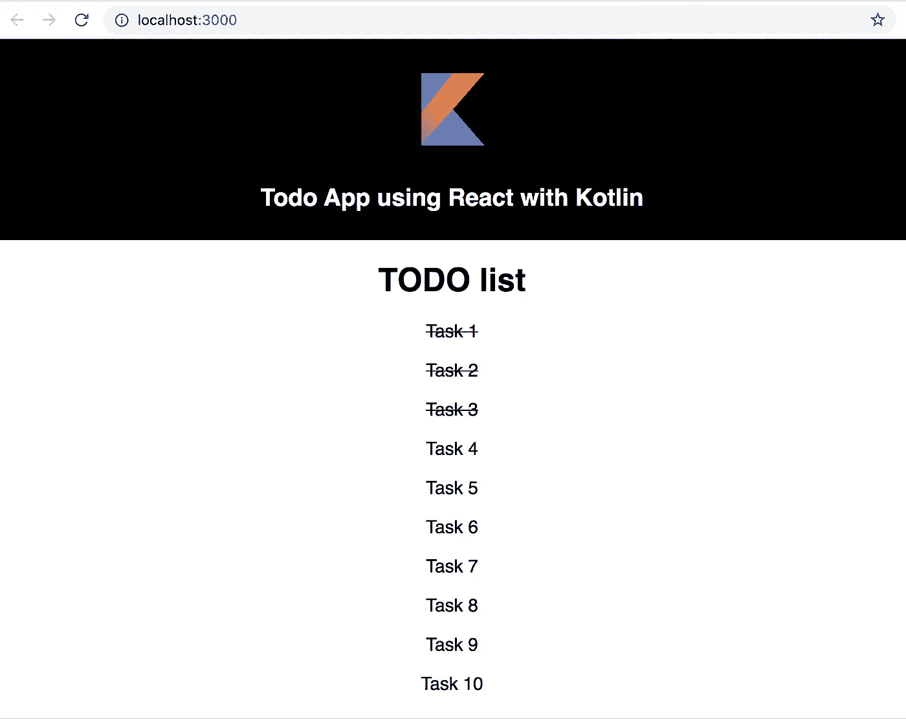

# 使用 Kotlin 开发全栈应用

> 原文：<https://medium.com/globant/develop-full-stack-app-using-kotlin-f3c1bb9db440?source=collection_archive---------1----------------------->

作为软件开发人员，我们大多数人都梦想成为全栈开发人员，这样我们就可以开发前端、后端和移动应用程序。但是开发这样的应用程序需要学习不同的语言和各种工具，比如后端开发用 Java，前端开发用 JavaScript 等等。

如果我们只学习一种语言，但仍然可以在多种平台上开发应用程序，会怎么样？这个的答案是**科特林！**

我是一名 Android 开发人员，所以我知道如何使用 Kotlin 来开发 Android 应用程序。我开始试验和探索如何将我所拥有的 Kotlin 知识用于开发 Web 前端或后端代码。

因此，在这篇博客中，我将描述我是如何建立的:

1.  使用 Ktor 的后端应用程序，它提供一个 get API 来获取待办事项列表
2.  使用 KotlinJs 的 Web 应用程序，它使用这个 API 并显示待办事项列表

让我们从第一部分开始-

# **1。使用 Ktor 的后端服务**

为了开发这个项目，我们将使用由 Jetbrains 和 [Ktor](https://ktor.io/) 框架构建的 IntelliJ IDE。

Ktor 是一个流行的基于 Kotlin 的框架，用于构建异步服务器和客户端。

我们 Ktor 项目的范围是开发一个 GET API，它将以 JSON 格式返回给我们一个预定义的 Todos 列表。

**1。** **创建 Ktor 项目**

要创建一个 Ktor 项目，我们需要安装 **Ktor** 插件。一旦插件安装完毕，我们需要在“创建新项目”向导中选择 Ktor。

New project wizard

**2。定义路线**

使用默认设置创建项目。项目创建成功后，打开 **Application.kt** 文件，添加以下代码:

如果我们仔细观察上面的代码，我们使用的是 Kotlin 的强大功能之一，即高阶函数。**高阶函数**是以函数为参数或返回函数的函数。

在上面的代码片段中，我们定义了一个路由，客户端将使用它来获取 Todo 列表。这是一个 GET API。

当我们运行这个应用程序时，它会为我们生成一个 URL，如 [http://0.0.0.0:8080](http://0.0.0.0:8080/todos) ，我们可以使用这个基本 URL 访问任何 API。

现在，如果我们点击 http://0 . 0 . 0 . 0:8080/todosAPI，它会搜索路由，一旦找到匹配的路由，就会返回一个适当的响应，在我们的例子中，它是一个待办事项列表。

总结一下，到目前为止我们所做的，

1.  安装 Ktor 插件并创建新的 Ktor 项目
2.  定义了提取待办事项列表的路线
3.  运行应用程序并使用 localhost 获取 Todo 列表

现在，我们的服务器已经准备好了，让我们进入第二步，使用 KotlinJs 来构建 web 应用程序，以使用上面创建的 API。

# 2.使用 Kotlin-JS 的 Web 应用程序

为了开发我们的前端应用程序，我们将使用由 Jetbrains 和 Kotlin+JS 构建的 IntelliJ IDE。

**1。创建一个项目**

我们可以使用一个简单的命令创建一个项目:**yarn create react-kot Lin-app todofrontend**

它将为我们创建一个带有样板代码的项目，您可以使用 **yarn start** 命令运行该项目。

我们将保留使用上述命令创建的所有文件，只更改那些需要的文件。

**2。index.kt —入口点**

这个文件将组件的整个层次结构注入到 DOM 的根 div 中，如上所示。除此之外，它还需要根级别的应用程序的整个 CSS。

现在让我们来探索 App.kt

**3。App.kt**

App.kt 文件是一个父组件，由 div、h1 和一个子组件 TodoList 组成，它将为我们获取并显示 Todo 的列表。

让我们看看 TodoList 组件。

**4。TodoList.kt**

**4.1 创建一个 TodoList 组件**

该组件负责从 API 获取待办事项列表，并将其呈现在 UI 上。

这里道具和状态的概念非常类似于 React。这里有两种状态:

1.  实际待办事项列表
2.  出现任何错误时显示的消息

两者都可以为空，即它们可以在任何时间点保存空值。[零安全](https://kotlinlang.org/docs/reference/null-safety.html)是 Kotlin 最常用的功能之一。

**4.2 UI 渲染**

每个组件都有一个 render 方法来显示它的 UI。

上面的代码片段检查状态中的 todo 列表是否为 not null，然后它将遍历它并在 UI 上呈现它。如果 todo 列表为空，它将只显示错误消息。

现在让我们看看如何从我们刚刚创建的 API 中获取数据并处理它。

**4.3 集成 API 和响应解析**

在这里，我们调用一个 API“[http://0 . 0 . 0 . 0:8080/todos](http://0.0.0.0:8080/todos)”，结果将被解析为一个 JSON 对象。从这个 JSON 响应中，我们提取了 todos 数组，并通过对其进行迭代并将其设置为 state，创建了一个最终的显示列表。一旦状态被更新，组件将重新呈现自己。如果有错误，我们会将 errorMessage 设置为状态。

**4.4 模型类**

执行**纱线启动**命令后，我们可以看到下面的输出

万岁…

我们已经开发了一个后端来返回待办事项列表，还开发了一个前端应用程序来使用该 API，只需使用一种语言 Kotlin 的知识。很简单吧！

# 摘要

由于多平台支持、协程、交叉编译能力和类型安全等各种原因，Kotlin 是当今流行的语言之一。如果学习一种语言可以让我们在多个平台上开发应用程序受益，我们应该尝试一次！

快乐编码…

团队演职员表:[尼克尔·贾达夫](https://medium.com/u/62658ead3a79?source=post_page-----994756c7ea5e----------------------) | [穆昆德](https://medium.com/u/733fa45e5564?source=post_page-----d9cbcfba34a2----------------------) | [苏米特·苏塔尔](https://medium.com/u/fca6492380a9?source=post_page-----994756c7ea5e----------------------) | [阿尔卡纳 0623](https://medium.com/u/ddb5232e0b42?source=post_page-----994756c7ea5e----------------------)