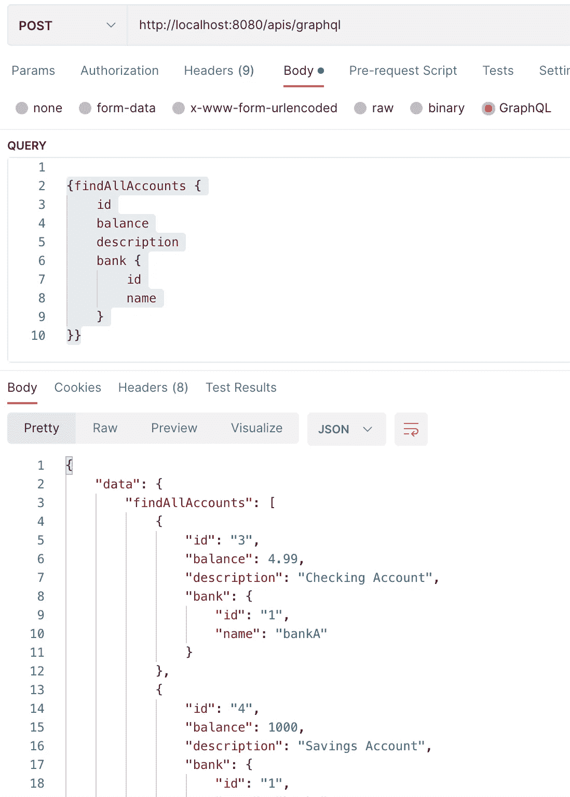

# 开发 React+graph QL+Spring Data JPA+UCP+Oracle

> 原文：<https://medium.com/oracledevs/develop-react-graphql-spring-boot-data-jpa-ucp-oracle-dcb7c4d3b1d4?source=collection_archive---------0----------------------->

​


**撰写本博客是为了给出一个现代全栈微服务应用程序的简洁描述和示例，该应用程序包括一个 React 前端服务，该服务针对 Spring Boot 数据 JPA 后端服务执行 GraphQL 查询，该后端服务进而映射到 Oracle 数据库。**

因此，我将从应用程序源的链接开始:[https://github . com/Paul Parkinson/react-graph QL-spring boot-JPA-Oracle-UCP-example](https://github.com/paulparkinson/react-graphql-springboot-jpa-oracle-ucp-example)

按照下面的简单说明，只需几分钟就可以构建并运行:

1.  `cd spring-data-jpa-graphql-ucp-oracle`
2.  修改`src/main/resources/application.properties`以设定`spring.datasource.url`、`spring.datasource.username`和`spring.datasource.password`的值
3.  运行`mvn clean install`
4.  运行`java -jar target/spring-data-jpa-graphql-oracle-0.0.1-SNAPSHOT.jar`
5.  (在单独的终端/控制台中)`cd react-graphql`
6.  运行`yarn add @apollo/client graphql`(该项目只需要运行一次)
7.  运行`npm run build`
8.  运行`npm start`

一个浏览器窗口将打开到 [http://localhost:3000/](http://localhost:3000/) 这是一个 React 应用程序，它将使用 Apollo 对运行在 localhost:8080 上的 Spring Boot 服务进行 GraphQL 查询，后者又使用 JPA 通过从 UCP 获得的连接查询 Oracle 数据库。

**关于 GraphQL 的优势和细节有很多文章，特别是因为它们非常适合许多微服务架构。我将尝试通过实际的应用程序源**来说明这一点，并在此简要说明 GraphQL 查询允许客户端动态地准确指定查询中需要的内容(无论是读还是写)，而服务器使用最合适和最有效的方式来提供这一结果，这样做可以减少所需的请求数量并提高性能。

**从后向前工作的一些细节…**

**您要做的第一件事是获得一个 Oracle 数据库，并配置 Spring Boot 服务使用 UCP 连接到它。**

任何 Oracle 数据库(本地、容器内、云……)都可以。[利用融合 Oracle 数据库简化微服务研讨会](https://apexapps.oracle.com/pls/apex/r/dbpm/livelabs/view-workshop?wid=637)是创建免费 Oracle 云数据库的一种非常便捷的方式(同时还设置了一个完整的微服务环境，尽管这对于这个简单的示例来说当然不是必需的)。

默认情况下，Spring Boot 目前使用光连接池，但是，Oracle 的通用连接池(UCP)提供了许多优势，包括性能和一些功能，如标签、请求边界、应用程序连续性、RAC 故障转移、分片、诊断和监控，在未来的版本中还会提供更多功能。为了使用 UCP 而不是光，必须设置特定的数据源配置属性，并且需要添加适当的依赖项。

*application.properties* 文件中配置属性的示例片段:

```
spring.datasource.url=jdbc:oracle:thin:@someServiceName_tp?TNS_ADMIN=/someLocation/Wallet_someWallet
spring.datasource.username=someUser
spring.datasource.password=somePassword
spring.datasource.driver-class-name=oracle.jdbc.OracleDriver
spring.datasource.type=oracle.ucp.jdbc.PoolDataSource
spring.datasource.oracleucp.connection-factory-class-name=oracle.jdbc.replay.OracleDataSourceImpl
spring.datasource.oracleucp.database-name=oracleADBForGraphQL
spring.datasource.oracleucp.data-source-name=oracleADBForGraphQLDataSource
spring.datasource.oracleucp.description="Oracle ADB Used For GraphQL"
```

*有关可以设置的其他可选 UCP 属性，包括池化和日志记录设置，请参见 src repos。

可以通过几种方式设置 Oracle 驱动程序和 UCP 库的依赖关系。

例如，可以使用生产 pom，如以下 pom.xml 片段所示:

```
<dependency>
   <groupId>com.oracle.database.jdbc</groupId>
   <artifactId>ojdbc11-production</artifactId>
   <version>21.1.0.0</version>
   <type>pom</type>
</dependency>
```

或者可以使用单独的依赖项，如 pom.xml 片段所示:

```
<dependency>
   <groupId>com.oracle.database.jdbc</groupId>
   <artifactId>ojdbc11</artifactId>
   <version>21.1.0.0</version>
</dependency>
<dependency>
   <groupId>com.oracle.database.jdbc</groupId>
   <artifactId>ucp</artifactId>
   <version>21.1.0.0</version>
</dependency>
<dependency>
   <groupId>com.oracle.database.ha</groupId>
   <artifactId>ons</artifactId>
   <version>21.1.0.0</version>
</dependency>
<dependency>
   <groupId>com.oracle.database.security</groupId>
   <artifactId>oraclepki</artifactId>
   <version>21.1.0.0</version>
</dependency>
<dependency>
   <groupId>com.oracle.database.security</groupId>
   <artifactId>osdt_core</artifactId>
   <version>21.1.0.0</version>
</dependency>
<dependency>
   <groupId>com.oracle.database.security</groupId>
   <artifactId>osdt_cert</artifactId>
   <version>21.1.0.0</version>
</dependency>
```

**接下来要注意的是，春季数据 JPA 的基础没有变化。**

注意，就模型和存储库抽象而言，Spring Data JPA 源中不存在针对 UCP 或 GraphQL 逻辑的特殊的、额外的逻辑(在本例中是 *Account* 和 *Bank* )。

**然后注意 Spring Boot 的服务器端 GraphQL 的基础知识**

GraphQL 包括模式、查询和变异的概念。
模式描述了哪些数据可以被查询和操作。如在
*src/main/resources/graph QL/account . graph qls*中我们看到:

```
type Account {
   id: ID!
   balance: BigDecimal!
   description: String
   bank: Bank
}
```

如您所料，查询描述了可以读取/查询的信息。再次在 *account.graphqls* 中我们看到:

```
extend type Query {
   findAllAccounts: [Account]!
   countAccounts: Long!
}
```

突变描述了可以被创建、删除和更新的信息。再次在 *account.graphqls* 中我们看到:

```
extend type Mutation {
   createAccount(balance: BigDecimal!, description: String, bank: ID!): Account!
   updateAccount(id: ID!, balance: BigDecimal, description: String): Account!
   deleteAccount(id: ID!): Boolean
}
```

GraphQL 和 Spring 数据 JPA 之间的映射逻辑在*解析器*包中，其中实现了 *GraphQLQueryResolver(查询)、GraphQL resolver<Account>(*Account resolver)*和 GraphQLMutationResolver(突变)*
都是直接的中介。下面是一些源代码片段作为示例:

Query.class:

```
public Iterable<Account> findAllAccounts() {
   return accountRepository.findAll();
}
```

AccountResolver.class:

```
public Bank getBank(Account account) {
   return bankRepository.findById(account.getBank().getId()).orElseThrow(null);
}
```

突变.类别:

```
public Account updateAccount(Long id, BigDecimal balance, String description) throws Exception {
   Optional<Account> optionalAccount = accountRepository.findById(id);
   if (optionalAccount.isPresent()) {
      Account account = optionalAccount.get();
      if (balance != null)
         account.setBalance(balance);
      if (description != null)
         account.setDescription(description);
      accountRepository.save(account);
      return account;
   }
   throw new Exception("No account found to update.");
}
```

*请注意，我们在这里使用的“GraphQL 的 Spring 是 GraphQL Java 团队的 GraphQL Java Spring 项目的继承者”，它“旨在成为所有 Spring、GraphQL 应用程序的基础。”。因此，我可能会使用该技术发布这个应用程序的新版本/分支(它为 graphqls 功能提供了方便的注释，等等)。)，然而，这个新功能在 2022 年 5 月才达到 1.0 版本，所以我在这里使用最初的、更广泛使用的方法。

**最后，试用应用程序，看看行为。**

Postman 是一个方便而简单的测试工具，因此我们将使用它来创建一个或多个银行，但使用带有 gql(图形查询语言—一种有意类似于 SQL 的语言)的 GraphQL POST，如下所示:


示例应用程序在 application.properties 文件中有 *spring.jpa.show-sql: true* ，因此可以在日志中看到数据库的相关 SQL JPA 问题。在这个 createBank 案例中，我们看到:

```
Hibernate: select hibernate_sequence.nextval from dual
Hibernate: insert into bank (name, routing, id) values (?, ?, ?)
```

然后，我们继续为创建的银行/银行 id 创建一个或多个帐户:


最后，我们使用下面的 gql 进行一个 *findAllAccounts* 查询:



这次在 Spring Boot 日志中我们看到:

```
Hibernate: select bank0_.id as id1_1_0_, bank0_.name as name2_1_0_, bank0_.routing as routing3_1_0_ from bank bank0_ where bank0_.id=?
```

**现在让我们看看前端 React 客户端，以及它如何使用 Apollo 对 Spring Boot 服务进行 GraphQL 查询。**

Apollo 是 ReactJS 中最流行的 GraphQL 库，可以通过运行

```
yarn add @apollo/client graphql
```

在 index.tsx 中，我们看到了指向 Spring Data JPA 服务的客户端的创建，以及呈现回复的代码:

```
const client = new ApolloClient({
    uri: 'http://localhost:8080/apis/graphql',
    cache: new InMemoryCache()
});render(
    <ApolloProvider client={client}>
        <App />
    </ApolloProvider>,
    document.getElementById('root'),
);
```

在 App.tsx 中，我们看到了之前在 Postman 中为 *findAllAccounts* 查询发布的 pql:

```
const ACCOUNT_INFORMATION_QUERY = gql`
  {findAllAccounts {
      id
      balance
      description
      bank {
          id
          name
      }
  }}
`;function AccountInformation() {
    const {loading, error, data} = useQuery(ACCOUNT_INFORMATION_QUERY);
    if (loading) return <p>Loading...</p>;
    if (error) return <p>Error :(</p>;
    return data.findAllAccounts.map( (account:any) =>
        <div key={account.id}>
            bank id: {account.bank.id} , bank name: {account.bank.name} , account id: {account.id}, account description: {account.description}, account balance: {account.balance}
        </div>
    );
}function App() {
    return (
        <div>
            <h2>Bank Account(s) Information...</h2>
            <AccountInformation/>
        </div>
    );
}
```

最后，当我们运行 React 应用程序时，我们会看到预期的相同查询结果。


**Oracle 非常重视对 React、GraphQL 和 Spring Boot 数据社区的强大而简单的支持，并在即将发布的版本中计划了额外的功能和创新。**稍后详细介绍。

如有任何意见或问题，请随时与我联系，感谢您的阅读！

​