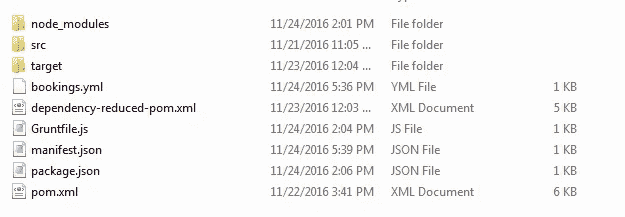
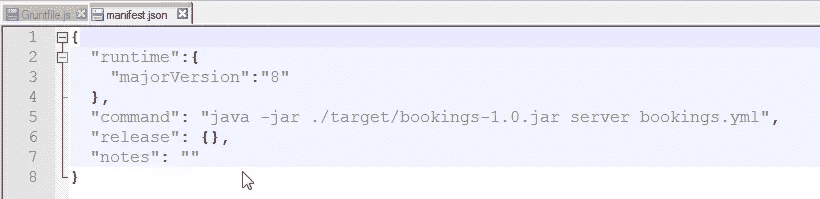
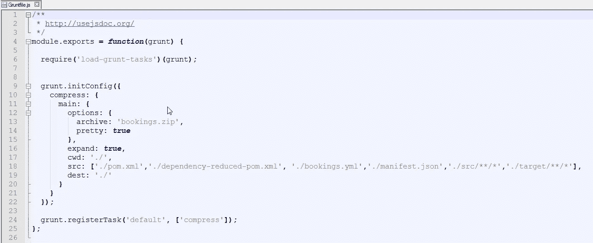
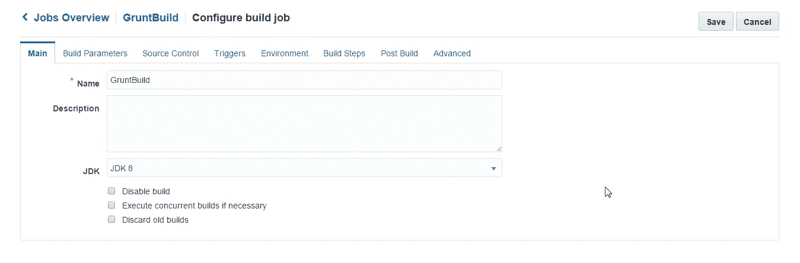
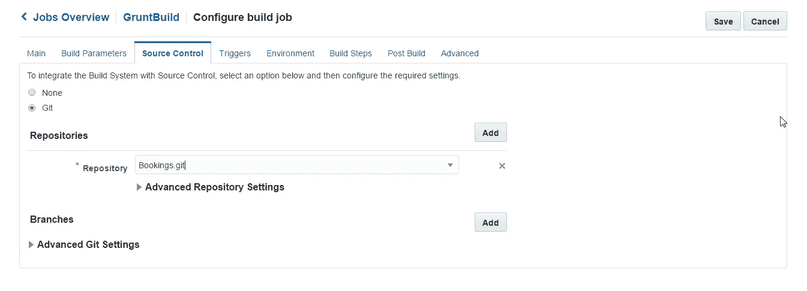

# 使用开发者云服务在应用程序容器云上部署 Dropwizard 应用程序

> 原文：<https://medium.com/oracledevs/developer-cloud-service-deploying-dropwizard-a-oracle-community-e77053c0f5b9?source=collection_archive---------0----------------------->

本博客将帮助您了解使用开发者云服务在 Oracle Application Container 云服务上部署 Dropwizard 应用程序。

**在我们开始之前，先简单介绍一下什么是 drop wizard:**

Dropwizard 站在一个库和一个框架之间。它基于 Java，使用 Jetty HTTP 库将 HTTP 服务器直接嵌入到项目中。它使用 Jersey 帮助开发人员构建 Restful web 应用程序，并使用 Jackson 处理基于 JSON 的数据。你可以在其网站上找到关于 Dropwizard 的其他详细信息—【http://www.dropwizard.io/ 

您可以按照下面链接中给出的教程从头开始开发您的 Dropwizard 应用程序，博客的其余部分将告诉您如何使用 Oracle Developer Cloud Service 在应用程序容器上部署它。

【http://www.dropwizard.io/1.0.5/docs/getting-started.html 

一旦你完成了 Dropwizard 教程(上面给出的链接),你的机器上就会有一个应用程序，它的文件夹结构如下。我将应用程序命名为 bookings，因此包含的文件夹也命名为‘bookings’。

按照 Dropwizard 教程创建和编译的应用程序将不包含以下文件/文件夹。这些，我们将不得不从外部添加。

*   Gruntfile.js
*   manifest.json
*   package.json
*   节点 _ 模块

上面提到的所有文件和文件夹将用于打包应用程序档案，并使其可部署在 Oracle 应用程序容器云服务的 Java 容器上。

manifest.json 文件应该与屏幕截图一致。确保 YAML 文件名与。yml 扩展名是正确的，并且您指向了正确的 jar。此外，主要版本字段是针对 JVM 的，应该给定为 8。

Gruntfile.js 应该通过提及 src 数组中的文件来包含要包含在包中的文件的名称。

注意:它不应该包含 node_module、Gruntfile.js 和 package.json .因为这些文件只是打包时需要的，在应用程序执行中不起任何作用。

请确保 package.json 如下面的屏幕截图所示。使用 npm install <dependency name="">将提到的依赖项安装在 node_modules 文件夹中</dependency>

**注:**三个文件都附在这个博客上，供参考。请参考下面的博客链接，了解 npm 的安装执行。

[https://community . Oracle . com/community/cloud _ computing/platform-as-a-service-PAAs/Oracle-developer-cloud-service/blog/2016/09/07/Oracle-developer-cloud-to-build-and-deploy-nodejs-rest-project-on-application-container-cloud](https://community.oracle.com/community/cloud_computing/platform-as-a-service-paas/oracle-developer-cloud-service/blog/2016/09/07/oracle-developer-cloud-to-build-and-deploy-nodejs-rest-project-on-application-container-cloud)

**开发者云服务:**

现在，为了使用开发人员云服务进行打包和部署，我们必须在 Oracle 开发人员云服务上创建一个名为 Bookings 的项目和 Git 存储库。然后使用 Eclipse 将 Dropwizard 项目代码上传到创建的 Git 存储库中。请使用我以前博客下面的链接，它将帮助您创建项目，开发人员云服务上的 Git 存储库，并设置 eclipse 和 Oracle cloud 插件，以将代码上传到 Git 存储库。

[https://community . Oracle . com/community/cloud _ computing/platform-as-a-service-PAAs/Oracle-developer-cloud-service/blog/2016/09/07/Oracle-developer-cloud-to-build-and-deploy-nodejs-rest-project-on-application-container-cloud](https://community.oracle.com/community/cloud_computing/platform-as-a-service-paas/oracle-developer-cloud-service/blog/2016/09/07/oracle-developer-cloud-to-build-and-deploy-nodejs-rest-project-on-application-container-cloud)

**构建:**

在 Git 存储库中检查完代码后，我们只需按照下面的屏幕截图在开发人员云服务上进行构建和部署配置:

构建执行将生成一个 bookings.zip 文件。你也可以参考我以前的博客(上面提到的开发者云服务部分的链接),在那里你也可以找到构建后配置，如果你选择自动化构建后过程的话。

**部署:**

在部署配置中，我们必须选择 ACCS 和 Java 作为选项。然后，我们必须选择我们配置的构建作业，以及成功的构建和从构建中生成的部署归档。其余的一切都和 Nodejs 博客中描述的一样，下面提供了链接。

[https://community . Oracle . com/community/cloud _ computing/platform-as-a-service-PAAs/Oracle-developer-cloud-service/blog/2016/09/07/Oracle-developer-cloud-to-build-and-deploy-nodejs-rest-project-on-application-container-cloud](https://community.oracle.com/community/cloud_computing/platform-as-a-service-paas/oracle-developer-cloud-service/blog/2016/09/07/oracle-developer-cloud-to-build-and-deploy-nodejs-rest-project-on-application-container-cloud)

* *本文表达的观点是我个人的观点，不一定代表甲骨文的观点。