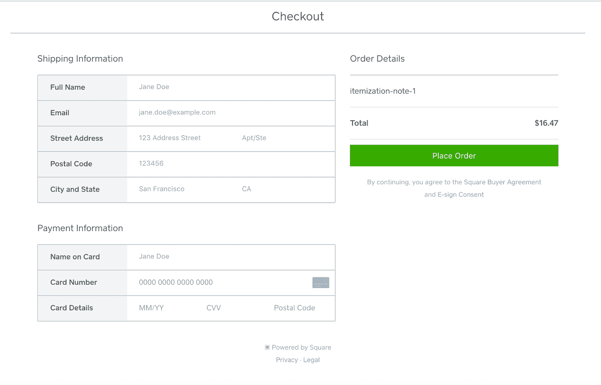

# 开发者之夜总结

> 原文：<https://medium.com/square-corner-blog/developer-night-recap-544bb900d0e1?source=collection_archive---------4----------------------->

> 注意，我们已经行动了！如果您想继续了解 Square 的最新技术内容，请访问我们的新家[https://developer.squareup.com/blog](https://developer.squareup.com/blog)

几周前，我们邀请了一小群本地开发人员来参观 Square 办公室，并透过窗帘看一看我们的 API 是如何制作的，以及我们在不久的将来会做些什么。

我们对我们正在做的事情感到非常兴奋，所以我们想公开分享它们——这样每个使用 Square 的人都可以分享我们的兴奋！

# 托管结帐(测试版)

An example of the hosted checkout screen mockup

您目前可以将您定制的 POS 应用程序连接到 Square payments，但有时您希望尽可能快速、轻松地开始接受支付，而无需编写定制集成。Hosted checkout 允许您使用 Square 托管的预制支付表单来完成人们在您网站上的购买。因为 Square 托管所有的支付表单，所以你不需要在你的网站上使用 https(尽管这总是一个好主意！).

# 电子商务明细(测试版)

现在，如果你使用 Square 的电子商务 API，你所有的销售额都会在你的仪表盘上显示为“自定义金额”。我们知道我们可以提供更多的细节，但这不会让您利用任何非 API 销售所利用的库存能力。随着电子商务明细的发布，您将能够在创建交易时传递明细购物车，或者动态创建与交易相关联的新项目。

# 项目 v2(目录)

项目是许多类型的业务的核心，但是跟踪所有不同的变化、折扣和税收可能是复杂的，并且在当前的项目 V1 API 中做得不是很好。在新版本中，我们创建了一个更广泛的项目*目录*的概念，这将帮助您管理各地的项目(及其所有变化&折扣)。新的目录端点还将允许批量上传和更改，这是开发人员最关心的问题。我们在听！

# Webhooks v2

我们当前的 Webhooks 实现是有限的。您会收到变更通知，但接下来需要做更多的工作来弄清楚什么发生了变更以及以何种方式发生了变更。将更多的 API 转移到 v2 框架意味着 Webhooks 也在升级。Webhooks v2 将相关信息添加到通知有效载荷中，并为我们所有的 API 提供通知——不仅仅是现有的交易、项目和客户。

我们将在未来几周内宣布这些功能的 beta 测试和发布。为了确保你能听到他们的消息，请务必在 twitter 上关注我们( [@SquareDev](https://twitter.com/squaredev) )并继续关注 [The Corner](https://medium.com/square-corner-blog) 。