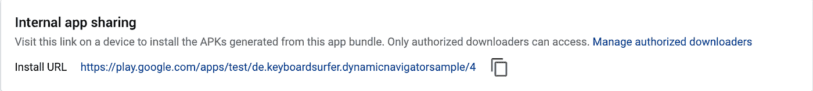

# 游戏控制台上的开发人员工具

> 原文：<https://medium.com/androiddevelopers/developer-tools-on-play-store-85fb710ee33b?source=collection_archive---------0----------------------->

## 支持您的开发和测试工作流


Header by [Virginia Poltrack](https://medium.com/u/224e59676537?source=post_page-----85fb710ee33b--------------------------------)

在本文中，您将了解如何使用谷歌 Play 商店快速安全地与测试人员和开发人员共享版本。
我还将介绍我们所做的改进，比如访问历史版本或者能够通过内部应用共享上传可调试版本。

# 但是首先，一些背景信息

将 APK 分发给您的测试人员就像将其附加到电子邮件中或者上传到文件存储服务器上一样简单。测试人员可以下载并在他们的手机上安装 APK。任何拿到文件的人也可以。

然后是安卓应用捆绑包(AAB)。它是 Android 的应用程序发布格式。通过 split apk，可以很容易地将所需的资源发送给用户，而不需要开发人员做任何额外的工作。AAB 是一种发布格式，这意味着 Google Play 将生成一组 apk，在最终用户设备上发布。这使得测试最终用户安装的准确工件变得很困难，特别是如果你考虑到更高级的特性，比如动态交付和应用内更新。

当与一个更大的团队、多个涉众或者外部测试人员一起工作时，您很可能正在寻找一种方法来与他们直接共享可安装的工件。要求他们安装开发工具并运行命令可能是不可行的。即使你可以使用`bundletool`将 Android 应用捆绑包转换为 APK 并安装在设备上，你也不能用它来测试应用内更新或你的`onDemand`交付实现。

不要担心，游戏商店已经为你准备好了。


# 用有限的测试人员测试你的应用

谷歌的 Play Store 为你提供了几种与有限人群分享应用的方式。可以通过选择加入 URL、特定邮件列表的成员资格或使用与 Google Play 用户帐户相关联的电子邮件地址在个人层面上限制访问。

## 测试轨道

您可以利用公众无法访问的多首曲目。这意味着您可以准确决定谁能够在开发的哪个阶段访问您的应用程序。以下是最重要的区别:

**内部测试赛道**

*   每个应用程序仅限 100 名测试人员
*   对于应该测试一个候选版本的更广泛的团队来说是理想的。
*   立即可用

**关闭轨道**

*   邀请个人用户或整个群组
*   在向公众开放之前，非常适合组织范围内的测试。
*   出版前审查

**打开轨道**

*   公共用户可以直接选择加入
*   非常适合在交付生产前与一大群用户进行测试。
*   出版前审查

> **这些曲目的一些一般说明**
> 
> 从这些轨道中的任何一个，只有一个版本可以一直传播到生产环境中。
> 
> 在 Play Store 中选择加入测试程序的用户可以访问发布到测试轨道的工件。
> 
> 在每个音轨上，你可以上传一个安卓应用捆绑包或者一个 APK。

# 深入了解内部应用程序共享

在上述曲目旁边，Play Store 提供了一个特殊的开发者工具，**内部应用共享**。

内部应用程序共享最重要的特点是，在这里上传 APK 或 AAB 不会对 Play Console 中发布的版本产生任何影响。这意味着永远不可能从内部应用共享直接传播到测试轨道或生产。

此外，上传到内部应用共享的应用可以**调试**。这意味着您可以将调试器附加到一个可以从 Play Store 安装的版本上。

而且你**上传新版本不需要递增版本代码**，不用为开发预留版本代码空间，也不用担心版本代码用完。您可以通过为每次上传共享一个唯一的链接来独立测试版本，而不会覆盖其他版本。

您可以**授权开发团队的上传者**只允许访问内部应用程序共享，而不必授权他们访问 Play Console 的任何其他部分。
到**授权下载者**访问 Play 开发者控制台上的“开发工具>内部 app 共享”。您可以通过使用选择链接共享的电子邮件列表将用户列入白名单，这将允许任何拥有链接的人将测试版本下载到他们的设备上。

> 注意:我们知道当前在一台设备上使用多个帐户的限制。
> 要解决这个问题，您可以让所有帐户都可以访问内部应用程序共享，或者允许电子邮件列表之外的测试人员在 Play 控制台中下载。

## 通过内部应用程序共享测试高级功能

通过内部应用程序共享，您可以在与真实用户相同的环境中测试**按需**动态功能模块的安装。通过上传一个可调试的版本，你甚至可以在 Android Studio 中附加一个调试器来检查你是否命中了所有正确的代码。

此外，**应用内更新**可以通过将带有旧版本代码的版本上传到内部应用共享进行测试。要开始，请遵循以下流程:

1.  上传两个不同`versionCode`属性的版本到内部 App 分享。
2.  通过内部应用共享 URL 安装较低版本的应用。
3.  打开较高版本的链接，但**不要安装**。
4.  再次打开已安装的版本。
5.  现在，您可以看到一个可用的更新。

如果您可以轻松访问旧版本的应用程序，并立即与他人分享，这不是很好吗？剧透…

# 介绍历史版本

历史版本支持快速、确定地访问应用程序的旧版本。

有权访问内部应用程序共享的用户也可以访问上传到制作轨道的任何版本。你所需要知道的就是这个版本的**版本代码**和**包名**。

有了这些信息，您可以按照以下 URL 方案安装应用程序的历史版本:

```
https://play.google.com/apps/test/<package name>/<version code>
```

但是您也可以在 **Bundle Explorer** 中找到版本代码和管理授权测试人员的链接。在“内部应用程序共享”部分，您将找到安装特定版本所需的所有信息。一旦你设置好了一切，你就可以使用这个网址安装 AAB 和 APK 的历史版本了。



Historical Releases in the Play Console

# 进一步阅读和后续步骤

仔细阅读[不同出版轨道](https://support.google.com/googleplay/android-developer/answer/3131213)或[内部版本](https://support.google.com/googleplay/android-developer/answer/9303479?hl=en)共享的文档。

[Wojtek Kaliciński](https://medium.com/u/b913acc64439?source=post_page-----85fb710ee33b--------------------------------) 向您介绍[使用按需模块进行本地开发和测试。](/androiddevelopers/local-development-and-testing-with-fakesplitinstallmanager-57083e1840a4)

另请阅读 [Marcel Pintó](https://medium.com/u/55362b009039?source=post_page-----85fb710ee33b--------------------------------) 的帖子，了解如何[设置您的 CI 以轻松上传测试版本](/androiddevelopers/speed-up-your-android-dynamic-features-flow-testing-d63986cd716a)。

此外，您可以从 Google I/O 和 Android Dev Summit 2019 这两个录制的会议中了解通过 Android 应用捆绑实现的其他功能。

## 现在，您可以上传新的包到测试赛道，使用内部应用程序共享或直接从谷歌 Play 商店访问历史版本。