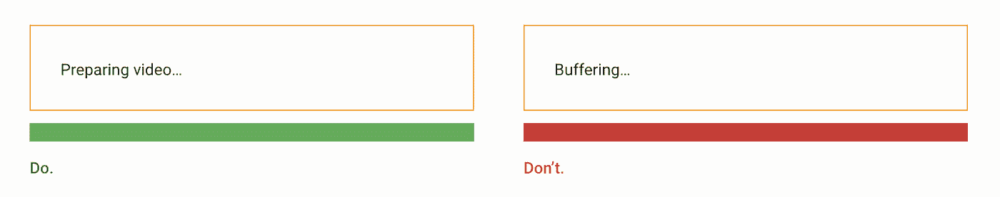
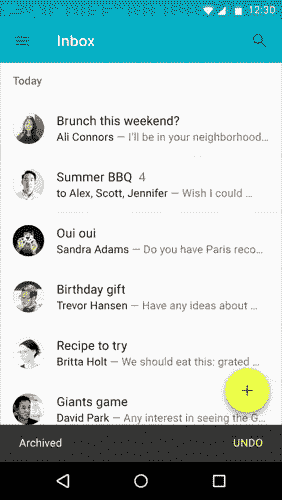
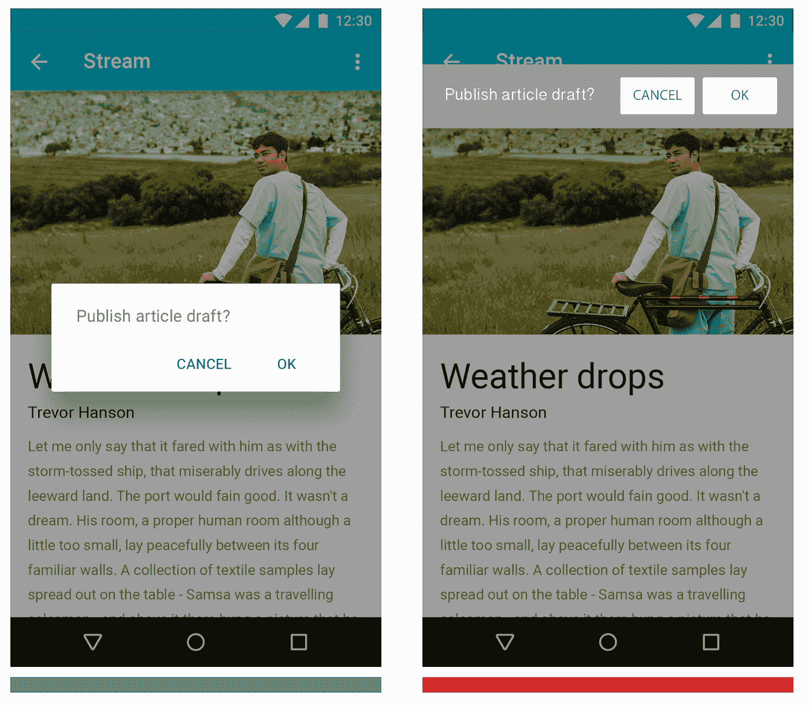
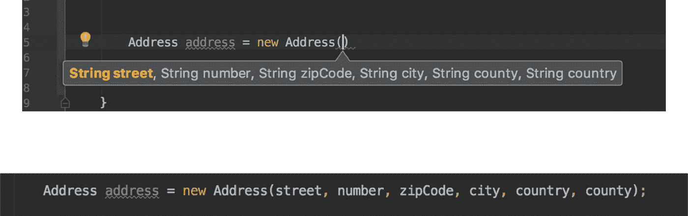
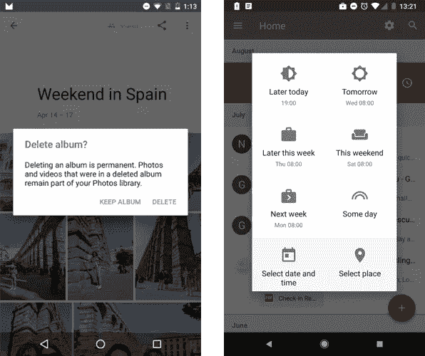

# 开发者也是用户——第 1 部分

> 原文：<https://medium.com/androiddevelopers/developers-are-users-too-part-1-c753483a50dc?source=collection_archive---------2----------------------->


Images: [Virgina Poltrack](https://twitter.com/VPoltrack)

## 提高 UI 和 API 可用性的 5 条准则

在上一篇文章中，我们看到了 UI 和 API 可用性的重要性，并且 UI 可用性指南也可以应用于 API。看看这里。

[](/google-developers/developers-are-users-too-introduction-fefdb42f05a) [## 开发者也是用户—简介

### 可用性——从 UI 中学习，在 API 中应用

medium.com](/google-developers/developers-are-users-too-introduction-fefdb42f05a) 

在本文中，我们将讨论前 5 条可用性指南:

1.  [系统状态的可见性](#a062)
2.  [系统与现实世界的匹配](#fd9a)
3.  [用户控制和自由](#52bc)
4.  [一致性和标准](#7d0b)
5.  [错误预防](#6f9b)

# 1.系统状态的可见性

> 系统应该通过适当的反馈，在合理的时间内让用户了解正在发生的事情。

**UI:** 当用户发起一个需要较长时间的动作时，通知他们进度。如果可能的话，更喜欢一个进度条而不是一个正在加载的图像，一个带有百分比的上传或下载通知。用户应该知道他们在等待什么，以及需要多长时间。


Keep the user informed of progress. [Source](https://material.io/guidelines/components/progress-activity.html#progress-activity-types-of-indicators)

**API:**API 应该提供查询当前状态的方法。例如，`[AnimatedVectorDrawable](https://developer.android.com/reference/android/graphics/drawable/AnimatedVectorDrawable.html)`类提供了一种检查动画是否正在运行的方法:

```
boolean isAnimationRunning = avd.isRunning();
```

API 可以以回调机制的形式给出反馈，允许 API 用户知道对象何时改变状态——就像动画何时开始和结束的通知。`[AnimatedVectorDrawable](https://developer.android.com/reference/android/graphics/drawable/AnimatedVectorDrawable.html)`对象允许[为此注册](https://developer.android.com/reference/android/graphics/drawable/AnimatedVectorDrawable.html#registerAnimationCallback(android.graphics.drawable.Animatable2.AnimationCallback))一个`[AnimationCallback](https://developer.android.com/reference/android/graphics/drawable/Animatable2.html#registerAnimationCallback(android.graphics.drawable.Animatable2.AnimationCallback))`。

# 2.系统与现实世界的匹配

> 应用程序应该说用户的语言，使用用户熟悉的短语和概念，而不是面向系统的术语。



Use concepts familiar to the user. [Source](https://material.io/guidelines/style/writing.html#writing-language)

## 类和方法的命名应该符合用户的期望

**API:** 当在一个新的 API 中搜索一个类时，用户没有一个明确的起点，而是依赖于以前使用类似 API 的经验，或者依赖于与 API 领域相关的一般概念。例如，当使用 Glide 或 Picasso 下载和显示图像时，用户可能会寻找一种称为“加载”或“下载”的方法。

# 3.用户控制和自由

> 为用户提供恢复其操作的可能性。

**UI:** 对于用户发起的可能不确定发生了什么事情的操作，如删除或存档电子邮件，显示一条确认消息并允许用户撤销该操作。



Allow the user to undo certain actions. [Source](http://Elements like “Help” and “Send feedback” are usually placed at the bottom of the navigation drawer.)

## API 应该允许中止或重置操作，并且很容易将 API 恢复到正常状态

**API:** 例如，retrieval 公开了一个 [Call#cancel](https://square.github.io/retrofit/2.x/retrofit/retrofit2/Call.html#cancel--) 方法，该方法试图取消正在进行的网络调用，或者，如果调用尚未执行，则确保它永远不会执行。如果你使用 NotificationManager API，你会发现你既可以创建也可以[取消](https://developer.android.com/reference/android/app/NotificationManager.html#cancel(int))通知。

# 4.一致性和标准

> 你的应用程序的用户不应该怀疑不同的词语、情况或动作是否意味着相同的事情。

**UI:** 与您的应用程序交互的用户已经通过与其他应用程序的交互得到了培训，他们希望常见的交互元素以某种方式呈现和表现。背离这些约定会导致容易出错的情况。

与平台保持一致，使用用户熟知的 UI 控件，这样他们就能很快识别并操作它们。此外，在整个应用程序中保持一致。在应用程序的多个屏幕上使用相同的文字和图标来表示相同的事物。例如，当用户可以编辑应用程序中的多个元素时，请始终使用相同的编辑图标。



Dialogs should be consistent with the platform. [Source](https://material.io/guidelines/usability/accessibility.html#accessibility-implementation)

**API:**API 设计的所有部分都应该一致

## 跨方法使用一致的命名

考虑以下示例，其中我们有一个接口，该接口公开了设置两种不同类型的观察器的两种方式:

```
public interface MyInterface {

    void registerContentObserver(ContentObserver observer); void addDataSetObserver(DataSetObserver observer);
}
```

这个界面的用户会问自己`register…Observer`和`add…Observer`有什么区别。一种方法一次只允许一个观察者，而另一种方法允许多个观察者吗？开发人员要么需要仔细阅读文档，要么寻找接口的实现，以查看两种方法的行为方式是否相同。

```
private List<ContentObserver> contentObservers;
private List<DataSetObserver> dataSetObservers;public void registerContentObserver(ContentObserver observer) {
    contentObservers.add(observer);
}public void addDataSetObserver(DataSetObserver observer){
    dataSetObservers.add(observer);
}
```

对做同样事情的方法使用**相同的名字**。

考虑使用成对的**反义词** : get — set，add — remove，subscribe — unsubscribe，show—dissolve。

## 跨方法使用一致的参数排序

重载方法时，确保所有方法中出现的参数保持相同的顺序。否则，您的 API 用户将花费更多的时间来理解重载方法之间的差异。

```
void setNotificationUri( **ContentResolver cr,
                         Uri notifyUri**);void setNotificationUri( **Uri notifyUri,
                         ContentResolver cr**,
                         int userHandle);
```

## 避免函数具有多个相同类型的连续参数

尽管 Android Studio 使得使用具有多个连续的同类型参数的方法变得更加容易，但是排序错误很容易出现，也很难被发现。参数顺序应该尽可能与参数的逻辑顺序相匹配。



It’s easy to make mistakes when parameters have the same type. Here county and country are interchanged.

作为这个问题的解决方案，您可以使用构建器模式，或者对于科特林的[命名参数](https://kotlinlang.org/docs/reference/functions.html)。

## 方法应该最多有 4 个参数

参数越多，方法越复杂。对于每个参数，用户需要理解方法的含义以及与其他参数的关系。这意味着每一个额外的参数都会导致复杂性的指数增长。当一个方法有 4 个以上的参数时，考虑将其中一些封装在其他类中或者使用构建器。

## 返回值会影响方法的复杂性

当一个方法返回一个值时，开发人员需要知道这个值代表什么，如何存储，等等。当不使用返回值时，它对方法的复杂性没有影响。

例如，当在数据库中插入一个对象时，Room 可以同时返回一个`Long`或`void`。当 API 用户想要使用返回值时，首先需要理解它的含义，然后才是在哪里存储它。当不需要该值时，可以使用 void 方法。

```
@Insert
**Long** insertData(Data data);@Insert
**void** insertData(Data data);
```

因此，您应该更喜欢返回值，让 API 用户决定他们在哪里需要它。如果您正在创建基于代码生成的库，请允许返回这两个选项的方法。

# 5.错误预防

> 创造一个从一开始就防止问题发生的设计。

通常，用户会从手头的任务中分心，所以你应该通过引导用户来防止无意识的错误，这样他们就能保持在正确的道路上，减少失误的机会。例如，你可以要求他们在采取破坏性行动之前进行确认，或者建议好的默认设置。

例如，Google 相册通过添加确认对话框来确保你不会误删除相册。收件箱允许你暂停一封邮件，并提供一键默认设置。



Google Photo uses confirmation before destructive actions. Inbox provides one-click defaults when snoozing an email

## API 应该引导用户正确使用 API。尽可能使用默认值。

API 应该易于使用，难以误用。通过提供默认值来帮助您的用户。例如，在创建房间数据库时，其中一个默认值确保即使在增加数据库版本时也能保留数据库中的数据。这为合并了空间的应用程序的用户带来了更好的可用性，因为他们的数据被保留并且数据库版本是透明的。

Room 还提供了一个可以改变这种行为的方法:`[fallbackToDestructiveMigration](https://developer.android.com/reference/android/arch/persistence/room/RoomDatabase.Builder.html#fallbackToDestructiveMigration())`如果没有提供迁移，当版本改变时，它会销毁然后重新创建数据库。

我们还有 5 条指导方针需要深入研究:

*   [承认而不是回忆](/google-developers/developers-are-users-too-part-2-96e03fe17535#b705)
*   [使用的灵活性和效率](/google-developers/developers-are-users-too-part-2-96e03fe17535#0709)
*   [唯美极简设计](/google-developers/developers-are-users-too-part-2-96e03fe17535#3033)
*   [帮助用户识别、诊断错误并从中恢复](/google-developers/developers-are-users-too-part-2-96e03fe17535#d40e)
*   [帮助和文档](/google-developers/developers-are-users-too-part-2-96e03fe17535#e86b)