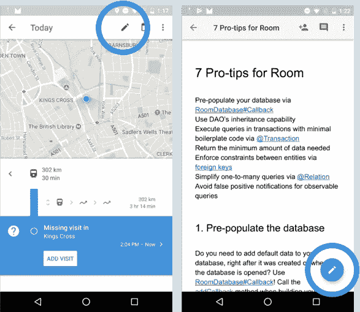
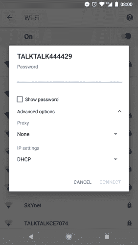
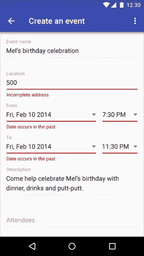
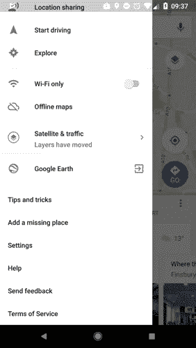

# 开发者也是用户——第 2 部分

> 原文：<https://medium.com/androiddevelopers/developers-are-users-too-part-2-96e03fe17535?source=collection_archive---------3----------------------->


Images: [Virgina Poltrack](https://twitter.com/VPoltrack)

## 5 个更好的 UI 和 API 可用性指南

我们对所有交互的东西都有相同的可用性期望，无论是 ui 还是 API。因此，我们用于 UI 的指导方针也可以转换成 API。在前一篇文章中，我们已经讨论了前 5 条准则。现在，是休息的时候了。

[](/google-developers/developers-are-users-too-part-1-c753483a50dc) [## 开发者也是用户——第 1 部分

### 提高 UI 和 API 可用性的 5 条准则

medium.com](/google-developers/developers-are-users-too-part-1-c753483a50dc) 

# 6.认可而不是回忆

UI: 识别熟悉的事物需要最少的认知能量，并由上下文触发。回忆意味着从记忆中提取细节，需要更多的时间。从一组选项中选择要比凭记忆写出这些选项容易。使用众所周知的图标的简单 UI 是基于识别的。命令行界面基于回调。信息和功能应该是可见的、直观的和容易访问的。



The pencil icon is a symbol for editing, easy to recognize, independent of the app.

## 让名字清晰易懂

一个**变量**的名字应该说它代表什么，而不是如何使用:`isLoading`，`animationDurationMs`。

一个**类**名应该是一个名词，应该说它代表什么:`RoomDatabase`，`Field`。

一个**方法**名称应该是一个动词，并且应该说明这个方法做什么:`query()`，`runInTransaction()`。

# 7.使用的灵活性和效率

UI: 您的应用程序可能会被没有经验的用户和有经验的用户使用。创建一个 UI 来迎合这两种类型的用户，并允许他们适应频繁的操作。据说 80%的用户使用 20%的功能。你需要在简单和强大之间找到平衡。找出这 20%对你的应用程序来说是什么，并使应用程序的这些部分尽可能简单易用。应用[渐进公开的原则](https://www.nngroup.com/articles/progressive-disclosure/)并允许您的其他用户在辅助屏幕中访问高级功能。



The Wi-Fi settings defaults to basic options but also contains advanced options. It fits the needs of the user.

## 构建灵活的 API

用户应该能够使用 API 高效地完成他们的任务，并且 API 需要具有灵活性。例如，当查询数据库时，Room 提供不同的返回值，允许它们进行同步查询，使用 LiveData，或者如果愿意，使用 RxJava 2 中的 API。

```
@Query(“SELECT * FROM Users”)// synchronous
List<User> getUsers();// asynchronously
Single<List<User>> getUsers();
Maybe<List<User>> getUsers();// asynchronously via observable queries
Flowable<List<User>> getUsers();
LiveData<List<User>> getUsers();
```

## 将相关的方法放在相关的类中

放置在与开发人员已经编写的代码没有直接关系的类中的方法很难找到。更重要的是，倾向于将许多有用的方法组合在一起的“Util”或“Helper”类可能很难找到。使用 Kotlin 时，解决方法是使用[扩展函数](https://kotlinlang.org/docs/reference/extensions.html)。

# 8.美学和极简设计

UI:UI 应该保持简单，只包含与用户当时相关的信息。不相关或很少需要的信息应该被删除或移到其他屏幕，因为它们的出现会分散用户的注意力，降低真正相关的信息的重要性。


[Pocket Casts](https://play.google.com/store/apps/details?id=au.com.shiftyjelly.pocketcasts&hl=en_GB) app uses a minimalist design

在剧集列表屏幕中，这个播客应用程序显示了最少的、上下文相关的信息量:如果用户没有下载一集，下载大小和下载按钮是可见的；如果用户已经下载了它—持续时间和播放按钮。同时，对于好奇的用户来说，所有这些以及更多的内容都显示在详细信息屏幕中。

API 用户有一个目标:在你的 API 的帮助下更快地解决他们的问题。因此，让他们的路径尽可能短和直接。

## 不要公开内部 API 逻辑

**API:** 不必要地暴露内部 API 逻辑会让用户困惑，导致糟糕的可用性。不要公开不需要的方法和类

## 不要让用户做 API 能做的任何事情

**API:** 从 22.1.0 开始，Android 支持库提供了`RecyclerView`对象套件，以支持基于大型数据集或频繁更改的数据创建 UI 元素。每当列表改变时，需要用更新的数据通知`RecyclerView.Adapter`。这导致开发人员创建自己的解决方案来计算列表之间的差异。在支持库的 25.1.0 版本中，`[DiffUtil](https://developer.android.com/reference/android/support/v7/util/DiffUtil.html)`类极大地减少了这个样板文件。而且，`DiffUtil`使用了优化的算法，减少了你需要编写的代码量，提高了性能。

# 9.帮助用户识别、诊断错误并从中恢复

**UI:** 为你的应用程序用户提供错误消息，帮助他们识别、诊断错误并从中恢复。好的错误消息清楚地表明出现了问题，用礼貌的、人类可读的语言对问题进行了精确的描述，并包含如何修复问题的建设性建议。避免显示状态代码或异常类名。用户不知道如何处理这些信息。



Error messages when creating an event. [Source](https://material.io/guidelines/patterns/errors.html#errors-user-input-errors)

当输入字段失焦时立即显示错误，不要等到用户按下按钮提交整个表单，或者更糟的是，等待错误从后端出现。使用文本视图的[功能](https://developer.android.com/reference/android/widget/TextView.html#setError(java.lang.CharSequence))来显示错误信息。例如，如果您正在创建一个事件表单，通过直接对 UI 小部件设置约束来防止您的用户在过去创建事件。

## 快速失败

越早报告错误，造成的损失就越小。因此，失败的最佳时机是在编译时。例如，Room 将在编译时报告任何不正确的查询或错误注释的类的问题。

如果不能在编译时失败，那就尽量在运行时失败。

## 例外应表示例外情况

**API:** 用户不应该对控制流使用异常。异常应该只用于异常情况或不正确的 API 用法。尽可能使用返回值来指示这一点。捕捉和处理异常几乎总是比测试返回值慢。

例如，试图在具有`NON NULL`约束的列中插入一个`null`值是一种异常情况，会导致抛出一个`SQLiteConstraintException`。

## 抛出特定的异常。首选已经存在的例外

**API:** 开发者已经知道`IllegalStateException`或者`IllegalArgumentException`是什么意思，即使他们不知道你的 API 中出现这种情况的原因。通过抛出现有的异常来帮助您的 API 用户，最好是更具体的异常而不是一般的异常，并给出一个好的错误消息。

当通过`[createBitmap](https://developer.android.com/reference/android/graphics/Bitmap.html#createBitmap(android.graphics.Bitmap,%20int,%20int,%20int,%20int))`方法创建新的`Bitmap`时，您需要提供新位图的宽度和高度等元素。如果你提供值< = 0 作为参数，那么这个方法将抛出一个`IllegalArgumentException`。

## 错误消息应该准确地指出问题

**API:** 为 UI 编写错误消息的相同准则也适用于 API。提供详细的消息来帮助你的用户修改他们的代码。

例如，在 Room 中，如果在主线程上运行查询，用户将得到一个`java.lang.IllegalStateException: Cannot access database on the main thread since it may potentially lock the UI for a long period of time`。这表明执行查询的状态(主线程)对于此操作是非法的。

# 10.帮助和文档

UI: 你的用户不需要任何文档就可以使用你的应用程序。对于复杂的或非常特定领域的应用程序，这可能是不可能的，所以，如果需要文档，请确保它容易找到，容易搜索，并回答常见问题。



Elements like “Help” and “Send feedback” are usually placed at the bottom of the navigation drawer

## API 应该是自我记录的

**API:** 方法、类和成员的良好命名使得 API 自文档化。但是再好的 API，没有一个好的文档是不会被使用的。这就是为什么每个公共元素——方法、类、字段、参数——都应该被记录。作为一名 API 开发人员，对您来说简单明了的事情，对您的 API 用户来说可能就不那么简单明了了了。

## 示例代码应该是示例性的

**API:** 代码示例有几个作用:它们帮助用户理解 API 的目的、用法以及用法上下文。**代码片段**旨在演示如何访问基本的 API 功能。**教程**教授开发者 API 的一个特定方面。**代码样本**是更复杂的例子，通常是整个应用程序。在这三个问题中，最大的问题出现在你没有代码样本的时候，因为开发人员忽略了更大的画面——你所有的类和方法如何协同工作，以及它们应该如何与系统协同工作。

如果你的 API 变得流行，有可能会有成千上万的开发者使用这些例子，这些例子将成为你的 API 应该如何使用的模型。所以，你犯的每一个错误都会反过来咬你一口。

这些年来，我们学到了很多关于用户界面可用性的知识；我们知道我们的用户需要什么，以及他们的想法。他们想要直观、高效、正确的用户界面，以适当的方式帮助他们完成特定的任务。所有这些概念都超越了 ui，也适用于 API，因为开发者也是用户。因此，让我们帮助他们(和我们)并构建可用的 API。

> API 应该易于使用，难以误用——它应该容易做简单的事情，可能做复杂的事情，不可能，或者至少很难做错误的事情。约书亚·布洛赫— [来源](https://dl.acm.org/citation.cfm?id=1176622)

## 参考

*   [用户界面设计的 10 种可用性启发法](https://www.nngroup.com/articles/ten-usability-heuristics/)
*   [http://www.apiusability.org/](http://www.apiusability.org/)
*   Myers，B. A .，& Stylos，J. (2016)。提高 API 可用性。*ACM 的通信*，59(6)，62–69。 [PDF](http://www.cs.cmu.edu/~NatProg/papers/API_Usability_Article_submitted.pdf)
*   Bloch，J. (2006 年)。如何设计一个好的 API 以及为什么它很重要。*第 21 届 ACM SIGPLAN 面向对象编程系统、语言和应用研讨会指南*。ACM。 [PDF](https://dl.acm.org/citation.cfm?id=1176622)
*   埃利斯和迈尔斯(2007 年)。API 设计中的工厂模式:可用性评估。第 29 届国际软件工程会议论文集。IEEE 计算机学会。 [PDF](https://www.cs.cmu.edu/afs/cs.cmu.edu/Web/People/NatProg/papers/Ellis2007FactoryUsability.pdf)
*   罗比拉德议员(2009 年)。API 难学的原因是什么？开发者的回答。*软件，IEEE* ， *26* (6)，27–34。 [PDF](http://cs.mcgill.ca/~martin/papers/software2009a.pdf)
*   t .谢勒和 Kühn，E. (2015 年)。API 可用性的自动测量:API 概念框架。*信息与软件技术*， *61* ，145–162。 [PDF](http://www.researchgate.net/profile/Eva_Kuehn/publication/272027830_Automated_measurement_of_API_usability_The_API_Concepts_Framework/links/55056eff0cf24cee3a047a21.pdf)
*   [防止用户错误:避免有意识的错误](https://www.nngroup.com/articles/user-mistakes/)
*   [错误信息指南](https://www.nngroup.com/articles/error-message-guidelines/)
*   [材料设计模式和指南](https://material.io/)