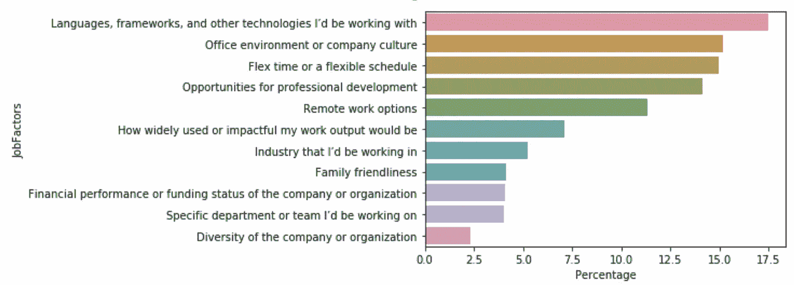
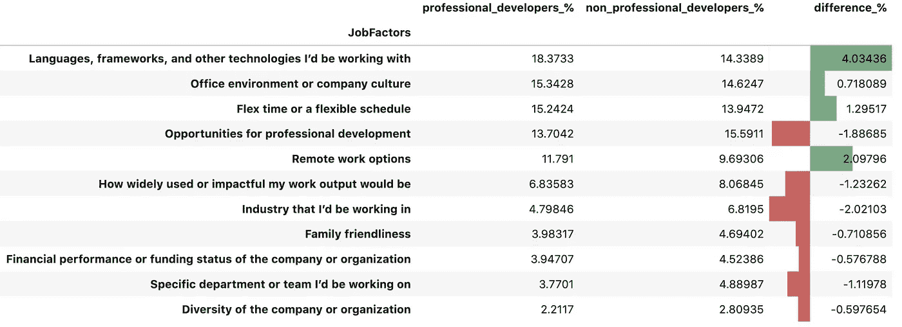
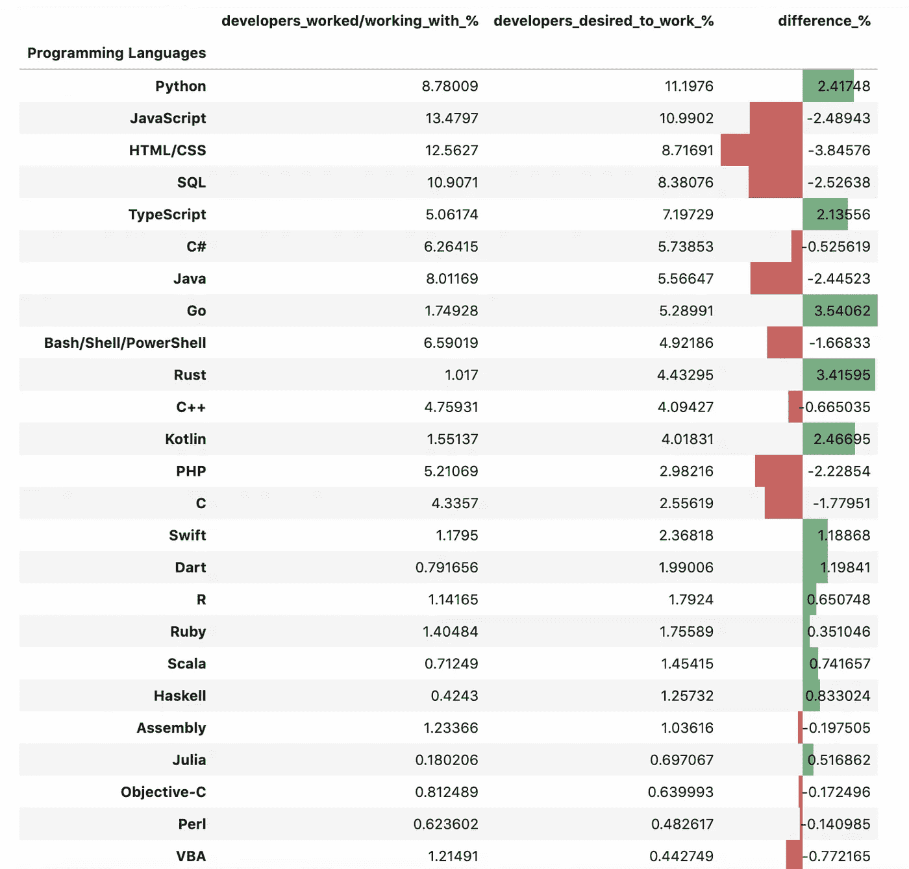
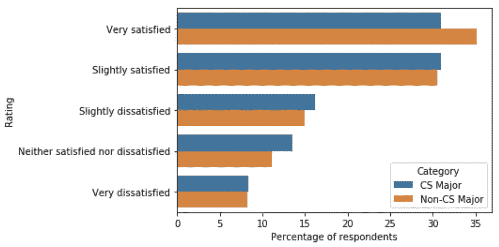
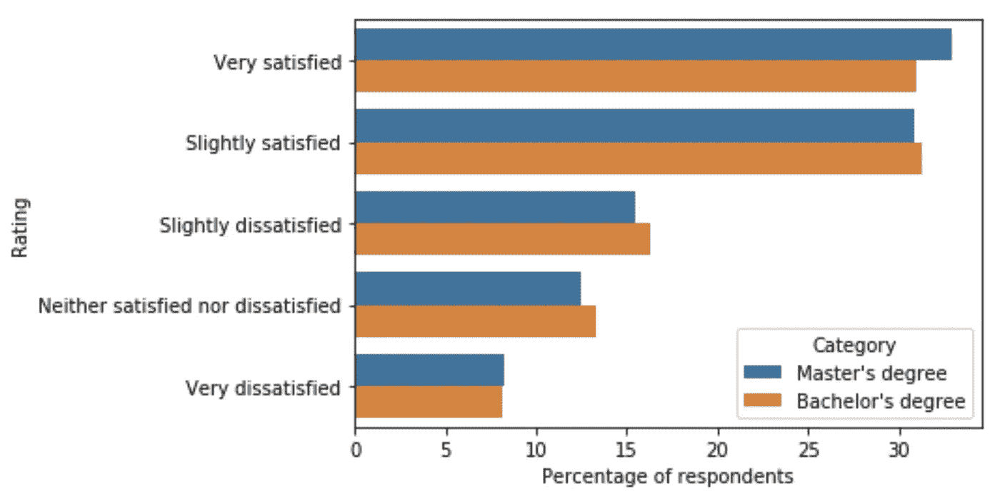

# 从数据科学的角度看开发者的行为

> 原文：<https://medium.com/walmartglobaltech/developers-behaviour-from-datascience-perspective-1b25376b2839?source=collection_archive---------2----------------------->

Image Source: [Google Images](https://www.vectorstock.com/royalty-free-vector/web-developer-design-vector-5885787)

# 简介:

在本文中，我们将使用数据驱动的方法，以编程方式确定使用[Stack Overflow developer survey data 2020](https://insights.stackoverflow.com/survey)的开发人员行为的某些方面。Stack Overflow 每年都会进行调查，以便从开发人员的角度更好地了解 IT 环境。该调查由许多问题组成，包括开发人员的爱好、教育、兴趣、与工作相关的问题等。

使用堆栈溢出数据，我们将尝试回答以下问题:

1.  *开发人员在找工作时主要评估哪些工作因素？*
2.  *开发人员现在主要工作/正在工作，并且对以后的工作感兴趣或希望工作的编程语言是什么？*
3.  *开发者在某个领域拥有硕士学位比学士学位更有工作满足感，还是拥有 CS 专业比非 CS 专业更有工作满足感？*

第一部分:工作因素

让我们假设你收到了三家不同公司的工作邀请。三家公司都提供相同的补偿。那么你会根据什么标准来选择你应该选择的公司呢？

我确信一个人可以根据环境来决定，但是让我们看看世界各地的开发者是怎么说的。堆栈溢出开发者调查 2020 已经从多达 184 个国家的开发者那里收到了大约 65000 份回复。

下图是选择各种工作因素的人的百分比，这些因素可能有助于按降序选择合适的工作。

当然，从图表来看，最重要的工作因素是'*语言、框架和开发人员将使用的技术'*，大约有 17.5%的受访者这样认为。

**这里有一点**需要注意的是，在所有受访者中，大多数是职业开发人员，但有些开发人员只是将编程作为一种爱好，或者是学生开发人员，或者根本不是开发人员，但有时只是将编程作为他们工作的一部分。

当我们将专业开发人员分开，并比较专业和非专业开发人员的回答百分比时，会有一些细微的差异。我们来看看下面的情节。

非专业开发人员的回答中排名第一的工作因素是“ ***专业发展机会*** ”，这是专业开发人员的第四大首选工作因素。

**第二部分:编程语言** 了解一门编程语言是任何人成为开发者的第一步。任何一个开发人员都会使用多种编程语言。此外，开发人员可能希望现在或以后开发最流行的编程语言。

借助堆栈溢出开发人员调查数据集，我们能够深入了解这些属性。让我们看看下面的图表。

developers _ worked/working _ with _ %:-过去或现在从事编程语言工作的开发人员的百分比。

**developers _ desired _ to _ work _ %**:-现在或以后希望/有兴趣从事编程语言工作的开发人员的百分比。

由此，我们可以说, **JavaScript、HTML/CSS、SQL、Python、Java** 是开发人员努力开发的排名前五的编程语言。

但是，在这五种顶级编程语言中，除了 **Python** 之外，开发人员对其余四种编程语言的总体愿望/兴趣正在减弱。

在开发人员希望/有兴趣使用的所有编程语言中，Python 占据了首位。这意味着 **Python** 是目前最流行的编程语言。

**第三部分:——工作满意度** 工作满意度对任何一个开发者来说都是至关重要的。堆栈溢出数据有助于将计算机科学本科专业和非计算机科学本科专业的开发人员之间的工作满意度联系起来。在某些领域，拥有学士学位和硕士学位的开发人员之间也存在差异。

在下图中，工作满意度评分是根据两个类别(CS 和非 CS)的受访者百分比绘制的

在这里，我们可以看到，非计算机专业类别的受访者“非常满意”的比例略高于计算机专业类别。但是我们可以观察到，总的来说，CS 和非 CS 类别的开发人员的工作满意度没有太大的差异。

在下面的图表中，工作满意度与两类(硕士和学士)受访者的百分比相对应

即使在这种情况下，从情节中，我们可以观察到，总的来说，拥有硕士学位或学士学位的开发人员的工作满意度没有差异。

因此，数据显示，没有证据表明拥有硕士学位比拥有学士学位或者拥有计算机专业比非计算机专业更有工作满意度。不管所追求的学位或专业如何，总体工作满意度都是一样的。

**结论:** 在这篇文章中，借助 Stack Overflow 开发者调查 2020 的数据，我们试图了解全球开发者的一些行为方面。
1。我们收集了大量观众的建议，即选择工作时要考虑的最重要的工作因素是什么。
2。我们能够确定哪些编程语言是当今最流行的，哪些是开发者不感兴趣的。最后，我们得出结论，拥有硕士学位而不是学士学位或者计算机专业而不是非计算机专业并不影响工作满意度。

**程序化分析可以在我的 Github 个人资料中找到。链接这里！**

 [## sa Indra/开发者-行为-分析

### 除了 Python 的 Anaconda 发行版之外，这里应该没有运行代码所必需的库。代码应该…

github.com](https://github.com/Saindra/Developers-Behaviour-Analysis) 

最后一点，
*这里的发现是基于栈溢出调查数据的观察，而不是正式研究的结果。*