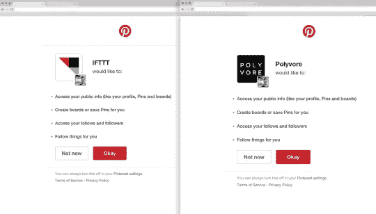
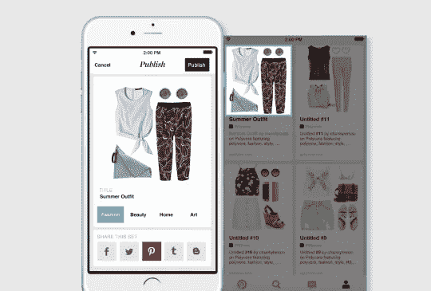

# 开发商:向我们的新网站问好！

> 原文：<https://medium.com/pinterest-engineering/developers-say-hello-to-our-new-site-5a77da692888?source=collection_archive---------3----------------------->

Josh Inkenbrandt | Pinterest 产品经理

我们最近宣布了 Pinterest 开发者平台，这是一个用于构建集成和应用的 API，可以帮助人们在线和离线使用 pin 做更多的事情。现在，为了帮助开发者创造最好的体验，我们对我们的[开发者网站](https://developers.pinterest.com/)进行了改版。

在我们的新网站上，您可以找到文档、下载和工具，您甚至可以使用该网站提交您的想法。(在提交之前，请确保您已经阅读了我们添加到网站上的所有[指南](https://developers.pinterest.com/terms/)和[政策](https://developers.pinterest.com/policy/)。)

需要灵感？查看 Pinterest 第一轮整合:

[IFTTT](https://ifttt.com/pinterest) :如果你使用 IFTTT，从今天开始你可以通过 Pinterest 频道将你的 Pinterest 账户连接到数百种产品和设备。使用 Pinterest 登录可以让你在 Instagram 上自动保存任何你喜欢的照片作为 Pin。它还可以与其他应用程序中的操作配合使用，如 Reddit upvotes、Etsy favorites 或任何其他在 IFTTT 上创建的 Pinterest“食谱”。

[Polyvore](http://www.polyvore.com/) :您还可以将您的 Polyvore 集无缝保存到 Pinterest。您制作的任何时尚、美容和家居装饰系列和套装都可以保存为图钉，直接从您的 iPhone、iPad 或台式机上保存。

Pinners 可以通过进入他们的 Pinterest 设置的应用程序部分随时删除访问权限。

我们才刚刚开始—如果您已经向我们发送了一个想法，但还没有收到我们的回复，我们将很快给您回复。到目前为止，我们已经收到了大量优秀的提交，我们期待着在未来几个月与开发人员社区合作！

***Josh Inkenbrandt****是开发者平台团队的产品经理。*

*获取 Pinterest 工程新闻和更新，关注我们的工程*[*Pinterest*](https://www.pinterest.com/malorie/pinterest-engineering-news/)*，* [*脸书*](https://www.facebook.com/pinterestengineering) *和*[*Twitter*](https://twitter.com/PinterestEng)*。有兴趣加入团队吗？查看我们的* [*招聘网站*](https://about.pinterest.com/en/careers/engineering-product) *。*