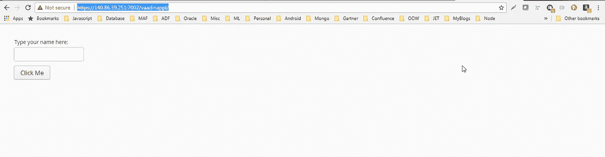

# 在 Oracle 云上开发和部署 Vaadin 应用程序

> 原文：<https://medium.com/oracledevs/developing-and-deploying-vaadin-applications-on-oracle-cloud-2733ea68ee80?source=collection_archive---------1----------------------->

这个博客帮助你理解使用[开发者云服务](https://cloud.oracle.com/developer_service)的 [Vaadin](https://vaadin.com/) 应用的构建和部署自动化。它将关注使用 Vaadin 框架的 web 应用程序的开发、构建和部署。


**注意:**关于如何开发 Vaadin 应用程序的详细信息，请查看这个[链接](https://vaadin.com/docs)，它提供了关于框架及其组件的详细信息。

## **使用的技术堆栈**

*   **Eclipse:** 用于 Vaadin 应用程序开发的 IDE
*   **应用框架:** Vaadin
*   **构建工具:** Maven
*   **Oracle 开发人员云服务:**用于 DevOps 自动化
*   **Oracle Java 云服务:**用于部署 Vaadin 应用程序的 Java EE 应用服务器

**关于瓦丁**

Vaadin 是一个 web 框架，它提供了轻松构建 web 应用程序所需的所有工具。它由 Vaadin 框架和 Vaadin 元素组成。我们可以将包含的基于聚合物的 Vaadin 元素与我们选择的框架一起使用，或者将其与 Vaadin 框架无缝集成并部署在 Java 服务器上。欲了解更多关于瓦丁的信息，请访问—[https://vaadin.com/](https://vaadin.com/)

**为什么是 Vaadin？**

*   **服务器驱动:**框架是服务器驱动的，所以所有逻辑都在服务器端处理。
*   **安全:**由于所有的逻辑都驻留在服务器端，客户端只发送消息，因此应用程序更加安全。
*   **UI 组件:**拥有丰富的 UI 组件集，作为 Vaadin 元素的一部分。
*   **集成:**它的组件与 Vaadin 框架分离，因此也可以与任何其他框架一起使用。
*   **多语言支持:**支持用运行在 JVM 上的任何语言编写业务逻辑和 UI，比如 Java、Scala 或 Kotlin

## **Vaadin 框架引导应用**

我们可以通过使用 maven 原型生成样例应用程序，我们将在博客中使用它。eclipse 中也支持 Maven 原型，因此项目支架也可以直接从 eclipse 中生成。否则，您可以生成项目支架，然后在 Eclipse 中导入它。下面是用于生成 Vaadin UI 应用程序支架的 maven 命令。

```
mvn -B archetype:generate -DarchetypeGroupId=com.vaadin -DarchetypeArtifactId=vaadin-archetype-application -DarchetypeVersion=8.1.5 -DgroupId=org.test -DartifactId=vaadin-app -Dversion=1.0-SNAPSHOT
```

**关于基于 Vaadin 的 UI 应用**

Vaadin UI 应用程序有一个 MyUI 类，它是应用程序的入口点，您可以根据自己的需求添加 UI 组件。

**Eclipse 中 Vaadin 应用程序的项目结构**


**来自 Vaadin UI 项目的突出文件**

MyUI.java**—**vaa din UI 应用程序将有一个 MyUI 类，这是应用程序的入口点，您可以在其中的 init 方法中添加 UI 组件。您还可以通过使用各自的注释来定义 servlet 和 servlet 配置。在 Vaadin 应用程序中，UI 可以代表浏览器窗口或嵌入了 Vaadin 应用程序的 HTML 页面的某个部分。使用{@link #init(VaadinRequest)}初始化 UI。此方法旨在被重写以向用户界面添加组件并初始化非组件功能。

```
**import** javax.servlet.annotation.WebServlet;
**import** com.vaadin.annotations.Theme;
**import** com.vaadin.annotations.VaadinServletConfiguration;
**import** com.vaadin.server.VaadinRequest;
**import** com.vaadin.server.VaadinServlet;
**import** com.vaadin.ui.Button;
**import** com.vaadin.ui.Label;
**import** com.vaadin.ui.TextField;
**import** com.vaadin.ui.UI;
**import** com.vaadin.ui.VerticalLayout;@Theme("mytheme")
**public** **class** MyUI **extends** UI {@Override
**protected** **void** init(VaadinRequest vaadinRequest) { **final** VerticalLayout layout = **new** VerticalLayout();
  **final** TextField name = **new** TextField();
  name.setCaption(“Type your name here:”);
  Button button = **new** Button("Click Me");
  button.addClickListener(e -> {
    layout.addComponent(**new** Label("Thanks"+name.getValue()+", it works!"));
  });
  layout.addComponents(name, button);
  setContent(layout);
}@WebServlet(urlPatterns="/*",name="MyUIServlet",asyncSupported=**true**)
@VaadinServletConfiguration(ui = MyUI.**class**, productionMode = **false**)
**public** **static** **class** MyUIServlet **extends** VaadinServlet {}}
```

这个文件包含了应用程序的主题。我们可以继续向它添加我们自己的主题规则。它导入 valo.css。除了这个文件之外，还有其他 css 文件，其中已经为应用程序定义了样式表。这些文件是，styles.css，styles.scss 和 addons.scss。这里给出的主题名称用于 MyUI.java by @ theme 注释，如上所示。如下面给出的代码片段所示，“mytheme”是主题的名称。

```
@import "../valo/valo.scss";@mixin mytheme { @include valo; // Insert your own theme rules here}
```

**pom.xml —** 这个 xml 文件定义了 Maven 构建 war 文件以部署在 Java 服务器上的包依赖性、先决条件和插件。

```
<?xml version=*"1.0"* encoding=*"UTF-8"*?><project xmlns=*"http://maven.apache.org/POM/4.0.0"* xmlns:xsi=*"http://www.w3.org/2001/XMLSchema-instance"*xsi:schemaLocation=*"http://maven.apache.org/POM/4.0.0 http://maven.apache.org/xsd/maven-4.0.0.xsd"*><modelVersion>4.0.0</modelVersion>
<groupId>org.test</groupId>
<artifactId>vaadin-app</artifactId>
<packaging>war</packaging>
<version>1.0-SNAPSHOT</version>
<name>vaadin-app</name><prerequisites>
   <maven>3</maven>
</prerequisites><properties>
  <vaadin.version>8.1.5</vaadin.version>  
  <vaadin.plugin.version>8.1.5</vaadin.plugin.version>  
  <jetty.plugin.version>9.3.9.v20160517</jetty.plugin.version>   
   <project.build.sourceEncoding>UTF-8  
   </project.build.sourceEncoding>  
  <maven.compiler.source>1.8</maven.compiler.source>  
  <maven.compiler.target>1.8</maven.compiler.target><!-- If there are no local customizations, this can also be "fetch" or "cdn" -->
  <vaadin.widgetset.mode>local</vaadin.widgetset.mode>
</properties><repositories>
  <repository>
    <id>vaadin-addons</id>
    <url>http://maven.vaadin.com/vaadin-addons</url>
  </repository>
</repositories><dependencyManagement>
<dependencies>
<dependency>
<groupId>com.vaadin</groupId>
<artifactId>vaadin-bom</artifactId>
<version>${vaadin.version}</version>
<type>pom</type>
<scope>import</scope>
</dependency>
</dependencies>
</dependencyManagement><dependencies><dependency>
<groupId>javax.servlet</groupId>
<artifactId>javax.servlet-api</artifactId>
<version>3.0.1</version>
<scope>provided</scope>
</dependency><dependency>
<groupId>com.vaadin</groupId>
<artifactId>vaadin-server</artifactId
</dependency><dependency>
<groupId>com.vaadin</groupId>
<artifactId>vaadin-push</artifactId>
</dependency><dependency>
<groupId>com.vaadin</groupId>
<artifactId>vaadin-client-compiled</artifactId>
</dependency><dependency>
<groupId>com.vaadin</groupId>
<artifactId>vaadin-themes</artifactId>
</dependency>
</dependencies><build>
<plugins>
<plugin>
<groupId>org.apache.maven.plugins</groupId>
<artifactId>maven-war-plugin</artifactId>
<version>3.0.0</version>
<configuration><failOnMissingWebXml>false</failOnMissingWebXml><!-- Exclude an unnecessary file generated by the GWT compiler. --><packagingExcludes>WEB-INF/classes/VAADIN/widgetsets/WEB-INF/**</packagingExcludes></configuration>
</plugin><plugin>
<groupId>com.vaadin</groupId>
<artifactId>vaadin-maven-plugin</artifactId>
<version>${vaadin.plugin.version}</version>
<executions>
<execution>
<goals>
<goal>update-theme</goal>
<goal>update-widgetset</goal>
<goal>compile</goal>
<!-- Comment out compile-theme goal to use on-the-fly theme compilation -->
<goal>compile-theme</goal>
</goals>
</execution>
</executions>
</plugin><plugin>
<groupId>org.apache.maven.plugins</groupId>
<artifactId>maven-clean-plugin</artifactId>
version>3.0.0</version>
<!-- Clean up also any pre-compiled themes -->
<configuration>
<filesets>
<fileset>
<directory>src/main/webapp/VAADIN/themes</directory>
<includes>
<include>**/styles.css</include>
<include>**/styles.scss.cache</include>
</includes>
</fileset>
</filesets>
</configuration>
</plugin><!-- The Jetty plugin allows us to easily test the development build by running jetty:run on the command line. --><plugin>
<groupId>org.eclipse.jetty</groupId>
<artifactId>jetty-maven-plugin</artifactId>
<version>${jetty.plugin.version}</version>
<configuration>
<scanIntervalSeconds>2</scanIntervalSeconds>
</configuration>
</plugin>
</plugins></build><profiles>
<profile>
<!-- Vaadin pre-release repositories -->
<id>vaadin-prerelease</id>
<activation>
<activeByDefault>false</activeByDefault>
</activation><repositories>
<repository>
<id>vaadin-prereleases</id>
<url>http://maven.vaadin.com/vaadin-prereleases</url>
</repository>
<repository><id>vaadin-snapshots</id>
<url>https://oss.sonatype.org/content/repositories/vaadin-snapshots/</url>
<releases>
<enabled>false</enabled>
</releases><snapshots>
<enabled>true</enabled>
</snapshots>
</repository>
</repositories><pluginRepositories>
<pluginRepository>
<id>vaadin-prereleases</id>
<url>http://maven.vaadin.com/vaadin-prereleases</url>
</pluginRepository>
<pluginRepository>
<id>vaadin-snapshots</id>
<url>https://oss.sonatype.org/content/repositories/vaadin-snapshots/
</url>
<releases>
<enabled>false</enabled>
</releases><snapshots>
<enabled>true</enabled>
</snapshots></pluginRepository>
</pluginRepositories>
</profile>
</profiles>
</project>
```

**构建配置:**

下面是 **VaadinBuild、**的构建作业配置截图，它将执行 Maven build 来构建 war 文件并将其部署在 Oracle Java Cloud Service 上。

为构建作业选择一个名称。对于这个博客，我将其命名为“ **VaadinBuild** ”。从 JDK 下拉列表中选择 JDK 8 作为选项，如下图所示:


选择已上传 Vaadin UI 应用程序相关文件的存储库。


这里我们将 SCM 轮询设置为触发器。这确保了每次我们将代码上传到 Git 存储库时，都会触发**‘VaadinBuild’**build**作业，如博客中的构建触发图所示。**

****

**我们将使用指向 pom.xml 项目的 Build Steps 选项卡中的 Maven3 构建步骤。**

****

**然后使用下面的构建后配置，将 Maven build 构建的 war 作为 VaadinBuild 作业执行的一部分进行归档。**

****

**在执行“VaadinBuild”构建作业时，控制台日志如下所示:**

****

**在执行“VaadinBuild”构建作业时，会生成部署 war 文件，可以在“Vaadin Build”构建作业仪表板中看到该文件。**

****

****部署配置****

**为了部署生成的 Vaadin UI war 文件，我们将在 Oracle Developer Cloud 的 deploy 菜单中配置 Oracle Java Cloud Service 部署配置，如下所示。**

****

**在 Oracle Java Cloud Service 上发布 war 文件的部署后，vaadinappl 将显示部署成功状态，如下图所示。**

****

**下面是访问该应用程序的 URL。IP 将是您在部署配置中配置的 JCS 实例的公共 IP 地址。**

**[https://140 . xx . xx . 251:7002/vaadinapl/](https://140.xx.xx.251:7002/vaadinappl/%20%0dOn%20accessing%20the%20URL%20in%20a%20browser,%20below%20application%20UI%20would%20come%20up:%0d#)**

**在浏览器中访问 URL 时，会出现下面的应用程序 UI:**

************

**编码快乐！**

*** *本文表达的观点是我个人的观点，不一定代表甲骨文的观点**