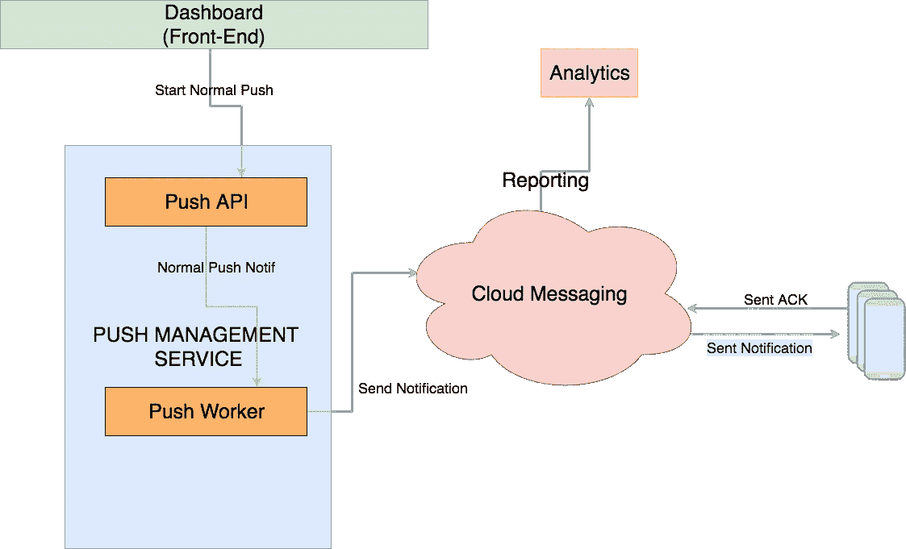
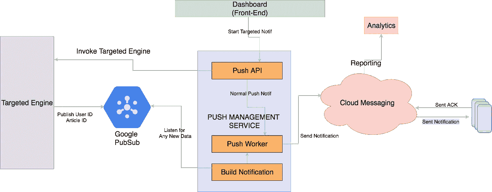
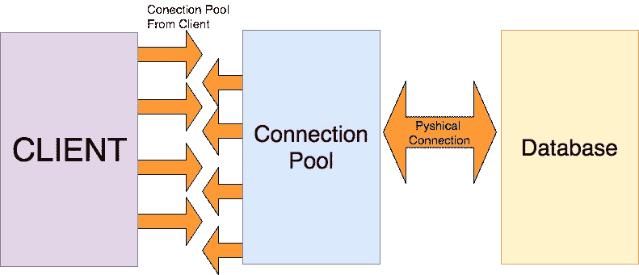
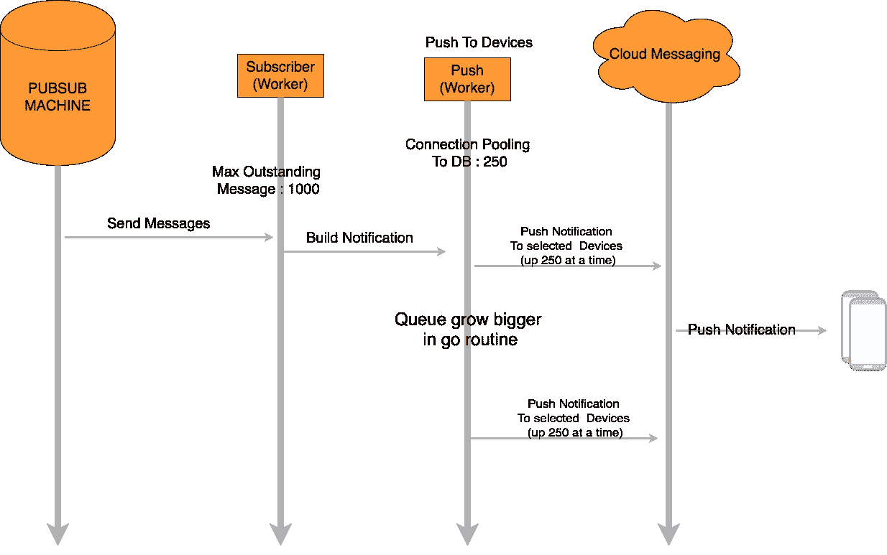
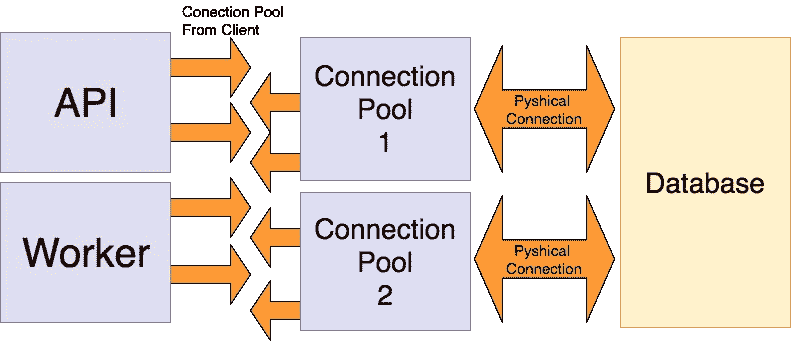
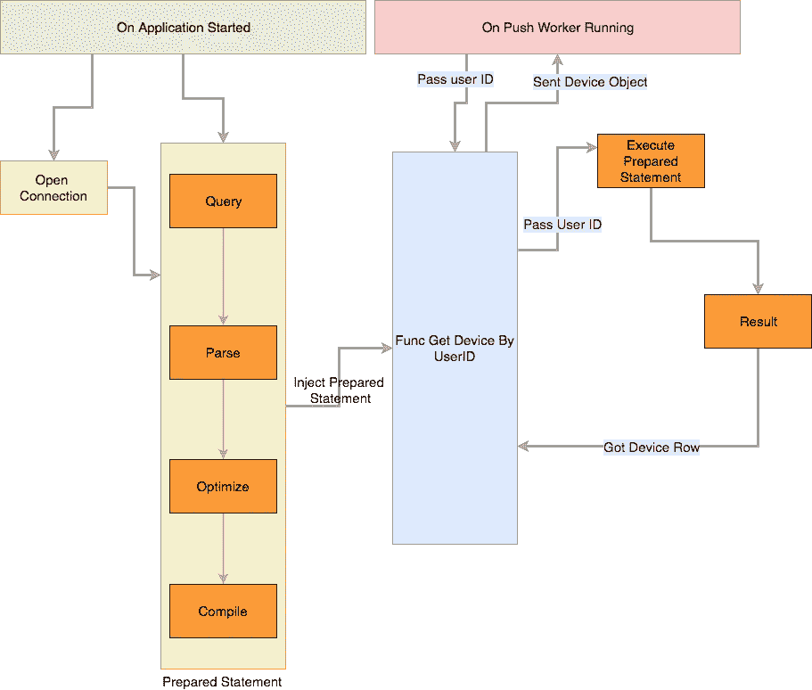

# 为目标推送通知开发后端

> 原文：<https://medium.easyread.co/developing-backend-for-targeted-push-notification-6b605c522c29?source=collection_archive---------1----------------------->

## 一个我们如何在 Kurio 从后端开发目标推送通知服务的故事。

几周前，我们在 [Kurio](https://kurio.co.id/) ，正在开发一个新功能。是推荐/定向推送通知。这与我们当前的推送通知系统不同，在当前的推送通知系统中，推送通知是基于我们所拥有的数据发送给所有用户的。通过此功能，每个用户都可以获得不同的推送通知。

## 我们的工具

*   Go (1.8)
*   关系型数据库
*   Google Coud 发布订阅
*   云消息传递(GCM，APNS)

# 它是如何工作的

我们的旧系统如果画成图可能是这样的:



Kurio Normal Push

这是普通推送通知的工作方式。我们根据关于文章的数据选择一篇文章进行推送，然后从仪表板启动推送通知，这将触发“推送管理”服务。基于推送，每个用户将获得相同的推送通知。

然后，我们决定通过发送有针对性的推送来改进它，这样每个用户都可以根据他们之前阅读的内容获得不同的推送通知。

这个过程看起来像这样:



Kurio Targeted Push Notification

这个新系统看起来更复杂，因为它使用一个外部服务来根据用户的读数提供`user_id`和`article_id`。
由于处理所有用户以获得有针对性的推送通知需要一些时间，并且数据会非常大，所以我们决定使用 Google Cloud PubSub。通过使用 PubSub，我们可以在处理完每个用户后立即开始发送通知。

# 挑战

当我们决定定向推送通知时，我们面临的挑战是与外部定向系统集成。外部目标系统可以按需生成`user_id`和`article_id`的元组。并且该目标系统可能需要一些时间来进行一些处理。然后，我们需要定义我们希望如何使用这些数据，因为这些数据可能很大。

# 从 Pubsub 计算机监听

考虑到这些挑战，我们决定使用 Google Cloud PubSub。
以便外部目标系统可以从容不迫，只要准备好就发布`user_id`和`article_id`的元组。那么我们只需要一个订阅者来听这个话题。

然后，我们的工作人员获得必要的数据来构建通知。在这种情况下，我们需要的数据是文章的细节(标题、缩略图等。)和用户的设备信息(推送令牌)。

由于我们的微服务架构，我们可以从管理这些数据的服务中获得文章的细节。对于用户的设备信息，我们已经有了自己的数据库。

## 首次尝试

所以在我们完成代码之后，我们在生产环境中测试这个系统。对于几百个用户来说，系统仍然运行良好。扩大用户数量后，灾难就发生了。

我们得到了`Too Many Connection`错误。当我们为每条消息生成一个 goroutine 时，就会发生这种情况。随着 goroutine 数量的增加，Mysql 的连接数也在增加，最终达到了极限。

# 创建连接池

在意识到这个错误之后，我们从 golang 自身设置了一个数据库的最大连接池。我们设置最大开放连接和最大空闲连接。看这里:[http://go-database-sql.org/connection-pool.html](http://go-database-sql.org/connection-pool.html)



Kurio Connection Pooling

```
dbConn.SetConnMaxLifetime(1 * time.Minute)
dbConn.SetMaxIdleConns(10)
dbConn.SetMaxOpenConns(250)
```

当设置这个的时候，我们必须知道的是不要设置超过 Mysql 处理能力的最大开放连接数。在我们的实例中，我们的数据库可以处理多达 300 个连接。

## 第二次尝试

设置连接池之后，现在我们处理`Too Many Connections`的错误。但是我们意识到奇怪事情发生了。我们的消息队列已经在 pubsub 机器中清空，但是我们的 worker 仍然在运行处理数据。这需要一个漫长的过程。找到原因后，我们知道我们在 golang 中使用的库有默认的`Maximum Outstanding Message : 1000`

这个突出的消息意味着，我们的项目接受多达 1000 条消息。这解释了为什么订阅已经清空了，但是我们的 worker 仍然运行了很长时间。

# 设置 MaxOutstandingMessage

为了减少 worker 中的队列，我们发现未处理的消息比数据库的连接要大。这使得我们的围棋套路越来越大。因为我们只使用大约 60K 的消息进行测试，所以 goroutine 可能仍然能够处理，因为 goroutine 很小，而且在资源上很便宜。但是，如果我们显著增加用户数量，接下来会发生什么呢？



Before enhanced Max Outstanding Message in Pubsub Client

为了处理这个问题，我们设置了推送工作器可以处理的最大未完成消息。通过这样做，我们的队列不会变得太大，因为内存占用也会增加。


Reduce the Max Outstanding Message

因为消息传入的速度比查询 DB 以获取基于每个用户的活动设备的速度快，所以我们将最大未处理消息减少到 100，比默认值低 10%。

这有助于我们减少工作线程中运行的线程数量。

## 第三次尝试

做了这些改进后，我们再次尝试。我们优化了东西，现在运行得很好。但是还有其他问题，一个新的意想不到的问题。

在运行改进后，我们发现了另一个问题。我们的系统是推送管理服务，因此，除了向 GCM/APNS 发送推送通知之外，我们还有一个 API，在 API 端提供过去通知的列表。

我们的仪表盘和移动应用程序都在使用这项服务。问题是，当我们的工作人员发送目标推送时，我们无法访问该 API。它会一直等待，直到最后超时。

我们开始对它的成因感到困惑。经过一些调查，我们终于意识到，只有当工作人员正在发送有针对性的推送通知时，才会发生这种情况。结果是工作人员已经用完了所有的 Mysql 连接池，并让 API 等待连接池的连接。

# 独立的 Mysql 客户端

为了解决这个问题，考虑到交付目标(也就是最后期限)，我们决定将 API 和 worker 的 Mysql 客户端分开，这样它们都可以独立地获得各自的连接池。

所以现在我们在一个项目中有 2 个 Mysql 客户端



Create 2 Mysql Client Connection

相反，我们使用单个客户端供整个系统使用，我们将数据库分成 2 个客户端。

客户端 1 将由 API 系统用于提供仪表板和移动应用。客户端 2 将由推送工作器使用。

然后，我们将 API 端的最大连接数设置为低于 worker 端。由于工人端需要每个用户一个连接，我们需要快速发送，它将需要池中更多的连接。

通过这种设置，即使我们正在发送有针对性的推送通知，仪表板和移动应用程序也可以访问 API。

## 第四次尝试

然后第四次，我们再试一次。运行目标推送通知。

现在，我们可以调用 API 推送管理，仪表盘运行良好，即使我们正在进行有针对性的推送通知。

但是…

我们发现有些奇怪的行为。这与逻辑无关。现在一切都运行良好。但是对于单个通知，将消息发送到云消息可能需要长达 3 个小时。真的真的好长。查看日志后，我们可以看到获取每个用户的设备信息的查询花费了很长时间。

WTF！！！！

# 改进查询:使用索引

然后我们开始调查这个查询。事实证明，一个查询至少需要 30 秒。真的吗？

问题不是因为我们没有索引。我们的表中已经有了一个索引。但这就像 Mysql 没有使用正确的索引，也是因为我们的查询速度慢。

```
SELECT `token` FROM device  WHERE `id` IN ( SELECT max(`id`) as `id` FROM device WHERE `deleted_at` IS NULL AND `user_id` IN ("***userIDs*** ")  GROUP BY uuid )
```

为了改进查询，我们编写了一个新的查询。因为我们只需要一台最新设备，所以我们将其更改为:

```
SELECT `token`
 FROM device **USE INDEX** (user_id)
 WHERE `user_id` = ?
  AND `deleted_at` IS NULL
 ORDER BY id DESC
 LIMIT 1
```

通过这个查询，我们迫使 Mysql 使用正确的索引。这为我们节省了大量的查询时间。使用新的查询，现在只需要大约 30 毫秒

万岁！！！！

## 速度更快，做准备语句

甚至在获得我们想要的查询速度之后，我们还做了一些额外的改进。



Kurio Prepared Statement Querying

每次查询时(打开连接、创建查询、执行查询)，我们不需要重做一堆过程，而是通过使用准备好的语句来简化它。我们准备了关于申请开始的声明。然后将该语句注入到将由推送工作器调用的函数中。

在 main 函数中，我们打开连接并准备语句

```
dsn := "kurio:someofpassword@tcp(127.0.0.1:3306)/push_notification?parseTime=1&loc=Asia%2FJakarta"dbConn, _ := sql.Open(`mysql`, dsn)**StmtGetDevicesByUserID**, err:= dbConn.**Prepare**(queryGetDeviceByUserID)*// stmtGetDevicesByUserID : will injected to function GetDeviceByUserID*
```

准备好后，语句`StmtGetDevicesByUserID`将被注入到检索设备的函数中。然后在这个函数中，我们只执行准备好的语句。

```
func (repo *Repository)GetDeviceByUserID(userID int64) *Device{row:= repo.**StmtGetDevicesByUserID**.QueryRow(userID)device:= &Device{}
err:= row.Scan(
  &device.Token)
return device
}
```

因此，当每个工人从 Google Pubsub 获得新消息时，它现在只传递用户 ID。因为查询和样板文件已经准备好了。

## 缓存和 HTTP 配置

对于文章服务的 HTTP 调用，我们使用一些缓存机制，因为可能会有一些用户获得相同的文章。因此，为了减少对我们的文章服务的 HTTP 调用，我们添加了内存缓存，它将在特定时间内过期(例如 10 分钟)。

我们在这里使用了开源的内存 golang 缓存[https://github.com/patrickmn/go-cache](https://github.com/patrickmn/go-cache)

并在 HTTP 默认传输中进行一些配置

```
timeout := 2 * time.Second
keepAliveTimeout := 100 * time.Second 
defaultTransport := &http.Transport{
  Dial: (&net.Dialer{
   KeepAlive: keepAliveTimeout,
  }).Dial,
  MaxIdleConns:100,
  MaxIdleConnsPerHost:600,
 }client:= &http.Client{
   Transport: defaultTransport,
   Timeout:   timeout,
  }
```

这用于优雅地处理 HTTP 调用和超时。
关于这一点的更多解释，你可以在 cloudfare 的这篇博文中读到:[https://blog . cloud flare . com/The-complete-guide-to-golang-net-http-time outs/](https://blog.cloudflare.com/the-complete-guide-to-golang-net-http-timeouts/)

# 结论

在开发这个特性的几个星期后，我学到了很多东西，也学到了很多可以帮助我改进代码的东西

*   围棋套路小而便宜，但正因为它们的便宜，我们必须小心翼翼地去照顾它们，尤其是在处理人脉等的时候。
*   目前，由于截止日期，我们分开了两个客户，因为我们公司想做一些关于定位系统的初步测试。目前，我们对此没有任何问题。如果这发生了一些意想不到的事情，我们将稍后进行更改，并在此更新。
*   如果你认为你可以改善这一点，以获得更好的优化，只需向 join@kurio.co.id 问好😄

感谢 [Andrew Ongko](https://medium.com/u/c4a88043f0b0?source=post_page-----6b605c522c29--------------------------------) 、 [Rifad Ainun Nazieb](https://medium.com/u/c244e0555136?source=post_page-----6b605c522c29--------------------------------) 、 [Arie Ardaya Lizuardi](https://medium.com/u/3c688feb6ac4?source=post_page-----6b605c522c29--------------------------------) 以及所有参与 [Kurio](https://kurio.co.id/) 的团队。

如果你认为这值得一读，就在你的 twitter、facebook 等上分享，这样其他人也可以阅读。如果你有任何问题，你可以在下面回复或者发邮件给我[](mailto:iman.tumorang@gmail.com)

**[](https://toolbox.kurio.co.id) [## Kurio 工具箱

### 来自你友好的邻居 Kurio 的工程相关的笔记

toolbox.kurio.co.id](https://toolbox.kurio.co.id) [](https://toolbox.kurio.co.id/implementing-grpc-service-in-golang-afb9e05c0064) [## 在戈兰实施 gRPC 服务

### 指南，使 gRPC 服务使用清洁的建筑在果兰。

toolbox.kurio.co.id](https://toolbox.kurio.co.id/implementing-grpc-service-in-golang-afb9e05c0064) [](https://hackernoon.com/golang-clean-archithecture-efd6d7c43047) [## 在 Golang 尝试干净的建筑

### 独立的、可测试的和干净的

hackernoon.com](https://hackernoon.com/golang-clean-archithecture-efd6d7c43047)**