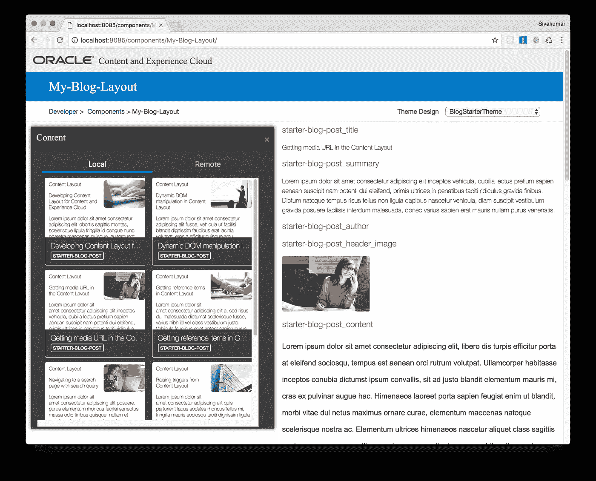

# 为内容和体验云开发内容布局

> 原文：<https://medium.com/oracledevs/developing-content-layouts-for-content-and-experience-cloud-a81bdbf39f62?source=collection_archive---------0----------------------->

# 先决条件

请参考上一篇文章[使用站点工具包开发内容和体验云(CEC)](/oracledevs/developing-for-content-and-experience-cloud-cec-using-sites-toolkit-ed9e27d9a703),了解站点工具包和安装的介绍。这篇文章假设*项目创建和安装*步骤已经完成。

# 内容布局

内容布局帮助用户通过网站页面中使用的内容列表或内容占位符组件查看内容项目中的数据。您可以为一种内容类型创建多个内容布局，以创建不同的视图或表示内容项目的不同部分。在本帖中，我们将探讨如何使用 Sites Toolkit 来开发内容布局。

# 创建内容布局

要创建内容布局，需要内容类型。名为 BlogTemplate 的模板具有“Starter-Blog-Post”内容类型。让我们从 BlogTemplate 创建一个名为“Starter-Blog-Template”的模板。

```
cec create-template Starter-Blog-Template -f BlogTemplate
```

现在为“Starter-Blog-Post”内容类型创建一个内容布局。

```
cec create-contentlayout My-Blog-Layout -c Starter-Blog-Post -t Starter-Blog-Template
```

选项:
—内容类型，-c <内容类型>内容布局基于【必需】

— template，-t<template></template>

— layoutstyle，-s 

我的博客布局将在 src/main/components/My-Blog-Layout 下创建。另外，将内容布局映射添加到 Starter-Blog-Template 中。

```
cec add-contentlayout-mapping My-Blog-Layout -c Starter-Blog-Post -t Starter-Blog-Template -s Summary
```

# 对内容布局进行简单更改

您可以在生成的内容布局中编辑以下文件，以修改内容布局。

*   assets/layout.html
*   assets/design.css
*   assets/render.js

要进行简单的 UI 更改，您只需要更改 assets/layout.html 和 assets/design.css。

# 对内容布局进行高级更改

要为内容布局添加更多动态行为，您可以编辑 assets/render.js。本节探究 src/main/components/My-Blog-Layout/assets/render . js 中的代码。

## 要求模块定义

RequireJS 模块在 render.js 文件中定义。Sites 加载依赖项，比如 JQuery、Mustache、RequireJS 文本插件和 RequireJS CSS 插件。mustache 模板系统用于呈现布局。但是你可以使用任何图书馆。

```
define([ 'jquery',
 'mustache',
 'text!./layout.html',
 'css!./design.css'
 ], function ($, Mustache, templateHtml, css) {
   // Content layout code goes here
 }
```

内容布局的 assets/render.js 文件具有以下属性:

*   它应该是一个必需的模块
*   它应该返回一个 JavaScript 构造函数。Sites 通过传递一个参数对象来调用构造函数。参数对象具有呈现布局所需的内容项数据和 API。
*   这个构造函数应该有一个 render(parentObj)方法来处理内容布局的呈现。这个函数应该将内容布局 DOM 对象附加到传递给 render()方法的 parentObj 对象上。
*   RequireJS 模块可以使用依赖项，包括 JQuery、Mustache、RequireJS 文本插件和 RequireJS CSS 插件。这些依赖项将由网站加载。您也可以使用其他库。

## 构造函数参数

当 Sites 创建构造函数的一个新实例时，它传递一个包含 *contentItemData* 、 *scsData* 和 *contentClient* 的参数来帮助内容布局开发。

以下是构造函数、render()方法和返回的示例代码:

```
// Constructor functionfunction ContentLayout(params) {
 this.contentItemData = params.contentItemData || {};
 this.scsData = params.scsData;
 this.contentClient = params.contentClient;
}// PrototypeContentLayout.prototype = { contentVersion: ">=1.0.0 <2.0.0", render: function (parentObj) {
    var template,
    content = $.extend({}, this.contentItemData),
    scsData = this.scsData,
    contentClient = this.contentClient,
    contentType,
    secureContent = false; //  Merge the properties from params.scsData into
    //  content, so the template can make use of them too. if (this.scsData) {
      content = $.extend(content, {
      "scsData": this.scsData
    });
    //.... }
  //....
}return ContentLayout;
```

构造函数参数包括以下对象:

`**params.contentItemData**`:包含内容项，包括名称、描述、ID 和数据。例如，可以使用 params . contentitemdata . data[' blogpost _ title ']访问内容项中的字段`blogpost_ title`。

`**params.scsData**`:当从站点内部调用构造函数时，这个对象传递信息。第三方应用程序中呈现的内容布局不存在此对象。该对象包含 SitesSDK、引发触发器的 contentTriggerFunction 方法以及详细信息页面链接。

`**params.contentClient**`:这是从 Content Delivery SDK 创建的 contentClient 对象。因此，它配置了内容服务器的适当参数。如果需要对 content server 进行额外的调用，可以使用这个 contentClient 对象，而不是创建自己的对象。该对象包含内容的客户端 API。API 可用于查询、搜索和获取内容项及其内容类型。其他助手 API 也是可用的；例如，expandMacros()扩展富文本中使用的宏。

## 呈现内容布局

`ContentLayout`的`render(params)`方法从模板中呈现内容布局。默认情况下，Mustache 模板用于内容布局，但是您可以使用任何想要的模板技术。

`ContentLayout`的`render(params)`方法可以使用下面的代码来呈现带有数据的模板:

```
try {
    // Mustache
    template = Mustache.render(templateHtml, content);
    if (template) {
        $(parentObj).append(template);
    } // Dynamic DOM Manipulation can be done here} catch (e) {
    console.error(e.stack);
}
```

您可以将所需的数据添加到从`params.contentItemData`创建的`content`对象中。呈现的模板应该附加到传递给`render()`方法的父对象上。

## 获取参考项目

您可以通过引用另一个内容类型的引用数据字段来获取某个内容类型的引用项目。

例如，Blog-Post 内容类型中的`starter-blog-post_author`字段是对`Author`内容类型的引用。`this.getRefItems()`方法可以用来查询被引用的项目。

```
if (data["starter-blog-post_author"]) { referedIds[referedIds.length] =
               data["starter-blog-post_author"].id;}//..
this.getRefItems(referedIds).then(*function* (*results*) { *var* items = results && results.items || []; // use the reference items
```

## 获取媒体 URL

您可以使用`contentClient.getRenditionURL()`来获得数字资产的默认呈现，比如图像。

```
blogImageRenditionURL: contentClient.getRenditionURL({ 'id': data['starter-blog-post_header_image'].id})
```

如果您需要其他再现，如`thumbnail`，您可以使用`contentClient.getItems()`获取数字资产，并参考`item.data.renditions.default`和`item.data.renditions.thumbnail`。

## 引发触发器

您可以使用`scsData.contentTriggerFunction(payload)`从内容布局中触发一个触发器。

## 获取富文本字段

如果内容类型具有富文本字段，并且内容布局将在内容列表中使用，请再次查询该项目以检索富文本字段。此外，如果富文本中有嵌入的图像，请使用 expandMacros()。

```
// query the item again to get the rich text fieldscontentClient.getItem({ "id": content.id}).then(*function* (*itemdata*) { content = itemdata; //.. data["starter-blog-post_content"] =
      contentClient.expandMacros(data["starter-blog-post_content"]);
```

## 链接到详细信息页面

当前内容项的详情页链接通过`scsData.detailPageLink`可用。

## 为其他内容项目详细信息页面生成 URL

有时，当前内容项引用其他相关内容项，您希望获得这些内容项的详细信息页面 URL。可以使用下面的函数。

```
function getDetailsRelatedPageLink(scsData, reatedContentItemData) {
    // Get the parts of the current detail link
    var uriParts = scsData.detailPageLink.split('/');
    var length = uriParts.length; // Fill the details of the related content item
    uriParts[length - 1] = reatedContentItemData.name;
    uriParts[length - 2] = reatedContentItemData.id;
    uriParts[length - 3] = reatedContentItemData.type; // Got the url
    return uriParts.join('/');
}
```

## 在 CEC 内容布局中生成本地资产的 URL

有时，您可能希望使用内容布局本身中本地可用的静态资产，例如用于样式化目的的背景图像。例如，在下面的内容布局中，可以在 render.js 中生成 images/background.jpg 的绝对 URL，并在 layout.html 中使用。

生成绝对 URL 的最简单方法是使用内置的 RequireJS 模块。将“require”定义为依赖项，并使用[**require . tourl()**](http://requirejs.org/docs/api.html#modulenotes-urls)生成 URL，如下所示。

```
define([
    '**require**',
    'jquery',
    'mustache',
    'text!./layout.html',
    'css!./design.css'
], function (**require**, $, Mustache, templateHtml, css) {
    'use strict’; *var* imageURL = req.toUrl('./images/building.jpg');
```

# 测试内容布局

当您在编辑器中修改代码时，您可以在本地测试工具中测试内容布局。因为内容项在 Starter-Blog-Template 中是本地可用的，所以选择 local 并选择要预览的主题设计。您还可以在 Starter-Blog-Template 中测试内容布局。



Testing a content layout in local test harness

# 评论家

感谢**邦妮·沃恩**、**伊戈尔·波利亚科夫**、**卡迈勒·卡普尔、**和**史蒂夫·伯恩斯**审阅本文。

# 参考:

[**为 Oracle 内容和体验云开发**](https://docs.oracle.com/en/cloud/paas/content-cloud/developer/index.html)