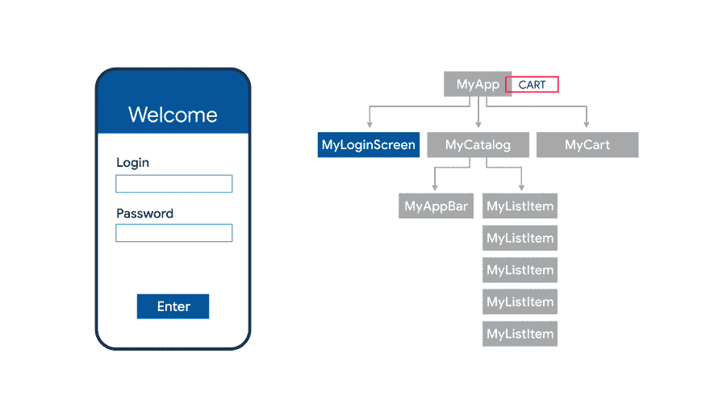

# 通过 Flutter 使用单一代码库开发跨平台(Android/iOS)应用

> 原文：<https://medium.com/walmartglobaltech/developing-cross-platform-android-ios-apps-using-a-single-codebase-with-flutter-f380ff15303a?source=collection_archive---------1----------------------->

[source: medium](https://miro.medium.com/max/3252/1*YWLkxromkAfNXyro145prw.png)

嘿，伙计们，当我们又经历了一周的隔离期时，我想到了偏离我们的 Scala 轨道( [*微服务*](/walmartlabs/type-safe-rest-services-in-scala-with-http4s-cats-io-288d6e23a90a) 、 [*IO 单子*](/walmartlabs/understanding-io-monad-in-scala-b495ca572174) 、 [*宏*](/walmartlabs/an-introduction-to-scala-macros-908ee8752bd5) )，探索一些新的&令人兴奋的东西。

随着智能手机用户数量的不断增加，企业不得不更加关注持续改善用户的应用体验。根据谷歌 的一项 [*调查，一个智能手机用户一次在他们的设备上有大约 35 个应用程序。随着谷歌 Play 商店苹果应用商店的应用市场超过 100 万，争夺第一的竞争越来越激烈。*](https://www.thinkwithgoogle.com/data/average-number-of-apps-on-smartphones/)

在现有的实践中，开发者不仅要为 Android 和 iOS 编写单独的代码(用两种不同的语言)，还要不断更新这两种语言以跟上最新的功能。不言而喻，开发者必须在两个不同的平台上保持统一的应用体验。

唷！对于任何考虑应用程序开发或开始基于应用程序的创业的人来说，这似乎已经足够令人沮丧了。但是不要害怕，颤振是来救援的…

[source: Pinterest](https://i.pinimg.com/originals/fb/91/c1/fb91c151ecb1d11f8ff79e9758b9a960.jpg)

[***Flutter***](https://flutter.dev/)是谷歌的移动 UI 框架，它为开发者提供了一种快速而富有表现力的方式，使用单一代码库在两种系统上构建原生应用。

那似乎很棒。但是它到底是如何工作的呢？

High-level Flutter internals

在 Flutter 中的开发是用[***Dart***](https://dart.dev/)编程语言完成的(与任何其他 OOP 语言非常相似)。代码以本机方式编译，并使用 GPU 来呈现统一的 UI。此外，它还可以原生访问 GPS &蓝牙等平台 API。

还有，开发 is Flutter 大多只是一个[***widgets***](https://flutter.dev/docs/development/ui/widgets-intro)的构成，这些都是一个 Flutter app 的积木。

[source: dev.to](https://res.cloudinary.com/practicaldev/image/fetch/s--gCy5MuRs--/c_limit%2Cf_auto%2Cfl_progressive%2Cq_66%2Cw_880/https://thepracticaldev.s3.amazonaws.com/i/q0m1c1s77u7uky4zwh2m.gif)

这种小部件组合模式不仅简单，而且可以缩短开发周期，而且一次开发的小部件可以在多个应用程序中重用。此外，小部件还确保了跨 Android 和 iOS 设备的统一呈现，以及开发人员访问设备原生服务的统一 API。

我敢打赌，你现在一定很兴奋在 Flutter 中开发你的第一个应用程序。我们将从构建一个简单的时钟应用程序开始。欢迎来到飞镖这边！(双关语:P)

我将在这个演示中使用安装了 Flutter 插件的 Android Studio。

Create a new Flutter project

一旦你创建了一个新的颤振项目，导航到" ***main.dart"*** 文件。在 Java 术语中，这是带有 ***main()*** 方法的类。

在开始开发之前，您还需要创建一个 Android 虚拟设备，您可以通过 [*这个*](https://developer.android.com/studio/run/managing-avds) 链接来完成。

[source: developer.android.com](https://developer.android.com/studio/run/managing-avds)

现在，我们可以开始真正的编码了。

我们将组成一些部件，以获得我们的最终应用程序。考虑到这篇文章的简短，我将只给出一个小部件的简要说明，但是如果你想了解更多，我会链接官方文档。同样，出于同样的原因，我不会在每一步之后都链接虚拟设备的截图，但通过在你自己的系统中尝试，会使这篇文章更具互动性。

我们将从创建一个名为 Clock 的 [***无状态小部件***](https://api.flutter.dev/flutter/widgets/StatelessWidget-class.html) 类开始。这是我们构建应用程序的所有逻辑所在的类。此外，为了确保 OOTB 与材料设计的集成，我们将在[***material app***](https://api.flutter.dev/flutter/material/MaterialApp-class.html)小部件中封装时钟小部件。

我们的时钟小部件的构建函数负责在屏幕上实际呈现内容。由于我们在这里返回了一个空的 [***容器***](https://api.flutter.dev/flutter/widgets/Container-class.html) 小部件，我们的应用程序也将在虚拟设备上呈现一个空白屏幕。

我们现在将添加 [***脚手架***](https://api.flutter.dev/flutter/material/Scaffold-class.html) 小部件以在我们的应用程序中引入布局，然后使用 [***文本***](https://api.flutter.dev/flutter/widgets/Text-class.html) 小部件在屏幕上呈现当前时间。为了集中对齐我们的渲染，我们将使用 [***中心***](https://api.flutter.dev/flutter/widgets/Center-class.html) 小部件封装文本小部件，并使用 ***样式*** 属性添加一些字体样式。

如果你重新加载应用程序，你将能够在屏幕上看到当前的时间。但是，还有一个问题:时间没有更新。这是因为我们的时钟小部件扩展了无状态小部件类。为了维护和更新应用程序的状态，我们需要扩展有状态小部件类。

同样，我们需要使用[***initState()***](https://api.flutter.dev/flutter/widgets/State/initState.html)方法定义初始状态，为了更新时间，我们将使用[***timer . periodic()***](https://api.dart.dev/stable/2.8.2/dart-async/Timer/Timer.periodic.html)函数。让我们这样做:

这里的***timer . periodic()***函数，以每秒触发的 [***lambda 表达式***](https://en.wikipedia.org/wiki/Anonymous_function) ***，*** 为参数，更新我们 App 的状态。现在，如果你重新加载应用程序，你将能够看到时间每秒都在更新。

现在让我们继续添加背景图片。但为了让这更有趣，让我们添加一些逻辑，这样我们的应用程序就可以根据一天中的时间来改变它的背景。

我们首先需要将图片添加到根目录下的 ***资产*** 文件夹中，并更新[***pub spec . YAML***](https://dart.dev/tools/pub/pubspec)文件中的*资产*键。这个文件类似于你在一个节点项目中的 ***package.json*** 文件。在这里，我添加了两张白天和晚上的图片。

现在让我们完成基于当前时间选择背景图像的最后一步，并使用[***box decoration***](https://api.flutter.dev/flutter/painting/BoxDecoration-class.html)小部件将其渲染为我们的容器小部件的背景。

我们结束了。现在，如果您重新加载应用程序，您必须看到我们的时钟呈现在屏幕上，并根据当前时间显示相应的背景。

Sample app render for day time

我希望这篇文章能帮助你在 Flutter 中启动应用程序开发，你也可以将同样的原则应用到你的下一个应用程序中。

下次见，再见！！