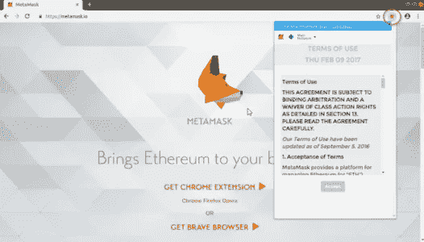
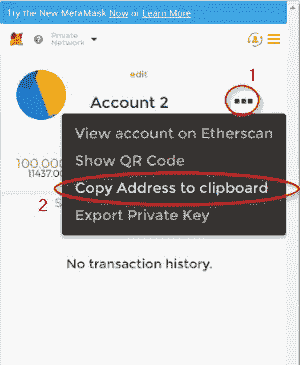

# 用松露开发以太坊 DApps

> 原文：<https://medium.com/edureka/developing-ethereum-dapps-with-truffle-7533289c8b2?source=collection_archive---------0----------------------->


Truffle Ethereum Tutorial — Edureka

从之前关于以太坊的文章中，我们已经了解到智能合同包含一组管理区块链的规则。为了使以太坊智能合约的工作变得容易，一个名为 **Truffle Suite** 的开发环境被建立起来。在这个松露以太坊教程中，我们将探讨以下主题:

1.  什么是松露套房？
2.  块菌以太坊的特色
3.  什么是 MetaMask？
4.  在 Ubuntu 上安装 Truffle 并创建一个 Truffle 项目
5.  在 Google Chrome 上安装 MetaMask
6.  在 Ubuntu 上安装 TestRPC
7.  演示:开发一个简单的 DApp 松露和 MetaMask，并进行交易

# 什么是松露套房？

Truffle Suite 是一个基于以太坊区块链的开发环境，用于开发 DApps(分布式应用)。Truffle 是构建 dapp 的一站式解决方案:编译合同、部署合同、将其注入 web 应用程序、为 dapp 创建前端，以及测试。


Truffle Suite 有三个组件:

1.  ***松露:*** 是以太坊区块链的开发环境、测试框架和资产管道
2.  ***Ganache:*** Ganache 是一个个人以太坊区块链，用于测试智能合同，在这里你可以部署合同，开发应用程序，运行测试和执行其他任务，而无需任何成本
3.  ***毛毛雨:*** 毛毛雨是一个用来为以太坊 DApps 创建更简单更好的前端的库集合

# 块菌以太坊的特色

下面是使 Truffle 成为构建基于以太坊的 DApps 的强大工具的特性列表:

*   内置支持编译、部署和链接智能合同
*   自动化合同测试
*   支持控制台应用程序以及 Web 应用程序
*   网络管理和包管理
*   Truffle 控制台直接与智能合约通信
*   支持紧密集成

# 什么是 MetaMask？

MetaMask 是一个易于使用的浏览器插件(适用于 Google-Chrome、Firefox 和 Brave 浏览器)，它提供了一个图形用户界面来进行以太坊交易。它允许您在浏览器上运行以太坊 DApps，而无需在系统上运行完整的以太坊节点。基本上，MetaMask 是以太坊区块链和浏览器之间的桥梁。MetaMask 是开源的，提供了以下激动人心的特性:

*   您可以更改元掩码的代码，使它成为您想要的样子
*   提供内置硬币购买
*   本地密钥存储


现在，我们已经知道了松露和 MetaMask，让我们来看看如何在 DApps 中使用它们。

# 在 Ubuntu 上安装 Truffle 并创建一个 Truffle 项目

在松露以太坊教程的这一节中，我们将看到如何安装松露以及如何创建松露项目。

要安装 Truffle，您必须运行如下简单命令:

```
$ npm install -g truffle
```

现在，让我们开始在松露创建一个项目。首先，让我们创建一个新目录，并使用以下命令进入该目录:

```
$ mkdir truffle-pro 
$ cd truffle-pro
```

要创建项目，请执行以下命令:

```
$ truffle unbox metacoin
```

当该命令成功执行时，您将看到该目录中存在一个项目结构，其中包含项目所需的最少文件。

就是这样！您已经创建了一个简单的松露以太坊项目。


# 在 Google Chrome 上安装 MetaMask

在松露以太坊教程的这一节，我们将看看如何为 Google-Chrome 浏览器安装 MetaMask 插件。

以下是安装元蒙版浏览器插件的步骤:

1.  先去以下链接:[https://metamask.io/](https://metamask.io/)
2.  点击**获取 CHROME 扩展**按钮。这将打开一个新标签


3.点击“**添加到 Chrome** 按钮，然后“**添加扩展**”。

4.现在，在浏览器的右上角，你可以看到元蒙版图标。



5.接受条款和条件。

然后砰！元掩码已安装。

现在我们已经在系统中安装了 Truffle Ethereum 和 MetaMask，让我们看看如何使用 Truffle Ethereum 开发一个 DApp，并使用 MetaMask 进行交易。

# 在 Ubuntu 上安装 TestRPC

对于这个松露以太坊教程，我们将使用“TestRPC”，这是一个区块链仿真器，来开发我们的 DApp。TestRPC 允许您运行网络进行测试。它允许您在不运行实际以太坊节点的情况下调用区块链。

要安装 TestRPC，请运行以下命令:

```
$ npm install -g ethereumjs-testrpc
```

# 演示:开发一个简单的 DApp 松露和 MetaMask，并进行交易

打开一个新的终端，用下面的命令运行 TestRPC。这将在您的系统上启动一个测试网络。

```
$ testrpc
```

您将看到可用帐户列表、这些帐户的私钥、助记短语以及 TestRPC 正在侦听的端口。


> **注意:**不要在主以太网上使用助记短语。仅在专用网络上使用它。

现在，让我们设置松露。

打开一个新的终端，进入创建项目的目录。

要在我们的网络上运行 truffle，我们需要编辑“ **truffle.js** ”文件。打开该文件，并输入以下内容:

```
module.exports = {
      networks: {
            development: {
                  host: 'localhost',
                  port: 8545,
                  network_id: '*' //* will match to any network id
                  }
         }
};
```


保存文件并退出。

现在，我们必须编译合同并将其迁移到网络上。执行此操作的命令如下:

```
$ truffle compile 
$ truffle migrate
```

您可以看到代码已经成功迁移并部署到网络上。


现在，打开 Chrome 浏览器，点击 MetaMask 图标。点击**导入已有书斋**。输入执行“ **testrpc** 命令时显示的助记短语，输入密码，点击“ **Ok** ”。


默认情况下，MetaMask 在主网络上运行。我们不想仅仅为了一个演示而花钱，对吗？因此，我们必须将网络改为私有网络。在我们的例子中，这个网络是 **Localhost 8545** 。


我们现在可以看到一个包含 99+个醚的帐户。“哇！自由醚！”让你失望的是，这些不是真正的醚。这些是测试醚，仅用于测试目的，没有实际价值。

我们需要两个账户来进行交易:发送者和接收者。那么，让我们创建一个新帐户。为此，在 MetaMask 插件中，点击“**切换账户**”，然后点击“**创建账户**”。您的新帐户已创建。


现在，要发送乙醚到这个帐户，我们需要复制这个帐户的地址。



对于这个松露以太坊教程，我们将从账户 1 发送醚到账户 2。因此，让我们将帐户切换回帐户 1。在这里，点击“**发送**，输入你要发送账户的地址(我复制的账户 2 的地址)和要发送的乙醚数量，点击“**下一步**”。


它将向您显示交易摘要并要求确认。点击**提交**，交易完成。


我们现在可以看到，帐户 1 中少了 50 个醚。


要验证交易，请切换到帐户 2。这里，还有 50 多个醚。这表明 50 个醚从账户 1 转移到账户 2。


*恭喜恭喜！您已经创建了您的第一个松露以太坊 DApp，并完成了一笔交易。我希望这个块菌以太坊教程博客能提供信息，帮助你了解块菌。现在，继续尝试构建新的 DApps。*

到此，我们结束这篇关于用松露开发以太坊 DApps 的文章。如果你想查看更多关于人工智能、DevOps、道德黑客等市场最热门技术的文章，你可以参考 Edureka 的官方网站。

请留意本系列中的其他文章，它们将解释区块链的其他各个方面。

> 1.[区块链教程](/edureka/blockchain-tutorial-d05f9c36b62b)
> 
> 2.[以太坊教程](/edureka/ethereum-tutorial-with-smart-contracts-db7f80175646)
> 
> 3.[以太坊专用网络](/edureka/ethereum-private-network-tutorial-22ef4119e4c3)
> 
> 4.什么是智能合约？
> 
> 5.[坚固性教程](/edureka/solidity-tutorial-ca49906bdd47)
> 
> 6.[最好的以太坊开发工具](/edureka/ethereum-development-tools-7175503a1ac7)
> 
> 7.[大帐织物](/edureka/hyperledger-fabric-184667460-edc184667460)
> 
> 8. [Hyperledge vs 以太坊](/edureka/hyperledger-vs-ethereum-bdc868e10817)

*原载于 2019 年 1 月 8 日*[*【www.edureka.co】*](https://www.edureka.co/blog/developing-ethereum-dapps-with-truffle)*。*