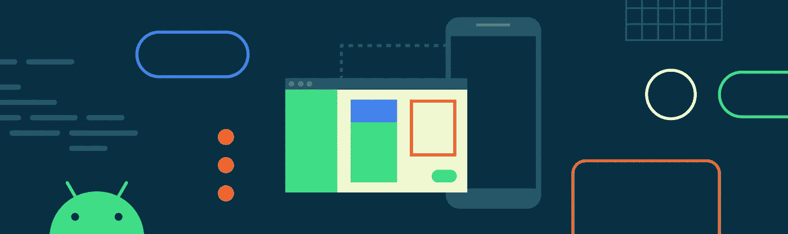
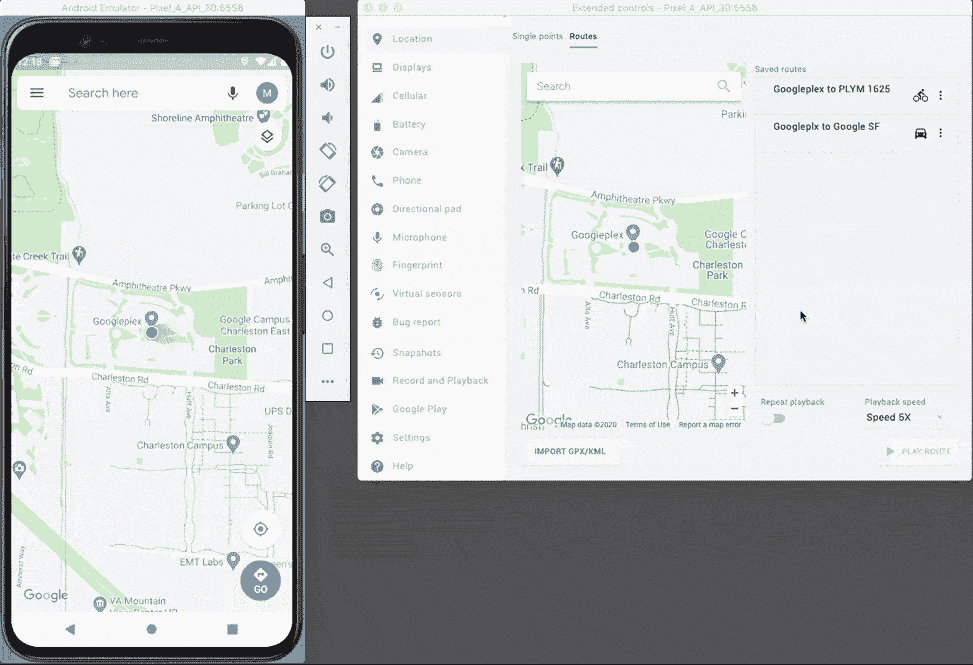
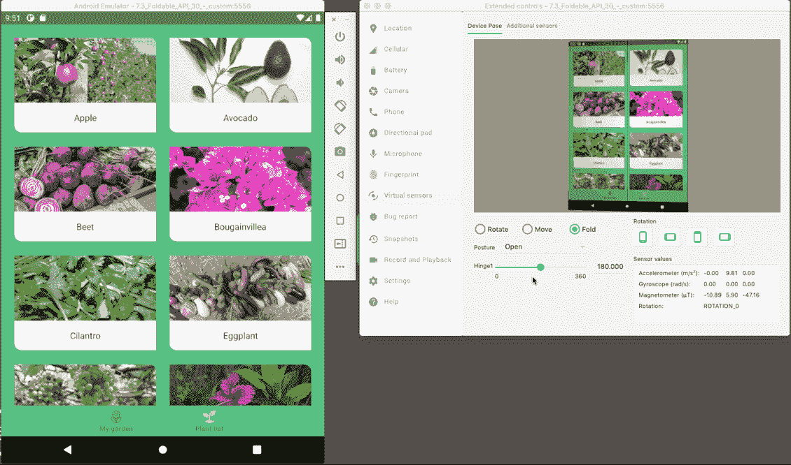
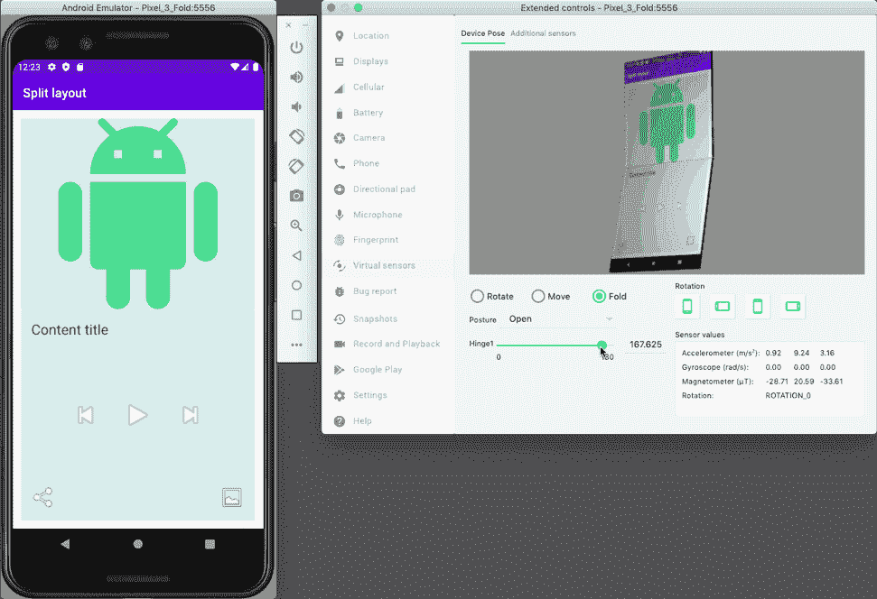
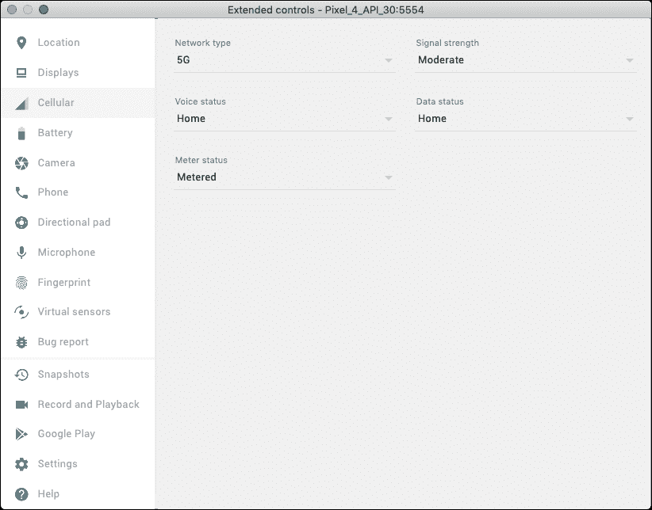

# 使用 Android 模拟器为 Android 11 开发

> 原文：<https://medium.com/androiddevelopers/developing-for-android-11-with-the-android-emulator-a9486af2d7ef?source=collection_archive---------0----------------------->

我们构建了 Android 模拟器，让您无需维护大量物理设备就能测试您的应用。虽然这仍然是我们的主要目标，但我们并不满足于提供一个完全模仿物理设备的工具。相反，我们希望构建一个仿真器，通过提供只有虚拟设备才有可能实现的功能来补充物理设备。

在过去，我们已经发布了像[位置和电池扩展控制](https://developer.android.com/studio/run/emulator#extended)这样的功能，这两个功能都允许您快速测试会在物理设备上引起头痛的场景。位置控制可以让你在舒适的办公桌上测试应用对沿某一路线移动的反应，电池控制可以让你测试充电水平状态等影响，而不必等待物理设备的电池耗尽。

*The Location controls allow you to emulate movement along a route.*

今天，我想向你展示 Android 模拟器的一些新方法，这些方法使开发和测试你的应用变得更加容易，特别关注与 [Android 11](https://developer.android.com/android11) 中的新功能相一致的功能。

# 可折叠和其他外形

Android 模拟器版本 30.0.23+使释放可折叠手机的潜力变得更加容易，可以在 Android Studio Canary 发布频道中找到。它具有新的 3D 可折叠设备渲染和扩展的可折叠控件。3D 渲染可以直观地显示您的应用在可折叠设备上的外观，而扩展的控件允许您明确设置每个折叠的角度或整体设备姿态。您可以使用这些附加功能来验证您的应用在可折叠设备上看起来很棒，并构建定制体验，发挥外形的优势。

*Using the Emulator to build an interface that splits into a parent child layout when the device’s state is* [*HALF_OPENED*](https://developer.android.com/reference/androidx/window/DeviceState#POSTURE_HALF_OPENED) *and returns to normal when the state is* [*OPENED*](https://developer.android.com/reference/androidx/window/DeviceState#POSTURE_OPENED)*.*

这个功能利用了 Android 模拟器的灵活性，并直接挂钩到 [WindowManager](https://developer.android.com/jetpack/androidx/releases/window) ，这是最近添加到 [Android Jetpack](https://developer.android.com/jetpack) 的一个新功能，它使开发人员能够构建一致的体验，对可折叠设备的姿态做出反应。通过这些控件，你可以明确地设置窗口管理器的[设备状态](https://developer.android.com/reference/androidx/window/DeviceState)并测试你的应用程序的反应。在上面的例子中，Android [向日葵示例应用](https://github.com/android/sunflower)已经被修改为当姿态为[半开](https://developer.android.com/reference/androidx/window/DeviceState#POSTURE_HALF_OPENED)时沿着设备的铰链分裂成一个父子布局，使用硬件来支持新颖的 UX。如果你想了解更多关于这个库和为可折叠内容构建的信息，请阅读[为可折叠内容构建应用](https://developer.android.com/guide/topics/ui/foldables)或[使用新的 Jetpack WindowManager 库支持新的外形。如果这还不够，请关注第九周的更多内容](/androiddevelopers/support-new-form-factors-with-the-new-jetpack-windowmanager-library-4be98f5450da) [11 周的 Android:Android Beyond Phones](https://developer.android.com/11weeksofandroid)。

除了可视化和扩展控件，我们还将在[两个初始可折叠硬件配置文件](https://developer.android.com/guide/topics/ui/foldables#emulators)的基础上进行扩展，并将在 Android Studio 4.2 的基础上发布具有水平折叠和双显示器的配置文件。在此之前或之后，如果您想要自定义虚拟设备，可以通过编辑虚拟设备的 config.ini 文件来添加或修改可折叠属性。这使得模拟市场上任何可折叠设备甚至尚不存在的配置成为可能。在 Android Studio 的 Android 虚拟设备(AVD)管理器中右键单击设备并选择“在磁盘上显示”,可以找到虚拟设备的 config.ini 文件。将以下代码添加到 Pixel 3 的 config.ini 文件中，可以让您看到水平折叠的效果！

Additions to a virtual Pixel 3’s confing.ini that enable the foldable controls.

*A virtual Pixel 3 with an added horizontal fold.*

请记住，可折叠只是 Android 和 Android Emulator 支持的众多替代形式之一。我们的 [Android Auto](https://developer.android.com/training/cars/testing#test-automotive-os) 、 [Android TV](https://developer.android.com/training/tv/start/start#run-on-a-virtual-device) 和 [WearOS](https://developer.android.com/training/wearables/apps/creating#emulator) 虚拟设备也使其有可能构建替代的外形并接触更多的用户。

# 5G

Android 模拟器现在支持 5G，允许您开发利用 5G 的体验，而无需购买硬件或访问物理 5G 网络。要尝试这一点，请下载并使用 Android 11 Beta 2+ (API level 30)系统映像之一创建一个虚拟设备，并使用最新版本的 Android 模拟器运行它，该模拟器可在 Android Studio Canary 发布频道中获得。

Android 模拟器 [5G 网络设置](https://developer.android.com/preview/behavior-changes-all#emulator-5g)与新的 Android 11 [5G 检测](https://developer.android.com/preview/features/5g#detection)、[计量](https://developer.android.com/preview/features/5g#meteredness)和[带宽估计](https://developer.android.com/preview/features/5g#estimator)API 集成，只需点击一个按钮，就可以针对该 API 表面进行开发和测试。

*The 5G network setting can be accessed in the Android Emulator’s Cellular controls*

查看我们的 [5G 文档](https://developer.android.com/preview/features/5g)以了解更多关于向您的应用添加 5G 功能的信息。

# 结论与展望

Android 模拟器最初是为了提供一个真实的虚拟设备而构建的，这使得在任何设备配置上测试你的应用成为可能，而无需维护一系列物理设备。我们仍然致力于这一目标，并将继续为每个 Android 平台版本提供各种设备外形以及高质量的符合 [Android 兼容性测试套件(CTS)的](https://source.android.com/compatibility/cts)系统映像。

也就是说，我们不满足于仅仅提供物理设备的基本功能集。相反，我们还专注于构建一个超越的工具，为物理设备补充只有虚拟设备才有的功能。新的 Android 模拟器可折叠和 5G 功能是 Android 模拟器如何补充物理设备的两个例子，我们希望它们能够帮助[将您的应用升级到 Android 11](https://android-developers.googleblog.com/2020/02/Android-11-developer-preview.html) 。