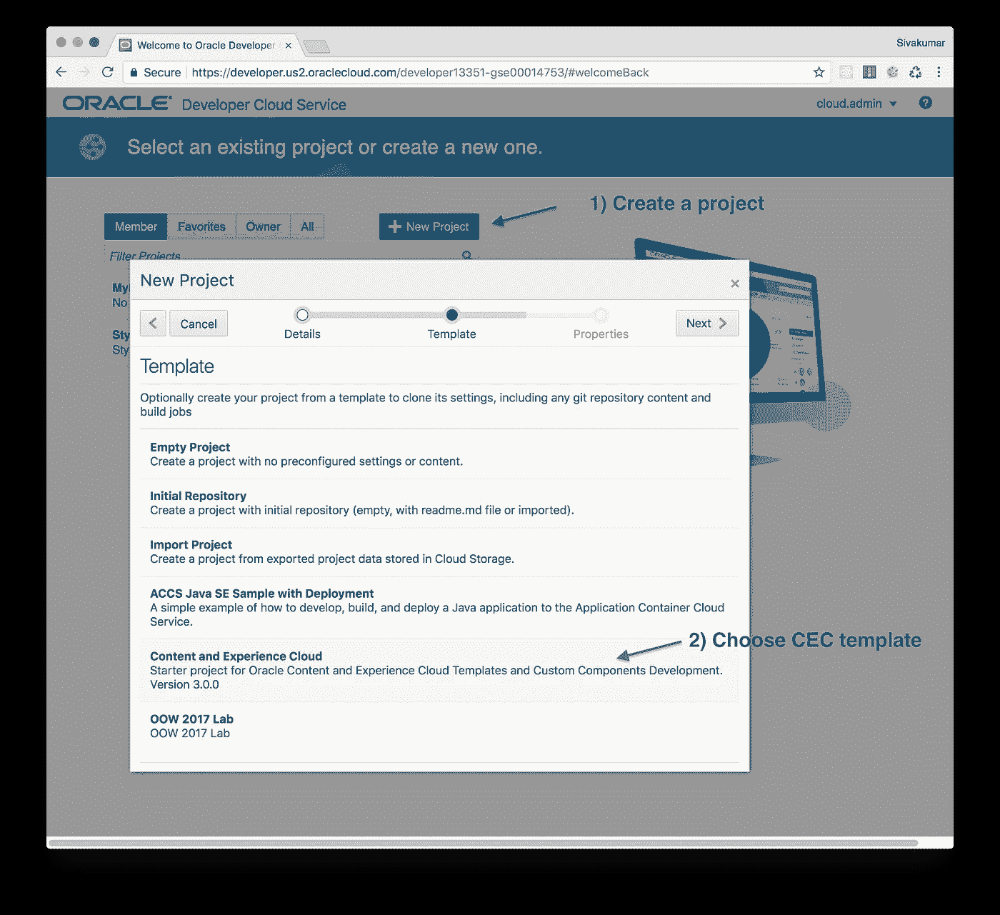
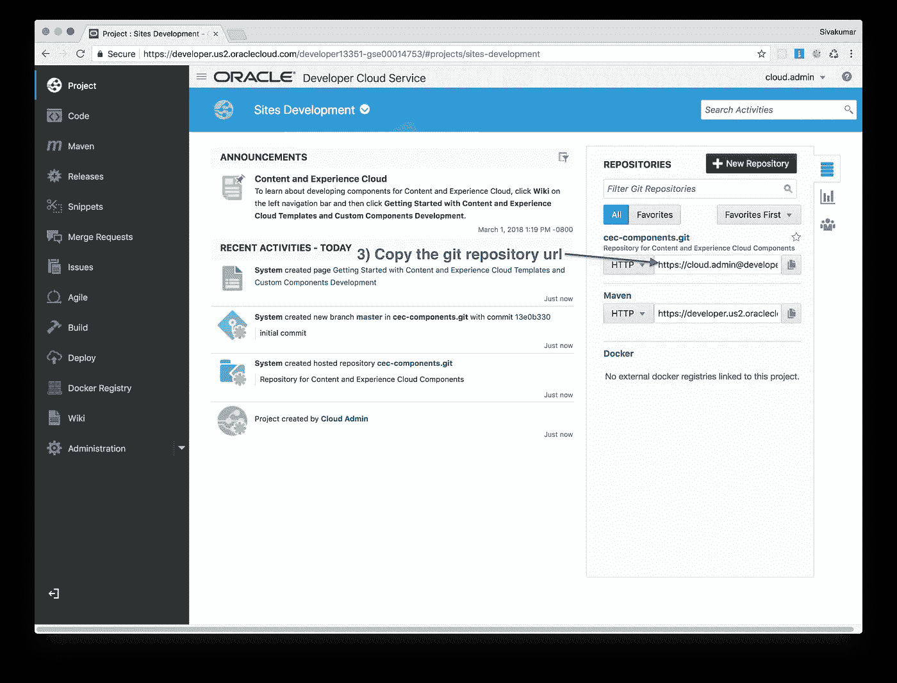
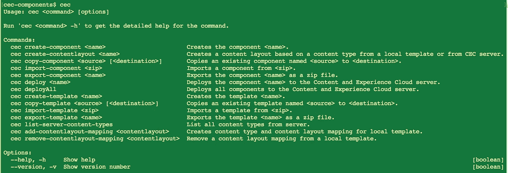
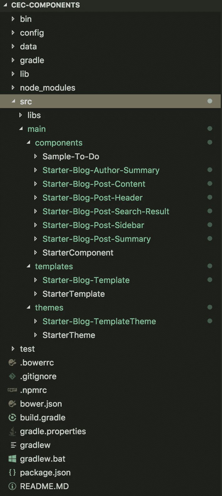
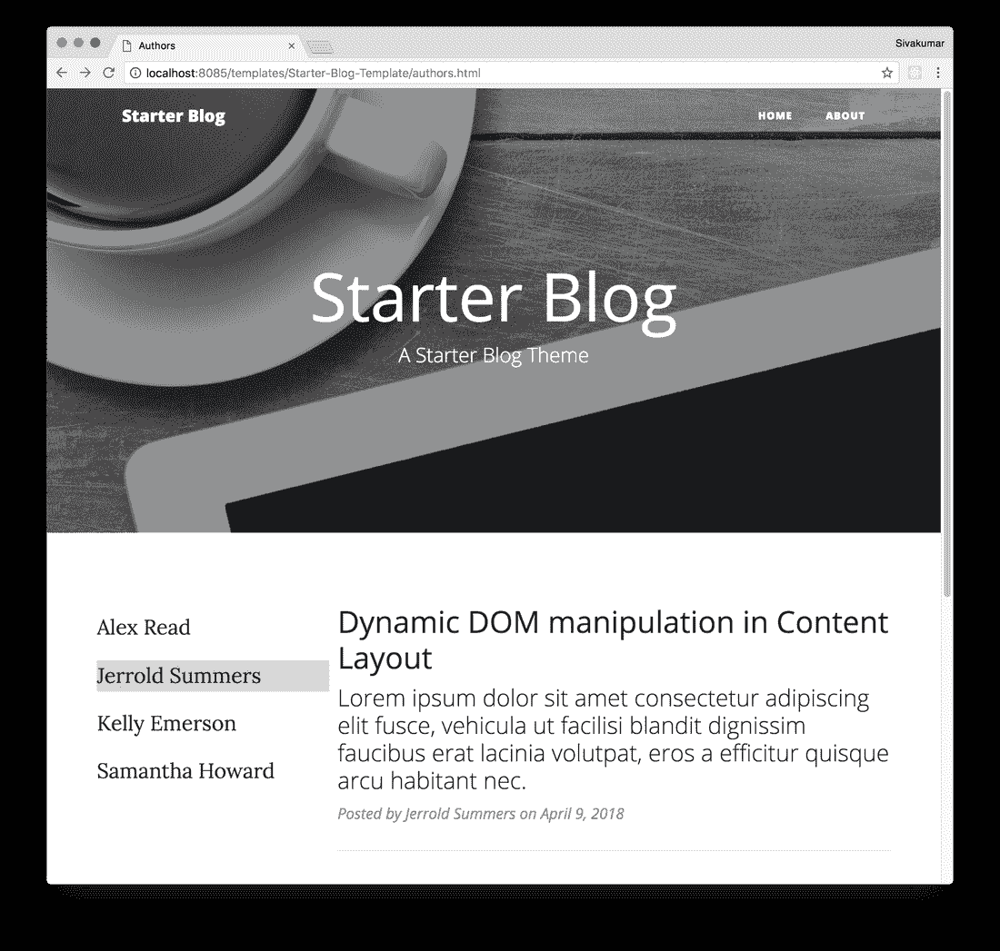
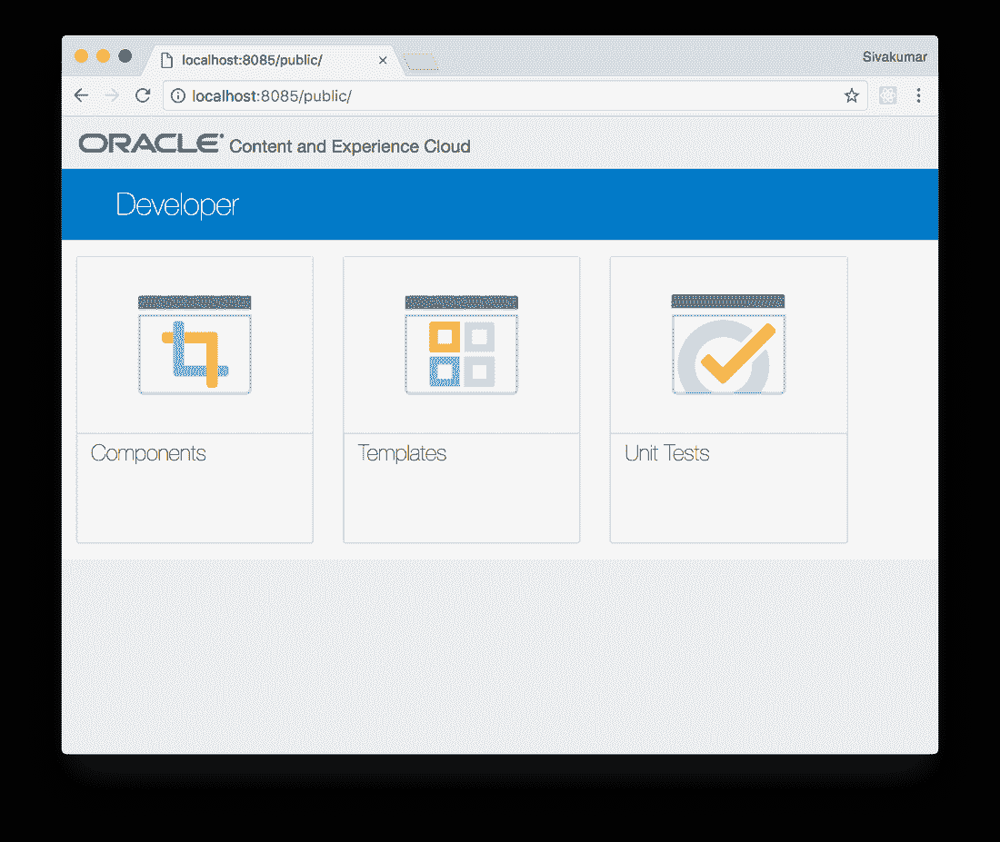
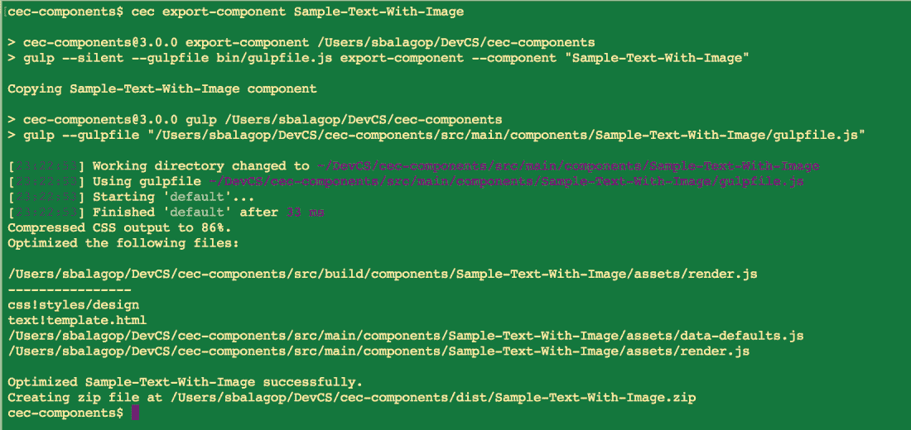
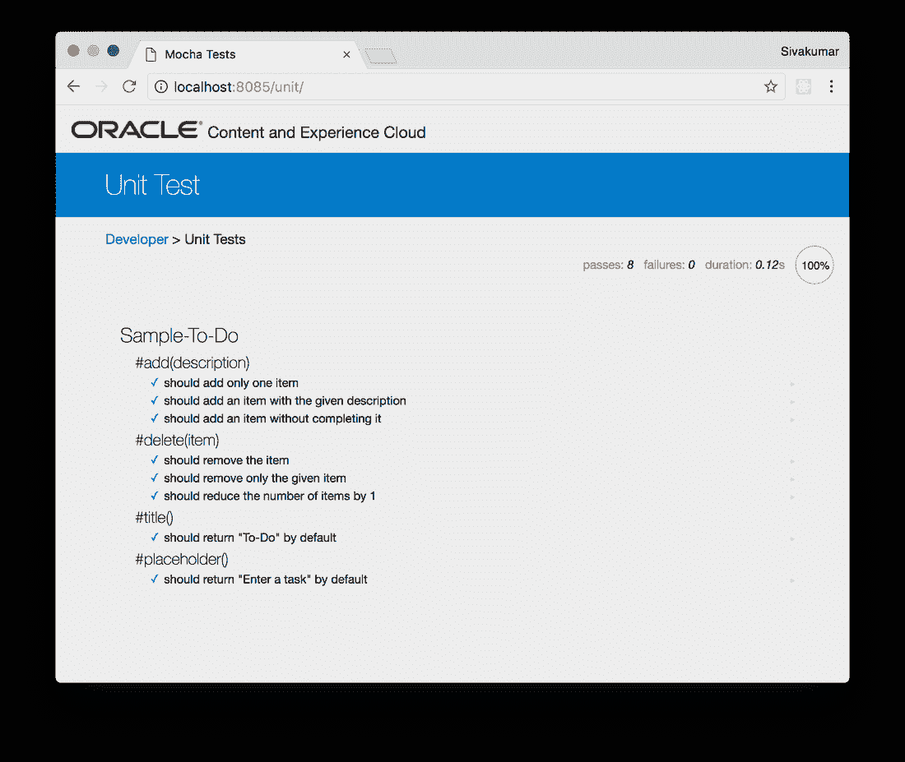

# 使用站点工具包开发内容和体验云(CEC)

> 原文：<https://medium.com/oracledevs/developing-for-content-and-experience-cloud-cec-using-sites-toolkit-ed9e27d9a703?source=collection_archive---------4----------------------->

CEC Sites Toolkit 3.0 于 2018 年 5 月发布，作为开发者云服务 **(DevCS)** 中的入门项目模板。Sites Toolkit 帮助开发人员快速开发内容和体验云的模板、主题、组件和内容布局。整个 Sites Toolkit 本身是使用 JavaScript 和 Node.js 编写的。

## CEC 网站工具包的功能包括:

*   cec 命令行界面(CLI)。这为创建、复制、导入和导出模板、组件和内容布局提供了强大的命令。
*   一个基于 Node.js 的测试工具，当您在自己喜欢的编辑器中编辑模板、组件和布局时，可以立即预览它们。
*   通过最小化组件 JavaScript 和 CSS 文件并使用 RequireJS 优化器组合它们来优化它们的最佳实践
*   示例单元测试和最佳实践使用 Mocha 和 Chai 编写单元测试和示例单元测试。
*   丰富的入门组件、模板和内容布局。

## DevCS 的功能包括:

*   托管 Git 存储库和代码审查
*   问题跟踪、团队管理和敏捷仪表板
*   维基和团队协作

# 项目创建和安装

1.  在 DevCS 控制台中，单击 New Project。
2.  选择内容和体验云模板。



Create a new CEC Project

3.创建新的 CEC 项目。该项目包含 cec-components.git 存储库。

4.复制这个 Git 存储库 URL。



CEC Project in DevCS

5.在您的本地计算机/笔记本电脑上运行以下命令来克隆 Git 存储库，安装 Sites Toolkit，并启动本地测试工具。

```
git clone <your_project_url>.git
cd cec-components
npm install
npm run install-cec
npm start
```

现在本地开发服务器将在 [http://localhost:8085](http://localhost:8085) 启动并运行

# CEC 网站工具包

## 硬币指示器 （coin-levelindicator 的缩写）命令行界面（Command Line Interface for batch scripting）

您可以通过在命令行中键入“cec”来调用 cec CLI，以查看命令列表。使用-h 运行每个命令提供了详细的帮助和示例。这个 CLI 基于 Node.js。



CLI

## 初学者组件、模板和内容布局

Sites Toolkit 为初学者组件和模板提供了很好的选择。每个样本展示了一个独特的功能。例如，在命令行中键入“cec create-template”会给出可用的初学者模板列表。键入以下命令创建一个初学者博客模板。

```
cec create-template Starter-Blog-Template -f BlogTemplate
```

这个博客模板演示了如何开发一个站点所需的典型内容布局。create template 命令将模板、主题和组件分别放在模板、主题和组件子目录下的 src/main 目录中。这与您在 CEC 服务器中看到的结构相同。



Project Structure

您可以在本地测试工具中访问 Starter-Blog-Template。这是入门博客模板中的一页。这使用 Bootstrap 主题进行响应。所有内容都是由模板提供的。当该模板被导入到内容和体验云中，并且创建了一个站点时，内容将从内容 API 动态提供。



## 本地测试线束

您创建的组件和模板将会列出，并且可以在本地开发服务器中呈现。您可以在任何编辑器中编辑 JavaScript、HTML 和 CSS 文件，并在本地服务器中立即看到更改。这将呈现组件和模板，就像在 CEC 云服务器中呈现站点一样。本地服务器加快了开发时间。完成开发后，您可以分别使用“cec export-component”和“cec export-template”命令，为组件和模板创建一个 ZIP 文件。这些可以使用云 UI 导入到 CEC 云服务器中。



Local test harness

## 组件源代码的优化

RequireJS 优化器将 JavaScript 和 CSS 文件最小化，并将它们组合成一个包，以减小下载大小，并提供更快的页面加载。在下面的示例中，“cec export-component”命令优化了带图像的示例文本组件。design.css、template.html、data-default.js 和 render.js 文件被最小化并合并成一个 render.js 文件。



# 单元测试

Sites Toolkit 提供了一个如何使用 Mocha 和 Chai 为组件编写单元测试的例子。单元测试既可以从开发服务器访问，也可以使用 PhantomJS 在命令行上运行。



# 我们的产品页面提供了详细的文档。以下是链接:

*   [利用开发者云服务开发内容和体验云](https://docs.oracle.com/en/cloud/paas/content-cloud/developer/developing-content-and-experience-cloud-developer-cloud-service.html)
*   [用开发者云服务开发模板](https://docs.oracle.com/en/cloud/paas/content-cloud/developer/developing-templates-developer-cloud-service.html)
*   [使用开发者云服务在本地开发内容布局](https://docs.oracle.com/en/cloud/paas/content-cloud/developer/developing-content-layouts-locally-developer-cloud-service.html)
*   [使用开发者云服务开发定制组件](https://docs.oracle.com/en/cloud/paas/content-cloud/developer/developing-custom-components-developer-cloud-service.html)

## 评论家

感谢**邦妮·沃恩**、**伊戈尔·波利亚科夫**、**卡迈勒·卡普尔**、**肯·扬**和**史蒂夫·伯恩斯**审阅本文。