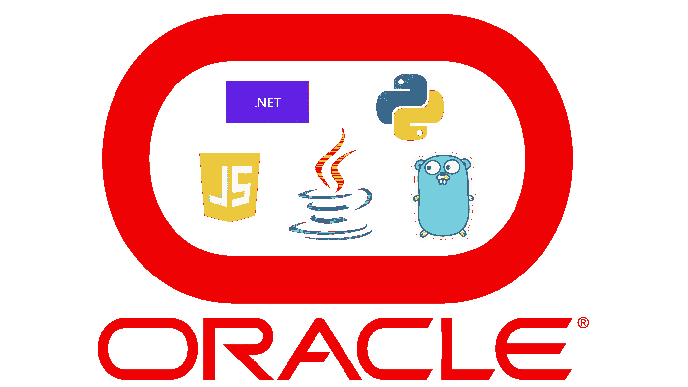
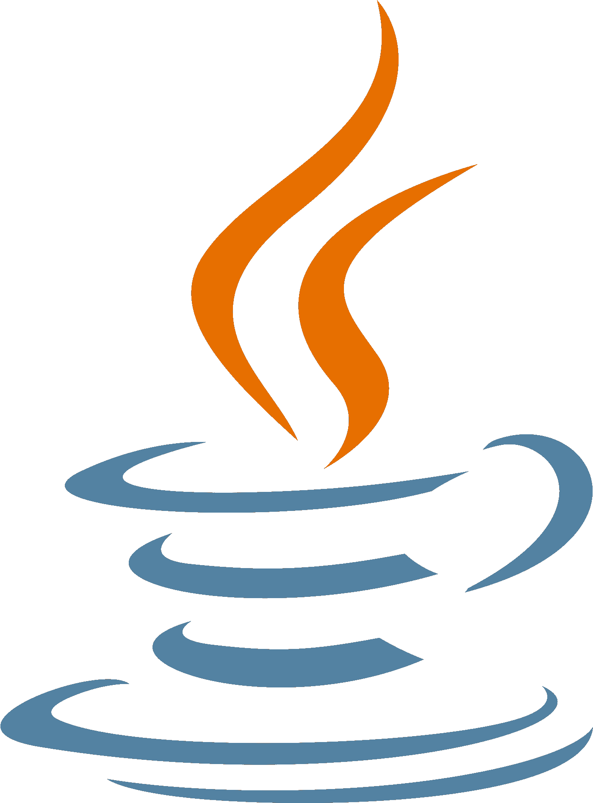
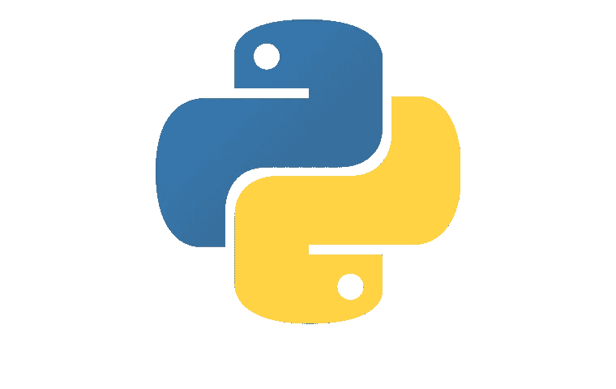
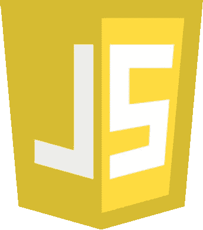
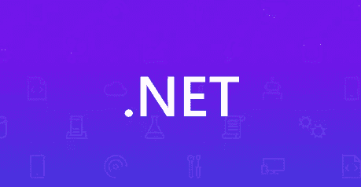

# 用 Java、JavaScript、Python、.NET，并选择 Oracle 融合数据库

> 原文：<https://medium.com/oracledevs/developing-microservices-in-java-javascript-python-net-75d617a511be?source=collection_archive---------0----------------------->



这是关于 Oracle 融合数据库的数据驱动微服务设计机制和事务模式的系列博客中的第一篇。第一篇博客的目标是说明如何用 Java、JavaScript、Python 等语言连接到 Oracle 数据库。NET，并尽可能简洁地使用源代码和 docker 文件示例，使您能够快速轻松地连接您的微服务，无论是在本地还是在云中，并利用 Oracle 融合数据库。JavaScript、Python 和 Go 驱动程序构建于 Oracle 的 C 栈[“Oracle 调用接口”API](https://docs.oracle.com/en/database/oracle/oracle-database/21/lnoci/index.html) 和 Oracle 数据提供者之上。NET(【ODP.NET】)核心被用作了。网络驱动。

完整的源代码可以在 https://github.com/oracle/microservices-datadriven 的[找到，您可以随时参加在 http://bit.ly/simplifymicroservices](https://github.com/oracle/microservices-datadriven)[的“利用 Oracle 融合数据库构建微服务研讨会”,轻松建立完整的微服务环境，包括 OCI Kubernetes 集群、2 个 ATP(自主事务处理)Oracle 数据库、AQ 消息传递、容器注册、对象存储等。大约 25 分钟后！](http://bit.ly/simplifymicroservices)

在本系列的后续部分中，我们将探索不同的 SQL 调用(查询、命令、存储过程调用等)。)和数据模型(JSON、Spatial、XML 等。).我们还将展示 Oracle AQ 的消息传递、各种框架中的便利特性，并深入研究数据驱动的微服务模式的细节。全部以这五种语言显示，但现在让我们开始连接…

我们将提供您需要的基本事实:导入、源代码和 Dockerfile。当然，在如何获得连接方面可能会有一些变化(钱包位置、连接池的使用、连接字符串的构造方式等)。)，但是这里介绍的是连接的一般方法，可以根据需要进行修改。

下载连接到 Oracle 云数据库(如 ATP)所需的客户端凭据(wallet)的说明可在此处找到，并且必须将 TNS_ADMIN 环境变量分配到这个解压缩的 wallet 的位置。通常，wallet 安装在 Kubernetes 部署中，因此可以在它所部署的微服务容器的环境中进行设置。有关这方面的示例，您可以参考 repos 和 workshop 中的各种*-deployment.yaml 文件。

同样，您会注意到源代码片段中的连接属性值是从环境中获取的。DB_CONNECT_STRING 是除 Java 之外的所有语言的 DB 的服务名(在 tnsnames.ora 文件中可以找到),在 Java 中，它是完整的 JDBC 连接 URL。请注意，在 Java 中，也可以通过这个 URL 设置 TNS_ADMIN 值，而所有其他语言都要求将其设置为前面提到的环境值。请参见注释示例片段。



# Java 语言(一种计算机语言，尤用于创建网站)

# 来源…

```
import oracle.ucp.jdbc.PoolDataSource;
import java.sql.Connection;
import java.sql.SQLException;PoolDataSource dataSource = PoolDataSourceFactory.getPoolDataSource();
dataSource.setUser(System.getEnv("DB_USER"));
dataSource.setPassword(System.getEnv("DB_PASSWORD"));
dataSource.setConnectionFactoryClassName("oracle.jdbc.pool.OracleDataSource");
dataSource.setURL(System.getEnv("url")); //for example "jdbc:oracle:thin:@examplepdb_tp?TNS_ADMIN=/msdataworkshop/creds"
Connection connection = dataSource.getConnection();
```

# Dockerfile…

```
FROM openjdk:11-jre-slim# Oracle OJDBC and UCP jars are packaged with application jar via Maven dependencies
ENTRYPOINT ["java", "-jar", "/usr/share/myservice/myservice.jar"]
ADD target/libs           /usr/share/myservice/libs
ARG JAR_FILE
ADD target/${JAR_FILE} /usr/share/myservice/myservice.jar
```



# 计算机编程语言

# 来源…

```
import cx_Oracledb_user = env.get('DB_USER') 
db_password = env.get('DB_PASSWORD')
db_connect_string = env.get('DB_CONNECT_STRING') //for example "examplepdb_tp"
pool = cx_Oracle.SessionPool(
    db_user,
    db_password,
    db_connect_string)
conn = pool.acquire()
```

# Dockerfile…

```
FROM oraclelinux:7-slimARG release=19
ARG update=9
RUN  yum -y install oracle-release-el7 && \
     yum-config-manager --enable ol7_oracle_instantclient && \
     yum -y install oracle-instantclient${release}.${update}-basiclite && \
     yum install -y oracle-epel-release-el7
WORKDIR /app
COPY inventory/requirements.txt .
RUN  yum install -y python36 && \
     yum install -y tar && \
     rm -rf /var/cache/yum && \
     python3.6 -m pip install -r requirements.txt
ADD myapp .
CMD ["gunicorn", "app:app", "--config=config.py"]
```



# Java Script 语言

# 来源…

```
const oracledb = require('oracledb');const dbConfig = {
  inventoryPool: {
    user: process.env.DB_USER,
    password: process.env.DB_PASSWORD, 
    connectString: process.env.DB_CONNECT_STRING //for example "examplepdb_tp"
  }
};
const pool = await oracledb.createPool(dbConfig.inventoryPool);
connection = await oracledb.getConnection();
```

# Dockerfile…

```
FROM oraclelinux:7-slimARG release=19
ARG update=9
RUN  yum -y install oracle-release-el7 && \
     yum-config-manager --enable ol7_oracle_instantclient && \
     yum -y install oracle-instantclient${release}.${update}-basiclite && \
     yum install -y oracle-epel-release-el7
RUN  yum -y install oracle-nodejs-release-el7 && \
     yum-config-manager --disable ol7_developer_EPEL && \
     yum -y install nodejs && \
     rm -rf /var/cache/yum
WORKDIR /app
COPY package*.json ./
RUN npm install
COPY . .
CMD [ "node", "app.js" ]
```



# 。网

# 来源…

```
using System.Data;
using System.Data.Common;
using Oracle.ManagedDataAccess.Client;OracleConfiguration.WalletLocation = Environment.GetEnvironmentVariable("TNS_ADMIN");
string connString =
    "User Id=" +
    Environment.GetEnvironmentVariable("DB_USER") +
    ";Password=" +
    Environment.GetEnvironmentVariable("DB_PASSWORD") +
    ";Data Source=" +
    Environment.GetEnvironmentVariable("DB_CONNECT_STRING") + //for example "examplepdb_tp"
    ";";
OracleConnection connection = new OracleConnection(connString)
```

# Dockerfile…

```
FROM mcr.microsoft.com/dotnet/aspnet:5.0
WORKDIR /app
COPY /app /app 
ENTRYPOINT ["dotnet", "inventory-dotnet.dll"]
```

# Dockerfile(包括构建)…

```
FROM mcr.microsoft.com/dotnet/sdk:5.0.300-alpine3.13-amd64 AS build
WORKDIR /src
COPY inventory-dotnet.csproj .
RUN dotnet restore
COPY . .
RUN dotnet publish -c release -o /appFROM mcr.microsoft.com/dotnet/aspnet:5.0
WORKDIR /app
COPY --from=build /app .
ENTRYPOINT ["dotnet", "inventory-dotnet.dll"]
```


# 去

# 来源…

```
import (
   "context"
   "database/sql"
   "github.com/godror/godror"
)user := os.Getenv("DB_USER")
dbpassword := os.Getenv("DB_PASSWORD") 
connectString := os.Getenv("DB_CONNECT_STRING") //for example "examplepdb_tp"
connectionString := user + "/" + dbpassword + "@" + connectString
connection, err := sql.Open("godror", connectionString)
```

# Dockerfile…

```
FROM alpine:latest
ENV LD_LIBRARY_PATH=/lib
RUN wget [https://download.oracle.com/otn_software/linux/instantclient/193000/instantclient-basic-linux.x64-19.3.0.0.0dbru.zip](https://download.oracle.com/otn_software/linux/instantclient/193000/instantclient-basic-linux.x64-19.3.0.0.0dbru.zip) && \
    unzip instantclient-basic-linux.x64-19.3.0.0.0dbru.zip && \
    cp -r instantclient_19_3/* /lib && \
    rm -rf instantclient-basic-linux.x64-19.3.0.0.0dbru.zip && \
    apk add libaio && \
    apk add libaio libnsl libc6-compat
RUN cd /lib
RUN ln -s /lib64/* /lib
RUN ln -s libnsl.so.2 /usr/lib/libnsl.so.1
RUN ln -s /lib/libc.so.6 /usr/lib/libresolv.so.2
COPY /go/bin/inventory-go /usr/lib/inventory-go
ENTRYPOINT ["/usr/lib/inventory-go"]
```

# Dockerfile(包括构建)…

```
FROM golang:alpine AS builder
RUN apk update && apk add --no-cache git build-base
WORKDIR /src
COPY . .
RUN go get -d -v
RUN go build -o /go/bin/inventory-goFROM alpine:latest
ENV LD_LIBRARY_PATH=/lib
RUN wget [https://download.oracle.com/otn_software/linux/instantclient/193000/instantclient-basic-linux.x64-19.3.0.0.0dbru.zip](https://download.oracle.com/otn_software/linux/instantclient/193000/instantclient-basic-linux.x64-19.3.0.0.0dbru.zip) && \
    unzip instantclient-basic-linux.x64-19.3.0.0.0dbru.zip && \
    cp -r instantclient_19_3/* /lib && \
    rm -rf instantclient-basic-linux.x64-19.3.0.0.0dbru.zip && \
    apk add libaio && \
    apk add libaio libnsl libc6-compat
RUN cd /lib
RUN ln -s /lib64/* /lib
RUN ln -s libnsl.so.2 /usr/lib/libnsl.so.1
RUN ln -s /lib/libc.so.6 /usr/lib/libresolv.so.2
COPY --from=builder /go/bin/inventory-go /usr/lib/inventory-go
ENTRYPOINT ["/usr/lib/inventory-go"]
```

# 结论

如上所述，这只是一系列博客的开始，这些博客将深入探讨使用 Oracle 融合数据库的多语言微服务的各个方面，不仅限于以下方面:

*   各种 SQL 调用(查询、更新、存储过程调用等。)
*   各种数据模型，比如 JSON、Spatial、XML 等等
*   与 AQ 和卡夫卡 API 的消息传递
*   各种框架(如 Helidon、Micronaut、Springboot、。NET，DJango，Express 等。)
*   数据驱动的微服务模式，如事件源、CQRS、Sagas 等。

请随时在这里、在研讨会上、在 github repos 上或直接提供任何反馈。我们很高兴收到你的来信。

我要感谢 Kuassi Mensah、Alex Keh、Christian Shay、克里斯托弗·琼斯、Richard Exley、Irina Granat 和 Curtis Dunkel 在这些语言的开发方面提供的帮助以及对研讨会的贡献。

如果你有兴趣，可以进入我们的[开发者休闲频道](https://bit.ly/devrel_slack)进行讨论。